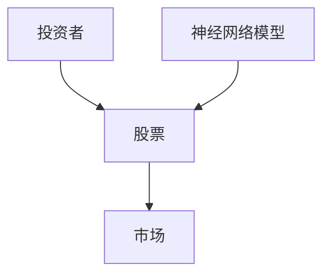
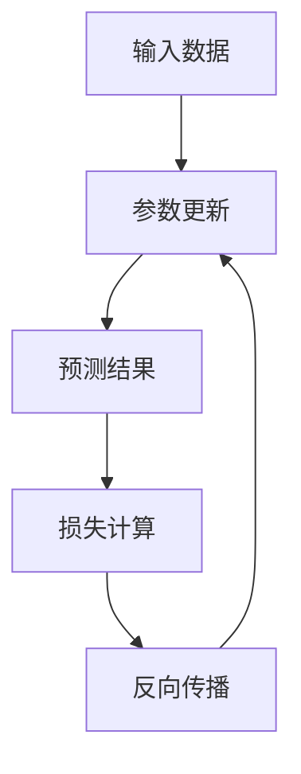
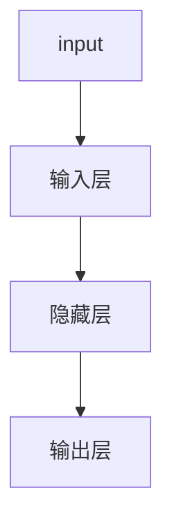
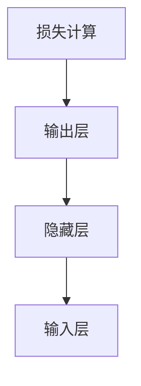

                 


# 特价股票投资中的神经网络模型构建与优化

> 关键词：特价股票投资，神经网络模型，机器学习，股票预测，投资决策

> 摘要：本文详细探讨了在特价股票投资中，如何利用神经网络模型进行股票预测和投资决策。从神经网络的基本原理到高级算法优化，结合实际案例，为读者提供从理论到实践的全面指导。

---

## 第一部分: 特价股票投资中的神经网络基础

### 第1章: 特价股票投资与神经网络概述

#### 1.1 特价股票投资的背景与现状
- 1.1.1 特价股票的定义与特点
  - 特价股票是指低于市场价的股票，通常具有较高的投资回报潜力。
- 1.1.2 特价股票投资的现状与挑战
  - 市场波动性大，信息不对称，传统方法难以捕捉短期机会。
- 1.1.3 神经网络在特价股票投资中的应用前景
  - 利用神经网络分析历史数据，预测价格波动，优化投资策略。

#### 1.2 神经网络的基本原理
- 1.2.1 神经网络的定义与基本结构
  - 由输入层、隐藏层和输出层组成，模拟人脑神经网络。
- 1.2.2 神经网络的核心概念与特点
  - 激活函数（如ReLU、sigmoid）、损失函数（如均方误差、交叉熵）。
- 1.2.3 神经网络与传统统计模型的对比
  - 神经网络具有非线性建模能力，适合处理复杂数据。

#### 1.3 神经网络在股票投资中的应用
- 1.3.1 神经网络在股票预测中的优势
  - 能够捕捉非线性关系，适用于时间序列分析。
- 1.3.2 神经网络在投资决策中的作用
  - 通过分析市场情绪、技术指标，辅助投资决策。
- 1.3.3 神经网络在股票市场中的潜在应用领域
  - 风险评估、组合优化、高频交易。

---

### 第2章: 神经网络模型的核心概念与联系

#### 2.1 神经网络的核心概念
- 2.1.1 神经元与网络结构
  - 神经元通过权重和激活函数传递信息。
- 2.1.2 激活函数与损失函数
  - 激活函数（ReLU、sigmoid）和损失函数（MSE、交叉熵）的选择影响模型性能。
- 2.1.3 神经网络的训练与优化
  - 使用梯度下降法优化模型参数。

#### 2.2 核心概念的对比与表格
- 2.2.1 激活函数对比表
  | 函数类型 | 输出范围 | 是否有饱和区 | 常见用途 |
  |----------|----------|-------------|----------|
  | ReLU     | (-∞, +∞)| 否          | 隐藏层   |
  | Sigmoid  | (0, 1)  | 是          | 输出层   |
- 2.2.2 损失函数对比表
  | 损失类型 | 公式                 | 适用场景          |
  |----------|----------------------|-------------------|
  | MSE      | $\frac{1}{n}\sum(y_i - \hat{y_i})^2$ | 回归问题         |
  | Cross Entropy | $-\frac{1}{n}\sum y_i \log(\hat{y_i})$ | 分类问题         |

#### 2.3 ER实体关系图与Mermaid流程图
- 2.3.1 实体关系图

- 2.3.2 神经网络训练流程图


---

### 第3章: 神经网络模型的算法原理

#### 3.1 神经网络的前向传播
- 3.1.1 前向传播的数学公式
  $$ y = \sigma(wx + b) $$
  其中，$\sigma$ 是激活函数，$w$ 是权重，$x$ 是输入，$b$ 是偏置。
- 3.1.2 激活函数的作用
  - ReLU：解决梯度消失问题，适合隐藏层。
- 3.1.3 前向传播的流程图


#### 3.2 神经网络的反向传播
- 3.2.1 损失函数的计算
  $$ L = \frac{1}{n}\sum_{i=1}^{n}(y_i - \hat{y_i})^2 $$
- 3.2.2 梯度下降算法
  $$ w = w - \eta \frac{\partial L}{\partial w} $$
  其中，$\eta$ 是学习率，$\frac{\partial L}{\partial w}$ 是损失函数对权重的偏导数。
- 3.2.3 反向传播的流程图


---

## 第二部分: 特价股票投资中的神经网络模型构建

### 第4章: 数据准备与特征工程

#### 4.1 数据获取与预处理
- 4.1.1 数据来源
  - 股票历史数据（开盘价、收盘价、最高价、最低价、成交量等）。
- 4.1.2 数据清洗
  - 处理缺失值、异常值、重复值。
- 4.1.3 数据标准化
  - 使用归一化或标准化方法处理数值型数据。

#### 4.2 特征提取与选择
- 4.2.1 技术指标
  - 移动平均线（MA）、相对强弱指数（RSI）、MACD等。
- 4.2.2 市场情绪
  - 利用新闻、社交媒体数据计算市场情绪指数。
- 4.2.3 时间序列特征
  - 增加滞后特征（如前一日的价格、成交量）。

---

### 第5章: 模型构建与训练

#### 5.1 神经网络模型的选择
- 5.1.1 多层感知机（MLP）
  - 适合股票分类问题（如涨跌预测）。
- 5.1.2 长短期记忆网络（LSTM）
  - 适合处理时间序列数据，捕捉长期依赖关系。
- 5.1.3 径向基函数网络（RBF）
  - 适用于非线性回归问题。

#### 5.2 模型训练与优化
- 5.2.1 模型训练
  - 使用训练数据进行前向传播和反向传播，更新权重。
- 5.2.2 模型调优
  - 调整学习率、批量大小、隐藏层数量等超参数。
- 5.2.3 模型评估
  - 使用测试数据计算准确率、召回率、F1分数等指标。

---

## 第三部分: 神经网络模型的优化与实战

### 第6章: 模型优化与调优

#### 6.1 超参数调优
- 6.1.1 网格搜索
  - 系统地搜索最优超参数组合。
- 6.1.2 随机搜索
  - 随机选择超参数值，减少计算量。
- 6.1.3 调度器优化
  - 使用学习率调度器动态调整学习率。

#### 6.2 模型集成与优化
- 6.2.1 Bagging
  - 通过随机化训练数据生成多个模型，提高泛化能力。
- 6.2.2 Boosting
  - 通过序列化训练模型，提高模型性能。
- 6.2.3 Stacking
  - 使用多个模型的预测结果作为输入，构建元模型。

---

### 第7章: 项目实战与案例分析

#### 7.1 环境安装与配置
- 7.1.1 安装必要的库
  - Python库：numpy、pandas、keras、tensorflow。
- 7.1.2 数据集获取
  - 使用Yahoo Finance获取股票数据。

#### 7.2 系统核心实现源代码
- 7.2.1 数据预处理代码
```python
import pandas as pd
import numpy as np

# 加载数据
data = pd.read_csv('stock.csv')

# 数据清洗
data.dropna(inplace=True)

# 标准化处理
from sklearn.preprocessing import MinMaxScaler
scaler = MinMaxScaler()
data_scaled = scaler.fit_transform(data)
```

- 7.2.2 神经网络模型构建代码
```python
from tensorflow.keras.models import Sequential
from tensorflow.keras.layers import Dense, LSTM

model = Sequential()
model.add(LSTM(50, input_shape=(timesteps, features)))
model.add(Dense(1))
model.compile(loss='mean_squared_error', optimizer='adam')
```

#### 7.3 实际案例分析
- 7.3.1 数据分析
  - 使用历史数据训练模型，预测未来股票价格。
- 7.3.2 模型评估
  - 使用测试数据计算均方误差（MSE）和R平方值。
- 7.3.3 结果可视化
  - 绘制实际价格与预测价格的对比图。

---

## 第四部分: 总结与展望

### 第8章: 总结与最佳实践

#### 8.1 总结
- 神经网络在特价股票投资中的应用前景广阔，但需要结合实际市场情况和数据特征进行模型优化。

#### 8.2 最佳实践
- 数据质量是模型性能的关键，需确保数据清洗和特征工程。
- 模型调优需结合业务需求，选择合适的超参数和模型结构。
- 风险控制是投资的重要部分，需结合多种模型进行综合判断。

---

## 参考文献

1. LeCun, Y., Bengio, Y., & Hinton, G. (2015). Deep learning. Nature, 521(7555), 436-444.
2. Hochreiter, S., & Schmidhuber, J. (1997). Long short-term memory. Neural computation, 9(8), 1735-1780.
3. Goodfellow, I., Bengio, Y., & Courville, A. (2016). Deep learning. MIT press.

---

## 作者信息

作者：AI天才研究院/AI Genius Institute & 禅与计算机程序设计艺术/Zen And The Art of Computer Programming

---

以上是《特价股票投资中的神经网络模型构建与优化》的技术博客文章目录大纲。

