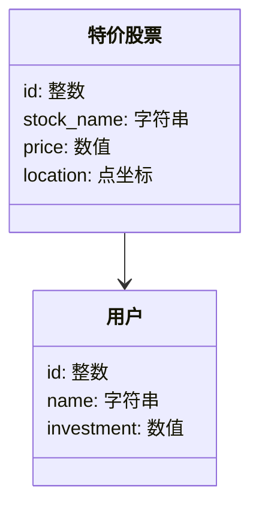
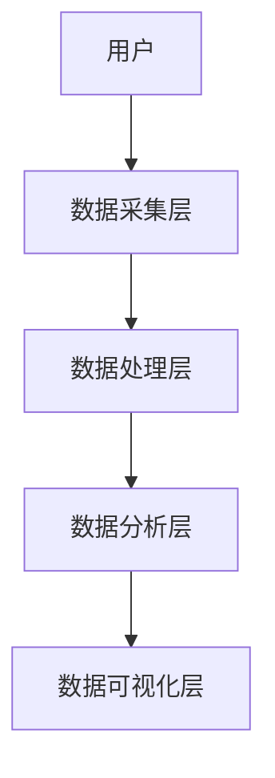
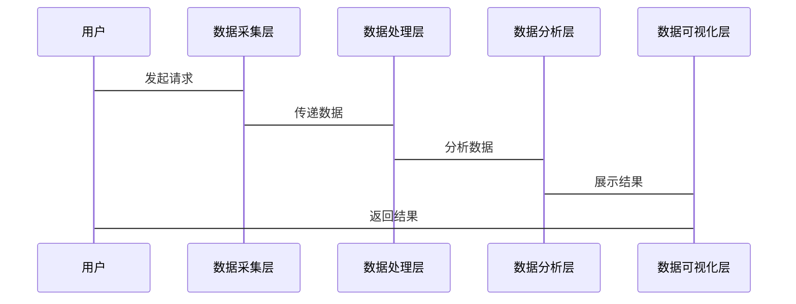

                 


# 特价股票投资中的空间计算大数据分析与应用

> 关键词：特价股票投资、空间计算、大数据分析、算法、系统架构、项目实战

> 摘要：本文深入探讨了特价股票投资中空间计算与大数据分析的应用，结合实际案例和系统设计，详细讲解了相关算法、系统架构以及最佳实践。通过本文，读者可以全面了解如何利用空间计算和大数据分析技术，提升特价股票投资的效率和准确性。

---

# 第1章: 特价股票投资与空间计算大数据分析概述

## 1.1 特价股票投资的背景与意义

### 1.1.1 什么是特价股票
特价股票是指价格低于市场价或有特别优惠的股票，通常用于投资者在特定市场条件下寻找低估的投资机会。这类股票可能因公司重组、市场波动或行业调整等原因出现。

### 1.1.2 特价股票投资的市场现状
近年来，随着金融市场的波动加剧，投资者 increasingly look for opportunities in特价股票。然而，传统的方法难以处理海量数据，且忽略了空间因素的影响。因此，利用空间计算和大数据分析技术来优化投资策略成为趋势。

### 1.1.3 空间计算在股票投资中的作用
空间计算通过分析地理位置、分布模式和空间关系，帮助投资者发现潜在的市场机会。例如，分析同一行业不同地区的股票分布，可以帮助识别具有投资价值的区域。

---

## 1.2 大数据分析在金融领域的应用

### 1.2.1 大数据分析的基本概念
大数据分析是指对海量、多样化的数据进行处理、分析和挖掘，以提取有价值的信息和洞察。在金融领域，大数据分析被广泛应用于风险评估、市场预测和投资决策。

### 1.2.2 大数据分析在金融投资中的优势
- **数据量大**：能够捕捉到更多市场信号。
- **数据多样性**：结合文本、图像等多种数据类型。
- **实时性**：支持实时数据分析，便于快速决策。

### 1.2.3 空间计算与大数据分析的结合
空间计算将地理位置信息纳入数据分析，提供了新的视角。例如，分析地理位置数据可以帮助发现区域性的市场趋势，从而优化投资策略。

---

## 1.3 本书的核心内容与目标

### 1.3.1 本书的核心主题
本文将探讨如何利用空间计算和大数据分析技术，优化特价股票的投资策略。

### 1.3.2 本书的目标读者
本文适合金融投资者、数据科学家、技术开发者以及对大数据分析和空间计算感兴趣的读者。

### 1.3.3 本书的结构安排
本文将从背景、核心概念、算法、系统设计到项目实战，逐步深入讲解，帮助读者掌握相关知识和技术。

---

# 第2章: 空间计算与大数据分析的核心概念

## 2.1 空间数据的特征与类型

### 2.1.1 空间数据的基本特征
- **空间位置**：数据的地理位置信息。
- **空间关系**：数据之间的空间联系。
- **空间属性**：与地理位置相关的属性信息。

### 2.1.2 空间数据的分类
- **点数据**：如经纬度坐标。
- **线数据**：如道路、河流等线状地理特征。
- **面数据**：如行政区划、建筑物等面状地理特征。

### 2.1.3 空间数据的采集与处理
- **采集**：通过GPS、传感器等获取地理位置信息。
- **处理**：数据清洗、坐标转换、空间投影等。

---

## 2.2 大数据分析的基本原理

### 2.2.1 大数据分析的定义
大数据分析是对海量、多样化数据进行处理、分析和挖掘，以提取有价值的信息。

### 2.2.2 大数据分析的框架
- **数据采集**：从多种数据源获取数据。
- **数据存储**：使用分布式存储系统。
- **数据处理**：清洗、转换和整合数据。
- **数据分析**：利用算法进行数据挖掘。
- **数据可视化**：以图表等形式展示结果。

### 2.2.3 空间计算与大数据分析的结合
- **空间数据的分布式处理**：利用Hadoop等分布式计算框架。
- **空间数据分析**：结合空间索引和空间聚合操作。

---

## 2.3 空间计算与大数据分析的结合

### 2.3.1 空间计算与大数据分析的联系
- 都依赖于海量数据的处理和分析。
- 空间计算为大数据分析提供了新的视角。

### 2.3.2 空间计算与大数据分析的区别
- **空间计算**注重地理位置信息的处理。
- **大数据分析**注重数据的多样性和规模。

### 2.3.3 空间计算与大数据分析的协同作用
通过结合空间计算和大数据分析，投资者可以更好地理解市场分布、区域趋势，从而做出更精准的投资决策。

---

# 第3章: 空间计算与大数据分析的核心算法

## 3.1 空间计算的核心算法

### 3.1.1 空间聚类算法
- **K-Means**：将地理位置相似的数据点聚类。
- **DBSCAN**：基于密度的空间聚类算法。

### 3.1.2 空间回归算法
- **线性回归**：分析地理位置与股票价格的关系。
- **空间回归模型**：考虑空间依赖性的回归模型。

### 3.1.3 空间插值算法
- **IDW**：反距离加权插值。
- **Kriging**：克里金插值法。

---

## 3.2 大数据分析的核心算法

### 3.2.1 MapReduce算法
- **Map**：将数据分割成小块，进行处理。
- **Reduce**：将处理结果汇总。

### 3.2.2 Spark计算框架
- **Spark Core**：核心计算框架。
- **Spark SQL**：支持结构化数据处理。

### 3.2.3 Hadoop分布式计算
- **HDFS**：分布式文件系统。
- **MapReduce**：分布式计算框架。

---

## 3.3 空间计算与大数据分析的结合算法

### 3.3.1 空间数据的分布式处理
- 使用Hadoop或Spark处理大规模空间数据。

### 3.3.2 空间数据的并行分析
- 并行处理空间聚类或回归分析。

### 3.3.3 空间数据的实时计算
- 实时监控地理位置数据，快速响应市场变化。

---

# 第4章: 空间计算与大数据分析的数学模型与公式

## 4.1 空间计算的数学模型

### 4.1.1 空间距离公式
- **欧氏距离**：$$d = \sqrt{(x2 - x1)^2 + (y2 - y1)^2}$$
- **曼哈顿距离**：$$d = |x2 - x1| + |y2 - y1|$$

### 4.1.2 空间聚类公式
- **K-Means**：目标函数$$\sum_{i=1}^{k} \sum_{j=1}^{n_i} (x_{ij} - c_i)^2$$
- **DBSCAN**：密度可达性与连接性。

### 4.1.3 空间回归公式
- **线性回归**：$$y = \beta_0 + \beta_1x + \epsilon$$
- **空间回归模型**：$$y_i = \lambda \sum_{j} \rho_{ij} y_j + \beta x_i + \epsilon_i$$

---

## 4.2 大数据分析的数学模型

### 4.2.1 MapReduce模型
- **Map函数**：将输入数据转换为键值对。
- **Reduce函数**：将键值对合并成结果。

### 4.2.2 Spark计算模型
- **RDD（弹性分散数据集）**：数据并行处理模型。

### 4.2.3 Hadoop计算模型
- **HDFS**：分布式文件存储。
- **MapReduce**：分布式计算框架。

---

# 第5章: 系统分析与架构设计

## 5.1 项目介绍

### 5.1.1 项目背景
本文将设计一个基于空间计算和大数据分析的特价股票投资分析系统。

### 5.1.2 项目目标
- 实时监控特价股票市场。
- 分析地理位置数据，提供投资建议。

---

## 5.2 系统功能设计

### 5.2.1 领域模型设计


### 5.2.2 系统架构设计


### 5.2.3 系统接口设计
- **数据采集接口**：接收地理位置数据。
- **数据分析接口**：提供聚类、回归等服务。
- **数据可视化接口**：展示分析结果。

### 5.2.4 系统交互设计


---

# 第6章: 项目实战

## 6.1 环境安装

### 6.1.1 安装Hadoop
```bash
sudo apt-get install hadoop
```

### 6.1.2 安装Spark
```bash
sudo apt-get install spark
```

### 6.1.3 安装地理数据处理工具
```bash
sudo apt-get install gdal
```

---

## 6.2 核心实现

### 6.2.1 数据采集
```python
import requests

def fetch_stock_data(location):
    response = requests.get(f"http://api.stock.com/stocks/{location}")
    return response.json()
```

### 6.2.2 数据处理
```python
from pyspark import SparkContext

sc = SparkContext()
data = sc.textFile("hdfs://localhost:8020/input/stock_data.csv")
processed_data = data.map(lambda x: (x.latitude, x.longitude, x.price))
```

### 6.2.3 空间聚类
```python
from sklearn.cluster import KMeans

clusters = KMeans(n_clusters=5).fit(processed_data)
```

### 6.2.4 数据可视化
```python
import matplotlib.pyplot as plt

plt.scatter(clusters.cluster_centers_[:, 0], clusters.cluster_centers_[:, 1], c='red', marker='x')
plt.show()
```

---

## 6.3 案例分析

### 6.3.1 数据分析结果
通过空间聚类算法，发现某些地区的股票价格具有相似性，形成价格洼地。

### 6.3.2 投资策略优化
基于分析结果，投资者可以优先关注价格洼地的特价股票。

---

## 6.4 项目小结

通过本项目，我们展示了如何利用空间计算和大数据分析技术，优化特价股票投资策略。实践证明，结合地理位置信息能够显著提升投资决策的准确性。

---

# 第7章: 最佳实践与小结

## 7.1 最佳实践 tips

### 7.1.1 数据质量
确保数据的准确性和完整性。

### 7.1.2 工具选择
根据需求选择合适的工具和框架。

### 7.1.3 可视化
通过图表直观展示分析结果。

## 7.2 小结

本文详细探讨了特价股票投资中的空间计算大数据分析与应用，结合理论和实践，为投资者提供了新的思路和方法。

## 7.3 注意事项

- 数据隐私保护。
- 算法选择与优化。
- 系统性能调优。

## 7.4 拓展阅读

- 《大数据分析与金融投资》
- 《空间计算与地理信息系统》
- 《分布式计算与Hadoop框架》

---

# 作者：AI天才研究院/AI Genius Institute & 禅与计算机程序设计艺术 /Zen And The Art of Computer Programming

