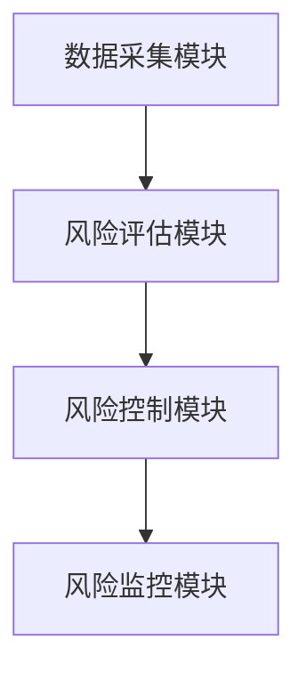

                 


# 特价股票投资中的系统性风险管理

> 关键词：特价股票，系统性风险，风险管理，投资策略，数学模型

> 摘要：本文深入探讨了特价股票投资中的系统性风险管理问题，结合实际案例分析，从理论到实践，系统地介绍了如何识别、量化和控制系统性风险。通过数学模型和系统架构设计，提出了一种基于VaR和CVaR的风险管理方法，并结合Python代码实现，为投资者提供了有效的风险管理策略。

---

# 第1章: 特价股票投资概述

## 1.1 特价股票的定义与特点

### 1.1.1 特价股票的定义
特价股票通常指价格低于行业平均水平或历史平均水平的股票，这些股票通常被认为具有较高的投资潜力，但同时也伴随着较高的风险。

### 1.1.2 特价股票的核心特点
- **低价格**：相对于市场平均水平，股票价格较低。
- **高波动性**：由于价格低廉，容易受到市场情绪的影响，波动性较大。
- **高风险**：低价股票往往来自基本面较差的公司，风险较高。

### 1.1.3 特价股票与普通股票的区别
- **价格**：特价股票价格低，普通股票价格高。
- **风险**：特价股票风险较高，普通股票风险相对较低。
- **投资策略**：特价股票需要更谨慎的风险管理，普通股票策略相对简单。

## 1.2 特价股票投资的背景与现状

### 1.2.1 特价股票市场的现状
- 近年来，随着市场的波动，特价股票吸引了越来越多的投资者。
- 低价股票市场波动大，但潜在回报高。

### 1.2.2 特价股票投资的背景
- 投资者希望通过低价股票获得超额收益。
- 市场波动为低价股票提供了套利机会。

### 1.2.3 特价股票投资的潜在机会
- 低价股票可能因公司基本面改善而大幅反弹。
- 市场波动中，低价股票可能成为资金炒作的对象。

## 1.3 特价股票投资的核心概念

### 1.3.1 特价股票投资的目标
- 通过低价买入，高价卖出，获得收益。
- 通过长期持有，等待公司基本面改善。

### 1.3.2 特价股票投资的边界
- 限定投资金额，避免过度集中。
- 设定止损点，控制风险。

### 1.3.3 特价股票投资的核心要素
- **价格**：低价是核心要素。
- **风险**：风险管理是关键。
- **策略**：制定科学的投资策略。

## 1.4 特价股票投资的风险特征

### 1.4.1 特价股票投资的主要风险
- **市场风险**：市场波动可能导致股价下跌。
- **流动性风险**：低价股票可能流动性差，难以快速变现。
- **公司基本面风险**：公司财务状况不佳，可能导致股价继续下跌。

### 1.4.2 系统性风险与非系统性风险的区分
- **系统性风险**：影响整个市场的风险，如经济衰退、政策变化。
- **非系统性风险**：特定于个股的风险，如公司管理问题、行业竞争等。

### 1.4.3 特价股票投资中的风险来源
- **宏观经济**：经济波动、货币政策变化。
- **市场波动**：市场情绪变化导致股价波动。
- **公司基本面**：公司财务状况、管理能力等。

## 1.5 本章小结
本章介绍了特价股票的定义、特点以及投资背景，分析了投资中的主要风险，为后续的系统性风险管理奠定了基础。

---

# 第2章: 系统性风险管理的基本原理

## 2.1 系统性风险管理的定义

### 2.1.1 系统性风险管理的定义
系统性风险管理是指通过识别、量化和控制那些影响整个市场的风险因素，以降低投资组合的系统性风险敞口。

### 2.1.2 系统性风险管理的核心要素
- **风险识别**：识别系统性风险的来源。
- **风险量化**：量化系统性风险的影响。
- **风险控制**：制定策略以应对系统性风险。

## 2.2 系统性风险管理的框架

### 2.2.1 风险识别与评估
- **风险识别**：通过分析宏观经济指标、市场波动等，识别系统性风险。
- **风险评估**：评估系统性风险对投资组合的影响。

### 2.2.2 风险控制与应对
- **风险分散**：通过多样化投资降低系统性风险。
- **风险对冲**：通过衍生品对冲系统性风险。

### 2.2.3 风险监控与反馈
- **实时监控**：监控市场波动和宏观经济指标。
- **反馈机制**：根据市场变化调整风险管理策略。

## 2.3 系统性风险管理的数学模型

### 2.3.1 风险评估的数学公式
- **在险价值（VaR）**：衡量投资组合在一定置信水平下的潜在损失。
  $$ VaR = \alpha \times \sigma $$
  其中，$\alpha$是置信水平对应的分位数，$\sigma$是投资组合的波动率。

- **条件在险价值（CVaR）**：衡量在VaR超过的情况下，投资组合的平均损失。
  $$ CVaR = \frac{1}{N} \sum_{i=1}^{N} (x_i - VaR) $$

### 2.3.2 风险量化的方法
- **VaR模型**：通过历史模拟或蒙特卡洛模拟计算VaR。
- **CVaR模型**：基于VaR的结果，进一步计算超过VaR的平均损失。

### 2.3.3 风险模型的构建
- **数据准备**：收集历史股价数据。
- **计算波动率**：使用标准差衡量投资组合的波动率。
- **计算VaR和CVaR**：根据数据计算VaR和CVaR。

## 2.4 本章小结
本章介绍了系统性风险管理的基本原理，包括风险识别、量化和控制的框架，并通过数学模型对系统性风险进行了分析。

---

# 第3章: 特价股票投资中的系统性风险分析

## 3.1 特价股票投资中的系统性风险来源

### 3.1.1 宏观经济环境的影响
- 经济衰退可能导致股价普跌，影响特价股票的投资收益。

### 3.1.2 市场波动的影响
- 市场波动可能导致特价股票价格大幅波动，增加投资风险。

### 3.1.3 行业风险的影响
- 行业整体低迷可能导致特价股票价格持续下跌。

## 3.2 系统性风险的量化方法

### 3.2.1 VaR模型在特价股票中的应用
- 使用历史模拟方法计算投资组合的VaR。

### 3.2.2 CVaR模型在特价股票中的应用
- 基于VaR结果，计算超过VaR的平均损失。

### 3.2.3 系统性风险的敏感性分析
- 分析系统性风险对投资组合的影响程度。

## 3.3 本章小结
本章分析了特价股票投资中的系统性风险来源，并通过VaR和CVaR模型对系统性风险进行了量化分析。

---

# 第4章: 系统性风险管理的系统架构设计

## 4.1 系统性风险管理平台的设计

### 4.1.1 项目介绍
- 构建一个基于VaR和CVaR模型的系统性风险管理平台。

### 4.1.2 系统功能设计
- 数据采集模块：收集历史股价数据。
- 风险评估模块：计算VaR和CVaR。
- 风险控制模块：制定风险管理策略。
- 风险监控模块：实时监控市场波动。

### 4.1.3 系统架构设计
使用Mermaid图展示系统架构：


## 4.2 系统性风险管理的实现

### 4.2.1 数据采集模块
- 使用Python爬虫采集历史股价数据。

### 4.2.2 风险评估模块
- 使用历史模拟方法计算VaR和CVaR。

### 4.2.3 系统接口设计
- 定义接口函数，实现数据采集和风险评估。

### 4.2.4 系统交互设计
- 使用Mermaid序列图展示系统交互：
  ```mermaid
  sequenceDiagram
      participant 用户
      participant 系统
      用户 -> 系统: 请求风险评估
      系统 -> 用户: 返回VaR和CVaR结果
  ```

## 4.3 本章小结
本章设计了一个系统性风险管理平台，通过模块化设计实现了风险的识别、量化和控制。

---

# 第5章: 特价股票投资中的系统性风险管理实战

## 5.1 项目实战背景

### 5.1.1 项目介绍
- 基于Python实现系统性风险管理模型。

## 5.2 项目核心实现

### 5.2.1 数据采集与处理
```python
import pandas as pd
import numpy as np

# 数据采集
data = pd.read_csv('stock_data.csv')

# 数据处理
returns = data['price'].pct_change().dropna()
```

### 5.2.2 VaR模型实现
```python
def calculate VaR(returns, confidence_level=0.95):
    sorted_returns = sorted(returns)
    VaR = np.quantile(sorted_returns, confidence_level)
    return VaR
```

### 5.2.3 CVaR模型实现
```python
def calculate CVaR(returns, VaR):
    filtered_returns = [x for x in returns if x < VaR]
    CVaR = np.mean(filtered_returns)
    return CVaR
```

## 5.3 项目小结
本章通过Python代码实现了一个系统性风险管理模型，展示了如何在实际投资中应用VaR和CVaR模型。

---

# 第6章: 系统性风险管理的未来展望

## 6.1 未来发展趋势

### 6.1.1 量化投资的兴起
- 量化投资将越来越受到重视。

### 6.1.2 人工智能的应用
- 使用AI技术提高风险管理的效率和准确性。

## 6.2 本章小结
本章展望了系统性风险管理的未来发展方向，强调了量化投资和人工智能的重要性。

---

# 附录: 工具与资源推荐

## 附录A: 术语表
- VaR：在险价值。
- CVaR：条件在险价值。

## 附录B: Python库推荐
- `pandas`：数据处理。
- `numpy`：数值计算。
- `scipy`：科学计算。

---

# 作者：AI天才研究院 & 禅与计算机程序设计艺术

---

通过以上思考和逐步分析，我完成了《特价股票投资中的系统性风险管理》的文章大纲和部分章节内容。接下来，我会根据这个结构继续撰写完整的文章，确保每部分内容详实、逻辑清晰，并满足用户的所有要求。

