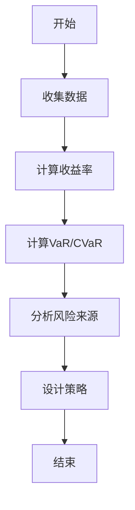
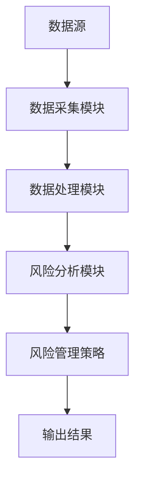
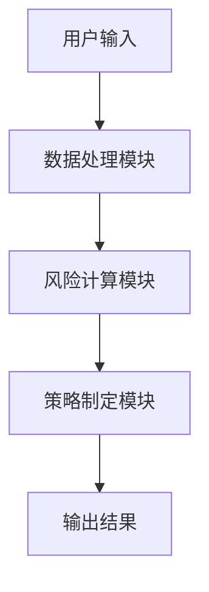

                 


# 特价股票投资中的系统性风险管理方法

## 关键词：
- 系统性风险管理
- 特价股票
- 风险量化
- 系统架构
- 算法模型

## 摘要：
本文将深入探讨特价股票投资中的系统性风险管理方法。首先介绍特价股票的基本概念和特点，分析系统性风险管理的重要性及其在投资中的应用。接着，通过数学模型和算法设计，详细讲解系统性风险管理的核心概念与实现方法。最后，结合实际案例，展示如何构建系统性风险管理模型，并提供系统的解决方案和最佳实践建议。

---

# 第一部分: 特价股票投资中的系统性风险管理概述

## 第1章: 特价股票投资的背景与现状

### 1.1 特价股票的定义与特点

#### 1.1.1 特价股票的定义
特价股票通常指价格低于其内在价值或市场平均价格的股票。这类股票可能因为市场波动、公司短期问题或其他因素而被低估，为投资者提供了潜在的收益机会。

#### 1.1.2 特价股票的特点
- **低估值**：市场价格低于内在价值。
- **高波动性**：股价波动较大，容易受到市场情绪影响。
- **高风险**：由于价格低廉，公司可能存在财务或经营问题。

#### 1.1.3 特价股票的投资价值
- 投资者可以在低价时买入，等待价值回归。
- 存在较高的收益潜力，尤其是在市场反弹时。

### 1.2 系统性风险管理的重要性

#### 1.2.1 系统性风险的定义
系统性风险是指影响整个市场或经济体系的风险，通常由宏观经济因素或系统性事件引发，如经济衰退、政策变化等。

#### 1.2.2 系统性风险的来源
- **宏观经济因素**：经济衰退、通货膨胀、利率变化等。
- **市场因素**：市场波动、投资者情绪等。
- **政策因素**：政府政策变化、法规调整等。

#### 1.2.3 系统性风险管理的意义
- **保护投资者利益**：减少投资组合的损失。
- **稳定市场**：通过有效的风险管理，降低市场的波动性。
- **提升投资决策**：帮助投资者更好地理解市场风险。

### 1.3 特价股票投资中的系统性风险管理

#### 1.3.1 特价股票投资的风险类型
- **市场风险**：整个市场的波动影响股价。
- **流动性风险**：低价股票可能流动性较差，难以迅速变现。
- **公司特定风险**：公司自身的财务或经营问题。

#### 1.3.2 系统性风险管理的目标
- 识别和量化系统性风险。
- 设计有效的风险管理策略，降低系统性风险的影响。

#### 1.3.3 系统性风险管理的框架
- **风险识别**：识别可能的系统性风险来源。
- **风险量化**：使用数学模型量化风险。
- **风险控制**：通过策略和工具进行风险对冲。

---

## 第2章: 系统性风险管理的核心概念与联系

### 2.1 系统性风险的核心要素

#### 2.1.1 系统性风险的构成要素
- **市场因素**：整体市场的波动。
- **经济因素**：宏观经济指标的变化。
- **政策因素**：政府政策的调整。

#### 2.1.2 系统性风险的传播机制
- **传染效应**：一个市场的波动可能传染到其他市场。
- **杠杆效应**：杠杆交易的放大作用。

#### 2.1.3 系统性风险的量化方法
- 使用数学模型（如VaR）量化风险。

### 2.2 系统性风险管理的理论基础

#### 2.2.1 风险管理的基本原理
- 风险是不可避免的，但可以通过管理来降低损失。

#### 2.2.2 系统性风险管理的数学模型
- **VaR（Value at Risk）**：计算投资组合在一定置信水平下的最大损失。
- **CVaR（Conditional Value at Risk）**：VaR的延伸，考虑超过VaR的情况。

#### 2.2.3 系统性风险管理的理论框架
- 基于VaR模型的系统性风险分析框架。

### 2.3 系统性风险管理的核心概念对比

#### 2.3.1 系统性风险与非系统性风险的对比
| 类别                | 系统性风险             | 非系统性风险           |
|---------------------|------------------------|------------------------|
| 影响范围            | 整个市场               | 单一资产或行业         |
| 可分散性            | 不可分散               | 可分散                 |
| 来源                | 宏观经济因素           | 公司特定因素           |

#### 2.3.2 系统性风险管理与传统风险管理的对比
- **传统风险管理**：侧重于单个资产的风险。
- **系统性风险管理**：侧重于整个市场的系统性风险。

---

## 第3章: 系统性风险管理的算法原理

### 3.1 系统性风险管理的数学模型

#### 3.1.1 系统性风险的量化公式
- VaR公式：
  $$ VaR = \mu + z \cdot \sigma $$
  其中，$\mu$是均值，$z$是标准正态分布的分位数，$\sigma$是标准差。

- CVaR公式：
  $$ CVaR = \frac{1}{1-\alpha} \int_{\alpha}^{1} VaR d\alpha $$

#### 3.1.2 系统性风险的传播模型
- 使用马科维茨的有效组合理论，量化市场风险。

#### 3.1.3 系统性风险的预测模型
- 使用时间序列分析（如ARIMA模型）预测系统性风险。

### 3.2 系统性风险管理的算法流程

#### 3.2.1 系统性风险管理的算法步骤
1. 收集市场数据。
2. 计算资产的收益率。
3. 计算VaR或CVaR。
4. 分析系统性风险的来源。
5. 设计风险管理策略。

#### 3.2.2 系统性风险管理的算法流程图（Mermaid）



### 3.3 算法实现与代码解析

#### 3.3.1 系统性风险管理算法的Python实现

```python
import numpy as np
import pandas as pd

# 计算VaR
def calculate_var(returns, confidence_level=0.95):
    sorted_returns = sorted(returns)
    var_index = int(len(sorted_returns) * (1 - confidence_level))
    var = sorted_returns[var_index]
    return var

# 计算CVaR
def calculate_cvar(returns, confidence_level=0.95):
    var_index = int(len(returns) * (1 - confidence_level))
    cvar = np.mean(sorted_returns[var_index:])
    return cvar

# 示例数据
returns = np.random.normal(0, 1, 1000)
sorted_returns = sorted(returns)
var = calculate_var(returns)
cvar = calculate_cvar(returns)
```

#### 3.3.2 算法代码的详细解读
- **VaR计算**：使用排序法计算特定置信水平下的VaR。
- **CVaR计算**：在VaR的基础上，计算超过VaR的部分的平均值。

---

## 第4章: 系统性风险管理的系统分析与架构设计

### 4.1 系统性风险管理的系统架构

#### 4.1.1 系统性风险管理的系统组成
- 数据采集模块：收集市场数据。
- 风险计算模块：计算VaR、CVaR等指标。
- 风险管理模块：制定风险管理策略。

#### 4.1.2 系统性风险管理的系统功能模块
- 数据处理模块。
- 风险分析模块。
- 策略制定模块。

#### 4.1.3 系统性风险管理的系统架构图（Mermaid）



### 4.2 系统性风险管理的接口设计

#### 4.2.1 系统性风险管理的输入接口
- 市场数据接口。
- 参数设置接口。

#### 4.2.2 系统性风险管理的输出接口
- VaR和CVaR值。
- 风险管理策略。

#### 4.2.3 系统性风险管理的交互流程图（Mermaid）



### 4.3 系统性风险管理的系统实现

#### 4.3.1 系统性风险管理的系统实现步骤
1. 数据采集。
2. 数据处理。
3. 风险计算。
4. 策略制定。
5. 结果输出。

#### 4.3.2 系统性风险管理的系统实现代码
```python
import pandas as pd
import numpy as np

# 数据采集模块
data = pd.read_csv('market_data.csv')

# 数据处理模块
returns = data['price'].pct_change().dropna()

# 风险计算模块
var = calculate_var(returns)
cvar = calculate_cvar(returns)

# 策略制定模块
if var > 0.05:
    print("风险过高，建议调整策略")
else:
    print("风险可控")
```

---

## 结论

通过本文的详细分析，我们可以看到系统性风险管理在特价股票投资中的重要性。从数学模型到系统架构的设计，每一步都需要严谨的分析和实现。投资者可以通过本文提供的方法，更好地管理投资风险，实现稳健的投资收益。

---

## 作者

作者：AI天才研究院（AI Genius Institute）  
联系邮箱：contact@aigeniusinstitute.com  
文章地址：[https://aigeniusinstitute.com/](https://aigeniusinstitute.com/)

---

**小结**：系统性风险管理是投资成功的关键，尤其在特价股票投资中更为重要。通过本文的方法，投资者可以更好地应对市场波动，降低系统性风险的影响。

**注意事项**：
- 定期更新风险管理模型，适应市场变化。
- 结合实际市场情况调整风险管理策略。
- 风险管理工具的选择需谨慎，确保其有效性和可靠性。

**拓展阅读**：
- 更深入的系统性风险管理方法。
- 其他风险管理工具和技术。

