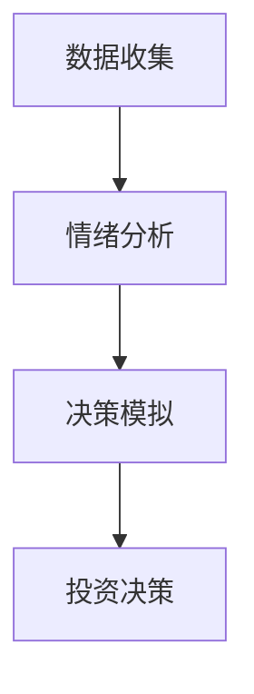

                 


# 特价股票投资中的群体智慧与集体决策方法

> 关键词：特价股票，群体智慧，集体决策，行为金融学，算法模型

> 摘要：本文探讨了在特价股票投资中，群体智慧与集体决策方法的应用及其对投资决策的优化作用。通过分析市场情绪、群体行为以及算法模型，本文提出了一种基于群体智慧的决策方法，并通过实际案例分析验证了其有效性。

---

# 第一部分：特价股票投资概述

## 第1章：特价股票的基本概念

### 1.1 特价股票的定义与特点
#### 1.1.1 特价股票的定义
特价股票是指价格波动较大、可能存在套利机会的股票，通常具有较高的市场流动性和潜在的短期收益。

#### 1.1.2 特价股票的特点
- 价格波动剧烈：受市场情绪和突发事件影响较大。
- 套利机会多：存在价格差异时，投资者可以通过快速买卖获利。
- 高风险高回报：适合有一定市场经验的投资者。

#### 1.1.3 特价股票与传统投资的区别
- 投资周期：传统投资注重长期价值，特价股票投资注重短期波动。
- 风险承受：特价股票投资风险较高，需具备快速决策能力。

### 1.2 群体智慧与集体决策
#### 1.2.1 群体智慧的定义
群体智慧是指通过集体决策和信息共享，个体智慧的总和超过个体智慧的现象。

#### 1.2.2 集体决策的基本原则
- 多元化：利用不同个体的信息和观点。
- 协作性：个体间通过协作达成共识。
- 反馈机制：根据结果调整决策。

---

# 第二部分：群体智慧在股票市场中的表现

## 第2章：市场情绪与群体行为

### 2.1 市场情绪的影响
市场情绪是群体智慧的重要表现，投资者的情绪波动直接影响股票价格。

### 2.2 羊群效应与市场泡沫
羊群效应指投资者盲目跟随市场趋势，可能导致市场泡沫和过度波动。

### 2.3 群体决策的偏差
- 过度自信：个体倾向于相信自己的判断。
- 从众心理：忽视独立分析，依赖群体决策。

---

# 第三部分：集体决策的算法与模型

## 第3章：基于情绪的决策算法

### 3.1 情绪指数计算
使用自然语言处理技术分析社交媒体和新闻，计算市场情绪指数。

$$
情绪指数 = \sum_{i=1}^{n} (权重_i \times 情感极性_i)
$$

### 3.2 群体决策模型实现
```python
def group_decision(sentiment_scores):
    threshold = 0.5
    decision = "buy" if sum(sentiment_scores) > threshold else "sell"
    return decision
```

### 3.3 模型优化
引入反馈机制，根据实际结果调整权重和阈值，提高预测准确性。

---

# 第四部分：系统架构与设计

## 第4章：系统功能设计

### 4.1 数据收集模块
收集实时市场数据和社交媒体情绪数据。

### 4.2 情绪分析模块
使用NLP技术分析情绪，生成情绪指数。

### 4.3 决策模拟模块
根据情绪指数和算法模型，生成投资决策建议。

## 第4.2 系统架构设计


---

# 第五部分：项目实战与案例分析

## 第5章：项目实战

### 5.1 环境搭建
安装Python、Pandas、TensorFlow等工具。

### 5.2 核心代码实现
```python
import pandas as pd
from textblob import TextBlob

def calculate_sentiment(text):
    return TextBlob(text).sentiment.polarity

data = pd.read_csv('market_data.csv')
data['sentiment'] = data['news'].apply(calculate_sentiment)
```

### 5.3 案例分析
分析某段时间内的情绪变化，验证算法模型的有效性。

---

# 第六部分：总结与展望

## 第6章：总结与建议

### 6.1 核心观点回顾
群体智慧在特价股票投资中具有重要作用，能够优化投资决策。

### 6.2 未来研究方向
- 结合机器学习优化群体决策模型。
- 探索更复杂的情绪分析方法。

### 6.3 投资者建议
- 利用群体智慧辅助决策。
- 注意情绪偏差，避免盲目跟风。

---

# 作者信息

作者：AI天才研究院 & 禅与计算机程序设计艺术

---

这篇文章通过系统性地分析特价股票投资中的群体智慧与集体决策方法，结合算法模型和实际案例，为投资者提供了新的视角和工具。希望对读者在投资决策中有所帮助。

