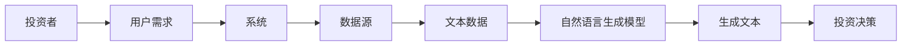
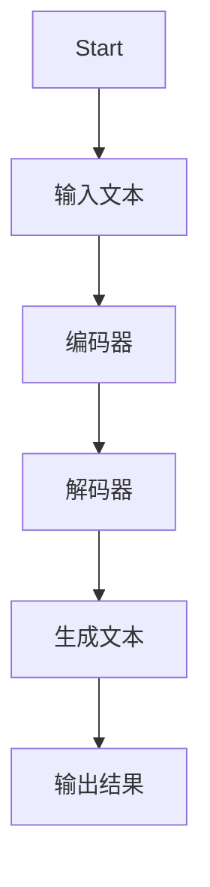
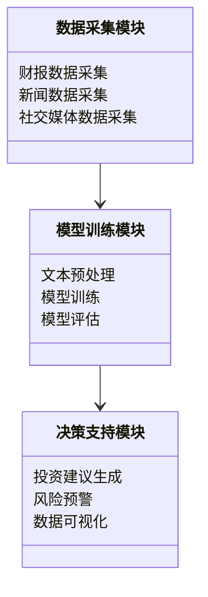
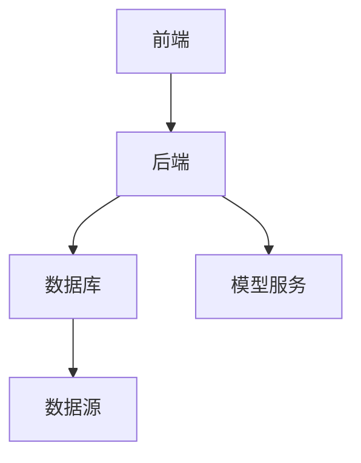
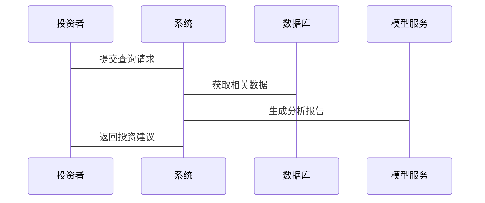

                 


# 特价股票投资中的自然语言生成辅助决策系统

> 关键词：自然语言生成、股票投资、决策系统、预训练语言模型、数学模型、系统架构设计

> 摘要：本文探讨了自然语言生成技术在特价股票投资中的应用，通过分析特价股票投资的背景、核心概念、算法原理、数学模型、系统架构设计以及项目实战，展示了如何利用自然语言生成技术辅助投资者做出更明智的决策。文章内容详实，结合理论与实践，为读者提供了从理论到实践的完整指南。

---

## 第一部分：背景介绍

### 第1章：特价股票投资的背景与挑战

#### 1.1 特价股票投资的背景
- 1.1.1 什么是特价股票  
  特价股票是指价格相对较低、市场流动性较低的股票，通常在特定市场环境下具有较高的投资潜力。  
- 1.1.2 特价股票投资的现状与趋势  
  随着市场的波动，特价股票因其低估值特性吸引了越来越多的投资者。然而，其信息不透明和流动性低的问题也为投资决策带来了挑战。  
- 1.1.3 特价股票投资中的信息需求  
  投资者需要快速获取公司财报、行业新闻、市场分析等信息，以做出明智的投资决策。

#### 1.2 自然语言生成技术的必要性
- 1.2.1 自然语言生成技术的定义与特点  
  自然语言生成（Natural Language Generation, NLP）是利用计算机技术自动生成人类可读文本的过程，具有高效性、灵活性和可扩展性的特点。  
- 1.2.2 特价股票投资中信息处理的难点  
  特价股票市场信息分散、数据复杂，传统的人工分析效率低下且成本高昂。  
- 1.2.3 自然语言生成技术如何解决这些问题  
  自然语言生成技术可以帮助投资者快速提取关键信息，生成结构化的报告，从而提高决策效率。

#### 1.3 问题分析与解决方案
- 1.3.1 特价股票投资中的信息不对称问题  
  由于信息不透明，投资者难以全面掌握市场动态，导致决策失误。  
- 1.3.2 自然语言生成技术的应用场景  
  通过分析新闻、财报等文本数据，生成投资建议、风险预警等信息，辅助投资者做出决策。  
- 1.3.3 解决方案的实现路径  
  结合自然语言处理技术，构建一个智能化的决策支持系统，帮助投资者快速获取和分析信息。

---

## 第二部分：核心概念与联系

### 第2章：自然语言生成与特价股票投资的核心概念

#### 2.1 自然语言生成的原理
- 自然语言生成的原理是通过训练大规模文本数据，构建语言模型，生成符合语法规则和语义逻辑的文本。  
- 常见的自然语言生成模型包括基于规则的生成和基于统计的生成，以及近年来兴起的基于深度学习的生成模型。

#### 2.2 特价股票投资的特征分析
- 特价股票市场的特征包括低流动性、高波动性、信息不透明等。  
- 投资者在面对这些特征时，需要快速做出决策，因此对信息处理效率的要求极高。

#### 2.3 自然语言生成与特价股票投资的联系
- 通过自然语言生成技术，投资者可以快速生成投资报告、市场分析等文本，帮助其做出决策。  
- 自然语言生成技术可以整合多种数据源，生成结构化的信息，从而提高投资决策的效率和准确性。

#### 2.4 实体关系图（ER图）设计

- 实体关系图展示了投资者、用户需求、系统、数据源、文本数据、自然语言生成模型和投资决策之间的关系。

---

## 第三部分：算法原理

### 第3章：自然语言生成算法的原理与实现

#### 3.1 预训练语言模型的原理
- 预训练语言模型通过在大规模文本数据上进行无监督训练，学习语言的语义和语法特征。  
- 常见的预训练模型包括BERT、GPT等。

#### 3.2 基于Transformer的自然语言生成模型
- Transformer模型通过自注意力机制，捕捉文本中的长距离依赖关系。  
- 解码器端的生成过程基于贪心搜索或Beam Search算法。

#### 3.3 算法流程图


#### 3.4 数学模型
- 编码器部分通过多头自注意力机制生成文本的语义表示，解码器部分通过相同的机制生成目标文本。
- 损失函数采用交叉熵损失函数：
  $$ L = -\sum_{i=1}^{n} y_i \log(p(y_i)) $$
- 优化算法采用Adam优化器：
  $$ \theta = \theta - \eta \frac{\partial L}{\partial \theta} $$

---

## 第四部分：数学模型

### 第4章：自然语言生成中的数学模型

#### 4.1 交叉熵损失函数
- 交叉熵损失函数用于衡量生成文本与真实文本之间的差异：
  $$ H(y, p) = -\sum_{i=1}^{n} y_i \log(p(y_i)) $$
  
#### 4.2 优化算法
- 使用Adam优化器：
  $$ \theta = \theta - \eta \frac{\partial L}{\partial \theta} $$
  其中，$\eta$ 是学习率，$\theta$ 是模型参数。

---

## 第五部分：系统分析与架构设计

### 第5章：系统架构设计

#### 5.1 项目应用场景
- 该系统适用于专业投资者、机构投资者以及个人投资者，帮助其快速获取市场信息，做出投资决策。

#### 5.2 系统功能设计


#### 5.3 系统架构设计


#### 5.4 系统接口设计
- API接口：RESTful API，支持文本生成、数据查询等功能。

#### 5.5 系统交互流程


---

## 第六部分：项目实战

### 第6章：系统实现与案例分析

#### 6.1 环境配置
- Python 3.8+
- PyTorch 1.9+
- transformers库 4.10+

#### 6.2 系统核心实现
```python
from transformers import AutoTokenizer, AutoModelForCausalLM
import torch

model_name = "gpt2"
tokenizer = AutoTokenizer.from_pretrained(model_name)
model = AutoModelForCausalLM.from_pretrained(model_name)

def generate_text(prompt, max_length=50):
    inputs = tokenizer.encode(prompt, return_tensors="pt")
    outputs = model.generate(inputs, max_length=max_length, do_sample=True)
    return tokenizer.decode(outputs[0], skip_special_tokens=True)
```

#### 6.3 案例分析
- 案例1：基于公司财报生成投资建议
- 案例2：基于市场新闻生成风险预警

---

## 第七部分：总结与展望

### 第7章：总结与展望

#### 7.1 全文总结
- 本文详细介绍了自然语言生成技术在特价股票投资中的应用，从理论到实践，展示了如何构建一个高效的决策支持系统。

#### 7.2 系统优缺点分析
- 优点：高效性、准确性、可扩展性  
- 缺点：依赖高质量数据、模型训练成本高

#### 7.3 未来展望
- 深度学习技术的进一步发展将推动自然语言生成技术在金融领域的应用。
- 多模态数据的结合将进一步提升系统的决策能力。

---

作者：AI天才研究院/AI Genius Institute & 禅与计算机程序设计艺术/Zen And The Art of Computer Programming

