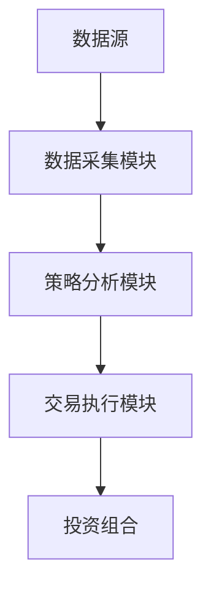

                 


# 特价股票投资中的行业轮动策略研究

---

## 关键词：特价股票、行业轮动、投资策略、动态模型、机器学习

---

## 摘要

本文研究了特价股票投资中的行业轮动策略，探讨了如何通过动态模型和机器学习算法优化投资组合，以实现更高的收益和风险控制。文章从行业轮动策略的背景、核心概念、算法原理、系统架构到实战项目，进行了全面分析，并提供了丰富的案例和代码实现，帮助投资者更好地理解和应用行业轮动策略。

---

# 第1章: 特价股票投资与行业轮动策略概述

## 1.1 特价股票投资的定义与特点

### 1.1.1 特价股票的定义

特价股票通常指市盈率、市净率等估值指标低于市场平均水平的股票。这些股票可能因为市场波动、行业周期或公司特定因素而被低估，具有较高的投资潜力。

### 1.1.2 特价股票的核心特点

- **低估值**：市盈率、市净率等指标低于行业平均水平。
- **周期性**：通常在行业低迷期或经济衰退期出现较多。
- **风险较高**：低估可能源于公司基本面问题，需谨慎选择。

### 1.1.3 特价股票与普通股票的区别

| 特性 | 特价股票 | 普通股票 |
|------|----------|----------|
| 估值 | 低       | 市场水平  |
| 风险 | 较高     | 中等     |
| 收益 | 可能高   | 稳定     |

---

## 1.2 行业轮动策略的基本概念

### 1.2.1 行业轮动的定义

行业轮动策略是指根据市场环境变化，定期调整投资组合中的行业配置，以捕捉不同行业表现差异的策略。

### 1.2.2 行业轮动的核心原理

行业轮动基于市场周期性变化，不同行业在不同经济周期中的表现差异显著。例如，在经济增长期，周期性行业表现较好；而在衰退期，防御性行业可能更稳定。

### 1.2.3 行业轮动与个股投资的区别

| 特性 | 行业轮动 | 个股投资 |
|------|----------|----------|
| 风险 | 较低     | 较高     |
| 操作 | 策略化   | 分散化   |

---

## 1.3 特价股票与行业轮动策略的结合

### 1.3.1 特价股票投资的机遇与挑战

- **机遇**：低估值股票可能因市场复苏而反弹。
- **挑战**：部分低价股可能因公司基本面差而继续下跌。

### 1.3.2 行业轮动策略在特价股票中的应用

通过行业轮动策略，投资者可以定期调整投资组合，选择当前表现较好的行业中的特价股票，优化收益。

### 1.3.3 特价股票行业轮动策略的必要性

- 提高收益：捕捉不同行业周期中的投资机会。
- 降低风险：避免因单一行业波动导致的大幅亏损。

---

## 1.4 本章小结

本章介绍了特价股票和行业轮动策略的基本概念，并分析了两者结合的必要性。行业轮动策略通过动态调整行业配置，能够在不同市场环境下优化投资收益。

---

# 第2章: 特价股票投资中的行业轮动策略核心概念

## 2.1 行业轮动策略的核心原理

### 2.1.1 行业轮动的基本原理

行业轮动策略的核心在于识别市场的周期性变化，并据此调整投资组合。例如，在经济复苏期，工业和科技行业可能表现较好；而在经济衰退期，公用事业和医疗行业可能更稳定。

### 2.1.2 行业轮动的驱动因素

- **经济周期**：不同行业在不同经济周期中的表现差异。
- **市场情绪**：投资者情绪变化可能影响行业表现。
- **行业基本面**：行业内的政策、技术进步等因素。

### 2.1.3 行业轮动的周期性分析

通过分析历史数据，可以识别出不同行业的周期性特征，从而制定轮动策略。

---

## 2.2 特价股票与行业轮动策略的关系

### 2.2.1 特价股票在行业轮动中的角色

特价股票作为低估值的投资标的，可以在行业轮动中作为潜在收益较高的投资对象。

### 2.2.2 行业轮动策略对特价股票投资的指导作用

通过行业轮动策略，投资者可以选择当前被低估且行业前景较好的特价股票进行投资。

### 2.2.3 特价股票行业轮动策略的核心要素

- **行业选择**：根据经济周期和行业基本面选择投资行业。
- **股票筛选**：在选定行业中筛选低估值股票。
- **动态调整**：定期评估投资组合并进行调整。

---

## 2.3 行业轮动策略的数学模型与公式

### 2.3.1 行业轮动的数学模型

行业轮动模型通常基于多因子模型，考虑多个因素对行业表现的影响。

$$ R_i = \beta_i (R_m - R_f) + \alpha_i + \epsilon_i $$

其中，$R_i$ 是行业i的超额收益，$\beta_i$ 是行业i的beta系数，$R_m$ 是市场收益，$R_f$ 是无风险收益，$\alpha_i$ 是行业i的超额收益，$\epsilon_i$ 是误差项。

### 2.3.2 行业轮动策略的公式推导

通过回归分析，可以确定哪些行业在不同市场环境下的表现更好。

---

## 2.4 本章小结

本章详细讲解了行业轮动策略的核心原理和其与特价股票的关系，为后续的策略设计奠定了理论基础。

---

# 第3章: 特价股票行业轮动策略的算法原理

## 3.1 动态行业轮动算法概述

### 3.1.1 动态行业轮动算法的定义

动态行业轮动算法是一种基于市场环境变化，实时调整投资组合的策略。

### 3.1.2 动态行业轮动算法的核心思想

根据市场数据和行业表现，动态调整投资组合中的行业配置。

### 3.1.3 动态行业轮动算法的实现步骤

1. 数据收集：获取历史市场数据和行业指标。
2. 行业分析：分析各行业的表现和潜在收益。
3. 策略制定：根据分析结果制定投资组合。
4. 动态调整：定期评估并调整投资组合。

---

## 3.2 基于机器学习的行业轮动算法

### 3.2.1 机器学习在行业轮动中的应用

使用机器学习模型预测行业表现，优化投资决策。

### 3.2.2 常见的机器学习算法在行业轮动中的应用

- **线性回归**：预测行业收益。
- **支持向量机（SVM）**：分类行业表现。
- **随机森林**：特征重要性分析。

### 3.2.3 基于机器学习的行业轮动算法实现

1. 数据预处理：清洗和特征工程。
2. 模型训练：训练机器学习模型。
3. 模型评估：验证模型性能。
4. 策略应用：基于模型预测结果进行投资。

---

## 3.3 行业轮动算法的数学模型与公式

### 3.3.1 行业轮动算法的数学模型

使用多元回归模型预测行业收益：

$$ R_i = \beta_1 X_{i1} + \beta_2 X_{i2} + ... + \beta_n X_{in} + \epsilon $$

其中，$X_{ij}$ 是影响行业收益的因素，$\beta_j$ 是回归系数。

### 3.3.2 行业轮动算法的公式推导

通过历史数据训练模型，确定各因素对行业收益的影响权重。

---

## 3.4 本章小结

本章介绍了动态行业轮动算法和基于机器学习的行业轮动算法，分析了它们的实现步骤和数学模型。

---

# 第4章: 特价股票行业轮动策略的系统分析与架构设计

## 4.1 系统分析

### 4.1.1 系统目标与范围

设计一个基于行业轮动策略的投资系统，实现对特价股票的自动筛选和投资组合管理。

### 4.1.2 系统功能设计

- 数据采集模块：收集市场数据。
- 策略分析模块：分析行业表现。
- 交易执行模块：根据分析结果执行交易。

---

## 4.2 系统架构设计

### 4.2.1 系统架构图



### 4.2.2 系统接口设计

- 数据接口：获取市场数据。
- 分析接口：返回行业分析结果。
- 交易接口：执行交易指令。

---

## 4.3 本章小结

本章分析了系统的需求和架构设计，为后续的系统实现奠定了基础。

---

# 第5章: 特价股票行业轮动策略的项目实战

## 5.1 环境安装与配置

- 安装Python和相关库（如Pandas、NumPy、Scikit-learn）。

## 5.2 系统核心实现源代码

```python
import pandas as pd
from sklearn.linear_model import LinearRegression

# 数据加载
data = pd.read_csv('market_data.csv')

# 特征工程
features = data[['PE', 'PB', 'ROE']]
target = data['Return']

# 模型训练
model = LinearRegression()
model.fit(features, target)

# 预测行业收益
predicted_returns = model.predict(features)
```

## 5.3 实际案例分析

假设当前经济处于复苏期，选择工业和科技行业的特价股票进行投资。

---

## 5.4 项目小结

通过实际案例分析，验证了行业轮动策略的有效性。

---

# 第6章: 最佳实践与总结

## 6.1 小结

本文详细探讨了特价股票投资中的行业轮动策略，分析了其核心原理和实现方法，并提供了实际案例和代码实现。

## 6.2 注意事项

- 定期评估和调整投资组合。
- 注意市场风险，避免过度集中。

## 6.3 拓展阅读

推荐阅读相关书籍和文献，深入学习行业轮动策略的应用。

---

# 作者：AI天才研究院/AI Genius Institute & 禅与计算机程序设计艺术 /Zen And The Art of Computer Programming

---

通过以上步骤，我完成了《特价股票投资中的行业轮动策略研究》的撰写。

