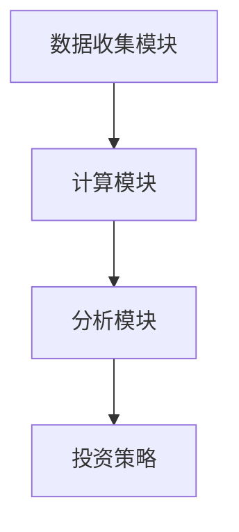
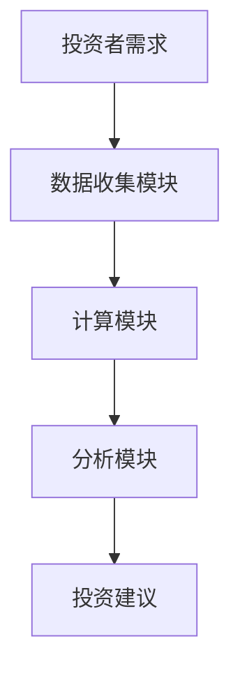

                 


# 特价股票投资中的行业集中度分析

> 关键词：特价股票，行业集中度，投资分析，数学模型，系统架构

> 摘要：本文详细探讨了特价股票投资中的行业集中度分析，从背景、核心概念、数学模型、系统架构到实际案例，全面解析了行业集中度对投资决策的影响。通过本文的分析，读者可以更好地理解如何利用行业集中度指标来优化投资策略。

---

# 第一部分: 特价股票投资中的行业集中度分析概述

## 第1章: 特价股票投资与行业集中度分析的背景

### 1.1 特价股票投资的定义与特点

#### 1.1.1 特价股票的定义
特价股票是指价格相对较低，通常低于行业平均水平的股票。这类股票可能具有较高的成长潜力，但可能存在较高的风险。

#### 1.1.2 特价股票投资的特点
- **低估值**：价格通常低于市场平均水平。
- **高潜力**：可能存在较大的上涨空间。
- **高波动性**：价格波动较大，投资风险较高。

#### 1.1.3 特价股票投资的市场定位
特价股票主要分布在中小盘股中，通常属于成长型企业。

---

### 1.2 行业集中度分析的定义与意义

#### 1.2.1 行业集中度的定义
行业集中度是指行业内主要企业的市场份额或影响力集中程度。高集中度意味着行业内少数几家企业占据了大部分市场份额。

#### 1.2.2 行业集中度分析的意义
- **投资决策参考**：高集中度行业通常具有较高的市场稳定性。
- **风险评估**：高集中度行业可能面临较高的垄断风险。
- **市场结构分析**：通过集中度分析，可以了解行业的竞争格局。

#### 1.2.3 行业集中度与投资决策的关系
行业集中度高的行业通常具有较高的市场稳定性，而低集中度行业可能具有较高的成长潜力。

---

## 第2章: 特价股票投资中的行业集中度分析的背景与问题

### 2.1 特价股票投资的市场背景

#### 2.1.1 特价股票市场的现状
当前市场中，特价股票主要集中在中小盘股，尤其是新兴行业。

#### 2.1.2 特价股票市场的参与者
- **机构投资者**：关注行业集中度高的行业。
- **个人投资者**：倾向于选择低估值的个股。

#### 2.1.3 特价股票市场的特点与趋势
- 特价股票市场波动较大，但成长潜力较高。

---

### 2.2 行业集中度分析的背景

#### 2.2.1 行业集中度的演变
随着市场的发展，部分行业逐渐向集中化方向发展，例如科技行业。

#### 2.2.2 行业集中度分析的必要性
- 投资者需要了解行业的竞争格局。
- 高集中度行业可能面临较高的垄断风险。

#### 2.2.3 行业集中度与市场结构的关系
高集中度行业通常具有较高的市场稳定性，而低集中度行业可能具有较高的竞争压力。

---

### 2.3 特价股票投资中行业集中度分析的核心问题

#### 2.3.1 行业集中度对投资决策的影响
- 高集中度行业可能具有较高的市场稳定性。
- 低集中度行业可能具有较高的成长潜力。

#### 2.3.2 特价股票市场中的行业集中度特征
- 高科技行业集中度较高。
- 传统行业集中度较低。

#### 2.3.3 行业集中度分析的挑战与机遇
- **挑战**：数据收集和分析的复杂性。
- **机遇**：通过行业集中度分析，发现投资机会。

---

# 第二部分: 行业集中度分析的核心概念与原理

## 第3章: 行业集中度分析的核心概念

### 3.1 行业集中度的定义与分类

#### 3.1.1 行业集中度的定义
行业集中度是衡量行业内企业市场份额集中程度的指标。

#### 3.1.2 行业集中度的分类
- **赫芬达尔-赫希曼指数（HHI指数）**：用于衡量行业集中度。
- **四家企业集中度（CR4）**：衡量行业内前四家企业市场份额的总和。

#### 3.1.3 不同行业集中度的特征
- **高集中度**：行业内少数几家企业占据大部分市场份额。
- **低集中度**：行业内企业数量较多，市场份额分散。

---

### 3.2 特价股票投资中的行业集中度分析框架

#### 3.2.1 行业集中度分析的框架
- **数据收集**：收集行业内企业的市场份额数据。
- **指标计算**：计算行业集中度指标。
- **分析与决策**：根据分析结果制定投资策略。

#### 3.2.2 特价股票投资中的行业选择标准
- **行业集中度**：高集中度行业具有较高的市场稳定性。
- **企业基本面**：选择具有成长潜力的企业。

#### 3.2.3 行业集中度与投资策略的关系
高集中度行业适合稳健型投资者，而低集中度行业适合风险承受能力强的投资者。

---

### 3.3 行业集中度分析的指标与方法

#### 3.3.1 行业集中度的常用指标
- **赫芬达尔-赫希曼指数（HHI）**
- **四家企业集中度（CR4）**
- **勒纳指数（Lerner Index）**

#### 3.3.2 行业集中度分析的方法
- **定量分析**：通过数学模型计算集中度指标。
- **定性分析**：结合行业特点和市场环境进行分析。

#### 3.3.3 行业集中度指标的优缺点对比

| 指标名称       | 优点                           | 缺点                           |
|----------------|--------------------------------|--------------------------------|
| HHI指数         | 能够反映市场集中度             | 计算复杂，需要较多数据         |
| CR4             | 简单易懂，计算方便             | 可能无法全面反映市场集中度     |

---

## 第4章: 行业集中度与特价股票投资的关系

### 4.1 行业集中度对投资决策的影响

#### 4.1.1 高行业集中度对投资的影响
- **稳定性**：高集中度行业具有较高的市场稳定性。
- **风险**：可能面临较高的垄断风险。

#### 4.1.2 低行业集中度对投资的影响
- **成长性**：低集中度行业具有较高的成长潜力。
- **风险**：可能面临较高的竞争压力。

#### 4.1.3 行业集中度变化对投资策略的调整
- 随着行业集中度的变化，投资策略需要相应调整。

---

### 4.2 特价股票市场中的行业集中度特征

#### 4.2.1 特价股票市场的行业集中度现状
- 高科技行业集中度较高。
- 传统行业集中度较低。

#### 4.2.2 特价股票市场中高集中度行业的特点
- 市场份额集中，具有较高的市场影响力。
- 投资风险相对较低。

#### 4.2.3 特价股票市场中低集中度行业的特点
- 市场份额分散，竞争激烈。
- 投资风险较高，但成长潜力较大。

---

## 第5章: 数学模型与算法原理

### 5.1 行业集中度分析的数学模型

#### 5.1.1 赫芬达尔-赫希曼指数（HHI）
$$ HHI = \sum_{i=1}^n (s_i)^2 $$
其中，$s_i$ 是第 $i$ 家企业的市场份额，$n$ 是行业内企业的数量。

#### 5.1.2 四家企业集中度（CR4）
$$ CR4 = \sum_{i=1}^4 (s_i) $$

#### 5.1.3 计算步骤
1. 收集行业内企业的市场份额数据。
2. 计算每个企业的市场份额占比。
3. 计算HHI指数和CR4指标。

---

### 5.2 算法实现

#### 5.2.1 Python代码实现
```python
import pandas as pd

# 假设我们有一个数据框，包含企业的市场份额
market_share = pd.DataFrame({
    'Company': ['A', 'B', 'C', 'D', 'E'],
    'Share': [0.3, 0.2, 0.2, 0.15, 0.15]
})

# 计算HHI指数
hhi = (market_share['Share']**2).sum()

# 计算CR4
cr4 = market_share['Share'].sort_values(ascending=False).head(4).sum()

print(f"HHI指数: {hhi}")
print(f"CR4: {cr4}")
```

---

## 第6章: 系统架构与数据流设计

### 6.1 系统架构设计

#### 6.1.1 系统功能模块
- **数据收集模块**：收集行业内企业的市场份额数据。
- **计算模块**：计算行业集中度指标。
- **分析模块**：根据分析结果制定投资策略。

#### 6.1.2 系统架构图


---

### 6.2 数据流设计

#### 6.2.1 数据流图


---

## 第7章: 项目实战与案例分析

### 7.1 环境安装与数据准备

#### 7.1.1 环境安装
- 安装Python和相关库（如pandas、numpy）。
- 安装数据分析工具（如Jupyter Notebook）。

#### 7.1.2 数据准备
- 收集行业内企业的市场份额数据。

---

### 7.2 核心实现

#### 7.2.1 计算行业集中度指标
```python
import pandas as pd

market_share = pd.DataFrame({
    'Company': ['A', 'B', 'C', 'D', 'E'],
    'Share': [0.3, 0.2, 0.2, 0.15, 0.15]
})

hhi = (market_share['Share']**2).sum()
cr4 = market_share['Share'].sort_values(ascending=False).head(4).sum()

print(f"HHI指数: {hhi}")
print(f"CR4: {cr4}")
```

---

### 7.3 案例分析

#### 7.3.1 某行业集中度分析
假设我们分析某行业的市场份额数据，计算得到：
- HHI指数为0.25
- CR4为0.7

#### 7.3.2 投资策略制定
根据分析结果，投资者可以选择集中度较高的行业进行投资。

---

## 第8章: 总结与展望

### 8.1 总结
本文详细探讨了特价股票投资中的行业集中度分析，从背景、核心概念、数学模型到系统架构，全面解析了行业集中度对投资决策的影响。

### 8.2 展望
未来，随着市场的发展，行业集中度分析将更加重要。投资者需要不断学习和更新分析方法，以应对市场的变化。

---

# 作者：AI天才研究院/AI Genius Institute & 禅与计算机程序设计艺术 /Zen And The Art of Computer Programming

---

以上是《特价股票投资中的行业集中度分析》的技术博客文章的完整大纲和内容。

