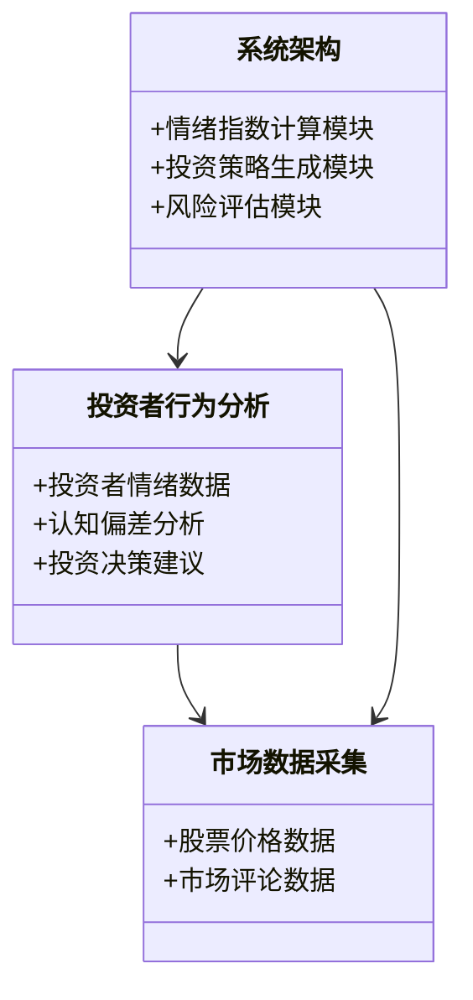
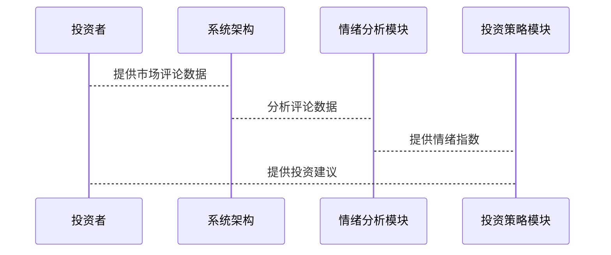

                 


# 特价股票投资中的行为科学应用技巧

## 关键词：
- 特价股票
- 行为科学
- 投资策略
- 情绪分析
- 认知偏差

## 摘要：
本文深入探讨了行为科学在特价股票投资中的应用技巧，从背景介绍、行为科学基础、数学模型构建、系统设计到项目实战，全面分析了投资者心理、行为偏差、情绪影响以及如何利用这些因素优化投资策略。文章结合实际案例，通过数学模型和系统架构的设计，为读者提供了科学的分析方法和实用的技巧，帮助投资者在特价股票市场中做出更明智的决策。

---

# 第一部分: 特价股票投资中的行为科学基础

## 第1章: 特价股票投资与行为科学概述

### 1.1 特价股票投资的定义与特点
#### 1.1.1 特价股票的定义
特价股票是指在特定市场条件下，价格被低估或处于历史低位的股票。这些股票通常具有较高的投资潜力，但由于市场波动或其他因素，其价格未能完全反映其内在价值。

#### 1.1.2 特价股票投资的核心特点
- 价格波动性大，但具有长期增长潜力。
- 投资者情绪波动显著，容易受市场情绪影响。
- 需要结合基本面分析和市场情绪分析。

#### 1.1.3 行为科学在特价股票投资中的应用价值
行为科学可以帮助投资者识别市场中的非理性行为，从而抓住投资机会。通过分析投资者的心理和行为模式，投资者可以制定更科学的投资策略。

### 1.2 行为科学的基本概念
#### 1.2.1 行为科学的定义
行为科学是研究人类行为的学科，结合心理学、社会学和经济学等领域的知识，分析个体和群体的行为模式。

#### 1.2.2 行为科学的核心理论
- 认知心理学：研究人类如何处理信息和做出决策。
- 社会心理学：研究社会互动和群体行为对个体的影响。
- 行为经济学：研究非理性行为对市场和经济的影响。

#### 1.2.3 行为科学与金融投资的联系
金融市场的波动性很大程度上受到投资者情绪和行为的影响。行为科学可以帮助投资者理解这些行为背后的规律，从而做出更明智的投资决策。

## 第2章: 行为科学在股票投资中的核心作用

### 2.1 投资者心理与行为分析
#### 2.1.1 投资者认知偏差的类型
- **确认偏差**：投资者倾向于寻找支持自己观点的信息，忽略相反的证据。
- **过度自信**：投资者往往高估自己的能力，低估市场的不确定性。
- **损失厌恶**：投资者对损失的厌恶程度远高于对收益的追求。

#### 2.1.2 情绪对投资决策的影响
- **贪婪与恐惧**：市场上涨时投资者贪婪，市场下跌时投资者恐惧。
- ** herd mentality**：从众心理导致市场波动加剧。

#### 2.1.3 社会心理与群体行为对投资的影响
- 群体决策可能导致非理性行为，如盲目跟风。

### 2.2 特价股票投资中的行为陷阱
#### 2.2.1 过度自信与从众心理
投资者可能因过度自信而忽视市场风险，从众心理可能导致错失投资机会。

#### 2.2.2 损失厌恶与风险偏好
投资者因害怕损失而倾向于规避风险，可能导致错失高回报的投资机会。

#### 2.2.3 短期行为与长期投资目标的冲突
短期市场波动可能干扰长期投资策略的执行。

### 2.3 行为科学在投资策略中的应用
#### 2.3.1 基于行为科学的投资决策框架
- 结合情绪分析和基本面分析制定投资策略。

#### 2.3.2 行为信号的识别与利用
- 识别市场情绪变化，提前做出反应。

#### 2.3.3 行为科学视角下的风险管理
- 通过分析投资者行为，制定更有效的风险管理策略。

## 第3章: 特价股票投资中的行为科学模型

### 3.1 行为金融学的核心理论
#### 3.1.1 行为金融学的定义
行为金融学是研究投资者心理和行为对金融市场影响的学科。

#### 3.1.2 行为金融学的主要理论
- ** prospect theory**：描述投资者在风险和收益下的决策偏好。
- ** emotion-based decision-making**：情绪对投资决策的影响。

#### 3.1.3 行为金融学与传统金融学的区别
传统金融学假设市场是理性的，而行为金融学考虑市场中的非理性因素。

### 3.2 特价股票投资中的行为模型构建
#### 3.2.1 投资者行为模型的构建
- 分析投资者情绪、认知偏差等行为特征。

#### 3.2.2 基于行为科学的股票估值模型
- 结合情绪指标和基本面分析进行股票估值。

#### 3.2.3 行为驱动的市场波动模型
- 通过分析投资者行为预测市场波动。

### 3.3 行为模型的数学表达
#### 3.3.1 投资者情绪指数的计算公式
$$情绪指数 = \frac{正向情绪词汇数 - 负向情绪词汇数}{总评论数}$$

#### 3.3.2 基于情绪的股票价格预测模型
$$价格预测 = 基准价格 + 情绪指数 \times 系数$$

#### 3.3.3 情绪与市场波动的关系式
$$波动幅度 = 情绪指数 \times 波动系数$$

## 第4章: 特价股票投资中的行为科学应用技巧

### 4.1 市场情绪分析与投资决策
#### 4.1.1 市场情绪的识别方法
- 使用自然语言处理技术分析市场评论。

#### 4.1.2 基于情绪的买入卖出时机选择
- 当情绪指数为正时考虑买入，情绪指数为负时考虑卖出。

#### 4.1.3 情绪指标在投资组合中的应用
- 根据情绪指标调整投资组合的构成。

### 4.2 行为偏差的识别与克服
#### 4.2.1 认知偏差的识别
- 通过自我反思或借助技术工具识别认知偏差。

#### 4.2.2 情绪管理技巧
- 制定情绪管理计划，避免情绪化决策。

#### 4.2.3 群体行为的识别与应对
- 识别从众心理，避免盲目跟风。

---

# 第二部分: 项目实战与系统设计

## 第5章: 系统分析与架构设计

### 5.1 项目背景介绍
- 本文将设计一个基于行为科学的特价股票投资系统。

### 5.2 系统功能设计
#### 5.2.1 领域模型（Mermaid 类图）


### 5.3 系统架构设计（Mermaid 架构图）


### 5.4 系统接口设计
- 数据采集接口：从市场获取股票价格和评论数据。
- 情绪分析接口：计算投资者情绪指数。
- 投资策略接口：生成基于情绪分析的投资策略。

### 5.5 系统交互设计（Mermaid 序列图）


## 第6章: 项目实战

### 6.1 环境安装
- 安装Python、Pandas、NumPy、TextBlob和相关库。

### 6.2 核心代码实现
```python
from textblob import TextBlob
import pandas as pd

def calculate_sentiment(text):
    blob = TextBlob(text)
    sentiment = blob.sentiment.polarity
    return sentiment

# 示例数据
comments = ["This stock is a great buy!", "I'm worried about its future.", "Love this stock!"]
sentiments = [calculate_sentiment(comment) for comment in comments]
print(sentiments)
```

### 6.3 代码应用解读与分析
- 代码用于计算每条评论的情绪值，帮助投资者识别市场情绪。

### 6.4 实际案例分析
- 分析某科技股的市场评论，计算情绪指数，并制定投资策略。

### 6.5 项目小结
- 通过案例分析，验证了行为科学在特价股票投资中的实际应用价值。

## 第7章: 最佳实践与总结

### 7.1 最佳实践
- 定期分析市场情绪，避免情绪化决策。
- 结合基本面分析和市场情绪分析制定投资策略。

### 7.2 小结
- 行为科学为特价股票投资提供了新的视角和工具。
- 通过分析投资者行为，投资者可以制定更科学的投资策略。

### 7.3 注意事项
- 情绪分析结果仅供参考，需结合其他因素进行综合判断。
- 避免过度依赖情绪分析，忽略基本面分析。

### 7.4 拓展阅读
- 建议阅读《行为经济学》、《投资者的行为偏差》等相关书籍。

---

# 作者：AI天才研究院 & 禅与计算机程序设计艺术

---

通过以上详细结构和内容的规划，本文系统地介绍了行为科学在特价股票投资中的应用，从理论到实践，为读者提供了丰富的知识和实用的技巧，帮助投资者在复杂的市场环境中做出更明智的决策。

