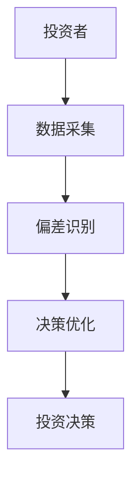

                 


# 特价股票投资中的认知偏差及其克服方法

> 关键词：认知偏差，股票投资，投资决策，决策优化，行为金融学

> 摘要：本文探讨了在特价股票投资中常见的认知偏差类型及其对投资决策的影响，并提出了克服这些偏差的具体方法和策略。通过分析认知偏差的原理、分类及其对投资行为的影响，本文旨在帮助投资者更理性地做出投资决策，提升投资效果。

---

## 第一章：背景介绍

### 1.1 特价股票投资的定义与特点

#### 1.1.1 特价股票的定义
特价股票通常指的是价格低于其内在价值或行业平均水平的股票。这种股票可能由于市场波动、公司暂时性问题或投资者情绪影响而被低估，为精明的投资者提供了潜在的收益机会。

#### 1.1.2 特价股票投资的特点
- **低估值**：特价股票通常具有较高的安全边际，即市场价格低于其真实价值。
- **高波动性**：这类股票的价格波动较大，可能会因为市场情绪或公司业绩的变化而出现大幅波动。
- **投资机会**：特价股票往往被视为抄底的机会，尤其是在市场低迷时，投资者可以通过低位买入，待价格回升时卖出获利。

#### 1.1.3 特价股票投资的市场环境
- **市场周期**：在熊市或市场低迷期间，特价股票更容易出现，投资者需要识别这些机会。
- **行业环境**：某些行业在特定情况下（如经济衰退或行业整合）可能会出现更多的特价股票。
- **投资者情绪**：市场恐慌或过度乐观时，特价股票的投资机会也会相应变化。

### 1.2 投资者认知偏差的背景

#### 1.2.1 认知偏差的定义
认知偏差是指人们在信息处理、记忆检索和决策过程中，由于心理、情感或经验等因素的影响，导致系统性偏离理性决策的现象。

#### 1.2.2 投资者认知偏差的常见类型
- **确认偏差**：投资者倾向于寻找与自己观点一致的信息，忽视相反的证据。
- **过度自信偏差**：投资者往往高估自己的判断能力，认为自己能够准确预测市场走势。
- **损失厌恶偏差**：投资者对损失的厌恶程度高于对收益的追求，导致他们在决策时过于保守。
- **代表性偏差**：投资者根据某些特征（如公司名称、行业地位）来判断股票的价值，忽略其他重要因素。

#### 1.2.3 认知偏差对投资决策的影响
认知偏差会导致投资者做出非理性的投资决策，例如过度交易、错失投资机会或承担过高的风险。

### 1.3 本章小结
特价股票投资的核心在于识别被低估的股票，并在适当的时候进行买卖操作。然而，投资者的认知偏差往往会干扰这一过程，导致投资决策失误。理解这些偏差的来源和表现，是克服其影响的第一步。

---

## 第二章：认知偏差的原理与分类

### 2.1 认知偏差的原理

#### 2.1.1 人类认知的基本原理
人类在处理信息时，往往会依赖简化的方式，例如基于经验、情感或已有知识进行快速判断，这种简化方式容易导致认知偏差。

#### 2.1.2 认知偏差的形成机制
认知偏差的形成与大脑的信息处理能力有限、情感影响决策以及社会环境等因素密切相关。

### 2.2 认知偏差的分类与特征

#### 2.2.1 确认偏差
- **定义**：投资者倾向于寻找支持自己观点的信息，忽视与自己观点相悖的证据。
- **表现**：例如，投资者可能只关注那些支持其买入决策的信息，而忽略卖出信号。

#### 2.2.2 过度自信偏差
- **定义**：投资者过度相信自己的判断能力，认为自己能够准确预测市场走势。
- **表现**：例如，投资者可能频繁交易，试图通过短期波动获利，结果反而增加了交易成本和风险。

#### 2.2.3 损失厌恶偏差
- **定义**：投资者对损失的厌恶程度高于对收益的追求。
- **表现**：例如，投资者可能因为担心亏损而错过低价买入的机会，或者在亏损后选择割肉，避免进一步损失。

#### 2.2.4 代表性偏差
- **定义**：投资者根据某些代表性特征（如公司规模、行业地位）来判断股票的价值，忽略其他重要因素。
- **表现**：例如，投资者可能只关注公司的品牌影响力，而忽视其财务状况和市场竞争力。

### 2.3 认知偏差的ER实体关系图
```mermaid
er
  actor: 投资者
  class: 认知偏差类型
    - 确认偏差
    - 过度自信偏差
    - 损失厌恶偏差
    - 代表性偏差
  instance: 具体偏差实例
  relation: "具有"
```

---

## 第三章：认知偏差对特价股票投资的影响

### 3.1 认知偏差对投资决策的影响

#### 3.1.1 确认偏差对投资决策的影响
- **表现**：投资者只关注那些支持自己买入决策的信息，而忽视卖出信号或不利因素。
- **后果**：可能导致投资者错过卖出的最佳时机，或者在高位买入后无法及时止损。

#### 3.1.2 过度自信偏差对投资决策的影响
- **表现**：投资者认为自己能够准确预测市场走势，频繁交易，试图通过短期波动获利。
- **后果**：可能导致交易成本增加，投资组合波动性增大，最终收益低于预期。

#### 3.1.3 损失厌恶偏差对投资决策的影响
- **表现**：投资者因担心亏损而错过低价买入的机会，或者在亏损后选择割肉，避免进一步损失。
- **后果**：可能导致错失长期收益机会，或者因频繁交易而产生较高的交易成本。

#### 3.1.4 代表性偏差对投资决策的影响
- **表现**：投资者根据某些代表性特征（如公司品牌、行业地位）判断股票价值，忽略财务状况、市场环境等重要因素。
- **后果**：可能导致买入高估股票，或者错失低估股票的投资机会。

### 3.2 认知偏差对投资结果的影响

#### 3.2.1 认知偏差导致的投资损失
- **直接损失**：由于错误决策导致的直接经济损失。
- **间接损失**：由于错失投资机会或过度交易导致的机会成本增加。

#### 3.2.2 认知偏差导致的投资机会错失
- **错失低价买入机会**：由于损失厌恶或确认偏差，投资者可能错过买入特价股票的最佳时机。
- **错失高位卖出机会**：由于过度自信或代表性偏差，投资者可能在高位买入后无法及时卖出。

### 3.3 认知偏差与投资行为的关联

#### 3.3.1 认知偏差与非理性投资行为的关系
- **非理性行为的表现**：例如，盲目跟风、恐慌性抛售、过度交易等。
- **偏差与行为的关联**：认知偏差是导致非理性投资行为的主要原因之一。

#### 3.3.2 认知偏差与投资决策失误的关联
- **决策失误的表现**：例如，买入高价股、卖出低价股、错失长期收益机会等。
- **偏差与决策的关联**：认知偏差通过影响投资者的信息处理和决策过程，导致投资决策失误。

---

## 第四章：克服认知偏差的方法与策略

### 4.1 认知偏差的克服方法

#### 4.1.1 提高自我认知
- **方法**：通过自我反思和学习，识别自己的认知偏差，增强自我意识。
- **具体措施**：记录投资决策过程，定期回顾和分析，识别偏差并加以改进。

#### 4.1.2 建立科学的投资框架
- **方法**：制定明确的投资策略和决策流程，避免情绪化决策。
- **具体措施**：制定投资计划，明确买入和卖出标准，严格按照计划执行。

#### 4.1.3 培养理性思维
- **方法**：通过学习和实践，培养理性思维能力，避免被情绪左右。
- **具体措施**：在做出投资决策前，充分收集信息，进行多角度分析，避免片面判断。

### 4.2 认知偏差克服的系统性策略

#### 4.2.1 信息过滤与处理
- **方法**：建立科学的信息筛选机制，避免被误导。
- **具体措施**：使用多维度的分析工具，全面评估股票的投资价值。

#### 4.2.2 决策流程优化
- **方法**：制定标准化的决策流程，减少主观判断的影响。
- **具体措施**：在决策过程中引入数据分析和模型预测，提高决策的客观性和科学性。

#### 4.2.3 情绪管理
- **方法**：通过心理调节和行为训练，控制情绪对决策的影响。
- **具体措施**：在做出重大决策前，保持冷静，避免冲动性决策。

---

## 第五章：认知偏差克服的数学模型与算法

### 5.1 认知偏差的数学模型

#### 5.1.1 认知偏差的量化
- **方法**：通过统计学方法量化认知偏差的影响程度。
- **公式**：$$偏差程度 = \frac{实际决策与理性决策的差异}{理性决策的标准}$$

#### 5.1.2 偏差对投资收益的影响
- **公式**：$$投资收益 = 理论收益 - 偏差影响$$
- **解释**：认知偏差会降低投资收益，因此需要通过模型量化其影响，并采取措施进行优化。

### 5.2 偏差消除的算法原理

#### 5.2.1 基于概率论的偏差消除
- **方法**：通过概率模型预测市场走势，减少认知偏差的影响。
- **公式**：$$P(正确决策) = \frac{正确判断次数}{总判断次数}$$

#### 5.2.2 基于统计学的偏差校正
- **方法**：通过统计分析，识别并校正认知偏差对决策的影响。
- **公式**：$$校正后收益 = 原收益 - 偏差影响$$

---

## 第六章：系统架构与项目实战

### 6.1 系统架构设计

#### 6.1.1 系统功能设计
- **模块划分**：
  - 数据采集模块：收集市场数据和投资者行为数据。
  - 偏差识别模块：识别认知偏差类型及其影响。
  - 决策优化模块：根据偏差分析结果，优化投资决策。

#### 6.1.2 系统架构图


#### 6.1.3 系统接口设计
- **数据接口**：与数据源（如股票交易所API）对接，获取实时数据。
- **用户接口**：提供友好的操作界面，方便投资者进行决策分析。

---

## 第七章：项目实战与案例分析

### 7.1 环境安装与配置

#### 7.1.1 系统环境
- **操作系统**：Linux/Windows/MacOS
- **编程语言**：Python 3.8+
- **开发工具**：Jupyter Notebook、PyCharm

#### 7.1.2 库的安装
```bash
pip install numpy pandas matplotlib
```

### 7.2 核心实现代码

#### 7.2.1 数据采集模块
```python
import pandas as pd
import requests

def get_stock_data(symbol):
    url = f"https://api.example.com/stock/{symbol}"
    response = requests.get(url)
    data = response.json()
    df = pd.DataFrame(data['data'])
    return df
```

#### 7.2.2 偏差识别模块
```python
def identify_bias(strategy):
    # 假设strategy是投资策略
    if strategy['entry_point'] == 'price drop':
        return 'loss aversion'
    elif strategy['exit_point'] == 'price rise':
        return 'confirmation bias'
    else:
        return 'no bias'
```

#### 7.2.3 决策优化模块
```python
def optimize_decision(bias_type):
    if bias_type == 'loss aversion':
        return 'hold'
    elif bias_type == 'confirmation bias':
        return 'sell'
    else:
        return 'buy'
```

### 7.3 案例分析

#### 7.3.1 案例背景
某投资者在市场低迷时期，看到一家公司股价大幅下跌，认为这是买入的好机会。然而，由于损失厌恶偏差，他只关注股价下跌的信息，忽视了公司的财务状况和行业前景。

#### 7.3.2 案例分析
- **偏差识别**：投资者因损失厌恶偏差，未能全面评估公司价值。
- **优化决策**：通过系统分析，发现该公司财务状况不佳，行业前景黯淡，最终选择不买入。

---

## 第八章：总结与最佳实践

### 8.1 本章总结

#### 8.1.1 认知偏差的核心影响
认知偏差是影响投资决策的重要因素，尤其是在特价股票投资中，容易导致投资者错失机会或承担过高风险。

#### 8.1.2 克服偏差的关键策略
通过提高自我认知、建立科学的投资框架和培养理性思维，可以有效克服认知偏差的影响。

### 8.2 最佳实践 tips

#### 8.2.1 投资者行为建议
- 定期回顾投资决策，识别偏差。
- 使用工具辅助决策，减少主观判断。
- 保持冷静，避免情绪化决策。

#### 8.2.2 系统优化建议
- 定期更新数据，确保信息准确。
- 优化算法模型，提高偏差识别效率。
- 提供个性化建议，帮助投资者克服特定偏差。

### 8.3 未来展望
随着人工智能和大数据技术的发展，认知偏差的识别和克服将更加精确和智能化，投资者可以通过技术手段进一步提升决策的科学性和有效性。

---

## 作者：AI天才研究院/AI Genius Institute & 禅与计算机程序设计艺术 /Zen And The Art of Computer Programming

---

通过以上内容，我们深入分析了认知偏差对特价股票投资的影响，并提出了具体的克服方法和策略。希望本文能够帮助投资者在投资过程中更加理性，避免认知偏差带来的负面影响，实现更高效的投资决策。

