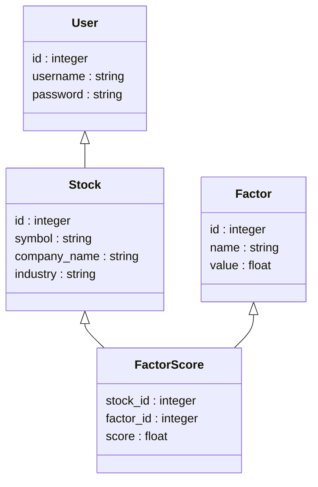
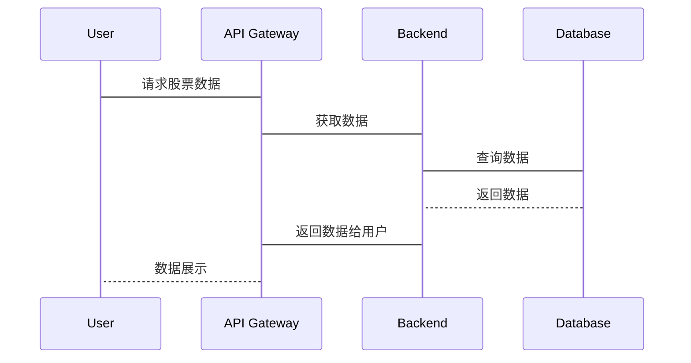

                 


# 特价股票投资中的质量因子分析

## 关键词：特价股票、质量因子、股票投资、数据分析、因子分析、投资策略

## 摘要：本文通过分析质量因子在特价股票投资中的应用，探讨如何利用质量因子筛选出具有投资价值的股票。文章详细介绍了质量因子的核心概念、算法原理、系统架构设计以及实际案例分析，帮助投资者优化投资策略。

---

# 第1章: 特价股票投资与质量因子分析概述

## 1.1 特价股票投资的背景与概念

### 1.1.1 什么是特价股票
特价股票通常指的是价格低于市场平均水平的股票，具有较高的投资潜力。这类股票可能因为市场波动或公司暂时的困境而被低估，但具备长期增值的潜力。

### 1.1.2 特价股票投资的定义与特点
特价股票投资是一种通过购买价格低于内在价值的股票，以期获得超额收益的投资策略。其特点包括高风险、高回报、周期性波动等。

### 1.1.3 特价股票投资的核心要素
- 市场分析：理解市场波动和周期。
- 公司基本面：分析公司的财务状况和盈利能力。
- 投资策略：制定合理的买入和卖出策略。

## 1.2 质量因子分析的定义与特点

### 1.2.1 什么是质量因子
质量因子是指影响股票质量的一系列指标，包括市盈率、市净率、股息率等，用于衡量公司的盈利能力、成长性和稳定性。

### 1.2.2 质量因子分析的核心要素
- 盈利能力：如净利润率、ROE。
- 成长性：如营收增长率、净利润增长率。
- 偿债能力：如资产负债率、流动比率。
- 股息支付率：公司分红能力。

### 1.2.3 质量因子与股票投资的关系
质量因子帮助投资者筛选出具有稳定收益和成长潜力的股票，是投资决策的重要依据。

## 1.3 特价股票与质量因子分析的结合

### 1.3.1 特价股票投资中引入质量因子的意义
通过质量因子分析，投资者可以避免仅因价格低廉而忽视公司质量的问题，确保投资标的具有长期价值。

### 1.3.2 质量因子在特价股票投资中的作用
质量因子帮助识别那些价格低廉但质地优良的股票，降低投资风险，提高收益潜力。

### 1.3.3 质量因子分析在特价股票投资中的应用范围
适用于多种市场环境，尤其在市场低迷时，帮助投资者发现被低估的优质股票。

## 1.4 本章小结
本章介绍了特价股票投资的基本概念和质量因子分析的核心要素，强调了两者结合的重要性，为后续分析奠定基础。

---

# 第2章: 质量因子分析的核心概念与联系

## 2.1 质量因子的定义与分类

### 2.1.1 质量因子的定义
质量因子是衡量公司质地的关键指标，涵盖盈利能力、成长性、财务健康等多个维度。

### 2.1.2 质量因子的分类
- 盈利能力因子：如净利润率、ROE。
- 成长性因子：如营收增长率。
- 偿债能力因子：如资产负债率。
- 股息支付率因子：股息率。

## 2.2 质量因子的属性特征对比

### 2.2.1 质量因子的属性特征表格
| 因子类别 | 因子名称 | 特性描述 |
|----------|----------|----------|
| 盈利能力 | 净利润率 | 衡量公司赚钱能力 |
| 成长性 | 营收增长率 | 衡量收入增长速度 |
| 偿债能力 | 负债率 | 衡量财务健康状况 |

### 2.2.2 质量因子之间的关系
质量因子之间存在相互影响，例如高成长性可能伴随着较高的偿债压力。

### 2.2.3 质量因子与股票表现的关系
高质量因子通常与较高的股票表现相关，但需结合市场环境具体分析。

## 2.3 质量因子的ER实体关系图

```mermaid
erDiagram
    company {
        key id : integer
        name : string
        industry : string
    }
    factor {
        key id : integer
        name : string
        value : float
    }
    company_factor {
        company_id : integer
        factor_id : integer
        score : integer
    }
    company_factor.company_id --> company.id
    company_factor.factor_id --> factor.id
```

---

# 第3章: 质量因子分析的算法原理

## 3.1 质量因子分析的算法概述

### 3.1.1 算法定义
质量因子分析是一种通过多因子模型评估股票质量的方法，综合多个因子的得分进行加权计算。

### 3.1.2 算法实现步骤
1. 数据收集：获取股票的财务数据和市场数据。
2. 因子计算：计算各质量因子的得分。
3. 加权汇总：根据权重计算综合得分。
4. 排序与筛选：根据得分筛选出优质股票。

## 3.2 质量因子分析的算法实现

### 3.2.1 算法实现的代码

```python
import pandas as pd

# 假设df为股票数据，columns包括各因子
# 计算各因子得分
def calculate_factor_scores(df):
    factors = ['profit_margin', 'revenue_growth', 'debt_ratio', 'dividend_yield']
    scores = []
    for factor in factors:
        df[factor] = df[factor].apply(lambda x: x if x >= 0 else 0)
        scores.append(df[factor])
    return pd.DataFrame(scores)

# 加权汇总
def calculate_total_score(df, weights):
    weighted_scores = []
    for i in range(len(df.columns)):
        weighted_scores.append(df.iloc[:, i] * weights[i])
    total_score = sum(weighted_scores)
    return total_score

# 筛选优质股票
def select_best_stocks(df, total_score, threshold=0.7):
    df['total_score'] = total_score
    return df[df['total_score'] > threshold]
```

### 3.2.2 算法实现的注意事项
- 数据预处理：确保数据完整性和准确性。
- 因子权重：根据市场环境调整各因子的权重。

## 3.3 质量因子分析的数学模型

### 3.3.1 因子得分计算公式
$$ \text{factor\_score}_i = \frac{\text{factor}_i - \text{min(factor}_i)}{\text{max(factor}_i) - \text{min(factor}_i)} $$

### 3.3.2 组合得分计算公式
$$ \text{total\_score} = \sum_{i=1}^{n} w_i \times \text{factor\_score}_i $$

### 3.3.3 风险调整公式
$$ \text{adjusted\_score} = \text{total\_score} \times \frac{1}{1 + \text{market\_volatility}} $$

---

# 第4章: 系统分析与架构设计

## 4.1 问题场景介绍
投资者希望通过质量因子分析系统筛选出优质的特价股票，优化投资组合。

## 4.2 系统功能设计

### 4.2.1 领域模型类图



## 4.3 系统架构设计

### 4.3.1 系统架构图

```mermaid
archiDiagram
    frontend --> backend
    backend --> database
    frontend --> API Gateway
    API Gateway --> backend
```

## 4.4 接口设计与交互流程

### 4.4.1 系统交互序列图



---

# 第5章: 项目实战

## 5.1 环境安装

### 5.1.1 安装Python环境
使用Anaconda或虚拟环境，安装Python 3.8及以上版本。

### 5.1.2 安装依赖库
安装Pandas、NumPy、Scikit-learn等数据分析库。

## 5.2 核心代码实现

### 5.2.1 数据加载与预处理

```python
import pandas as pd

# 加载数据
df = pd.read_csv('stock_data.csv')

# 数据清洗
df = df.dropna()
df = df.replace([np.inf, -np.inf, np.nan], 0)
```

### 5.2.2 因子分析与筛选

```python
from sklearn.preprocessing import MinMaxScaler

# 标准化处理
scaler = MinMaxScaler()
df_factors = scaler.fit_transform(df[['profit_margin', 'revenue_growth', 'debt_ratio', 'dividend_yield']])

# 计算因子得分
factor_scores = pd.DataFrame(df_factors, columns=['profit_margin', 'revenue_growth', 'debt_ratio', 'dividend_yield'])

# 加权汇总
weights = [0.4, 0.3, 0.2, 0.1]
total_score = sum([factor_scores[i] * weights[i] for i in range(len(weights))])
total_score = pd.DataFrame(total_score, columns=['total_score'])
```

### 5.2.3 筛选优质股票

```python
# 筛选优质股票
threshold = 0.7
selected_stocks = df[total_score['total_score'] > threshold]
print(selected_stocks.head())
```

## 5.3 案例分析与解读

### 5.3.1 实际案例分析
假设市场低迷，筛选出市盈率低、股息率高的股票，如某制造业公司，具备较高的投资价值。

### 5.3.2 投资策略优化
通过质量因子分析，投资者可以制定买入优质特价股票的策略，分散风险，提高收益。

## 5.4 项目小结
本章通过实际案例展示了质量因子分析在特价股票投资中的应用，验证了方法的有效性。

---

# 第6章: 最佳实践与总结

## 6.1 小结
质量因子分析是优化特价股票投资的重要工具，通过科学的筛选方法，帮助投资者识别出具有投资价值的股票。

## 6.2 注意事项
- 数据质量：确保数据的准确性和完整性。
- 因子选择：根据市场环境调整因子权重。
- 风险控制：合理分散投资，避免过度集中。

## 6.3 拓展阅读
建议阅读《投资学基础》、《因子投资策略》等书籍，深入理解质量因子分析的理论与实践。

---

# 作者信息
作者：AI天才研究院 & 禅与计算机程序设计艺术  
邮箱：contact@aitianjiayanliu.com  
网站：www.zen-of-programming.com

