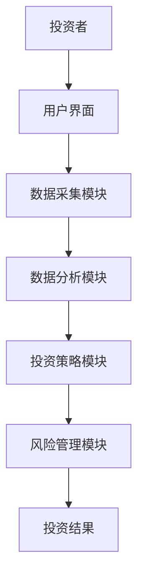

                 


# 特价股票投资中的跨境投资策略

> 关键词：特价股票、跨境投资、量化分析、风险管理、投资策略

> 摘要：本文深入探讨了特价股票投资中的跨境投资策略，结合量化分析方法、系统架构设计以及实际案例分析，详细阐述了如何在全球市场中识别和利用特价股票的投资机会，制定有效的风险管理和资产配置策略。

---

## 第1章: 特价股票与跨境投资概述

### 1.1 特价股票的定义与特点

#### 1.1.1 特价股票的定义
特价股票是指市场价格显著低于其内在价值的股票。这种低估通常源于市场波动、行业周期或公司特定问题，为投资者提供了潜在的收益机会。

#### 1.1.2 特价股票的核心特点
- **低估值**：市盈率（P/E）、市净率（P/B）等指标远低于行业平均水平。
- **高潜力**：一旦市场恢复或公司基本面改善，股价可能迅速反弹。
- **分散风险**：分布在不同行业和市场，降低单一投资的风险。

#### 1.1.3 特价股票的投资价值
通过识别市场低估的股票，投资者可以在市场回升时获得超额收益。此外，特价股票通常具有较高的安全边际，降低了投资风险。

### 1.2 跨境投资的基本概念

#### 1.2.1 跨境投资的定义
跨境投资是指投资者在本国以外的市场进行资产配置，包括股票、债券、基金等多种资产类别。

#### 1.2.2 跨境投资的主要形式
- **直接投资**：通过购买外国企业的股票或债券。
- **间接投资**：通过购买全球基金或ETF（交易所交易基金）。
- **货币市场工具**：投资于外国货币或短期债务工具。

#### 1.2.3 跨境投资的市场特点
- **多样性**：不同市场的经济周期、政策环境和行业趋势各不相同。
- **风险分散**：通过投资多个市场降低地域风险。
- **收益潜力**：新兴市场通常具有更高的增长潜力。

### 1.3 特价股票与跨境投资的结合

#### 1.3.1 特价股票在跨境投资中的应用
投资者可以通过分析全球市场中的特价股票，寻找具有高潜力的投资机会。

#### 1.3.2 跨境投资对特价股票的影响
- **套利机会**：同一股票在不同市场的价格差异可能导致套利收益。
- **市场流动性**：不同市场的流动性差异可能影响特价股票的投资策略。

#### 1.3.3 特价股票与跨境投资的协同效应
通过结合特价股票和跨境投资，投资者可以在全球范围内分散风险，同时捕捉市场低估的机会。

---

## 第2章: 特价股票的量化分析方法

### 2.1 特价股票的量化指标

#### 2.1.1 市净率（P/B）分析
市净率是股票价格与每股净资产的比率。低市净率通常表明股票被低估。

$$ P/B = \frac{\text{股票价格}}{\text{每股净资产}} $$

#### 2.1.2 市盈率（P/E）分析
市盈率是股票价格与每股收益的比率。低市盈率可能表明股票估值较低。

$$ P/E = \frac{\text{股票价格}}{\text{每股收益}} $$

#### 2.1.3 股息率分析
股息率是每股股息与股票价格的比率。高股息率可能表明股票具有吸引力。

$$ \text{股息率} = \frac{\text{每股股息}}{\text{股票价格}} \times 100\% $$

### 2.2 特价股票的市场周期分析

#### 2.2.1 股票市场的周期性
股票市场通常经历复苏、增长、成熟和衰退四个阶段。在衰退阶段，特价股票可能更具吸引力。

#### 2.2.2 特价股票在不同周期的表现
- **衰退阶段**：股票价格通常低于内在价值，提供投资机会。
- **增长阶段**：市场情绪高涨，特价股票可能被重新估值。

### 2.3 特价股票的行业分析

#### 2.3.1 特价股票的行业分布
不同行业的特价股票分布不同，例如金融、能源和科技行业可能有更多的低估股票。

#### 2.3.2 行业周期对特价股票的影响
行业周期波动可能影响特价股票的投资价值。例如，能源行业的周期性可能导致股票价格波动。

#### 2.3.3 行业风险评估
投资者需要评估行业风险，例如政策变化或技术进步对行业的影响。

---

## 第3章: 跨境投资策略的制定与实施

### 3.1 跨境投资的市场选择

#### 3.1.1 主要国际市场的特点
- **美国市场**：流动性高，上市公司数量多。
- **欧洲市场**：经济成熟，行业分布广泛。
- **新兴市场**：增长潜力大，但风险较高。

#### 3.1.2 市场选择的依据
- **经济指标**：GDP增长率、通胀率、利率等。
- **市场流动性**：交易量和市场深度。
- **政策环境**：税收、外汇管制等。

### 3.2 跨境投资的资产配置

#### 3.2.1 资产配置的基本原则
- **分散投资**：避免过度集中在某一市场或行业。
- **风险与收益平衡**：根据风险承受能力调整资产配置。

#### 3.2.2 不同市场的资产分配
根据市场风险和预期收益，合理分配资产到不同市场。

#### 3.2.3 资产配置的动态调整
定期评估市场变化，调整资产配置以适应新的市场环境。

### 3.3 跨境投资的风险管理

#### 3.3.1 跨境投资的主要风险
- **汇率风险**：货币贬值可能导致投资损失。
- **市场风险**：不同市场的波动可能影响投资收益。
- **流动性风险**：某些市场可能流动性不足，难以快速买卖资产。

#### 3.3.2 风险分散策略
- **多元化投资**：通过投资不同市场和资产类别分散风险。
- **对冲工具**：使用金融衍生品对冲汇率和市场风险。

#### 3.3.3 风险评估与监控
定期评估投资组合的风险敞口，监控市场变化，及时调整投资策略。

---

## 第4章: 特价股票与跨境投资的结合策略

### 4.1 特价股票在跨境投资中的应用策略

#### 4.1.1 基于市场差异的策略制定
分析不同市场的估值差异，寻找被低估的股票。

#### 4.1.2 特价股票的跨国套利机会
同一股票在不同市场的价格差异可能导致套利机会。

#### 4.1.3 跨境投资中的风险对冲
使用金融衍生品对冲市场风险和汇率风险。

### 4.2 特价股票与跨境投资的协同效应

#### 4.2.1 协同效应的实现路径
- **全球资产配置**：在不同市场中寻找低估股票。
- **风险分散**：通过跨国投资降低单一市场的风险。

#### 4.2.2 协同效应的具体案例分析
例如，投资者可以在新兴市场寻找低估的科技股，同时在成熟市场投资低估值的金融股。

#### 4.2.3 协同效应的长期价值
通过全球资产配置，投资者可以在不同市场周期中捕捉机会，实现长期稳定的收益。

---

## 第5章: 特价股票与跨境投资的系统分析

### 5.1 系统功能设计

#### 5.1.1 数据采集模块
采集全球市场的股票数据，包括价格、财务指标等。

#### 5.1.2 数据分析模块
使用量化分析方法，识别低估股票。

#### 5.1.3 投资策略模块
制定和优化投资策略，包括资产配置和风险对冲。

#### 5.1.4 风险管理模块
监控投资组合的风险，及时调整策略。

### 5.2 系统架构设计

#### 5.2.1 分层架构设计
- **数据层**：存储股票数据和市场信息。
- **业务逻辑层**：处理数据分析和策略制定。
- **用户界面层**：提供投资决策支持。

#### 5.2.2 模块间交互流程
数据采集模块将数据传输到数据分析模块，分析结果用于制定投资策略，并通过用户界面展示给投资者。

### 5.3 系统接口设计

#### 5.3.1 数据接口
与数据供应商或API接口连接，获取实时市场数据。

#### 5.3.2 用户接口
提供友好的用户界面，方便投资者进行资产配置和风险管理。

### 5.4 系统交互流程图（使用 Mermaid）


---

## 第6章: 特价股票与跨境投资的项目实战

### 6.1 环境安装

#### 6.1.1 数据源选择
使用全球股票数据库或金融API获取数据。

#### 6.1.2 工具安装
安装Python、Pandas、Matplotlib等工具，用于数据分析和可视化。

### 6.2 核心代码实现

#### 6.2.1 数据采集
```python
import pandas as pd
import requests

url = "https://api.example.com/stocks"
data = requests.get(url).json()
df = pd.DataFrame(data)
```

#### 6.2.2 量化分析
```python
def calculate_valuation_ratios(df):
    df['P/B'] = df['price'] / df['book_value_per_share']
    df['P/E'] = df['price'] / df['eps']
    return df

valuated_df = calculate_valuation_ratios(df)
```

#### 6.2.3 投资策略
```python
def crossborder_strategy(valuated_df):
    selected_stocks = valuated_df[(valuated_df['P/B'] < 1.5) & (valuated_df['P/E'] < 10)]
    return selected_stocks

selected_stocks = crossborder_strategy(valuated_df)
```

### 6.3 实际案例分析

#### 6.3.1 案例背景
假设在新兴市场中发现一只低市盈率的科技股，同时在成熟市场中发现一只低市净率的金融股。

#### 6.3.2 投资决策
根据量化分析结果，决定投资于这些低估股票，并使用金融衍生品对冲汇率风险。

### 6.4 项目小结

#### 6.4.1 核心发现
通过量化分析和全球资产配置，投资者可以在不同市场中捕捉低估股票的投资机会。

#### 6.4.2 经验总结
- 定期评估市场环境和投资组合，及时调整策略。
- 使用对冲工具降低市场风险和汇率风险。

---

## 结语

特价股票与跨境投资的结合为投资者提供了在全球范围内分散风险和捕捉收益的机会。通过量化分析和系统设计，投资者可以制定有效的投资策略，并在不同市场周期中实现长期稳定的收益。

---

**作者：AI天才研究院/AI Genius Institute & 禅与计算机程序设计艺术 /Zen And The Art of Computer Programming**

