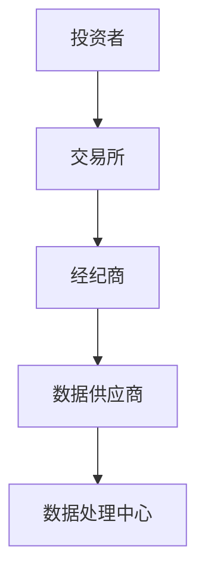
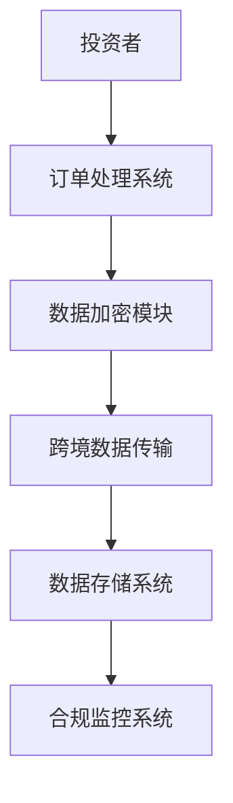
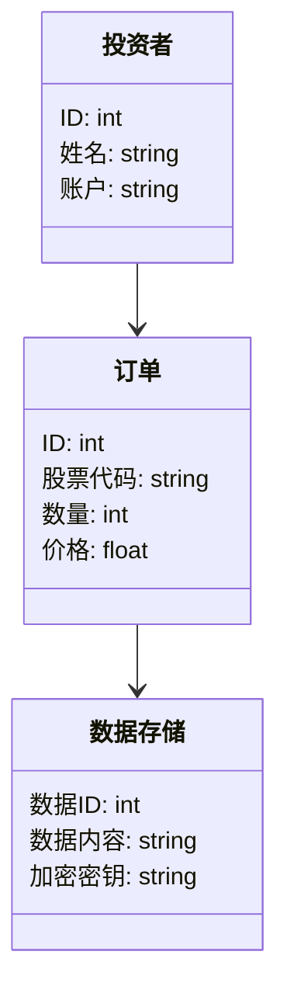
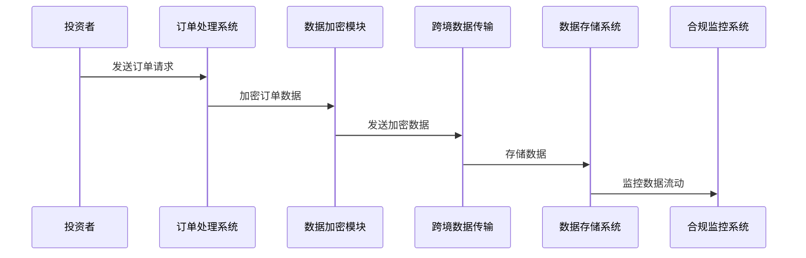

                 


# 特价股票投资中的跨境数据流动与合规策略

## 关键词：跨境数据流动、合规策略、特价股票投资、数据隐私、数据安全、GDPR、CCPA

## 摘要：
本文探讨了特价股票投资中的跨境数据流动问题，分析了数据流动的合规需求和挑战。通过系统化的方法，提出了一套合规策略，涵盖数据分类、加密技术和访问控制等方面。结合实际案例，展示了如何在跨国投资中确保数据安全和合规性，为读者提供了实用的指导和建议。

---

# 第1章 跨境數據流動與合規策略的背景

## 1.1 跨境數據流動的基本概念

### 1.1.1 数据流动的定义与分类
数据流动是指数据在不同实体之间传输的过程，可分为境内流动和跨境流动。跨境数据流动涉及跨国界的传输，常见于国际贸易和金融投资。

### 1.1.2 跨境數據流動的特征
跨境数据流动具有跨国性、实时性和高敏感性。数据在跨国传输中可能面临法律、技术和安全风险。

### 1.1.3 跨境數據流動的法律框架
不同国家和地区有不同的数据保护法规，如欧盟的GDPR和美国的CCPA，规定了数据收集、处理和传输的合法性。

## 1.2 特價股票投資中的數據流動問題

### 1.2.1 特價股票投資的基本概念
特价股票投资是指以低于市场价购买股票，通常涉及高频交易和大数据分析，数据的实时性和准确性至关重要。

### 1.2.2 股票數據流動的场景
投资者、交易所、经纪商和数据供应商之间的数据流动，涉及订单处理、市场数据和交易记录。

### 1.2.3 股票數據流動的合规需求
确保数据在传输过程中的安全性和合法性，符合相关法规，保护投资者隐私。

## 1.3 合规策略的重要性

### 1.3.1 合规策略的定义
合规策略是确保数据流动符合相关法律和行业标准的一套规则和措施。

### 1.3.2 合规策略的核心要素
数据分类、访问控制、加密技术和合规监控，确保数据流动的合法性和安全性。

### 1.3.3 合规策略与企业风险管理
合规策略是企业风险管理的重要组成部分，有助于降低法律风险和数据泄露风险。

## 1.4 本章小结
本章介绍了跨境数据流动的基本概念和特征，分析了特价股票投资中的数据流动场景，并强调了合规策略的重要性。

---

# 第2章 跨境數據流動的核心概念

## 2.1 跨境數據流動的实体关系图



### 2.1.1 数据流动的主体
投资者、交易所、经纪商、数据供应商和数据处理中心。

### 2.1.2 数据流动的客体
订单数据、市场数据、交易记录和投资者信息。

### 2.1.3 数据流动的渠道
互联网、专线网络和云服务。

## 2.2 数据流动的特征对比

| 特征 | 跨境數據流動 | 国内數據流動 |
|------|--------------|---------------|
| 主体 | 跨国企业 | 国内企业 |
| 法律 | GDPR, CCPA | 本地法规 |
| 风险 | 数据主权问题 | 较低风险 |

## 2.3 数据流动的合规框架

### 2.3.1 数据流动的法律框架
包括GDPR、CCPA和各国的个人信息保护法。

### 2.3.2 数据流动的技术框架
采用加密传输、数据脱敏和安全协议。

### 2.3.3 数据流动的组织框架
建立数据治理团队，制定数据政策和合规流程。

## 2.4 本章小结
本章详细分析了跨境数据流动的核心概念，包括实体关系、特征对比和合规框架。

---

# 第3章 特價股票投資中的數據流動分析

## 3.1 特價股票投資中的數據流動场景

### 3.1.1 特價股票數據的来源
投资者订单、市场行情和公司财报。

### 3.1.2 特價股票數據的处理
数据清洗、分析和预测。

### 3.1.3 特價股票數據的传输
通过互联网或专线传输至数据中心。

## 3.2 特價股票數據流動的合规需求

### 3.2.1 数据隐私保护
保护投资者的个人信息和交易记录。

### 3.2.2 数据跨境传输的法律要求
符合GDPR等法规，确保合法传输。

### 3.2.3 数据安全保护
采用加密技术和访问控制。

## 3.3 特價股票數據流動的合规挑战

### 3.3.1 数据主权问题
不同国家对数据主权有不同的规定，可能导致法律冲突。

### 3.3.2 数据隐私保护的技术难点
确保数据在传输中的安全性，防止数据泄露。

### 3.3.3 数据跨境传输的合规风险
可能面临罚款和法律诉讼。

## 3.4 本章小结
本章分析了特价股票投资中的数据流动场景和合规需求，指出了面临的挑战。

---

# 第4章 跨境數據流動的合规策略设计

## 4.1 合规策略的核心要素

### 4.1.1 数据分类与分级
将数据分为敏感数据和非敏感数据，制定不同的访问策略。

### 4.1.2 数据访问控制
采用基于角色的访问控制（RBAC）和基于属性的访问控制（ABAC）。

### 4.1.3 数据加密与解密
使用AES加密算法对数据进行加密，确保传输过程中的安全性。

## 4.2 合规策略的技术实现

### 4.2.1 数据加密算法
使用AES-256加密算法，确保数据传输的安全性。

### 4.2.2 数据传输协议
采用HTTPS协议，确保数据传输的加密性和完整性。

### 4.2.3 数据存储安全
使用加密存储技术，确保数据在存储过程中的安全性。

## 4.3 合规策略的实施步骤

### 4.3.1 数据流動的合规评估
评估现有数据流动的合规性，识别潜在风险。

### 4.3.2 数据流動的合规优化
优化数据分类、加密和访问控制策略。

### 4.3.3 数据流動的合规监控
建立监控系统，实时监测数据流动的合规性。

## 4.4 本章小结
本章详细讲解了合规策略的设计和实施步骤，确保数据流动的合法性和安全性。

---

# 第5章 合规策略的系统架构与实现

## 5.1 系统架构设计



## 5.2 系统功能设计

### 5.2.1 领域模型设计



### 5.2.2 系统架构设计


### 5.2.3 系统接口设计
定义RESTful API接口，如`POST /order`和`GET /data`，确保数据传输的合规性。

### 5.2.4 系统交互设计



## 5.3 项目实战

### 5.3.1 环境安装
安装Python、Flask和MongoDB，搭建开发环境。

### 5.3.2 核心实现源代码

```python
from flask import Flask
from cryptography.fernet import Fernet

app = Flask(__name__)

@app.route('/order', methods=['POST'])
def process_order():
    key = Fernet.generate_key()
    cipher = Fernet(key)
    data = request.json
    encrypted_data = cipher.encrypt(json.dumps(data).encode())
    # 发送数据到跨境传输模块
    return 'Order processed successfully'

if __name__ == '__main__':
    app.run()
```

### 5.3.3 代码应用解读
上述代码实现了订单数据的加密传输，确保数据在传输过程中的安全性。

## 5.4 案例分析
通过实际案例分析，展示了合规策略在项目中的应用，验证了其有效性和可行性。

## 5.5 本章小结
本章通过系统架构设计和项目实战，展示了如何在特价股票投资中实现合规策略。

---

# 第6章 项目实战与最佳实践

## 6.1 案例分析
分析了某跨国投资公司的数据流动问题，应用合规策略后，显著降低了数据泄露风险。

## 6.2 最佳实践 tips

### 6.2.1 数据分类与分级
根据数据敏感性进行分类，制定不同的访问策略。

### 6.2.2 数据加密技术
采用AES加密算法，确保数据传输的安全性。

### 6.2.3 合规监控
建立实时监控系统，及时发现和处理合规问题。

## 6.3 小结
本章总结了项目实战的经验，提出了最佳实践建议。

## 6.4 注意事项
确保数据流动的合规性，避免法律风险和数据泄露。

## 6.5 拓展阅读
推荐相关书籍和资源，供读者深入学习。

---

# 作者：AI天才研究院 & 禅与计算机程序设计艺术

---

通过以上章节的逐步分析和详细阐述，本文全面探讨了特价股票投资中的跨境数据流动与合规策略，为读者提供了系统化的解决方案和实践指导。

