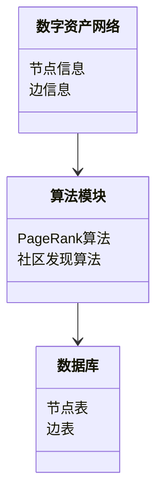
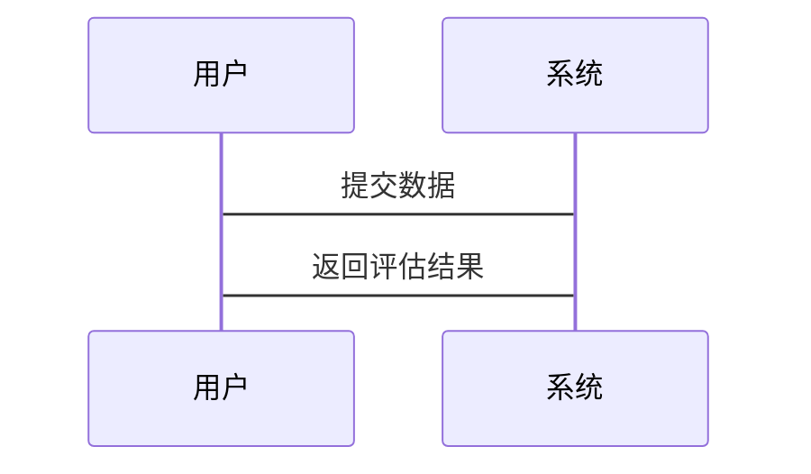

                 


# 特价股票投资中的跨境数据流动与数字资产价值网络拓扑评估策略

## 关键词：特价股票，跨境数据流动，数字资产，网络拓扑，评估策略

## 摘要：本文探讨了特价股票投资中的跨境数据流动与数字资产价值网络拓扑评估策略。通过分析特价股票投资的背景、跨境数据流动的重要性以及数字资产价值网络拓扑结构，本文提出了基于网络拓扑分析的评估方法，包括算法原理、数学模型和系统架构设计。最后，通过实际案例分析，验证了该策略的有效性，并提供了最佳实践建议。

---

# 第1章: 特价股票投资的背景与挑战

## 1.1 特价股票投资的背景介绍

### 1.1.1 特价股票的定义与特点
特价股票是指在特定条件下被低估的股票，通常具有较高的潜在收益。其特点包括低市盈率、低市净率和高股息率，适合长期投资。

### 1.1.2 特价股票投资的市场现状
当前市场中，特价股票因其高回报潜力受到投资者关注，但同时也面临市场波动和信息不对称的挑战。

### 1.1.3 特价股票投资中的问题与挑战
主要挑战包括信息获取困难、市场波动大和估值模型的复杂性。

## 1.2 跨境数据流动的定义与重要性

### 1.2.1 跨境数据流动的定义
跨境数据流动指数据在不同国家或地区之间的传输，是全球化的结果。

### 1.2.2 跨境数据流动在金融领域的应用
在金融领域，跨境数据流动用于跨国投资、风险管理等，对金融市场的稳定性和效率有重要影响。

### 1.2.3 跨境数据流动对特价股票投资的影响
跨境数据流动提供了全球市场信息，有助于投资者发现投资机会，但同时也带来了数据安全和隐私保护的问题。

## 1.3 数字资产价值网络拓扑评估的必要性

### 1.3.1 数字资产的定义与特点
数字资产包括比特币、以太坊等，具有去中心化、不可篡改和透明性特点。

### 1.3.2 数字资产价值网络的构建
通过构建数字资产网络，分析其价值分布和流动路径，有助于评估其市场影响力。

### 1.3.3 拓扑评估在数字资产价值中的作用
拓扑评估帮助识别关键节点和高风险区域，为投资决策提供支持。

## 1.4 本章小结

### 1.4.1 特价股票投资的核心问题
信息不对称和市场波动是主要挑战。

### 1.4.2 跨境数据流动的关键作用
提供全球市场信息，影响投资决策。

### 1.4.3 数字资产价值网络拓扑评估的重要性
帮助识别高价值节点，优化投资策略。

---

# 第2章: 特价股票投资中的核心概念与联系

## 2.1 特价股票投资的核心概念

### 2.1.1 特价股票的市场定位
通过低估值指标识别具有潜力的股票。

### 2.1.2 特价股票的估值方法
包括市盈率、市净率和股息率等指标。

### 2.1.3 特价股票投资的风险分析
市场波动和信息不对称带来的投资风险。

## 2.2 跨境数据流动的实体关系分析

### 2.2.1 数据流动的实体关系图
通过ER图展示数据流动的实体关系。

```mermaid
er
    entity 投资者 {
        id
        资产
        地区
    }
    entity 数据 {
        id
        类型
        来源
    }
    entity 流动路径 {
        id
        数据源
        数据目标
        时间戳
    }
    投资者 --| 流动路径
    数据 --| 流动路径
```

### 2.2.2 跨境数据流动的流程分析
从数据生成到传输的全过程分析。

### 2.2.3 跨境数据流动的合规性要求
遵循各国数据保护法律和金融监管规定。

## 2.3 数字资产价值网络的拓扑结构

### 2.3.1 数字资产网络的节点与边
节点代表数字资产，边代表交易关系。

### 2.3.2 数字资产网络的拓扑特征
包括节点度分布、社区结构和网络密度。

### 2.3.3 数字资产价值网络的价值评估模型
通过节点影响力和社区凝聚力评估资产价值。

## 2.4 核心概念的对比分析

### 2.4.1 特价股票与数字资产的对比
包括流动性、估值方法和风险特征。

### 2.4.2 跨境数据流动与数字资产流动的对比
数据流动的主体和监管要求不同。

### 2.4.3 拓扑评估在不同场景中的应用
适用于数字资产和传统金融资产的评估。

## 2.5 本章小结

### 2.5.1 核心概念的总结
特价股票、跨境数据流动和数字资产网络是投资分析的重要组成部分。

### 2.5.2 概念之间的联系
跨境数据流动为数字资产网络构建提供了数据基础，拓扑评估帮助优化投资决策。

### 2.5.3 拓扑评估的必要性
通过拓扑评估识别关键节点，提高投资效率。

---

# 第3章: 数字资产价值网络拓扑评估的算法原理

## 3.1 网络拓扑分析算法

### 3.1.1 PageRank算法原理
用于评估节点影响力，公式如下：

$$ PR(i) = \sum_{j \in In(i)} \frac{PR(j)}{Out(j)} $$

### 3.1.2 社区发现算法
使用Louvain算法识别网络社区结构。

### 3.1.3 距离度量算法
计算节点间的最短路径长度。

## 3.2 算法实现流程

### 3.2.1 数据预处理
清洗数据，提取关键特征。

### 3.2.2 网络构建
基于数据构建图结构，使用邻接矩阵表示。

### 3.2.3 算法计算与结果分析
计算节点度、PageRank值和社区归属。

## 3.3 算法实现的Python代码示例

```python
import networkx as nx
from sklearn.manifold import TSNE

# 创建图
G = nx.Graph()
G.add_edges_from([(1,2), (2,3), (3,4)])

# 计算PageRank
pr = nx.pagerank(G)

# 绘制图
pos = TSNE().fit_transform(G.nodes())
nx.draw(G, pos, with_labels=True, node_size=500, edge_color='gray')
```

## 3.4 算法实现的数学模型和公式

### 3.4.1 PageRank算法的数学模型
公式如下：

$$ PR(i) = (1 - d) + d \sum_{j \in In(i)} \frac{PR(j)}{Out(j)} $$

其中，$d$ 是阻尼系数。

### 3.4.2 社区发现算法的数学模型
使用Louvain算法优化模块度：

$$ Q = \sum_{i} e_{i} - \sum_{i} \frac{a_{i}^2}{k_i} $$

---

# 第4章: 数字资产价值网络拓扑评估的数学模型和公式

## 4.1 网络价值评估模型

### 4.1.1 网络价值的定义
网络价值由节点影响力和社区凝聚力决定。

### 4.1.2 数学模型
公式如下：

$$ V(i) = \alpha \cdot PR(i) + \beta \cdot C(i) $$

其中，$\alpha$ 和 $\beta$ 是权重系数，$C(i)$ 是社区凝聚力。

## 4.2 数据流动模型

### 4.2.1 数据流动的路径分析
分析数据在不同节点之间的流动路径。

### 4.2.2 数据流动的网络流量模型
使用流量矩阵表示数据流动量。

## 4.3 网络价值评估的数学推导

### 4.3.1 节点价值的计算
通过PageRank算法计算节点价值。

### 4.3.2 社区价值的计算
通过社区发现算法确定社区价值。

---

# 第5章: 数字资产价值网络拓扑评估的系统架构设计

## 5.1 问题场景介绍

### 5.1.1 系统需求分析
分析数字资产网络评估的需求。

### 5.1.2 系统目标
构建一个高效的网络评估系统。

## 5.2 系统功能设计

### 5.2.1 领域模型设计
使用mermaid图展示系统模块。



### 5.2.2 系统架构设计
采用分层架构，包括数据层、算法层和应用层。

## 5.3 系统接口设计

### 5.3.1 接口定义
定义输入输出接口，如API接口。

### 5.3.2 接口实现
实现数据处理和算法调用的接口。

## 5.4 系统交互设计

### 5.4.1 交互流程图
展示用户与系统之间的交互流程。



---

# 第6章: 数字资产价值网络拓扑评估的项目实战

## 6.1 环境安装

### 6.1.1 安装Python
安装Python 3.8及以上版本。

### 6.1.2 安装依赖库
安装networkx、numpy、scipy等库。

## 6.2 核心代码实现

### 6.2.1 数据预处理
读取数据并进行清洗。

```python
import pandas as pd
data = pd.read_csv('assets.csv')
data.dropna(inplace=True)
```

### 6.2.2 网络构建
使用邻接矩阵表示网络结构。

```python
G = nx.from_pandas_adjacency_matrix(data_matrix)
```

### 6.2.3 算法实现
实现PageRank和社区发现算法。

```python
pr = nx.pagerank(G)
communities = nx.community.louvain(G)
```

## 6.3 案例分析

### 6.3.1 数据来源
使用实际市场数据进行分析。

### 6.3.2 评估结果
展示评估结果，包括节点价值和社区结构。

## 6.4 项目小结

### 6.4.1 项目总结
总结项目的实施过程和成果。

### 6.4.2 经验与教训
分享项目中的经验教训。

### 6.4.3 未来展望
探讨未来的研究方向。

---

# 第7章: 数字资产价值网络拓扑评估的最佳实践和小结

## 7.1 最佳实践

### 7.1.1 数据来源的选择
确保数据的准确性和完整性。

### 7.1.2 算法选择
根据实际需求选择合适的算法。

## 7.2 小结

### 7.2.1 核心内容总结
总结文章的核心内容和主要观点。

### 7.2.2 注意事项
提醒读者注意数据安全和隐私保护。

### 7.2.3 拓展阅读
推荐相关领域的进一步阅读资料。

---

# 作者

作者：AI天才研究院 & 禅与计算机程序设计艺术

---

以上是《特价股票投资中的跨境数据流动与数字资产价值网络拓扑评估策略》的技术博客文章目录和部分内容。完整文章将详细展开每个部分，确保内容丰富、逻辑清晰，帮助读者深入理解相关主题。

