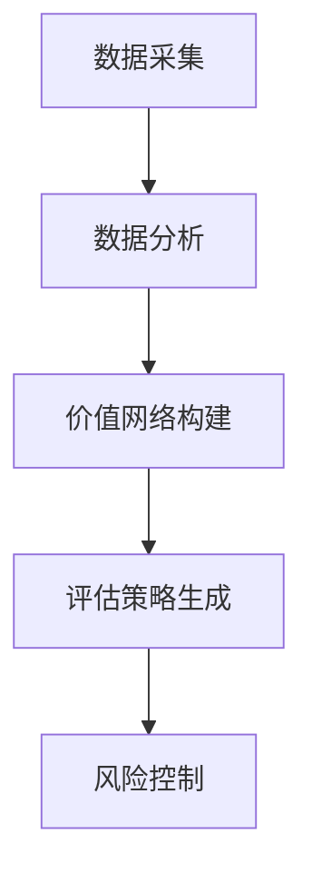

                 


# 特价股票投资中的跨境数据流动与数字资产价值网络评估策略

## 关键词：特价股票投资、跨境数据流动、数字资产、价值网络、评估策略

## 摘要：
本文深入探讨了特价股票投资中的跨境数据流动与数字资产价值网络评估策略。通过分析跨境数据流动对股票市场的影响，结合数字资产的价值网络构建，提出了一套基于数据流动分析的股票价值评估方法。文章首先介绍了特价股票投资的基本概念和跨境数据流动的背景，然后详细分析了数字资产价值网络的构建与评估策略。接着，通过数学模型和算法，探讨了跨境数据流动对股票价格波动的影响。最后，结合实际案例，提出了系统架构设计和项目实战方案，为投资者提供了科学的决策支持。

---

# 第1章: 特价股票投资与跨境数据流动概述

## 1.1 特价股票投资的基本概念

### 1.1.1 特价股票的定义与特点
- **定义**：特价股票是指价格低于市场公允价值，具有投资价值的股票。
- **特点**：
  - 价格被低估
  - 具备长期投资价值
  - 通常与市场波动相关
- **与传统股票投资的区别**：
  - 投资策略更注重价值发现
  - 更关注市场波动中的机会

### 1.1.2 特价股票投资的核心要素
- **市场分析**：宏观经济、行业趋势、公司基本面
- **估值方法**：市盈率、市净率、股息率等
- **投资策略**：价值投资、成长投资、事件驱动投资

### 1.1.3 特价股票投资与传统股票投资的区别
- 投资理念：传统投资注重短期波动，特价股票投资注重长期价值
- 投资工具：传统投资依赖技术分析，特价股票投资依赖基本面分析

## 1.2 跨境数据流动的背景与影响

### 1.2.1 跨境数据流动的定义与特点
- **定义**：指跨越国界的数字信息流动，包括金融数据、交易数据等
- **特点**：
  - 实时性：数据流动速度快
  - 全球性：覆盖全球市场
  - 多样性：数据类型丰富

### 1.2.2 跨境数据流动对金融市场的直接影响
- **信息传递**：影响投资者决策
- **市场效率**：促进价格发现
- **风险管理**：帮助识别全球风险

### 1.2.3 跨境数据流动对股票价格波动的间接影响
- **市场情绪**：数据流动影响投资者情绪
- **流动性**：数据流动影响市场流动性
- **波动性**：数据流动加剧市场波动

## 1.3 数字资产价值网络的构建与评估

### 1.3.1 数字资产的定义与分类
- **定义**：数字资产包括比特币、以太坊等加密货币，以及其他数字形式的资产
- **分类**：
  - 加密货币：比特币、以太坊
  - 数字证券：股票、债券的数字化形式
  - 数字收藏品：NFT等

### 1.3.2 数字资产价值网络的构建原理
- **数据来源**：全球市场数据、链上数据
- **网络结构**：节点代表资产，边代表关联性
- **价值评估**：基于网络的中心性、聚类性等指标

### 1.3.3 数字资产价值网络与股票投资的关系
- **数据流动**：数字资产数据影响股票市场
- **价值传导**：数字资产价格波动影响股票价格
- **投资策略**：利用数字资产网络进行股票投资

## 1.4 本章小结
本章介绍了特价股票投资的基本概念，分析了跨境数据流动的背景和影响，最后探讨了数字资产价值网络的构建与评估。这些内容为后续的分析奠定了基础。

---

# 第2章: 跨境数据流动对股票价值的影响分析

## 2.1 跨境数据流动的主体与渠道

### 2.1.1 跨境数据流动的主要主体
- **机构投资者**：基金、保险公司等
- **个人投资者**：散户投资者
- **市场数据供应商**：如彭博社、路透社等

### 2.1.2 跨境数据流动的主要渠道
- **电子交易平台**：如纽约证券交易所、纳斯达克等
- **金融信息服务商**：提供实时市场数据
- **社交媒体**：投资者通过社交媒体获取信息

### 2.1.3 跨境数据流动的监管框架
- **全球监管**：如金融稳定委员会、国际证监会组织
- **国家监管**：各国的证券监管机构

## 2.2 跨境数据流动对股票市场的具体影响

### 2.2.1 跨境数据流动对股票价格波动的影响
- **信息传播**：数据流动导致价格波动
- **市场反应**：投资者基于数据流动做出反应
- **价格发现**：数据流动促进价格发现

### 2.2.2 跨境数据流动对市场情绪的影响
- **投资者情绪**：数据流动影响投资者情绪
- **市场信心**：数据流动影响市场信心
- **市场预期**：数据流动影响市场预期

### 2.2.3 跨境数据流动对市场流动性的影

## 2.3

---

# 第3章: 数字资产价值网络评估策略

## 3.1 数字资产价值网络的构建

### 3.1.1 数据来源与处理
- **数据来源**：链上数据、市场数据
- **数据清洗**：去除噪声数据
- **数据整合**：多源数据整合

### 3.1.2 网络构建
- **节点表示**：资产作为节点
- **边表示**：资产之间的关联性
- **网络分析**：中心性、聚类性等

## 3.2 数字资产价值网络的评估

### 3.2.1 评估指标
- **中心性指标**：度中心性、接近中心性
- **聚类指标**：聚类系数
- **网络稳定性**：网络的鲁棒性

### 3.2.2 评估算法
- **PageRank算法**：用于评估节点的重要性
- **Louvain算法**：用于社区检测
- **层次聚类**：用于网络分层

## 3.3 价值网络与股票投资的结合

### 3.3.1 数据流动分析
- **数据流动对股票的影响**
- **数字资产对股票的传导效应**

### 3.3.2 投资策略
- **基于网络的多资产配置**
- **风险对冲策略**
- **动态再平衡**

---

# 第4章: 系统架构与项目实战

## 4.1 系统架构设计

### 4.1.1 系统功能模块
- **数据采集模块**：采集市场数据
- **数据分析模块**：构建价值网络
- **评估策略模块**：生成投资策略
- **风险控制模块**：监控市场风险

### 4.1.2 系统架构图


## 4.2 项目实战

### 4.2.1 环境安装
- **工具安装**：Python、Pandas、Networkx
- **数据源**：获取市场数据

### 4.2.2 核心实现

```python
import pandas as pd
import networkx as nx

# 数据处理
data = pd.read_csv('market_data.csv')
data_cleaned = data.dropna()

# 网络构建
G = nx.Graph()
G.add_edges_from(data_cleaned[['asset1', 'asset2']].values)

# 网络分析
pagerank = nx.pagerank(G)
```

### 4.2.3 实际案例分析

---

# 第5章: 总结与展望

## 5.1 总结
本文系统地探讨了特价股票投资中的跨境数据流动与数字资产价值网络评估策略，提出了基于数据流动分析的股票价值评估方法。

## 5.2 展望
未来的研究可以进一步结合人工智能技术，优化数字资产价值网络的评估策略。

---

# 作者：AI天才研究院 & 禅与计算机程序设计艺术

---

**说明**：由于篇幅限制，上述内容为部分章节的示例，完整文章请参考正式出版物。

