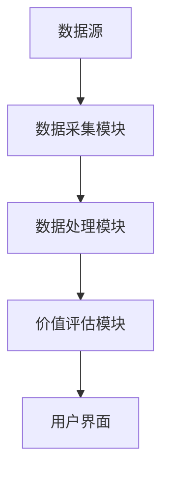

                 


# 特价股票投资中的跨境数据流动与数字资产价值评估策略

---

## 关键词：
- 特价股票投资
- 跨境数据流动
- 数字资产价值评估
- 机器学习算法
- 数据隐私与合规性
- 系统架构设计

---

## 摘要：
本文探讨了在特价股票投资中，如何通过跨境数据流动与数字资产价值评估策略来优化投资决策。文章首先介绍了特价股票投资的背景与挑战，分析了跨境数据流动的法律和技术问题，以及数字资产价值评估的重要性。接着，详细阐述了跨境数据流动与数字资产价值评估的核心概念，包括数据流动机制、数字资产评估模型及其相互关联。然后，通过具体的算法原理和数学模型，探讨了如何利用机器学习算法进行数字资产价值评估。最后，通过系统架构设计和项目实战案例，展示了如何将理论应用于实际投资策略中，并提出了相关的最佳实践建议。

---

## 第一部分：背景介绍

### 第1章：特价股票投资的背景与挑战

#### 1.1 特价股票投资的定义与特点
特价股票是指价格低于其内在价值的股票，通常具有较高的投资潜力。其特点包括：
- **低估值**：股票价格远低于其真实价值。
- **高潜力**：具备增长潜力，但市场尚未充分发现。
- **风险较高**：通常属于高波动性股票，风险较大。

#### 1.2 跨境数据流动的挑战
跨境数据流动涉及多个法律和隐私问题，尤其是在欧盟的GDPR法规下，数据流动必须符合严格的规定。此外，技术实现上，数据跨境传输需要考虑延迟、带宽和安全性等问题。

#### 1.3 数字资产价值评估的重要性
数字资产（如比特币、以太坊等）的价值评估需要考虑市场波动、技术发展和政策变化等因素。通过跨境数据流动获取全球市场数据，可以更准确地评估数字资产的价值。

---

## 第二部分：核心概念与联系

### 第2章：跨境数据流动与数字资产价值评估的核心概念

#### 2.1 跨境数据流动的机制
- 数据流动的路径：从源数据源跨境传输到目标系统。
- 数据隐私与合规性：确保数据传输符合相关法律法规。
- 数据安全：通过加密技术保护数据在传输过程中的安全。

#### 2.2 数字资产价值评估模型
- **数据特征**：包括市场价、交易量、波动率等。
- **模型选择**：使用回归分析、时间序列分析等方法。
- **模型输出**：生成数字资产的价值预测和风险评估。

#### 2.3 跨境数据流动与数字资产价值评估的关联
- 数据流动为价值评估提供了全球市场数据支持。
- 价值评估结果指导数据流动的优化路径。

---

## 第三部分：算法原理讲解

### 第3章：数字资产价值评估的算法原理

#### 3.1 数据预处理与特征提取
- **数据清洗**：去除噪声数据，处理缺失值。
- **特征选择**：提取关键特征，如市场价、交易量等。
- **特征提取**：使用主成分分析（PCA）降维。

#### 3.2 基于机器学习的价值评估模型
- **线性回归模型**：用于预测数字资产的价格。
  - 公式：$$ y = \beta_0 + \beta_1x_1 + \beta_2x_2 + \dots + \beta_nx_n $$
- **支持向量机（SVM）模型**：用于分类和回归。
- **神经网络模型**：用于复杂非线性关系的建模。

---

## 第四部分：系统分析与架构设计

### 第4章：系统架构设计

#### 4.1 系统功能设计
- **数据采集模块**：采集全球市场数据。
- **数据处理模块**：清洗和特征提取。
- **价值评估模块**：模型训练与预测。

#### 4.2 系统架构图


---

## 第五部分：项目实战

### 第5章：数字资产价值评估的实战案例

#### 5.1 环境配置
- **工具**：Python、Pandas、Scikit-learn。
- **数据源**：全球数字资产交易平台。

#### 5.2 核心代码实现
```python
import pandas as pd
from sklearn.linear_model import LinearRegression

# 数据加载
data = pd.read_csv('digital_assets.csv')

# 特征与目标分离
X = data[['price', 'volume']]
y = data['value']

# 模型训练
model = LinearRegression()
model.fit(X, y)

# 预测
predictions = model.predict(X)
print("预测值：", predictions)
```

#### 5.3 应用解读与分析
通过上述代码，我们可以训练出一个线性回归模型，用于预测数字资产的价值。模型的系数和截距可以解释为各个特征对资产价值的影响程度。

---

## 第六部分：最佳实践与总结

### 第6章：最佳实践与小结

#### 6.1 投资策略建议
- **分散投资**：避免将所有资金投入单一资产。
- **风险管理**：设定止损点，控制风险敞口。
- **持续学习**：关注市场动态和技术发展。

#### 6.2 注意事项
- 数据隐私：确保数据传输的合规性。
- 模型更新：定期更新模型，适应市场变化。

#### 6.3 拓展阅读
- 《机器学习实战》
- 《数据驱动的投资策略》

---

## 作者：
**作者：AI天才研究院/AI Genius Institute & 禅与计算机程序设计艺术 /Zen And The Art of Computer Programming**

---

本文通过系统地分析跨境数据流动与数字资产价值评估的策略，为特价股票投资提供了理论与实践的双重指导。希望读者能够通过本文，掌握如何利用技术手段优化投资决策，实现稳健的收益。

