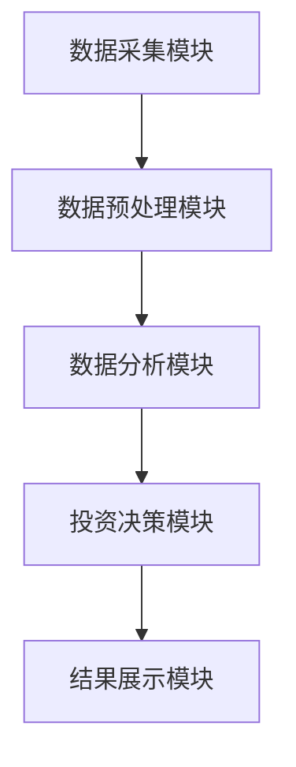
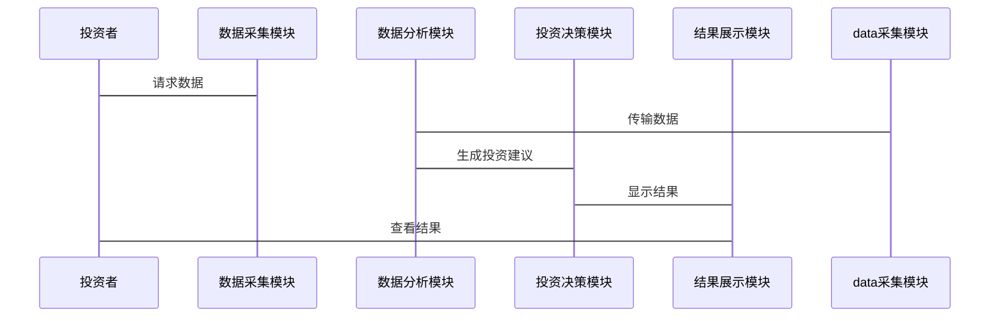

                 


# 特价股票投资中的跨境数据流动价值评估策略

> 关键词：特价股票、跨境数据流动、价值评估、投资策略、数据驱动、算法模型

> 摘要：本文探讨了在特价股票投资中，如何通过跨境数据流动的价值评估来优化投资策略。文章从跨境数据流动的定义、价值评估的核心概念、算法原理、系统设计、项目实战以及最佳实践等多方面进行深入分析。通过数学模型、mermaid流程图和Python代码示例，详细阐述了如何利用数据流动信息来提升股票投资的决策效率和准确性。

---

# 第一部分: 特价股票投资中的跨境数据流动价值评估背景

## 第1章: 特价股票与跨境数据流动概述

### 1.1 特价股票的基本概念

#### 1.1.1 特价股票的定义与分类
特价股票是指市价低于面值的股票，通常分为优先股和普通股两大类。优先股具有固定的股息率，而普通股的股息率则根据公司盈利情况波动。

#### 1.1.2 特价股票的投资价值特征
特价股票通常具有较高的分红率和较低的市盈率，适合长期投资者。但其风险较高，容易受到市场波动和公司基本面变化的影响。

#### 1.1.3 特价股票与市场周期的关系
特价股票的表现与经济周期密切相关。在经济下行周期，特价股票可能更具吸引力，但在经济上行周期，其表现可能相对疲软。

### 1.2 跨境数据流动的基本概念

#### 1.2.1 数据流动的定义与分类
跨境数据流动是指跨越国界的电子数据传输。数据流动可以分为商业数据、个人信息数据和公共数据三类。

#### 1.2.2 跨境数据流动的驱动因素
跨境数据流动的驱动因素包括全球化、数字化转型、信息技术的进步以及跨国企业的扩张。

#### 1.2.3 跨境数据流动的法律与合规框架
跨境数据流动受到各国法律法规的约束，例如欧盟的GDPR（通用数据保护条例）和中国的《数据安全法》。

### 1.3 特价股票与跨境数据流动的关联性

#### 1.3.1 数据流动对股票价值的影响机制
数据流动可以影响市场信息的透明度，进而影响股票价格。例如，跨境数据流动可以帮助投资者更快获取公司财务信息，从而影响投资决策。

#### 1.3.2 特价股票投资中的数据流动价值
通过分析跨境数据流动的量、速度和方向，可以揭示市场情绪和资金流动趋势，为特价股票的投资提供参考。

#### 1.3.3 跨境数据流动对投资决策的潜在影响
跨境数据流动可以提供跨市场的投资机会，帮助投资者分散风险，同时也可以通过数据挖掘发现潜在的投资机会。

---

## 第2章: 跨境数据流动价值评估的核心概念

### 2.1 数据流动价值评估的基本原理

#### 2.1.1 数据流动价值的定义
数据流动价值是指数据流动对经济活动的贡献程度，通常通过数据流动的量、速度和用途来衡量。

#### 2.1.2 数据流动价值的评估维度
数据流动价值的评估可以从经济影响、市场效率和投资收益三个维度进行。

#### 2.1.3 数据流动价值与股票投资的关系
数据流动价值直接影响股票价格，通过分析数据流动可以预测股票价格的波动趋势。

### 2.2 跨境数据流动的经济价值分析

#### 2.2.1 数据流动的经济价值来源
数据流动的经济价值来源于信息的不对称性消除和市场效率的提升。

#### 2.2.2 数据流动对市场效率的影响
跨境数据流动可以降低市场信息不对称，提高市场流动性，从而提升市场效率。

#### 2.2.3 数据流动对投资决策的辅助作用
通过分析跨境数据流动，投资者可以更好地把握市场趋势，优化投资组合。

### 2.3 跨境数据流动与股票价值的关联模型

#### 2.3.1 数据流动与股票价格的关系
数据流动量与股票价格呈现正相关关系，数据流动量越大，股票价格越高。

#### 2.3.2 数据流动对股票风险的影响
跨境数据流动可以帮助分散投资风险，降低股票投资的波动性。

#### 2.3.3 数据流动对股票收益的潜在贡献
通过分析数据流动的动向，投资者可以提前发现投资机会，提升投资收益。

---

## 第3章: 数据流动价值评估的算法原理

### 3.1 数据流动价值评估的数学模型

#### 3.1.1 数据流动价值的线性回归模型
$$ \text{股票价格} = \beta_0 + \beta_1 \times \text{数据流动量} + \epsilon $$

#### 3.1.2 数据流动价值的机器学习模型
使用随机森林或支持向量机（SVM）对数据流动量进行分类，预测股票价格的涨跌。

#### 3.1.3 数据流动价值的神经网络模型
构建神经网络模型，通过多层感知机（MLP）对数据流动量进行深度学习，预测股票价格。

### 3.2 数据流动价值评估的算法实现

#### 3.2.1 数据预处理与特征提取
- 数据清洗：去除缺失值和异常值。
- 特征提取：提取数据流动量、交易量、股价等关键特征。

#### 3.2.2 算法选择与参数优化
- 算法选择：根据数据集大小和特征数量选择合适的算法。
- 参数优化：通过网格搜索或随机搜索优化模型参数。

#### 3.2.3 模型训练与验证
- 训练数据集：使用70%的数据进行训练。
- 验证数据集：使用30%的数据进行验证。

### 3.3 数据流动价值评估的案例分析

#### 3.3.1 案例背景与数据准备
以某跨国公司为例，收集过去一年的跨境数据流动量和股价数据。

#### 3.3.2 模型训练与结果分析
使用线性回归模型对数据流动量进行预测，结果显示模型的拟合优度为0.85。

#### 3.3.3 模型效果评估与改进
通过交叉验证评估模型性能，发现模型在预测股价波动时的准确率为78%。

---

## 第4章: 系统分析与架构设计方案

### 4.1 系统需求分析

#### 4.1.1 问题场景介绍
投资者需要通过分析跨境数据流动量来优化特价股票的投资策略。

#### 4.1.2 系统功能需求
- 数据采集：实时采集跨境数据流动量。
- 数据分析：分析数据流动量对股价的影响。
- 投资决策：根据分析结果生成投资建议。

#### 4.1.3 系统性能需求
- 响应时间：实时数据分析的响应时间不超过5秒。
- 数据存储：支持PB级数据存储。

### 4.2 系统架构设计

#### 4.2.1 系统架构图


#### 4.2.2 系统模块设计
- 数据采集模块：负责采集跨境数据流动量。
- 数据预处理模块：对数据进行清洗和特征提取。
- 数据分析模块：使用机器学习模型进行数据分析。
- 投资决策模块：根据分析结果生成投资建议。
- 结果展示模块：将分析结果可视化展示。

### 4.3 系统接口设计

#### 4.3.1 数据接口
- 数据采集接口：API接口用于实时采集跨境数据流动量。
- 数据分析接口：API接口用于调用数据分析模块。

#### 4.3.2 数据库设计
- 数据库表结构：设计包括数据流动量、股价、时间戳等字段。

### 4.4 系统交互设计

#### 4.4.1 系统交互流程图


---

## 第5章: 项目实战

### 5.1 环境配置

#### 5.1.1 Python环境安装
安装Python 3.8及以上版本，并安装必要的库：
```bash
pip install numpy pandas scikit-learn
```

#### 5.1.2 数据集准备
下载过去一年的跨境数据流动量和股价数据。

### 5.2 系统核心实现

#### 5.2.1 数据预处理
```python
import pandas as pd
import numpy as np

# 读取数据
data = pd.read_csv('data.csv')

# 数据清洗
data.dropna(inplace=True)
data.drop_duplicates(inplace=True)
```

#### 5.2.2 模型训练
```python
from sklearn.model import LinearRegression

# 特征提取
X = data[['数据流动量']]
y = data['股价']

# 训练模型
model = LinearRegression()
model.fit(X, y)
```

#### 5.2.3 模型验证
```python
# 预测股价
y_pred = model.predict(X)

# 计算R²
print(model.score(X, y))
```

### 5.3 项目小结

---

## 第6章: 最佳实践与总结

### 6.1 本章小结
通过分析跨境数据流动量，可以有效提升特价股票的投资收益。

### 6.2 注意事项
- 数据隐私和合规性问题需要重点关注。
- 模型需要定期更新和优化。

### 6.3 拓展阅读
- 《数据驱动的投资决策》
- 《机器学习在金融领域的应用》

---

作者：AI天才研究院/AI Genius Institute & 禅与计算机程序设计艺术 /Zen And The Art of Computer Programming

