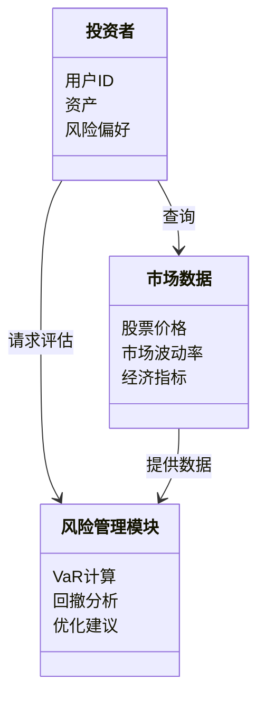

                 


# 特价股票投资中的跨文化投资策略与风险管理

## 关键词：特价股票投资、跨文化投资、风险管理、数学模型、算法、系统架构

## 摘要：  
在当前全球化和数字化的金融环境下，跨文化投资策略和风险管理的重要性日益凸显。本文通过深入分析特价股票投资中的跨文化投资策略，结合风险管理的核心原理和数学模型，探讨如何在不同文化背景下制定有效的投资策略，并通过系统架构设计和项目实战，为投资者提供实践指导。文章内容涵盖从理论到实践的全链条分析，旨在帮助投资者在复杂多变的市场环境中实现稳健收益。

---

## 第一部分：背景介绍

### 1.1 特价股票投资的背景与意义

#### 1.1.1 特价股票投资的定义与特点  
特价股票投资是指在特定市场环境下，投资者以低于市场价或折扣价购买股票，期望在未来市场反弹或公司价值回升时获得收益的投资策略。其特点是高风险、高回报，通常适用于对市场波动有深刻理解的投资者。

#### 1.1.2 特价股票投资的市场背景  
近年来，全球市场的波动性显著增加，尤其是在经济危机、地缘政治冲突和疫情等事件的影响下，许多股票价格出现大幅下跌。这些情况下，特价股票投资机会增多，吸引了更多投资者的关注。

#### 1.1.3 特价股票投资的意义与价值  
特价股票投资不仅是对市场机会的把握，更是对投资者心理素质、市场分析能力和风险管理能力的考验。通过特价股票投资，投资者可以在市场低谷时布局，为未来的收益奠定基础。

---

### 1.2 跨文化投资策略的基本概念

#### 1.2.1 跨文化投资的定义  
跨文化投资是指在不同国家或地区的市场中进行投资，充分利用各市场的差异性，优化投资组合，分散风险，提高收益。

#### 1.2.2 跨文化投资的核心要素  
跨文化投资的核心要素包括：  
1. 市场分析：不同市场的经济、政治、文化和社会因素。  
2. 投资策略：根据市场特点制定的投资方案。  
3. 风险管理：控制跨市场投资中的不确定性。

#### 1.2.3 跨文化投资与传统投资的区别  
跨文化投资与传统投资的主要区别在于市场选择的多样性和全球化视角。跨文化投资更注重市场间的差异和协同效应，而传统投资则更关注单一市场的内部因素。

---

### 1.3 风险管理在特价股票投资中的重要性

#### 1.3.1 风险管理的基本概念  
风险管理是指识别、评估和应对投资中的潜在风险，以降低损失、优化收益的过程。

#### 1.3.2 风险管理在特价股票投资中的作用  
在特价股票投资中，风险管理可以有效降低市场波动带来的损失，帮助投资者在市场下跌时减少损失，在市场反弹时锁定收益。

#### 1.3.3 风险管理的边界与外延  
风险管理的边界包括市场风险、流动性风险和信用风险等，外延则涉及法律、税务和操作风险。

---

## 第二部分：核心概念与联系

### 2.1 跨文化投资策略的核心要素

#### 2.1.1 跨文化投资的市场分析  
跨文化投资的市场分析需要考虑不同市场的经济周期、政策环境和文化差异。例如，新兴市场的增长潜力与发达国家市场的稳定性形成对比。

#### 2.1.2 跨文化投资策略的制定与优化  
跨文化投资策略的制定需要结合市场分析、资产配置和风险控制。优化策略需要根据市场变化动态调整。

#### 2.1.3 跨文化投资的风险管理  
跨文化投资中的风险管理需要考虑汇率波动、政治风险和文化差异带来的额外风险。

---

## 第三部分：风险管理的核心原理

### 3.1 风险管理的基本原理

#### 3.1.1 风险的定义与分类  
风险可以分为市场风险、信用风险、流动性风险和操作风险等。

#### 3.1.2 风险管理的目标与方法  
风险管理的目标是降低风险暴露，提高投资组合的稳定性。常用方法包括分散投资、对冲和保险。

#### 3.1.3 风险管理的流程与步骤  
风险管理流程包括风险识别、评估、应对和监控。

---

## 第四部分：跨文化投资中的风险管理

### 4.1 跨文化投资风险的识别与评估

#### 4.1.1 风险识别的方法与工具  
风险识别可以通过定性和定量方法进行，常用工具包括SWOT分析和风险矩阵。

#### 4.1.2 跨文化投资中的特定风险  
跨文化投资中的特定风险包括政治风险、汇率风险和文化差异带来的市场波动。

#### 4.1.3 风险评估的指标与方法  
常用指标包括VaR和信用评级。

---

## 第五部分：跨文化投资策略的数学模型与算法

### 5.1 跨文化投资策略的数学模型

#### 5.1.1 风险价值（VaR）模型  
VaR模型用于衡量投资组合在一定置信水平下的潜在损失。公式为：
$$ VaR = \alpha \times \sigma $$
其中，α为置信水平对应的分位数，σ为投资组合的标准差。

#### 5.1.2 最大回撤（Maximum Drawdown）模型  
最大回撤用于衡量投资组合在特定时间段内的最大损失，公式为：
$$ \text{最大回撤} = \max_{i} (\text{峰值} - \text{后续价格}) $$

---

## 第六部分：系统分析与架构设计

### 6.1 问题场景介绍

#### 6.1.1 系统功能需求  
系统需要支持跨文化投资分析、风险管理功能和投资组合优化。

### 6.2 系统架构设计

#### 6.2.1 领域模型类图  


---

## 第七部分：项目实战

### 7.1 环境安装与代码实现

#### 7.1.1 环境安装  
安装Python、Pandas、Matplotlib和Scipy库。

#### 7.1.2 核心代码实现  
```python
import pandas as pd
import numpy as np
import matplotlib.pyplot as plt
from scipy.stats import norm

def calculate VaR(returns, confidence_level):
    sorted_returns = sorted(returns)
    alpha = norm.ppf(confidence_level)
    VaR = alpha * np.std(returns)
    return VaR
```

#### 7.1.3 代码解读与分析  
代码实现VaR计算，展示如何通过统计方法评估潜在损失。

---

## 第八部分：小结与最佳实践

### 8.1 小结  
本文详细探讨了跨文化投资策略与风险管理的结合，通过数学模型和系统设计，提供了实践指导。

### 8.2 最佳实践 tips  
- 定期监控市场风险。
- 结合多种风险管理工具优化投资组合。

### 8.3 注意事项  
避免过度依赖单一模型，注意模型假设的合理性。

### 8.4 拓展阅读  
推荐阅读风险管理相关的书籍，深入理解模型的原理与应用。

---

## 作者：AI天才研究院/AI Genius Institute & 禅与计算机程序设计艺术 /Zen And The Art of Computer Programming

---

以上是《特价股票投资中的跨文化投资策略与风险管理》的详细内容，涵盖背景、理论、数学模型、系统设计和实战分析，希望对投资者有所帮助。

