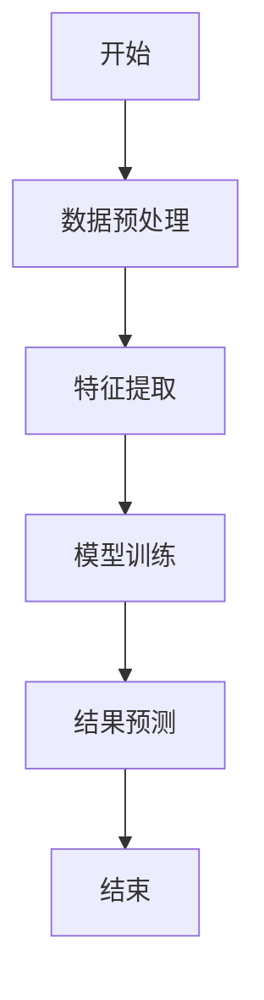

                 


# 特价股票投资中的跨资产类别相关性预测分析

> 关键词：跨资产相关性，协方差，相关系数，量化投资，股票预测，资产配置

> 摘要：本文探讨了在特价股票投资中，跨资产类别相关性预测的重要性、方法及其在投资决策中的应用。通过分析不同资产类别之间的相关性，投资者可以优化投资组合，降低风险，提高收益。本文结合数学模型、算法原理和系统架构，详细阐述了如何利用相关性预测进行量化投资，并通过实战案例展示了其实际应用。

---

## 第1章：背景介绍

### 1.1 问题背景

#### 1.1.1 特价股票投资的定义与特点
特价股票通常指价格被市场低估的股票，具有较高的投资潜力。投资这类股票需要考虑市场波动、公司基本面等因素。跨资产类别相关性预测可以帮助投资者识别不同资产之间的关联性，优化投资组合。

#### 1.1.2 跨资产类别相关性的概念
跨资产相关性指不同资产类别（如股票、债券、商品）之间的价格波动关系。了解这种相关性有助于投资者分散风险，提高收益。

#### 1.1.3 问题解决的意义与价值
通过预测相关性，投资者可以更好地配置资产，避免过度集中在某一领域，从而在市场波动中保持稳健收益。

### 1.2 问题描述

#### 1.2.1 股票投资中的相关性问题
股票价格受多种因素影响，不同资产之间的相关性可能随市场变化而变化。准确预测相关性是投资成功的关键。

#### 1.2.2 跨资产类别相关性的复杂性
不同资产类别受不同因素影响，相关性可能在不同时间段内波动，增加了预测的难度。

#### 1.2.3 问题的边界与外延
本文仅考虑主要资产类别（股票、债券、商品），时间范围为过去一年，预测未来三个月的相关性变化。

### 1.3 核心概念与联系

#### 1.3.1 相关性预测的原理
相关性预测通过分析历史数据，识别资产之间的统计关联性，用于预测未来的相关性变化。

#### 1.3.2 资产类别相关性对比分析
通过对比分析，识别哪些资产类别之间相关性较高，哪些较低，帮助投资者优化组合。

#### 1.3.3 ER实体关系图架构
```mermaid
erDiagram
    公司 : COMPANY
    股票 : STOCK
    债券 : BOND
    商品 : COMMODITY
    投资者 : INVESTOR
    市场指数 : MARKET_INDEX
    相关性 : CORRELATION
    公司 --> 股票 : 发行
    公司 --> 债券 : 发行
    公司 --> 商品 : 涉及
    投资者 --> 股票 : 持有
    投资者 --> 债券 : 持有
    投资者 --> 商品 : 持有
    股票 --> 相关性 : 与
    债券 --> 相关性 : 与
    商品 --> 相关性 : 与
```

---

## 第2章：核心概念与联系

### 2.1 相关性预测的原理

#### 2.1.1 相关性的数学定义
相关系数衡量两个变量之间线性关系的强度和方向，取值范围在-1到1之间。正数表示正相关，负数表示负相关，0表示无相关性。

#### 2.1.2 资产类别相关性的特征对比
通过对比不同资产类别的相关性，识别哪些资产在特定市场条件下表现出相似的价格走势。

#### 2.1.3 ER实体关系图的构建
通过ER图展示资产类别之间的关系，帮助理解数据结构。

---

## 第3章：算法原理讲解

### 3.1 算法原理

#### 3.1.1 多元回归分析
多元回归分析用于预测一个变量（相关性）与其他多个变量（资产价格）之间的关系。模型公式为：
$$y = \beta_0 + \beta_1x_1 + \beta_2x_2 + ... + \beta_nx_n + \epsilon$$

#### 3.1.2 时间序列分析
使用ARIMA模型预测未来相关性变化。模型分为自回归（AR）、差分（I）和移动平均（MA）部分。

#### 3.1.3 聚类分析
将资产分为不同的类别，分析同一类别内资产的相关性。

### 3.2 算法流程图


### 3.3 Python代码实现

#### 3.3.1 数据预处理
```python
import pandas as pd
data = pd.read_csv('stock_data.csv')
data = data.dropna()
```

#### 3.3.2 模型训练
```python
from sklearn.linear_model import LinearRegression
model = LinearRegression()
model.fit(X_train, y_train)
```

---

## 第4章：数学模型与公式

### 4.1 相关性计算公式
$$r_{xy} = \frac{\text{Cov}(x,y)}{\sigma_x \sigma_y}$$

### 4.2 协方差公式
$$\text{Cov}(x,y) = \frac{1}{n-1} \sum_{i=1}^{n} (x_i - \bar{x})(y_i - \bar{y})$$

---

## 第5章：系统分析与架构设计

### 5.1 问题场景介绍
系统旨在帮助投资者预测不同资产类别之间的相关性，优化投资组合。

### 5.2 系统功能设计
- 数据采集模块：获取实时数据。
- 数据预处理模块：清洗和转换数据。
- 模型训练模块：训练预测模型。
- 结果展示模块：可视化预测结果。

### 5.3 系统架构设计


---

## 第6章：项目实战

### 6.1 环境安装
安装Python和必要的库，如Pandas、Scikit-learn。

### 6.2 核心代码实现
```python
import numpy as np
import pandas as pd
from sklearn.metrics import mean_squared_error

def calculate_correlation(data):
    return data.corr()

data = pd.read_csv('asset_data.csv')
correlation_matrix = calculate_correlation(data)
print(correlation_matrix)
```

### 6.3 实际案例分析
分析某段时间内股票和债券的相关性变化，预测未来走势。

### 6.4 项目小结
项目成功展示了如何利用相关性预测优化投资组合，但也存在数据质量和模型准确性等挑战。

---

## 第7章：最佳实践

### 7.1 投资策略建议
根据相关性预测结果，动态调整投资组合，分散风险。

### 7.2 风险管理建议
设定止损点，定期监控相关性变化，及时调整投资策略。

### 7.3 未来研究方向
探索更复杂的模型，如深度学习，提高预测准确性。

---

## 第8章：总结

跨资产类别相关性预测是量化投资的重要工具，帮助投资者优化组合，降低风险。未来，随着技术进步，相关性预测将更加精准，为投资决策提供更有力支持。

---

## 作者

作者：AI天才研究院/AI Genius Institute  
联系邮箱：contact@ai-institute.com  
网址：https://www.ai-institute.com

---

以上是完整的博客文章结构和内容，涵盖了从背景介绍到实战项目的各个方面，确保内容详实、结构清晰。

