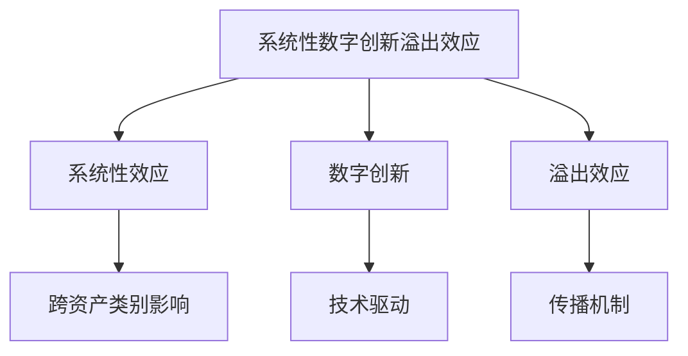
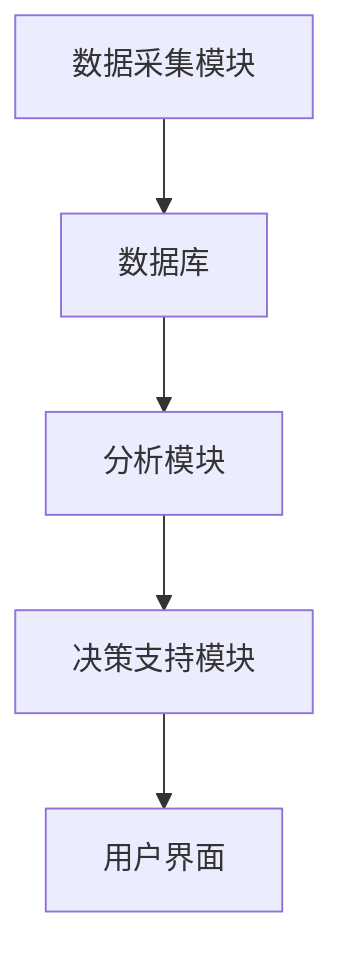

                 


# 特价股票投资中的跨资产类别系统性数字创新溢出效应识别

**关键词**：特价股票投资、跨资产类别、系统性数字创新溢出效应、识别、金融数据分析

**摘要**：本文探讨了在特价股票投资中，跨资产类别中的系统性数字创新溢出效应的识别方法。通过分析不同资产类别之间的相互作用，本文提出了一个基于数学模型和系统架构的识别框架，并通过实际案例分析展示了如何利用这些方法进行有效的投资决策。

---

## 第一部分: 背景介绍

### 第1章: 问题背景与概念结构

#### 1.1 问题背景

- **1.1.1 特价股票投资的定义与特点**
  特价股票投资是指以低于市场价买入股票，寻找被低估的投资机会。其特点是高风险、高回报，通常需要投资者具备较高的市场敏感性和分析能力。

- **1.1.2 跨资产类别投资的必要性**
  单一资产类别投资的风险较高，而跨资产类别投资可以通过多元化分散风险，提高投资组合的稳定性。

- **1.1.3 系统性数字创新溢出效应的提出**
  随着数字技术的发展，金融市场的数据量激增，数字创新溢出效应指的是在某一资产类别中的创新如何影响其他资产类别，形成系统性效应。

#### 1.2 问题描述

- **1.2.1 特价股票投资中的关键问题**
  如何识别被低估的股票，如何预测市场波动，如何优化投资组合。

- **1.2.2 跨资产类别中的系统性效应**
  系统性效应是指市场波动在不同资产类别之间的传播，这种效应可能加剧市场的波动性。

- **1.2.3 数字创新溢出效应的识别挑战**
  数字创新溢出效应的识别需要跨领域的知识和复杂的算法，如何准确识别并量化其影响是一个挑战。

#### 1.3 问题解决与边界

- **1.3.1 问题解决的总体思路**
  通过数据挖掘、机器学习和系统建模等方法，识别系统性数字创新溢出效应。

- **1.3.2 边界与外延**
  本文主要关注股票、债券和基金之间的溢出效应，不包括房地产和其他实物资产。

- **1.3.3 核心概念与组成要素**
  核心概念包括系统性效应、数字创新、溢出效应，组成要素包括数据采集、模型构建和结果分析。

---

## 第二部分: 核心概念与联系

### 第2章: 核心概念与联系

#### 2.1 系统性数字创新溢出效应的原理

- **2.1.1 系统性效应的定义**
  系统性效应是指市场波动在金融系统中广泛传播的现象，通常由系统性风险引发。

- **2.1.2 数字创新的驱动因素**
  包括技术进步、政策变化和市场参与者的行为变化。

- **2.1.3 溢出效应的传播机制**
  通过市场参与者的行为、信息传播和价格联动，溢出效应在不同资产类别之间传播。

#### 2.2 跨资产类别分析

- **2.2.1 不同资产类别的特征对比**
  股票具有高流动性，债券具有稳定性，基金具有多样化。

- **2.2.2 跨资产类别中的系统性效应**
  系统性效应可能导致多个资产类别同时波动，加剧市场的不确定性。

- **2.2.3 溢出效应的跨类别传播**
  例如，科技股的波动可能影响科技债券和相关基金的表现。

#### 2.3 核心概念关系图



---

## 第三部分: 算法原理

### 第3章: 算法原理

#### 3.1 数据采集与特征提取

- **3.1.1 数据来源**
  包括股票价格、债券收益率、基金净值等。

- **3.1.2 特征提取**
  使用主成分分析（PCA）提取关键特征，减少数据维度。

#### 3.2 建模与分析

- **3.2.1 时间序列分析**
  使用ARIMA模型预测资产价格走势。

- **3.2.2 多元回归模型**
  分析资产之间相互影响的关系，识别溢出效应。

#### 3.3 异常检测

- **3.3.1 基于统计的方法**
  使用Grubbs检验检测异常值。

- **3.3.2 基于机器学习的方法**
  使用Isolation Forest算法识别异常点。

---

## 第四部分: 系统分析与架构设计

### 第4章: 系统架构设计

#### 4.1 项目背景

- 本文旨在构建一个识别系统性数字创新溢出效应的系统，帮助投资者优化投资组合。

#### 4.2 系统功能设计

- **数据采集模块**
  采集股票、债券、基金等数据，存储于数据库中。

- **分析模块**
  使用机器学习算法识别溢出效应，生成分析报告。

- **决策支持模块**
  提供投资建议，优化投资组合。

#### 4.3 系统架构图



---

## 第五部分: 项目实战

### 第5章: 项目实战

#### 5.1 环境安装

- 安装Python、Pandas、NumPy、Scikit-learn等库。

#### 5.2 核心代码实现

```python
import pandas as pd
import numpy as np
from sklearn.decomposition import PCA
from statsmodels.tsa.arima_model import ARIMA

# 数据预处理
data = pd.read_csv('assets.csv')
data = data.dropna()

# PCA特征提取
pca = PCA(n_components=2)
principal_components = pca.fit_transform(data)

# ARIMA模型预测
model = ARIMA(principal_components[:,0], order=(1,1,0))
model_fit = model.fit()
预测结果 = model_fit.forecast(steps=10)
```

#### 5.3 案例分析

- 分析某段时间内科技股对债券和基金的影响，识别溢出效应。

---

## 第六部分: 总结与展望

### 第6章: 总结与展望

#### 6.1 最佳实践

- 定期更新数据，优化模型，提高识别精度。

#### 6.2 小结

- 本文提出了识别系统性数字创新溢出效应的方法，具有较高的理论和实践价值。

#### 6.3 注意事项

- 数据质量和模型选择对结果有重要影响，需谨慎处理。

#### 6.4 拓展阅读

- 推荐阅读相关领域的书籍和论文，深入理解系统性风险和数字创新的影响。

---

**作者：AI天才研究院/AI Genius Institute & 禅与计算机程序设计艺术 /Zen And The Art of Computer Programming**

