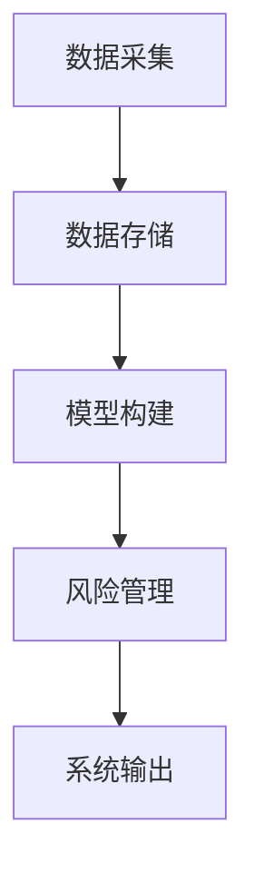

                 


# 特价股票投资中的跨资产类别配置

> **关键词**：特价股票，跨资产配置，风险管理，量化投资，资产组合优化  
> **摘要**：本文深入探讨了在特价股票投资中如何进行跨资产类别配置，从理论基础、量化方法到实证分析，系统地分析了如何通过跨资产配置优化投资组合的风险和收益。文章结合具体案例，详细介绍了资产配置的数学模型、风险管理策略以及系统实现方案，为投资者提供了科学的指导和实践参考。

---

# 第1章：跨资产类别配置的背景与理论基础

## 1.1 资产配置的定义与分类

### 1.1.1 资产配置的定义
资产配置是指将资金分配到不同资产类别（如股票、债券、基金、房地产等）中，以实现风险分散和收益最大化的过程。跨资产配置则强调在多个资产类别之间进行优化配置。

### 1.1.2 资产类别的分类
资产类别主要分为以下几类：
1. **股票类**：包括普通股、优先股等。
2. **债券类**：包括国债、企业债、金融债等。
3. **基金类**：包括股票型基金、债券型基金、混合型基金等。
4. **现金及等价物类**：包括活期存款、货币市场基金等。
5. **另类资产**：包括房地产、 commodities、私募股权等。

### 1.1.3 跨资产配置的意义
跨资产配置的意义在于通过分散投资降低风险，同时在不同资产类别之间捕捉收益机会。特别是在特价股票投资中，跨资产配置可以帮助投资者在市场波动中保持稳健的收益。

---

## 1.2 特价股票的定义与特点

### 1.2.1 特价股票的定义
特价股票通常指市场价格低于其内在价值的股票，也被称为“价值股”。这些股票可能因为市场短期波动或其他因素被低估，但具有长期增值潜力。

### 1.2.2 特价股票的特点
1. **低估值**：市盈率、市净率等指标低于行业平均水平。
2. **高分红**：通常具有较高的股息收益率。
3. **行业周期性**：多出现在周期性行业如能源、制造等领域。

### 1.2.3 特价股票与其他股票的区别
与成长股相比，特价股票更注重当前的价值而非未来的增长潜力。与蓝筹股相比，特价股票可能具有更高的风险但潜在回报也更大。

---

## 1.3 跨资产配置的必要性与优势

### 1.3.1 跨资产配置的必要性
在单一资产类别中投资可能导致过度集中风险，而跨资产配置可以通过分散投资降低特定资产类别的风险。

### 1.3.2 跨资产配置的优势
1. **风险分散**：通过投资不同类型资产降低组合的整体风险。
2. **收益增强**：在不同资产类别中捕捉收益机会。
3. **对冲风险**：通过配置相关性较低的资产对冲市场风险。

### 1.3.3 跨资产配置的风险与收益平衡
跨资产配置需要在风险和收益之间找到平衡点，避免过度配置高风险资产或低风险资产。

---

## 1.4 本章小结
本章介绍了资产配置的基本概念、资产类别的分类以及跨资产配置的意义。同时，详细阐述了特价股票的定义、特点及其与其他股票的区别。最后，分析了跨资产配置的必要性与优势。

---

# 第2章：资产配置的量化方法

## 2.1 资产配置的量化模型

### 2.1.1 均值-方差模型
均值-方差模型由Harry Markowitz提出，旨在通过优化资产组合的收益与风险关系，找到最优投资组合。

**公式**：
$$
\text{目标：} \min_w \left( w^T \Sigma w \right) \\
\text{约束：} \sum_{i=1}^n w_i = 1, \quad w \geq 0
$$

其中，$w$是权重向量，$\Sigma$是资产的协方差矩阵。

### 2.1.2 风险平价模型
风险平价模型将风险分配到各个资产类别中，使每个资产类别的风险贡献相等。

### 2.1.3 基于因子模型的资产配置
因子模型将资产收益分解为因子暴露和因子收益，常用于跨资产配置中。

---

## 2.2 特价股票的量化分析

### 2.2.1 特价股票的筛选方法
1. **基本面分析**：通过市盈率、市净率等指标筛选低估股票。
2. **技术分析**：通过K线图、趋势线等技术指标判断股票的投资价值。

### 2.2.2 特价股票的估值指标
常用的估值指标包括：
1. 市盈率（P/E）：股价/每股收益。
2. 市净率（P/B）：股价/每股净资产。
3. 股息率：股息/股价。

### 2.2.3 特价股票的风险评估
通过VaR（风险价值）和CVaR（条件风险价值）模型评估特价股票的风险。

---

## 2.3 跨资产配置的优化策略

### 2.3.1 资产配置的优化目标
1. 最大化收益。
2. 最小化风险。
3. 平衡风险与收益。

### 2.3.2 资产配置的优化方法
1. **数学优化**：使用均值-方差模型或风险平价模型。
2. **机器学习**：利用聚类、回归等算法优化配置。

### 2.3.3 资产配置的动态调整
根据市场变化定期调整资产配置比例，以保持最优组合。

---

## 2.4 本章小结
本章介绍了资产配置的量化方法，包括均值-方差模型、风险平价模型和因子模型。同时，详细讨论了特价股票的量化分析方法，包括筛选、估值和风险评估。最后，分析了跨资产配置的优化策略。

---

# 第3章：风险管理与资产配置

## 3.1 风险管理的基本概念

### 3.1.1 风险的定义
风险是指投资收益的不确定性，通常用波动率或VaR等指标衡量。

### 3.1.2 风险的分类
1. **市场风险**：整个市场的波动风险。
2. **流动性风险**：资产难以快速变现的风险。
3. **信用风险**：债券发行人违约的风险。

### 3.1.3 风险管理的重要性
有效的风险管理可以降低投资组合的损失，提高投资的稳定性。

---

## 3.2 跨资产配置中的风险管理

### 3.2.1 跨资产配置中的风险来源
1. **市场波动**：不同资产类别的价格波动可能同时发生。
2. **相关性风险**：资产类别之间相关性过高可能导致风险分散不足。

### 3.2.2 跨资产配置中的风险分散
通过投资相关性较低的资产类别降低整体风险。

### 3.2.3 跨资产配置中的风险对冲
使用衍生工具（如期货、期权）对冲特定风险。

---

## 3.3 风险价值（VaR）与条件风险价值（CVaR）

### 3.3.1 VaR的定义与计算
VaR是指在一定置信水平下，投资组合可能遭受的最大损失。

**公式**：
$$
\text{VaR} = \text{损失的分位数}
$$

### 3.3.2 CVaR的定义与计算
CVaR是指在VaR水平之上，投资组合的平均损失。

**公式**：
$$
\text{CVaR} = \text{VaR的期望损失}
$$

### 3.3.3 VaR与CVaR的应用
VaR常用于衡量市场风险，而CVaR更适用于对冲风险。

---

## 3.4 本章小结
本章介绍了风险管理的基本概念，分析了跨资产配置中的风险管理策略，重点讨论了VaR和CVaR的应用。

---

# 第4章：实证分析与案例研究

## 4.1 跨资产配置的实证分析

### 4.1.1 数据来源与处理
使用历史价格数据和财务数据进行实证分析。

### 4.1.2 模型构建与回测
构建资产配置模型并进行历史回测，验证模型的有效性。

### 4.1.3 实证结果与分析
分析回测结果，评估模型的收益与风险表现。

---

## 4.2 特价股票投资的案例研究

### 4.2.1 案例背景与目标
以某段时间内的特价股票为例，分析其投资价值。

### 4.2.2 案例分析与结果
通过量化分析和模型优化，得出最优的资产配置比例。

### 4.2.3 案例的启示与总结
总结案例经验，为未来投资提供参考。

---

## 4.3 跨资产配置在实际投资中的应用

### 4.3.1 跨资产配置的实际应用场景
1. **组合投资**：通过跨资产配置构建多元化的投资组合。
2. **风险对冲**：利用不同资产类别对冲市场风险。

### 4.3.2 跨资产配置的实际案例分析
分析实际投资案例，展示跨资产配置的优势。

### 4.3.3 投资策略的调整与优化
根据市场变化动态调整资产配置比例。

---

## 4.4 本章小结
本章通过实证分析和案例研究，验证了跨资产配置的有效性。通过具体案例展示了特价股票投资中的跨资产配置策略，并总结了实际应用的经验。

---

# 第5章：系统实现与实战操作

## 5.1 系统架构设计

### 5.1.1 问题场景介绍
设计一个跨资产配置系统，帮助投资者实现资产优化配置。

### 5.1.2 系统功能设计
1. 数据采集模块：获取各类资产的历史数据。
2. 模型构建模块：实现均值-方差模型等配置算法。
3. 风险管理模块：计算VaR和CVaR等风险指标。
4. 系统输出模块：生成最优资产配置方案。

### 5.1.3 系统架构设计（Mermaid图）


---

## 5.2 项目实战

### 5.2.1 环境安装
安装Python、Pandas、NumPy等工具。

### 5.2.2 系统核心实现源代码
```python
import numpy as np
import pandas as pd

# 示例：均值-方差模型实现
def mean_var_optimization(returns):
    n = returns.shape[1]
    cov_matrix = returns.cov()
    mu = returns.mean()
    # 使用 scipy 进行优化
    from scipy.optimize import minimize
    def objective(w):
        return (w.T @ cov_matrix @ w)[0,0]
    cons = ({'type': 'eq', 'fun': lambda w: sum(w) - 1.0})
    bounds = [(0, None) for _ in range(n)]
    result = minimize(objective, np.ones(n)/n, method='SLSQP', bounds=bounds, constraints=cons)
    return result.x
```

### 5.2.3 代码应用解读与分析
上述代码实现了一个简单的均值-方差优化模型，用于计算最优资产配置权重。

### 5.2.4 实际案例分析
以某段时间内的特价股票为例，进行实证分析并生成最优配置方案。

---

## 5.3 本章小结
本章介绍了跨资产配置系统的架构设计，并通过Python代码展示了系统的实现过程。通过实际案例分析，验证了系统的有效性和实用性。

---

# 附录

## 附录A：常用数学公式

## 附录B：系统架构图

---

# 作者：AI天才研究院 & 禅与计算机程序设计艺术

---

以上是《特价股票投资中的跨资产类别配置》的技术博客文章的完整内容。文章从理论到实践，详细探讨了跨资产配置的策略和方法，结合具体案例和系统实现，为投资者提供了科学的指导和实践参考。

