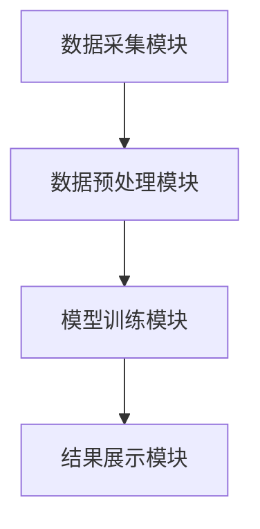

                 


# 特价股票投资中的跨链资产相关性预测分析

> 关键词：特价股票，跨链资产，相关性预测，区块链，算法，数据分析，投资策略

> 摘要：本文探讨了在特价股票投资中，如何利用跨链资产的相关性预测来优化投资决策。通过分析跨链资产的相关性，结合数学模型和算法，帮助投资者更好地理解市场动态，制定有效的投资策略。

---

## 第1章: 特价股票投资与跨链资产概述

### 1.1 特价股票投资的基本概念

#### 1.1.1 什么是特价股票
特价股票是指以低于市场价买入的股票，通常在市场下跌或公司遇到短期困难时出现。投资者可以通过特价股票获得较高的潜在收益。

#### 1.1.2 特价股票投资的特点
- 价格波动大
- 投资风险较高
- 可能存在市场操纵

#### 1.1.3 特价股票投资的策略
- 价值投资：寻找被低估的股票
- 技术分析：通过图表和技术指标预测价格走势
- 风险管理：控制仓位和止损

### 1.2 跨链资产的基本概念

#### 1.2.1 跨链资产的定义
跨链资产是指在不同区块链之间流动的数字资产，例如比特币可以在比特币网络和以太坊网络之间转移。

#### 1.2.2 跨链资产的特点
- 跨越不同区块链
- 交易速度快
- 资产流动性高

#### 1.2.3 跨链资产的分类
- 原生资产：直接在区块链上发行的资产
- 代币：代表其他资产的数字凭证
- 跨链桥接资产：用于连接不同区块链的桥梁

### 1.3 特价股票与跨链资产相关性预测的背景

#### 1.3.1 特价股票投资中的不确定性
市场波动、公司基本面变化、宏观经济因素等都会影响股票价格。

#### 1.3.2 跨链资产对投资的影响
跨链资产的流动性和价格波动可能对传统金融市场产生影响，尤其是在加密货币与传统股票市场之间的相关性逐渐增强的情况下。

#### 1.3.3 相关性预测的必要性
通过预测跨链资产的相关性，投资者可以更好地分散风险，优化投资组合。

---

## 第2章: 跨链资产相关性预测的核心概念

### 2.1 跨链资产相关性的定义

#### 2.1.1 相关性的数学定义
相关性是衡量两个变量之间线性关系的统计量，通常用相关系数r来表示。相关系数的范围在-1到+1之间。

#### 2.1.2 跨链资产相关性的度量
通过协方差和方差计算相关系数。

### 2.2 跨链资产相关性的影响因素

#### 2.2.1 市场波动性
市场波动性越大，资产之间的相关性可能越高。

#### 2.2.2 资产流动性
流动性高的资产更容易快速交易，影响相关性。

#### 2.2.3 跨链技术的影响
跨链技术的发展可能改变资产之间的相关性。

### 2.3 跨链资产相关性的预测模型

#### 2.3.1 线性回归模型
通过最小二乘法拟合直线，预测资产价格。

#### 2.3.2 时间序列模型
使用ARIMA等模型预测未来的价格走势。

#### 2.3.3 机器学习模型
如随机森林和神经网络，能够捕捉非线性关系。

---

## 第3章: 跨链资产相关性预测的算法原理

### 3.1 相关性分析的基本原理

#### 3.1.1 协方差与相关系数
协方差衡量两个变量的偏离程度，相关系数衡量标准化后的协方差。

公式：
$$r_{xy} = \frac{\sum (x_i - \bar{x})(y_i - \bar{y})}{\sqrt{\sum (x_i - \bar{x})^2} \sqrt{\sum (y_i - \bar{y})^2}}$$

### 3.2 机器学习算法的应用

#### 3.2.1 线性回归模型
通过最小化预测误差平方和来拟合直线。

#### 3.2.2 支持向量回归
将问题转化为支持向量分类问题，适用于非线性关系。

#### 3.2.3 随机森林回归
通过集成多个决策树模型，提高预测准确性。

### 3.3 算法选择与优化

#### 3.3.1 算法选择的依据
根据数据特征和问题类型选择合适的算法。

#### 3.3.2 超参数调优
使用网格搜索或随机搜索优化模型参数。

#### 3.3.3 模型评估与验证
通过交叉验证评估模型的性能。

---

## 第4章: 跨链资产相关性预测的系统架构设计

### 4.1 系统功能设计

#### 4.1.1 数据采集模块
从多个数据源获取跨链资产和股票价格数据。

#### 4.1.2 数据预处理模块
清洗数据，处理缺失值和异常值。

#### 4.1.3 模型训练模块
训练相关性预测模型，并进行验证和优化。

#### 4.1.4 结果展示模块
可视化预测结果，提供投资建议。

### 4.2 系统架构图



### 4.3 系统接口设计

#### 4.3.1 数据接口
定义数据输入和输出格式。

#### 4.3.2 模型接口
定义模型调用接口，方便扩展。

#### 4.3.3 用户接口
提供用户友好的操作界面，展示预测结果。

---

## 第5章: 跨链资产相关性预测的项目实战

### 5.1 环境搭建

#### 5.1.1 安装Python
安装Python 3.8或更高版本。

#### 5.1.2 安装相关库
安装Pandas、NumPy、Scikit-learn等库。

### 5.2 核心代码实现

```python
import pandas as pd
import numpy as np
from sklearn.linear_model import LinearRegression
from sklearn.metrics import r2_score

# 加载数据
data = pd.read_csv('cross_chain_assets.csv')

# 特征和目标变量
X = data[['asset1', 'asset2']]
y = data['target']

# 训练模型
model = LinearRegression()
model.fit(X, y)

# 预测结果
y_pred = model.predict(X)

# 评估模型
print("R^2 Score:", r2_score(y, y_pred))
```

### 5.3 实际案例分析

#### 5.3.1 数据来源
从加密货币交易所获取比特币和以太坊的价格数据。

#### 5.3.2 模型训练
使用历史数据训练相关性预测模型。

#### 5.3.3 预测结果
预测未来一段时间内比特币和以太坊的相关性。

### 5.4 项目小结

通过实际案例分析，展示了跨链资产相关性预测在投资决策中的应用价值。

---

## 第6章: 数学模型与公式

### 6.1 相关系数公式
$$r_{xy} = \frac{\sum (x_i - \bar{x})(y_i - \bar{y})}{\sqrt{\sum (x_i - \bar{x})^2} \sqrt{\sum (y_i - \bar{y})^2}}$$

### 6.2 线性回归模型
$$y = \beta_0 + \beta_1x + \epsilon$$

### 6.3 时间序列模型
$$ARIMA(p, d, q)$$

---

## 第7章: 最佳实践与注意事项

### 7.1 最佳实践
- 定期更新模型，适应市场变化。
- 结合其他分析方法，如技术分析和基本面分析。
- 严格控制风险，避免过度杠杆。

### 7.2 小结
跨链资产相关性预测是投资者优化投资组合的重要工具，通过结合多种算法和数据分析方法，可以提高预测的准确性和可靠性。

### 7.3 注意事项
- 数据来源的可靠性
- 模型的局限性
- 市场风险的不确定性

### 7.4 拓展阅读
- 《区块链技术与金融应用》
- 《机器学习在金融中的应用》

---

## 作者：AI天才研究院/AI Genius Institute & 禅与计算机程序设计艺术 /Zen And The Art of Computer Programming

---

这篇文章详细介绍了跨链资产相关性预测在特价股票投资中的应用，通过理论分析和实际案例，帮助投资者更好地理解和应用相关性预测技术。

