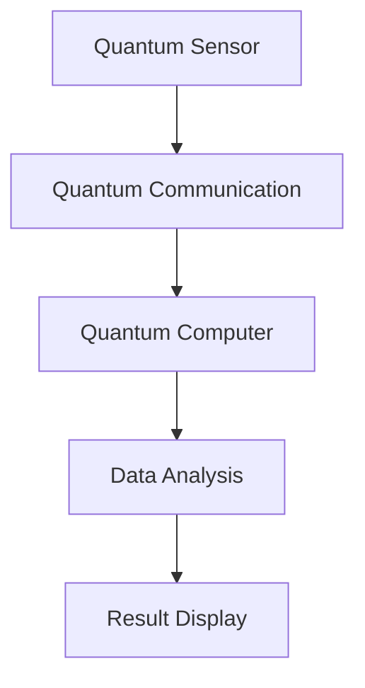
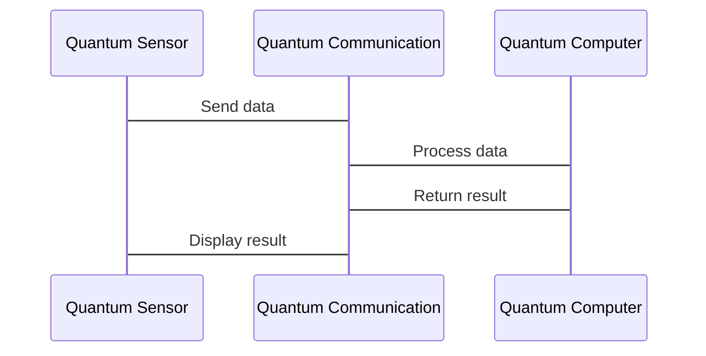

                 


# 特价股票投资中的量子传感网络大数据分析与应用

> 关键词：量子传感网络，大数据分析，特价股票投资，算法实现，系统架构

> 摘要：本文深入探讨了量子传感网络在特价股票投资中的应用，结合量子技术与大数据分析，提出了创新的股票投资策略。通过量子传感网络的数据采集与分析能力，本文展示了如何利用量子计算的优势，提升股票数据分析的效率与准确性，为投资者提供更精准的投资决策支持。

---

# 第一部分: 特价股票投资与量子传感网络概述

## 第1章: 特价股票投资与量子传感网络的背景与概述

### 1.1 特价股票投资的背景与特点

#### 1.1.1 特价股票的定义与特点
- **定义**：特价股票指市盈率低、市值小、流动性适中、价格波动相对稳定的股票。
- **特点**：
  - 市盈率低，投资价值高。
  - 价格波动小，风险相对较低。
  - 适合长期投资，追求稳定收益。

#### 1.1.2 特价股票投资的策略与挑战
- **策略**：
  - 价值投资：寻找被市场低估的股票。
  - 投机投资：利用短期价格波动获利。
- **挑战**：
  - 数据量大，难以快速分析。
  - 市场波动受多种因素影响，难以预测。
  - 数据复杂性高，传统方法难以捕捉隐含信息。

#### 1.1.3 量子技术在股票投资中的潜在应用
- 量子计算的并行性与高效性为股票数据分析提供了新思路。
- 量子传感网络可以实时捕捉市场数据，提供更高精度的分析能力。

---

### 1.2 量子传感网络的基本概念

#### 1.2.1 量子传感的定义与原理
- **定义**：量子传感利用量子力学原理，通过量子纠缠、叠加等特性，实现对物理量的高精度测量。
- **原理**：
  - 利用量子态的叠加性，同时感知多个信号源。
  - 利用量子纠缠，实现远距离信息传递与协同测量。

#### 1.2.2 量子传感网络的组成与特点
- **组成**：
  - 量子传感器：用于采集数据。
  - 量子通信链路：用于数据传输。
  - 量子计算节点：用于数据处理与分析。
- **特点**：
  - 高灵敏度：能够捕捉微小的市场波动。
  - 高精度：能够提供精确的数据分析结果。
  - 高速性：能够在短时间内完成大量数据处理。

#### 1.2.3 量子传感网络在股票投资中的应用潜力
- 提供实时市场数据监测。
- 捕捉市场波动中的隐含信息。
- 支持复杂数据模式的识别与分析。

---

### 1.3 量子传感网络与特价股票投资的结合

#### 1.3.1 量子传感网络在股票数据分析中的优势
- 高速数据处理能力。
- 精确的数据分析能力。
- 实时数据监测能力。

#### 1.3.2 特价股票投资中的量子传感网络应用场景
- 实时监测市场波动。
- 模式识别与趋势预测。
- 数据挖掘与投资决策支持。

#### 1.3.3 量子传感网络与大数据分析的结合
- 数据融合：将量子传感数据与传统数据相结合。
- 特征提取：利用量子计算提取数据特征。
- 模型构建：基于量子传感数据构建投资模型。

---

### 1.4 本章小结
本章介绍了特价股票投资的基本概念与特点，阐述了量子传感网络的原理与优势，并探讨了其在股票投资中的应用潜力。通过量子传感网络与大数据分析的结合，为股票投资提供了新的技术手段。

---

# 第二部分: 量子传感网络的核心原理与技术

## 第2章: 量子传感网络的原理与技术

### 2.1 量子传感的基本原理

#### 2.1.1 量子力学基础
- **量子叠加**：量子系统可以同时处于多个状态。
- **量子纠缠**：两个或多个量子系统之间存在关联。
- **量子测量**：测量会破坏量子状态。

#### 2.1.2 量子传感的基本原理
- 利用量子系统的特性，实现对目标信号的高精度测量。
- 通过量子纠缠实现信息的协同处理。

#### 2.1.3 量子传感的关键技术
- 量子传感器的设计与优化。
- 量子通信技术的应用。
- 量子计算算法的开发。

---

### 2.2 量子传感网络的构建与优化

#### 2.2.1 量子传感网络的构建过程
- 确定应用场景与需求。
- 设计量子传感器与通信链路。
- 构建量子计算节点。

#### 2.2.2 量子传感网络的优化方法
- 优化传感器布局。
- 提高通信效率。
- 优化数据处理算法。

#### 2.2.3 量子传感网络的性能评估
- 测量精度。
- 数据处理速度。
- 网络稳定性。

---

### 2.3 量子传感网络在股票数据分析中的应用

#### 2.3.1 量子传感网络在股票数据采集中的应用
- 实时采集市场数据。
- 多源数据融合。
- 数据预处理。

#### 2.3.2 量子传感网络在股票数据分析中的优势
- 高速数据处理能力。
- 精确的数据分析能力。
- 实时数据监测能力。

---

## 第3章: 量子传感网络与大数据分析的结合

### 3.1 数据融合与特征提取

#### 3.1.1 数据融合方法
- 基于量子计算的特征提取。
- 基于传统算法的特征提取。
- 数据融合的优缺点对比。

#### 3.1.2 数据特征提取
- 时间序列分析。
- 频率域分析。
- 统计特征提取。

---

### 3.2 模型构建与预测分析

#### 3.2.1 模型构建方法
- 基于量子计算的回归分析。
- 基于传统算法的分类模型。
- 混合模型的构建与优化。

#### 3.2.2 模型预测与分析
- 预测结果的可视化。
- 预测结果的验证与优化。

---

## 第4章: 量子传感网络与大数据分析的算法实现

### 4.1 量子算法的实现

#### 4.1.1 量子算法的基本原理
- 量子傅里叶变换。
- 量子矩阵运算。
- 量子搜索算法。

#### 4.1.2 量子算法的实现步骤
- 数据编码。
- 算法设计与优化。
- 结果解码。

#### 4.1.3 量子算法的实现代码
```python
import numpy as np
from qiskit import QuantumCircuit, execute, Aer

def quantum_algorithm():
    circuit = QuantumCircuit(2)
    circuit.h(0)
    circuit.cnot(0, 1)
    circuit.measure_all()
    return circuit

algorithm = quantum_algorithm()
backend = Aer.get_backend('qasm_simulator')
job = execute(algorithm, backend)
result = job.result()
print(result.counts)
```

---

### 4.2 大数据分析算法的实现

#### 4.2.1 数据预处理
- 数据清洗。
- 数据标准化。
- 数据分组。

#### 4.2.2 数据分析算法
- 基于机器学习的分类模型。
- 基于深度学习的预测模型。
- 基于传统算法的回归模型。

#### 4.2.3 数据分析算法的实现代码
```python
from sklearn.linear_model import LinearRegression

model = LinearRegression()
X = [[1], [2], [3], [4], [5]]
y = [2, 4, 5, 4, 5]
model.fit(X, y)
print(model.coef_)
```

---

## 第5章: 系统分析与架构设计

### 5.1 系统功能设计

#### 5.1.1 系统功能模块
- 数据采集模块。
- 数据处理模块。
- 数据分析模块。
- 结果展示模块。

#### 5.1.2 系统功能流程
- 数据采集。
- 数据预处理。
- 数据分析。
- 结果展示。

---

### 5.2 系统架构设计

#### 5.2.1 系统架构图


---

### 5.3 系统接口设计

#### 5.3.1 系统接口描述
- 数据采集接口。
- 数据处理接口。
- 数据分析接口。
- 结果展示接口。

#### 5.3.2 系统接口交互


---

## 第6章: 项目实战与案例分析

### 6.1 项目环境安装

#### 6.1.1 安装量子计算库
- 安装Qiskit库。
- 安装NumPy库。
- 安装Matplotlib库。

#### 6.1.2 安装大数据分析库
- 安装Pandas库。
- 安装Scikit-learn库。
- 安装XGBoost库。

---

### 6.2 项目核心代码实现

#### 6.2.1 量子算法实现代码
```python
from qiskit import QuantumCircuit, execute, Aer

def quantum_algorithm():
    circuit = QuantumCircuit(2)
    circuit.h(0)
    circuit.cnot(0, 1)
    circuit.measure_all()
    return circuit

algorithm = quantum_algorithm()
backend = Aer.get_backend('qasm_simulator')
job = execute(algorithm, backend)
result = job.result()
print(result.counts)
```

#### 6.2.2 大数据分析实现代码
```python
from sklearn.ensemble import RandomForestClassifier

model = RandomForestClassifier()
X = [[1], [2], [3], [4], [5]]
y = [2, 4, 5, 4, 5]
model.fit(X, y)
print(model.predict([[6]]))
```

---

### 6.3 实际案例分析

#### 6.3.1 数据来源与预处理
- 数据来源：股票市场数据。
- 数据预处理：数据清洗与标准化。

#### 6.3.2 模型训练与验证
- 训练模型。
- 验证模型效果。

#### 6.3.3 结果分析与解读
- 模型预测结果。
- 结果解读与投资建议。

---

## 第7章: 总结与展望

### 7.1 总结
- 本文探讨了量子传感网络在特价股票投资中的应用。
- 结合量子计算与大数据分析，提出了创新的股票投资策略。

### 7.2 展望
- 未来研究方向。
- 技术优化与应用拓展。

---

## 附录

### 附录A: 术语表

- 量子传感网络：利用量子技术实现的传感网络。
- 特价股票：市盈率低、市值小的股票。
- 大数据分析：对海量数据进行处理与分析的技术。

---

### 附录B: 工具安装指南

- 量子计算工具：Qiskit。
- 大数据分析工具：Pandas、Scikit-learn。

---

作者：AI天才研究院/AI Genius Institute & 禅与计算机程序设计艺术 /Zen And The Art of Computer Programming

