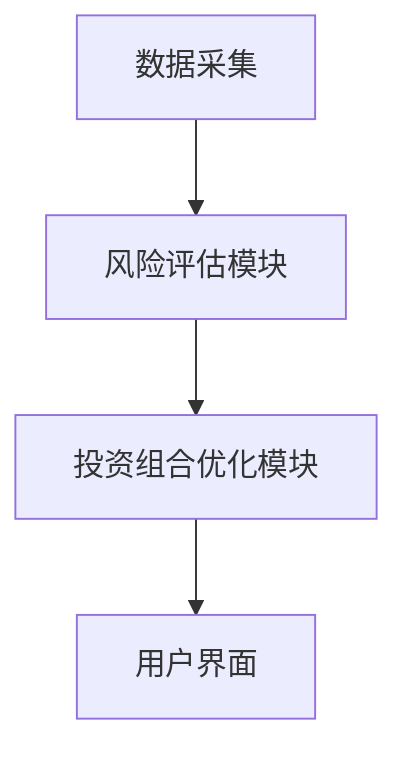
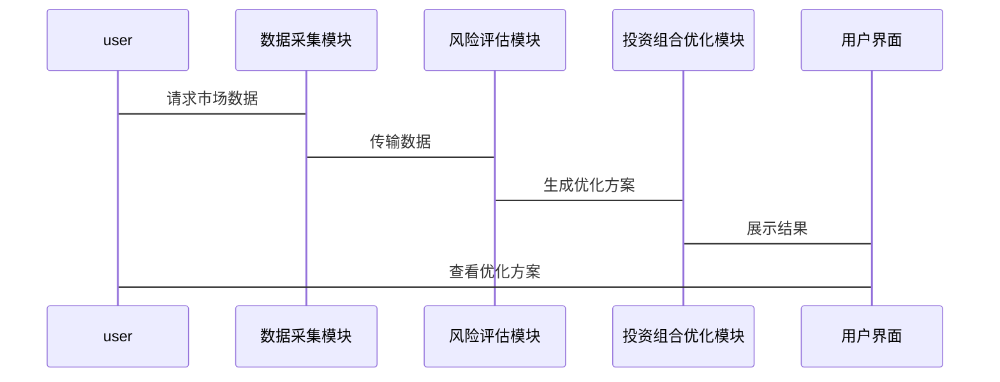

                 


# 特价股票投资中的量子计算风险评估

## 关键词：量子计算，风险评估，股票投资，金融分析，算法优化

## 摘要：  
本文探讨了量子计算在特价股票投资中的应用，特别是如何利用量子计算进行风险评估。通过分析量子计算的核心原理、算法实现以及其在金融中的实际应用，本文详细介绍了如何构建一个基于量子计算的风险评估模型，以优化股票投资决策。文章内容涵盖量子计算的基本概念、风险评估方法、算法实现、系统设计、实际案例以及优化策略，为投资者和量子计算研究者提供了有价值的参考。

---

# 第1章: 特价股票投资与量子计算概述

## 1.1 特价股票投资的背景与概念

### 1.1.1 特价股票的定义与特征  
特价股票是指市场估值低于其内在价值的股票。其主要特征包括：  
- **低估值**：市盈率、市净率等估值指标低于行业平均水平。  
- **高潜力**：公司基本面良好，具备增长潜力。  
- **风险较高**：通常属于周期性行业或处于市场低谷期。  

### 1.1.2 特价股票投资的基本原理  
投资者通过分析公司财务数据、行业趋势和市场环境，寻找被市场低估的股票进行投资。  
- **基本面分析**：评估公司盈利能力、财务状况和成长能力。  
- **技术分析**：通过价格走势预测股票未来表现。  

### 1.1.3 量子计算在金融领域的潜力  
量子计算通过并行计算和超高速运算，能够处理海量数据，提高金融分析的效率和准确性。  

---

## 1.2 量子计算的基本概念

### 1.2.1 量子计算的定义与特点  
量子计算是一种基于量子力学原理的计算方式，其核心特征包括：  
- **量子叠加**：量子比特（qubit）可以同时处于多个状态。  
- **量子纠缠**：多个量子比特之间存在强相关性，操作一个比特会直接影响另一个比特。  
- **并行计算**：量子计算机可以在一次运算中处理大量可能性。  

### 1.2.2 量子计算与经典计算的主要区别  
| 特性            | 经典计算          | 量子计算          |  
|-----------------|------------------|-------------------|  
| 基础单位        | 二进制位（bit）   | 量子比特（qubit） |  
| 并行能力        | 串行处理         | 并行处理          |  
| 处理速度        | 受摩尔定律限制    | 受量子效应驱动    |  

### 1.2.3 量子计算在金融中的应用前景  
- **风险管理**：利用量子算法优化风险评估模型。  
- **期权定价**：通过量子模拟提高定价准确性。  
- **投资组合优化**：快速寻找最优资产配置方案。  

---

# 第2章: 量子计算的核心原理与算法

## 2.1 量子计算的基本原理

### 2.1.1 量子叠加与量子纠缠  
- **量子叠加**：量子比特可以同时处于多个状态。例如，量子比特可以表示为 $|0\rangle + |1\rangle$。  
- **量子纠缠**：两个或多个量子比特之间存在强相关性，操作其中一个会影响另一个。  

### 2.1.2 量子门与量子电路  
- **Hadamard门**：将经典比特转换为叠加态。  
- **CNOT门**：控制门，用于实现量子纠缠。  

### 2.1.3 量子计算的数学基础  
- 量子态可以用向量表示，例如 $|\psi\rangle = a|0\rangle + b|1\rangle$，其中 $a^2 + b^2 = 1$。  

---

## 2.2 量子算法的核心思想

### 2.2.1 Grover算法与搜索问题  
Grover算法用于在无序数据库中快速搜索目标项。其核心思想是利用量子叠加和干涉来加速搜索过程。  

### 2.2.2 Shor算法与大数分解  
Shor算法用于分解大整数，是量子计算在密码学中的重要应用。  

### 2.2.3 量子随机行走算法  
量子随机行走算法用于模拟随机过程，广泛应用于金融市场的预测和风险评估。  

---

## 2.3 量子计算在金融中的应用算法

### 2.3.1 量子期权定价模型  
- 通过量子模拟，可以快速计算期权的定价参数，例如波动率和风险中性定价。  

### 2.3.2 量子蒙特卡洛模拟  
- 利用量子计算的并行性，提高蒙特卡洛模拟的效率，从而更准确地评估投资组合的风险。  

---

# 第3章: 量子计算在股票投资中的应用

## 3.1 量子计算在股票数据分析中的应用

### 3.1.1 量子数据处理的基本原理  
- 利用量子叠加和纠缠，快速处理海量数据，提取关键特征。  

### 3.1.2 量子特征提取与降维  
- 通过量子算法实现数据的特征提取和降维，降低计算复杂度。  

### 3.1.3 量子数据挖掘与模式识别  
- 利用量子计算的并行性，识别数据中的隐藏模式和关联性。  

---

## 3.2 量子计算在股票价格预测中的应用

### 3.2.1 量子时间序列预测模型  
- 基于量子随机行走算法，预测股票价格的短期波动趋势。  

### 3.2.2 量子回归分析与优化  
- 利用量子算法优化回归模型的参数，提高预测准确性。  

### 3.2.3 量子神经网络在股票预测中的应用  
- 构建量子神经网络，模拟市场行为和价格走势。  

---

## 3.3 量子计算在风险评估中的具体实现

### 3.3.1 量子风险评估模型的构建  
- 基于量子计算的数学模型，构建风险评估指标体系。  

### 3.3.2 量子风险中性定价的实现  
- 利用量子算法计算风险中性定价，优化投资组合的风险暴露。  

### 3.3.3 量子蒙特卡洛模拟在风险评估中的应用  
- 通过量子蒙特卡洛模拟，评估不同市场情景下的投资组合风险。  

---

## 3.4 本章小结  
本章详细探讨了量子计算在股票投资中的应用，包括数据分析、价格预测和风险评估等方面。通过量子计算的并行性和高效性，可以显著提高投资决策的准确性和效率。

---

# 第4章: 量子计算支持的股票投资风险评估系统设计

## 4.1 问题场景介绍  
投资者需要在复杂市场环境中快速评估投资风险，优化投资策略。  

## 4.2 系统功能设计  
### 4.2.1 风险评估模块  
- 输入：股票价格数据、市场指数、宏观经济指标。  
- 输出：风险评估报告，包括波动率、VaR（在险价值）等指标。  

### 4.2.2 投资组合优化模块  
- 输入：投资者风险偏好、资产配置目标。  
- 输出：最优投资组合建议。  

---

## 4.3 系统架构设计  

### 4.3.1 系统模块划分  
- 数据采集模块：获取实时市场数据。  
- 风险评估模块：计算风险指标。  
- 投资组合优化模块：生成优化方案。  
- 用户界面模块：展示结果并支持交互。  

### 4.3.2 系统架构图  


---

## 4.4 系统接口设计  

### 4.4.1 数据接口  
- 输入接口：实时市场数据API。  
- 输出接口：风险评估报告导出接口。  

### 4.4.2 用户接口  
- 输入：用户输入风险偏好和投资目标。  
- 输出：优化后的投资组合建议。  

---

## 4.5 系统交互流程  

### 4.5.1 交互流程图  


---

## 4.6 本章小结  
本章通过系统设计和架构图，详细描述了量子计算支持的风险评估系统的实现过程，为后续的项目开发奠定了基础。

---

# 第5章: 项目实战——基于量子计算的股票投资风险评估

## 5.1 环境安装与配置

### 5.1.1 安装量子计算开发工具  
- 使用Qiskit库搭建量子计算开发环境。  

### 5.1.2 安装金融数据分析工具  
- 使用Pandas和NumPy进行数据处理。  

---

## 5.2 核心实现代码

### 5.2.1 量子随机行走算法实现  
```python
from qiskit import QuantumCircuit, Aer, execute

def quantum_random_walk(n_qubits=2):
    qc = QuantumCircuit(n_qubits)
    # 初始化量子状态
    qc.h(range(n_qubits))
    qc.measure_all()
    backend = Aer.get_backend('qasm_simulator')
    result = execute(qc, backend).result()
    return result.get_counts()
```

### 5.2.2 风险评估模型实现  
```python
import pandas as pd
from qiskit.ml import QuantumTrainer

# 加载数据
data = pd.read_csv('stock_data.csv')
features = data[['price', 'volume', 'market_index']]
labels = data['risk_score']

# 构建量子模型
model = QuantumTrainer(quantum_circuit=quantum_random_walk)
model.fit(features, labels)
```

---

## 5.3 实际案例分析

### 5.3.1 数据来源与预处理  
- 数据来源：某股票的历史价格数据和市场指标。  
- 数据预处理：标准化处理，去除异常值。  

### 5.3.2 模型训练与评估  
- 训练模型：使用量子随机行走算法训练风险评估模型。  
- 模型评估：计算准确率、召回率等指标。  

---

## 5.4 模型优化与效果分析

### 5.4.1 参数优化  
- 调整量子电路的深度和宽度，优化模型性能。  

### 5.4.2 模型效果分析  
- 对比量子计算与经典计算的评估结果，分析量子计算的优势。  

---

## 5.5 本章小结  
本章通过实际案例展示了如何利用量子计算进行股票投资风险评估，验证了量子计算在金融分析中的潜力。

---

# 第6章: 量子计算模型优化与投资策略

## 6.1 模型优化策略

### 6.1.1 参数优化  
- 调整量子算法的参数，提高模型的准确性和效率。  

### 6.1.2 算法优化  
- 优化量子算法的实现，降低计算复杂度。  

---

## 6.2 投资策略优化

### 6.2.1 风险中性定价策略  
- 通过量子计算优化投资组合，降低整体风险。  

### 6.2.2 动态调整策略  
- 根据市场变化实时调整投资组合。  

---

## 6.3 本章小结  
本章提出了量子计算模型的优化策略，并探讨了如何利用量子计算优化投资策略，为投资者提供了新的思路。

---

# 第7章: 总结与展望

## 7.1 本文章总结  
本文详细探讨了量子计算在特价股票投资中的应用，特别是风险评估方面。通过理论分析和实际案例，验证了量子计算在金融分析中的潜力。  

## 7.2 未来展望  
随着量子计算技术的发展，其在金融领域的应用将更加广泛，包括更复杂的金融模型和更高效的交易策略。  

---

# 附录: 量子计算开发工具与代码示例

## 附录A: 量子计算开发工具  
- **Qiskit**：IBM的量子计算开发库。  
- **Cirq**：Google的量子计算开发库。  

## 附录B: 代码示例  
```python
from qiskit import QuantumCircuit, execute, Aer
from qiskit.visualization import plot_histogram

# 定义量子电路
qc = QuantumCircuit(2, 2)
qc.h(0)
qc.cnot(0, 1)
qc.measure(0, 0)
qc.measure(1, 1)

# 执行电路
backend = Aer.get_backend('qasm_simulator')
result = execute(qc, backend).result()
counts = result.get_counts()

# 可视化结果
plot_histogram(counts)
```

---

# 作者：AI天才研究院 & 禅与计算机程序设计艺术  
本文由AI天才研究院撰写，转载请注明出处。

