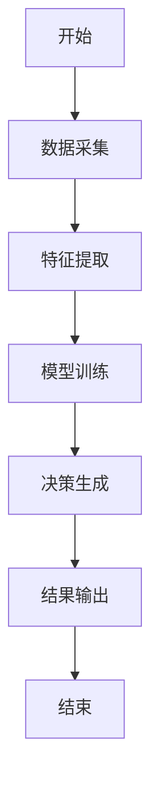

                 


# 特价股票投资中的集体智能与分布式决策方法

> **关键词：** 特价股票投资、集体智能、分布式决策、股票数据分析、分布式系统、投资策略

> **摘要：** 本文探讨了在特价股票投资中应用集体智能和分布式决策的方法。通过分析分布式计算技术、集体智能模型及其在股票数据分析中的应用，提出了基于贝叶斯网络和马尔可夫决策过程的分布式投资策略。同时，设计了系统架构并提供了实战案例，为投资者提供有效的决策支持。

---

## 第1章：特价股票投资的背景与挑战

### 1.1 特价股票投资的定义与特点

#### 1.1.1 特价股票的定义
特价股票通常指价格低于市场价的股票，具有较高的投资潜力。其特点包括高波动性、高风险和高回报。

#### 1.1.2 特价股票投资的特点
- **高波动性：** 价格波动剧烈，适合短期投资。
- **高风险：** 风险较高，需谨慎选择。
- **高回报：** 投资成功可带来丰厚收益。

#### 1.1.3 特价股票投资的市场现状
当前市场中，特价股票吸引了大量投资者，但也面临信息不对称和市场操纵等问题。

### 1.2 投资决策中的问题与挑战

#### 1.2.1 信息不对称的问题
投资者获取信息的不完全性影响决策，导致投资风险。

#### 1.2.2 市场波动性与不确定性
市场波动难以预测，影响投资策略的稳定性。

#### 1.2.3 投资者行为的复杂性
投资者情绪和行为受多种因素影响，增加了决策的难度。

### 1.3 集体智能与分布式决策的应用前景

#### 1.3.1 集体智能在投资中的优势
- **信息整合：** 多源信息整合提高决策准确性。
- **风险分散：** 分散投资降低风险。

#### 1.3.2 分布式决策的潜力
- **去中心化：** 避免单点故障，增强系统稳定性。
- **高效决策：** 利用分布式计算提升决策速度。

## 第2章：集体智能与分布式决策的基本理论

### 2.1 集体智能的定义与特点

#### 2.1.1 集体智能的定义
集体智能指个体通过协作产生的智能，强调去中心化和分布式决策。

#### 2.1.2 集体智能的特点
- **去中心化：** 无单一控制中心。
- **协作性：** 个体协作完成复杂任务。
- **自适应性：** 能够适应环境变化。

### 2.2 分布式决策的基本概念

#### 2.2.1 分布式决策的定义
分布式决策指多个决策主体在去中心化结构中协同决策。

#### 2.2.2 集中式与分布式决策的对比
| 对比维度 | 集中式决策 | 分布式决策 |
|----------|------------|------------|
| 控制方式 | 单一控制中心 | 多个决策主体 |
| 信息处理 | 集中处理 | 分散处理 |
| 效率 | 高 | 较低 |
| 稳定性 | 低 | 高 |

## 第3章：分布式计算技术

### 3.1 分布式系统架构

#### 3.1.1 对等网络架构
- **特点：** 所有节点地位相同，无中心服务器。
- **优势：** 高容错性，抗单点故障。

#### 3.1.2 层次化架构
- **特点：** 分为多个层次，如数据层、逻辑层、应用层。
- **优势：** 明确职责，便于扩展。

### 3.2 通信协议与数据同步

#### 3.2.1 通信协议
- **定义：** 定义了节点间数据交换的规则。
- **常见协议：** HTTP、WebSocket。

#### 3.2.2 数据同步机制
- **同步方法：** 周期性同步、事件驱动同步。
- **数据一致性：** 通过共识算法保证一致性。

## 第4章：集体智能在股票投资中的应用

### 4.1 数据采集与特征提取

#### 4.1.1 数据源
- **市场数据：** K线图、成交量。
- **新闻数据：** 公司公告、行业新闻。

#### 4.1.2 特征提取
- **技术指标：** MACD、RSI。
- **新闻情感分析：** 判断市场情绪。

### 4.2 分布式决策模型

#### 4.2.1 贝叶斯网络
- **定义：** 有向无环图，表示变量间概率关系。
- **应用：** 风险评估，预测股价波动。

#### 4.2.2 马尔可夫决策过程
- **定义：** 状态、动作、奖励的循环过程。
- **应用：** 短期投资策略制定。

### 4.3 分布式决策算法设计

#### 4.3.1 算法流程图


## 第5章：系统架构设计

### 5.1 功能模块划分

#### 5.1.1 数据采集模块
- **功能：** 收集市场数据和新闻。
- **接口：** 数据接口、API。

#### 5.1.2 数据分析模块
- **功能：** 数据清洗、特征提取。
- **接口：** 数据处理接口。

#### 5.1.3 决策模块
- **功能：** 分布式决策，生成投资策略。
- **接口：** 决策接口。

#### 5.1.4 反馈模块
- **功能：** 监控结果，优化模型。
- **接口：** 监控接口。

### 5.2 系统架构图


## 第6章：项目实战

### 6.1 环境安装

#### 6.1.1 安装Python
- **版本：** Python 3.8+

#### 6.1.2 安装库
- `numpy`、`pandas`、`scikit-learn`。

### 6.2 核心代码实现

#### 6.2.1 数据采集
```python
import pandas as pd
import numpy as np

def collect_data():
    # 示例代码，实际可调用API
    data = pd.DataFrame({'price': np.random.randn(100)})
    return data
```

#### 6.2.2 模型训练
```python
from sklearn.naive_bayes import GaussianNB

def train_model(data):
    X = data.drop('label', axis=1)
    y = data['label']
    model = GaussianNB()
    model.fit(X, y)
    return model
```

### 6.3 案例分析

#### 6.3.1 投资策略
- 使用贝叶斯模型预测股票走势，制定买入和卖出策略。

## 第7章：总结与展望

### 7.1 全书总结

#### 7.1.1 核心内容回顾
- 集体智能与分布式决策在股票投资中的应用。
- 系统架构设计与实现。

### 7.2 当前研究的不足与未来方向

#### 7.2.1 当前不足
- 数据隐私问题。
- 算法可解释性不足。

#### 7.2.2 未来方向
- 更先进的算法研究。
- 更多实际应用场景的探索。

### 7.3 最佳实践 tips

#### 7.3.1 投资者建议
- 结合集体智能和传统方法，制定多元化投资策略。

#### 7.3.2 开发者建议
- 注重数据隐私和系统安全性，确保算法的可扩展性。

---

**作者：AI天才研究院 & 禅与计算机程序设计艺术**

---

这篇文章系统地介绍了特价股票投资中的集体智能与分布式决策方法，从理论到实践，提供了详细的分析和代码示例，帮助读者理解并应用这些方法进行投资决策。

