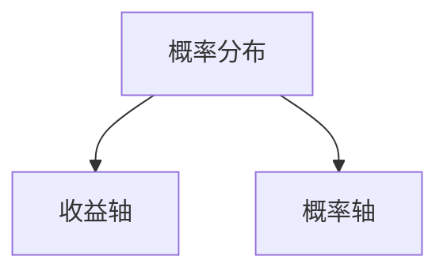
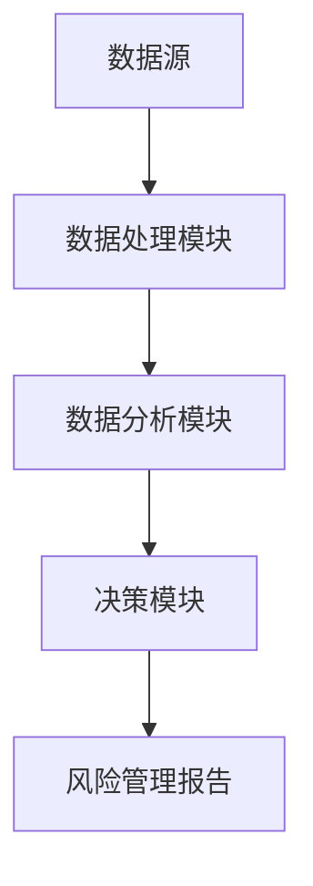
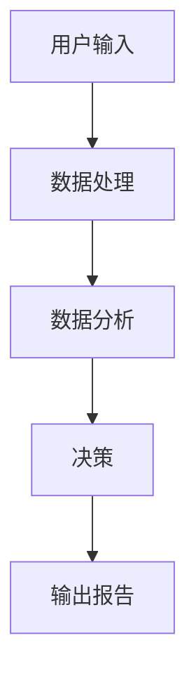

                 


# 特价股票投资中的风险管理

> 关键词：风险管理、特价股票、投资策略、概率分析、收益与风险、系统架构、项目实战

> 摘要：本文深入探讨了特价股票投资中的风险管理问题，从背景介绍、核心概念、数学模型、系统架构到项目实战，系统性地分析了如何在特价股票投资中进行有效的风险管理。文章结合理论与实践，通过详细的数学公式和系统设计，为投资者提供了风险管理的理论依据和实践指导。

---

# 第一部分: 背景介绍

## 第1章: 特价股票投资的基本概念

### 1.1 特价股票的定义与特点

#### 1.1.1 特价股票的定义
特价股票是指以低于市场价或内在价值的价格购买的股票。这种股票通常被认为具有较高的投资价值，因为其价格被市场低估，存在较大的上涨空间。

#### 1.1.2 特价股票的特点
- **低估性**：市场价格低于内在价值。
- **低流动性**：部分特价股票可能流动性较差。
- **高波动性**：价格波动较大，可能受市场情绪影响。
- **潜在收益**：存在较大的增值空间。

#### 1.1.3 特价股票的投资价值
- 投资者可以通过低价买入高价卖出的方式获利。
- 特价股票通常被视为价值投资的标的。

### 1.2 风险管理的重要性

#### 1.2.1 风险管理的概念
风险管理是指识别、评估和应对投资过程中可能遇到的各种风险，以降低损失、实现投资目标的过程。

#### 1.2.2 风险管理在投资中的作用
- **保护资本**：避免因市场波动导致的本金损失。
- **提高收益**：通过合理管理风险，实现收益的最大化。
- **降低不确定性**：通过风险管理，减少投资过程中的不确定性。

#### 1.2.3 特价股票投资中的风险管理策略
- **止损策略**：设定止损点，避免亏损过大。
- **分散投资**：通过投资多种股票降低风险。
- **长期持有**：耐心持有，等待股价回升。

## 第2章: 风险与收益的平衡

### 2.1 风险与收益的关系

#### 2.1.1 风险的定义与分类
- **市场风险**：市场整体波动带来的风险。
- **个股风险**：特定股票的波动带来的风险。
- **流动性风险**：股票变现困难带来的风险。

#### 2.1.2 收益的定义与分类
- **资本收益**：股价上涨带来的收益。
- **股息收益**：分红带来的收益。

#### 2.1.3 风险与收益的权衡
- 高风险通常伴随着高收益。
- 风险管理的核心在于在风险可控的前提下追求收益最大化。

### 2.2 投资组合的风险管理

#### 2.2.1 投资组合的概念
投资组合是指投资者持有的多种股票的组合，通过分散投资降低风险。

#### 2.2.2 投资组合的风险分散
- **相关性分析**：选择相关性较低的股票，降低整体风险。
- **权重分配**：根据股票的风险和收益特性分配权重。

#### 2.2.3 投资组合的收益与风险平衡
- **夏普比率**：衡量投资组合的风险调整后收益。
- **最大回撤**：衡量投资组合的最大亏损幅度。

## 第3章: 特价股票投资中的风险管理策略

### 3.1 特价股票投资的基本策略

#### 3.1.1 价值投资策略
- **基本面分析**：分析公司的财务状况、行业地位等，寻找被低估的股票。
- **安全边际**：买入价格低于内在价值，留有安全边际。

#### 3.1.2 技术分析策略
- **K线图分析**：通过技术指标（如KDJ、MACD）判断股票的买卖点。
- **趋势分析**：寻找股价处于上升趋势的股票。

#### 3.1.3 股票筛选策略
- **筛选指标**：如市盈率（P/E）、市净率（P/B）、股息率等，筛选出低估的股票。

### 3.2 风险管理的核心要素

#### 3.2.1 风险评估
- **风险识别**：识别可能影响股票价格的风险因素。
- **风险量化**：通过概率和收益分析，量化风险的影响。

#### 3.2.2 风险控制
- **止损策略**：设定止损点，控制亏损幅度。
- **仓位管理**：根据账户资金和风险承受能力，合理分配仓位。

#### 3.2.3 风险应对
- **风险对冲**：通过期货、期权等工具对冲市场风险。
- **风险转移**：通过保险等方式转移风险。

### 3.3 特价股票投资中的风险管理框架

#### 3.3.1 风险管理的步骤
1. **风险识别**：识别影响特价股票的各类风险因素。
2. **风险评估**：量化风险的影响程度和概率。
3. **风险应对**：制定应对策略，如止损、对冲等。
4. **风险监控**：实时监控风险变化，及时调整策略。

#### 3.3.2 风险管理的工具
- **止损订单**：自动触发的止损指令。
- **技术指标**：如RSI、布林带等，辅助判断风险。

---

# 第二部分: 风险管理的核心概念

## 第4章: 风险与收益的数学模型

### 4.1 风险的量化

#### 4.1.1 概率分布
股票价格的波动可以用概率分布来描述，如正态分布、t分布等。

#### 4.1.2 方差与标准差
- **方差**：衡量股票价格波动的程度。
- **标准差**：方差的平方根，表示价格波动的大小。

#### 4.1.3 风险的数学表达
$$\text{风险} = \text{标准差} = \sqrt{\text{方差}}$$

### 4.2 收益的期望值与风险

#### 4.2.1 期望值的计算
$$E(R) = \sum p_i R_i$$
其中，\( p_i \) 是收益 \( R_i \) 的概率。

#### 4.2.2 方差的计算
$$\text{方差} = \sum p_i (R_i - E(R))^2$$

#### 4.2.3 风险与收益的权衡
$$\text{夏普比率} = \frac{E(R) - R_f}{\sigma}$$
其中，\( R_f \) 是无风险利率，\( \sigma \) 是投资组合的波动率。

### 4.3 概率分析

#### 4.3.1 概率分布图
使用Mermaid绘制概率分布图：


#### 4.3.2 概率与收益的关系
$$P(\text{收益} > R) = \sum_{R_i > R} p_i$$

---

# 第三部分: 系统分析与架构设计

## 第5章: 风险管理系统的架构

### 5.1 系统功能设计

#### 5.1.1 数据收集模块
- 数据来源：股票价格、财务数据、市场新闻等。
- 数据处理：清洗、转换、存储。

#### 5.1.2 数据分析模块
- 风险评估：计算VaR（Value at Risk）。
- 模型选择：选择合适的概率模型（如正态分布、t分布）。

#### 5.1.3 决策模块
- 制定风险管理策略：如止损、对冲。
- 输出结果：生成风险管理报告。

### 5.2 系统架构设计

#### 5.2.1 系统架构图


#### 5.2.2 数据流图


---

# 第四部分: 项目实战

## 第6章: 特价股票风险管理的实战应用

### 6.1 环境安装

#### 6.1.1 安装Python
使用Anaconda安装Python环境：
```bash
conda create -n risk_management python=3.8
```

### 6.2 核心代码实现

#### 6.2.1 风险管理模块
```python
import numpy as np
import pandas as pd

def calculate VaR(returns, confidence_level=95):
    returns_sorted = np.sort(returns)
    var_index = int(len(returns_sorted) * (1 - confidence_level / 100))
    var = returns_sorted[var_index]
    return var

# 示例数据
returns = np.random.normal(0, 1, 1000)
var = calculate VaR(returns, 95)
print(f"95% VaR: {var}")
```

#### 6.2.2 技术分析模块
```python
import talib as ta

# 示例数据
close_prices = [100, 102, 101, 103, 104, 105, 103, 102, 101, 100]

# 计算RSI
rsi = ta.RSI(close_prices, timeperiod=14)
print(rsi)
```

### 6.3 实际案例分析

#### 6.3.1 案例背景
假设某投资者持有某只特价股票，股价波动较大，希望通过风险管理工具控制风险。

#### 6.3.2 案例分析
- 计算VaR，设定95%的置信水平。
- 使用RSI指标判断超买超卖信号。

### 6.4 项目小结
通过Python代码实现风险管理模块，能够有效量化风险并制定应对策略。

---

# 第五部分: 总结与展望

## 第7章: 总结与最佳实践

### 7.1 总结
本文系统地分析了特价股票投资中的风险管理问题，从理论到实践，详细介绍了风险管理的核心概念、数学模型和系统架构。通过项目实战，展示了如何将理论应用于实际投资中。

### 7.2 最佳实践 tips
- **分散投资**：避免将所有资金投入一只股票。
- **长期持有**：耐心持有低估股票，等待价值回归。
- **定期评估**：定期评估投资组合的风险和收益，及时调整策略。

### 7.3 注意事项
- 风险管理需要结合市场环境和个人风险承受能力。
- 选择合适的工具和方法，避免过度复杂化。

### 7.4 拓展阅读
- 《投资学》：深入理解投资组合管理。
- 《风险管理与VaR模型》：学习VaR等风险管理工具。

---

# 作者

作者：AI天才研究院/AI Genius Institute & 禅与计算机程序设计艺术 /Zen And The Art of Computer Programming

---

这篇文章通过系统性的分析和实战案例，为投资者提供了在特价股票投资中进行风险管理的理论和实践指导。希望读者能够通过本文，更好地理解风险管理的重要性，并在实际投资中应用相关策略。

