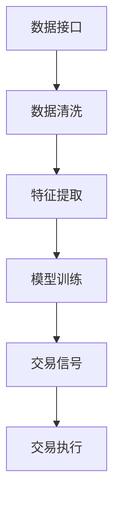

                 


# 特价股票投资中的高频数据分析

> 关键词：高频数据分析，股票投资，特价股票，机器学习，时间序列分析

> 摘要：本文详细探讨了特价股票投资中高频数据分析的应用，从数据采集、处理、分析到策略制定的全过程进行了深入分析。通过结合时间序列分析和机器学习算法，本文提出了一个高效的高频数据分析框架，并通过实际案例展示了如何利用这些技术来优化投资决策。

---

## 第一部分: 特价股票投资中的高频数据分析基础

### 第1章: 高频数据分析的基本概念

#### 1.1 高频数据分析的定义与特点
高频数据分析是指在极短时间内对大量金融数据进行处理和分析，以发现潜在的交易机会。其特点包括高实时性、数据量大、算法复杂性和对硬件要求高等。

#### 1.2 特价股票投资的定义与特点
特价股票是指价格低于市场价的股票，通常具有较高的投资潜力。其特点是价格波动大、交易机会短暂、风险较高。

#### 1.3 高频数据分析在特价股票投资中的作用
高频数据分析能够快速捕捉市场中的价格波动，帮助投资者在短时间内做出决策，从而抓住特价股票的投资机会。

---

### 第2章: 高频数据分析的核心技术

#### 2.1 数据采集与处理
- 数据源：包括股票市场数据、新闻数据等。
- 数据清洗：去除噪声数据，确保数据质量。
- 数据预处理：对数据进行标准化、归一化处理，以便后续分析。

#### 2.2 数据分析与建模
- 时间序列分析：用于预测股票价格走势。
- 机器学习：使用回归、分类等算法对数据进行深度分析。

#### 2.3 投资策略制定
- 策略选择：基于数据分析结果，选择合适的投资策略。
- 策略优化：通过回测和调整参数，优化投资策略。

---

## 第二部分: 高频数据分析的算法原理与实现

### 第3章: 时间序列分析

#### 3.1 移动平均模型
- 算法原理：通过计算过去若干期的平均值，预测未来的价格走势。
- 代码实现：
  ```python
  def moving_average(data, window_size):
      return data.rolling(window_size).mean()
  ```
- 示例：使用过去10天的平均价格预测第11天的价格。

#### 3.2 自回归模型（ARIMA）
- 算法原理：基于时间序列的自相关性进行预测。
- 代码实现：
  ```python
  from statsmodels.tsa.arima_model import ARIMA
  model = ARIMA(data, order=(5,1,0))
  model_fit = model.fit()
  ```

### 第4章: 机器学习在高频数据分析中的应用

#### 4.1 支持向量机（SVM）
- 算法原理：通过非线性分类器对股票价格走势进行分类。
- 代码实现：
  ```python
  from sklearn.svm import SVC
  model = SVC()
  model.fit(X_train, y_train)
  ```

#### 4.2 随机森林（Random Forest）
- 算法原理：通过集成学习提高模型的准确性和鲁棒性。
- 代码实现：
  ```python
  from sklearn.ensemble import RandomForestClassifier
  model = RandomForestClassifier()
  model.fit(X_train, y_train)
  ```

---

## 第三部分: 高频数据分析的系统架构设计

### 第5章: 系统架构设计

#### 5.1 系统功能模块
- 数据接口模块：负责数据的采集和传输。
- 数据分析模块：包括数据清洗、特征提取、模型训练等功能。
- 交易执行模块：根据分析结果执行交易指令。

#### 5.2 系统架构图


#### 5.3 接口设计与交互流程
- 数据接口：提供实时数据流。
- 交易执行：根据模型输出执行买卖指令。

---

## 第四部分: 项目实战与案例分析

### 第6章: 项目实战

#### 6.1 环境安装
- 安装必要的Python库：numpy、pandas、scikit-learn、statsmodels。

#### 6.2 核心代码实现
- 数据清洗：
  ```python
  import pandas as pd
  data = pd.read_csv('stock_data.csv')
  data = data.dropna()
  ```
- 模型训练：
  ```python
  from sklearn.linear_model import LinearRegression
  model = LinearRegression()
  model.fit(X_train, y_train)
  ```

#### 6.3 实际案例分析
- 数据来源：某股票的历史价格数据。
- 模型选择：使用线性回归预测未来价格。
- 结果分析：模型预测的价格与实际价格的误差分析。

---

## 第五部分: 总结与展望

### 第7章: 总结与展望

#### 7.1 总结
本文详细探讨了高频数据分析在特价股票投资中的应用，从数据处理到模型训练，再到系统设计，提出了一个完整的解决方案。

#### 7.2 展望
未来，随着人工智能技术的发展，高频数据分析在股票投资中的应用将更加广泛。同时，如何提高模型的准确性和稳定性，是需要进一步研究的方向。

---

作者：AI天才研究院/AI Genius Institute & 禅与计算机程序设计艺术 /Zen And The Art of Computer Programming

