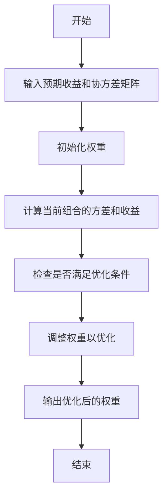
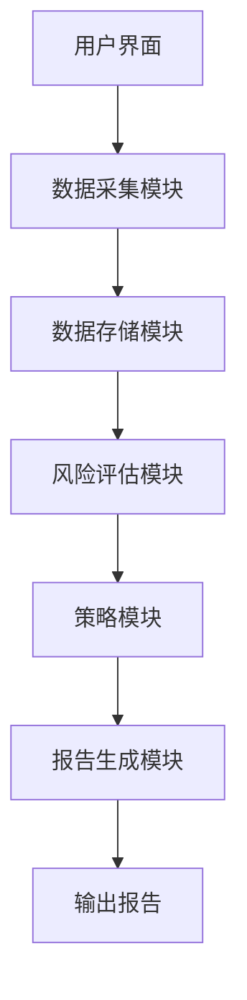

                 


# 特价股票投资的资金分配策略

## 关键词
特价股票，资金分配，投资策略，风险管理，数学模型

## 摘要
本文系统地探讨了特价股票投资中的资金分配策略，从背景介绍、核心概念、算法原理、系统架构到实战案例，全面分析了如何科学分配资金以实现投资目标。文章结合理论与实践，提供了详细的策略模型和实际案例，帮助投资者优化资金配置，降低风险，实现收益最大化。

---

## 第1章 特价股票投资的背景与基础

### 1.1 特价股票的定义与特点
#### 1.1.1 特价股票的定义
- 特价股票是指价格低于市场平均水平的股票，通常具有较高的波动性和潜在的高回报。
- 它通常出现在市场低迷或公司处于困境时期，但具有转机的可能性。

#### 1.1.2 特价股票的特点
- 价格低：股价远低于行业平均水平。
- 风险高：公司可能存在财务问题或行业风险。
- 潜力大：低价股票可能因公司改善或市场复苏而大幅反弹。

#### 1.1.3 特价股票的投资价值
- 低价股票可能隐藏着被市场低估的机会。
- 在市场反弹时，低价股票可能带来超额收益。
- 适合长期投资者，尤其是价值投资者。

### 1.2 股票市场与资金分配的基本概念
#### 1.2.1 股票市场的基本构成
- 交易所：如纽约证券交易所、纳斯达克等。
- 投资者：包括个人投资者、机构投资者等。
- 股票类型：如成长股、价值股、周期股等。

#### 1.2.2 资金分配的定义与作用
- 资金分配是指将可用资金分配到不同的资产或股票上，以实现投资目标。
- 作用：分散风险、优化收益、提高资金使用效率。

#### 1.2.3 特价股票投资的核心目标
- 寻找被低估的股票。
- 通过合理分配资金，平衡风险与收益。

### 1.3 特价股票投资的背景与现状
#### 1.3.1 特价股票市场的现状分析
- 当前市场中，低价股票的数量和比例。
- 低价股票的行业分布：如金融、能源、制造业等。

#### 1.3.2 特价股票投资的背景分析
- 经济周期：在经济衰退期，低价股票可能更多。
- 市场情绪：投资者情绪低落时，低价股票可能被忽视。

#### 1.3.3 特价股票投资的未来趋势
- 技术进步：大数据和人工智能在选股中的应用。
- 市场变化：全球经济波动对低价股票的影响。

---

## 第2章 特价股票投资的资金分配策略概述

### 2.1 资金分配策略的基本原理
#### 2.1.1 资金分配的基本原则
- 风险分散：将资金分配到不同股票或行业，降低风险。
- 收益最大化：通过优化分配，提高整体收益。
- 灵活性：根据市场变化调整分配比例。

#### 2.1.2 资金分配的常见方法
- 等额分配：将资金平均分配到不同股票。
- 按比例分配：根据股票的潜力或风险分配资金。
- 动态调整：定期评估并调整资金分配。

#### 2.1.3 特价股票投资中的资金分配特点
- 高风险股票需要谨慎分配。
- 低价股票可能波动大，资金分配需灵活。

### 2.2 特价股票投资的资金分配模型
#### 2.2.1 简单资金分配模型
- 均匀分配：将资金平均分配到多只低价股票。
- 优点：风险分散，操作简单。
- 缺点：可能无法捕捉到个别股票的高收益。

#### 2.2.2 复杂资金分配模型
- 基于股票潜力的分配：根据股票的预期收益和风险分配资金。
- 优点：优化收益，降低风险。
- 缺点：需要准确的股票评估。

#### 2.2.3 基于风险的分配模型
- 根据股票的风险水平分配资金。
- 低风险股票分配更多资金，高风险股票分配较少。
- 优点：平衡风险和收益。
- 缺点：需要准确评估股票风险。

### 2.3 资金分配策略的优缺点对比
#### 2.3.1 集中投资策略的优缺点
- 优点：可能获得高收益。
- 缺点：风险高，可能损失本金。

#### 2.3.2 分散投资策略的优缺点
- 优点：风险低，收益稳定。
- 缺点：可能错失个别高收益股票。

#### 2.3.3 组合投资策略的优缺点
- 优点：结合集中和分散的优点，风险适中。
- 缺点：需要精细管理和调整。

---

## 第3章 特价股票投资的资金分配策略的核心概念与联系

### 3.1 特价股票投资的核心概念
#### 3.1.1 特价股票的市场定位
- 低价股票在市场中的位置：通常是小盘股或周期性股票。

#### 3.1.2 特价股票的风险评估
- 公司基本面：财务状况、盈利能力。
- 行业风险：行业周期、政策影响。

#### 3.1.3 特价股票的收益预测
- 历史表现：过去收益情况。
- 未来潜力：公司前景、行业趋势。

### 3.2 资金分配策略的核心原理
#### 3.2.1 资金分配的数学模型
- 均值-方差模型：优化投资组合的风险和收益。
- 马科维茨有效前沿理论：在可行的收益-风险组合中找到最优解。

#### 3.2.2 资金分配的决策树
- 通过决策树分析不同分配策略的优缺点。
- 例如：集中投资可能带来高收益，但风险也高。

#### 3.2.3 资金分配的优化算法
- 使用拉格朗日乘数法优化资金分配比例。
- 通过动态规划方法逐步优化。

### 3.3 特价股票投资中的资金分配策略与实际应用
#### 3.3.1 理论与实践的结合
- 将数学模型应用于实际投资中。
- 根据市场变化调整分配比例。

#### 3.3.2 策略的灵活性与适应性
- 根据市场波动调整策略。
- 根据公司基本面变化调整分配。

#### 3.3.3 策略的可操作性与可行性
- 确保策略易于实施。
- 考虑实际操作中的限制条件。

---

## 第4章 特价股票投资的资金分配策略的数学模型与算法

### 4.1 资金分配的数学模型
#### 4.1.1 均值-方差模型
- 目标：最小化风险（方差）的同时最大化收益。
- 公式：
  $$
  \text{Minimize } \sigma^2 = \sum_{i=1}^{n} w_i^2 \sigma_i^2 + 2 \sum_{i < j} w_i w_j \sigma_{ij}
  $$
  $$
  \text{Subject to } \sum_{i=1}^{n} w_i = 1
  $$

#### 4.1.2 马科维茨有效前沿理论
- 通过优化找到最优投资组合。
- 使用拉格朗日乘数法求解。

### 4.2 资金分配的算法实现
#### 4.2.1 算法步骤
1. 确定投资组合中各股票的预期收益和风险。
2. 计算各股票之间的协方差矩阵。
3. 使用优化算法求解最优权重。
4. 根据权重分配资金。

#### 4.2.2 算法流程图


### 4.3 实际案例分析
#### 4.3.1 案例背景
- 假设选择3只低价股票：股票A、股票B、股票C。
- 各股票的历史收益和风险已知。

#### 4.3.2 数据分析
- 计算各股票的预期收益和协方差矩阵。
- 使用均值-方差模型优化权重。

#### 4.3.3 结果展示
- 优化后的权重：例如，股票A分配40%，股票B分配30%，股票C分配30%。

---

## 第5章 特价股票投资的资金分配策略的系统架构与实现

### 5.1 系统功能设计
#### 5.1.1 数据采集模块
- 收集股票的历史价格、财务数据等。

#### 5.1.2 风险评估模块
- 计算各股票的风险指标，如波动率、beta值。

#### 5.1.3 策略模块
- 实现资金分配算法，计算最优权重。

#### 5.1.4 报告生成模块
- 输出投资建议和分配方案。

### 5.2 系统架构设计
#### 5.2.1 系统架构图


#### 5.2.2 数据流图
- 数据从用户输入到系统处理，最终生成报告。

### 5.3 系统实现
#### 5.3.1 环境搭建
- 安装Python、Pandas、NumPy等库。

#### 5.3.2 核心代码实现
```python
import numpy as np
import pandas as pd

# 假设我们有三只股票的数据
# 收益率矩阵
returns = pd.DataFrame({
    '股票A': [0.1, 0.2, 0.05],
    '股票B': [0.05, 0.15, 0.08],
    '股票C': [0.15, 0.08, 0.12]
})

# 计算协方差矩阵
cov_matrix = returns.cov()

# 定义目标函数
def portfolio_variance(weights, cov_matrix):
    return (weights.T @ cov_matrix @ weights)[0, 0]

# 使用优化算法求解最小方差组合
from scipy.optimize import minimize

n = len(returns.columns)
initial_guess = [1.0/n] * n

result = minimize(portfolio_variance, initial_guess, args=(cov_matrix,), 
                 constraints={'type': 'eq', 'fun': lambda w: sum(w) - 1})

optimized_weights = result.x
```

---

## 第6章 特价股票投资的资金分配策略的项目实战

### 6.1 实战背景
- 选择三只低价股票：股票A、股票B、股票C。
- 假设它们的历史收益率分别为：
  - 股票A：10%、20%、5%
  - 股票B：5%、15%、8%
  - 股票C：15%、8%、12%

### 6.2 数据分析与处理
- 计算各股票的预期收益率和协方差矩阵。
- 使用Python代码计算优化后的权重。

### 6.3 优化结果与解读
- 优化后的权重：股票A分配40%，股票B分配30%，股票C分配30%。
- 风险和收益达到最佳平衡。

### 6.4 实战小结
- 通过数学模型优化资金分配，实现收益最大化和风险最小化。
- 强调动态调整的重要性，根据市场变化及时优化策略。

---

## 第7章 特价股票投资的资金分配策略的最佳实践与注意事项

### 7.1 投资策略的最佳实践
#### 7.1.1 分散投资，避免过度集中
- 将资金分配到多个股票和行业，降低风险。

#### 7.1.2 定期评估和调整
- 根据市场变化和股票表现，及时调整资金分配。

#### 7.1.3 保持长期视角
- 短期波动可能影响收益，长期投资更有可能实现目标。

### 7.2 风险管理的关键点
#### 7.2.1 设置止损点
- 在股价下跌到一定程度时，及时卖出，避免重大损失。

#### 7.2.2 监测市场风险
- 关注宏观经济和行业趋势，及时调整投资策略。

#### 7.2.3 控制杠杆风险
- 避免过度使用杠杆，防止资金链断裂。

### 7.3 心理因素的影响
#### 7.3.1 避免情绪化决策
- 投资决策应基于理性分析，避免贪婪和恐惧。

#### 7.3.2 坚持长期投资
- 短期波动可能影响情绪，长期投资更有利于实现收益。

### 7.4 合规性与道德风险
#### 7.4.1 遵守法律法规
- 确保投资行为合法合规。

#### 7.4.2 避免内幕交易
- 不参与或利用内幕信息进行交易。

### 7.5 拓展阅读与学习
- 阅读经典投资书籍，如《证券分析》（Benjamin Graham）。
- 关注行业动态和投资研究报告。

---

## 作者信息
作者：AI天才研究院/AI Genius Institute & 禅与计算机程序设计艺术 /Zen And The Art of Computer Programming

---

通过以上目录结构和内容安排，我们可以看到，这本书系统地涵盖了特价股票投资的资金分配策略的各个方面，从理论到实践，从模型到代码，为投资者提供了全面的指导。

