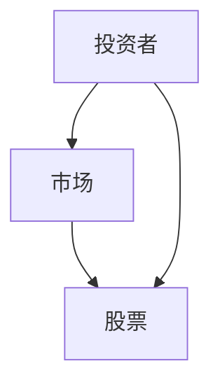
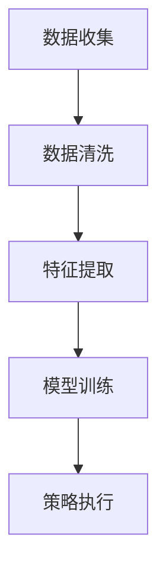
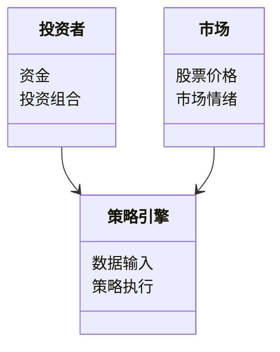
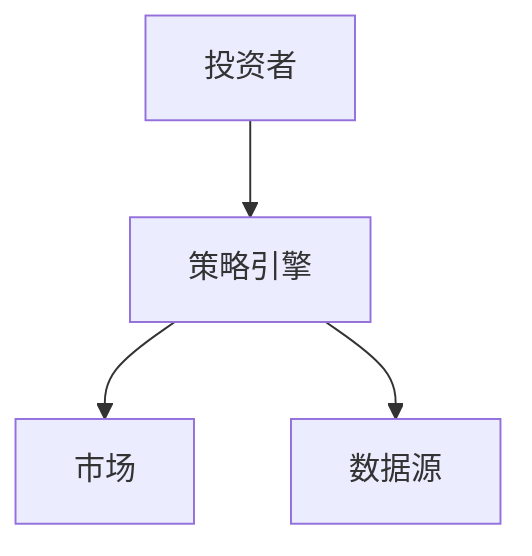
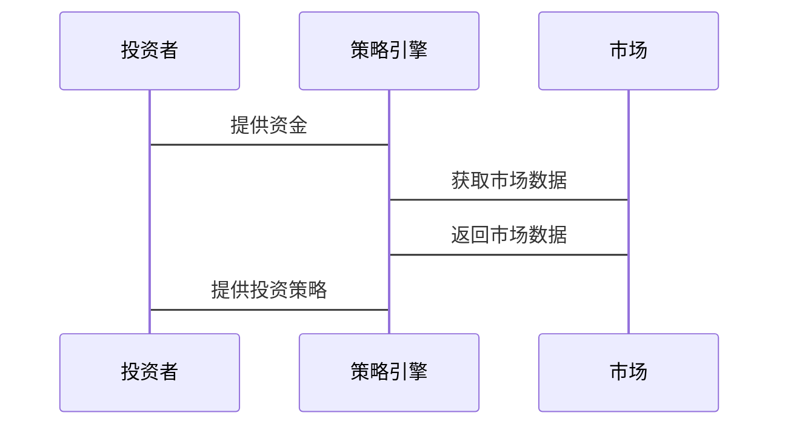

                 


# 特价股票投资策略在前沿市场的适用性探讨

> 关键词：特价股票、投资策略、前沿市场、算法、数学模型、系统架构

> 摘要：本文探讨了特价股票投资策略在前沿市场的适用性，从背景、核心概念、算法原理、数学模型、系统架构到项目实战，全面分析了特价股票投资策略在前沿市场中的应用。通过理论分析与实践案例结合，本文提出了在前沿市场中应用特价股票投资策略的可行性与优化方向。

---

# 第一章: 特价股票投资策略的背景与概述

## 1.1 特价股票投资策略的定义

### 1.1.1 特价股票的定义与特点
特价股票是指价格显著低于市场平均价格或历史价格水平的股票。其特点包括：
1. **低估值**：通常市盈率、市净率等估值指标低于市场平均水平。
2. **高波动性**：价格波动较大，存在快速反弹或下跌的可能。
3. **风险较高**：由于价格低廉，可能存在较高的市场风险。

### 1.1.2 投资策略的分类与特点
投资策略主要分为：
1. **价值投资**：寻找被市场低估的股票，长期持有。
2. **趋势投资**：基于价格趋势进行买卖决策。
3. **套利投资**：利用价格差异进行无风险或低风险投资。

### 1.1.3 特价股票投资策略的核心要素
- **价格敏感性**：价格波动对投资者决策的影响。
- **市场环境**：经济周期、政策环境对策略的影响。
- **风险控制**：如何在高波动性市场中控制风险。

## 1.2 前沿市场的特点与投资环境

### 1.2.1 前沿市场的定义与范围
前沿市场通常指新兴经济体或未被充分开发的市场，具有以下特点：
1. **市场流动性低**：交易量小，市场深度不足。
2. **信息不对称**：投资者获取信息的能力有限。
3. **政策不确定性**：法律法规不完善，政策变化频繁。

### 1.2.2 前沿市场的投资环境分析
1. **市场波动性高**：价格波动剧烈，投资风险较高。
2. **市场参与者少**：投资者数量有限，市场流动性不足。
3. **信息透明度低**：缺乏可靠的市场数据和分析。

### 1.2.3 特价股票在前沿市场的独特性
1. **低价股票集中**：前沿市场中低价股票较多，适合价值投资。
2. **市场机会多**：新兴市场中存在大量未被发现的投资机会。
3. **政策风险高**：政策变化对市场影响较大。

## 1.3 特价股票投资策略与前沿市场的结合

### 1.3.1 理论基础与应用背景
- **理论基础**：价值投资理论、市场有效性假说。
- **应用背景**：新兴市场中，许多股票价格被低估，适合特价股票投资。

### 1.3.2 特价股票投资策略在前沿市场的可行性
- **市场特性匹配**：前沿市场中低价股票较多，适合特价股票投资。
- **政策环境影响**：政策变化可能带来投资机会。

### 1.3.3 前沿市场中的投资机会与风险
- **投资机会**：新兴市场中存在大量低价股票，适合长期持有。
- **投资风险**：市场波动性高，政策风险大。

---

# 第二章: 特价股票投资策略的核心概念与联系

## 2.1 核心概念原理

### 2.1.1 技术分析与基本面分析的结合
- **技术分析**：通过价格走势预测未来股价。
- **基本面分析**：通过公司财务状况评估股票价值。
- **结合应用**：利用技术分析捕捉价格波动，基本面分析评估股票价值。

### 2.1.2 市场情绪与价格波动的关系
- **市场情绪**：投资者情绪影响市场波动。
- **价格波动**：市场情绪波动导致股票价格波动。

### 2.1.3 前沿市场中的信息不对称问题
- **信息不对称**：投资者获取信息的能力有限。
- **信息影响**：信息不对称可能导致股票价格偏离其真实价值。

## 2.2 核心概念属性对比表格

| **投资策略** | **核心概念**       | **特点**                                                                 |
|--------------|--------------------|--------------------------------------------------------------------------|
| 价值投资     | 低估值股票         | 长期持有，关注公司基本面，适合低价股票                                   |
| 技术投资     | 价格波动分析       | 短期操作，基于价格走势进行买卖决策                                       |
| 套利投资     | 价格差异           | 利用市场价差进行无风险或低风险投资                                         |

## 2.3 实体关系图



---

# 第三章: 特价股票投资策略的算法原理

## 3.1 算法原理概述

### 3.1.1 算法核心思想
- **核心思想**：基于价格波动和公司基本面，筛选出具有投资价值的低价股票。

### 3.1.2 算法流程
1. **数据收集**：收集目标市场的股票价格、财务数据。
2. **数据清洗**：去除异常数据，填补缺失值。
3. **特征提取**：提取股票价格、市盈率、市净率等特征。
4. **模型训练**：基于机器学习算法，训练股票分类模型。
5. **策略执行**：根据模型预测结果，执行买卖决策。

### 3.1.3 算法流程图



## 3.2 算法实现

### 3.2.1 Python代码实现

```python
import pandas as pd
import numpy as np
from sklearn.ensemble import RandomForestClassifier

# 数据收集与清洗
data = pd.read_csv('stock_data.csv')
data = data.dropna()

# 特征提取
features = ['收盘价', '市盈率', '市净率']
target = '是否低价股'

# 模型训练
model = RandomForestClassifier()
model.fit(data[features], data[target])

# 策略执行
def execute_strategy(price, prediction):
    if prediction == '买入':
        return '买入'
    elif prediction == '卖出':
        return '卖出'
    else:
        return '持有'
```

### 3.2.2 数学模型与公式

#### 3.2.2.1 特价股票筛选公式
$$ \text{筛选条件} = (市盈率 < 市场平均市盈率) \land (市净率 < 市场平均市净率) $$

#### 3.2.2.2 价格波动预测公式
$$ \text{波动预测} = \alpha \times \text{历史波动率} + \beta \times \text{市场情绪指数} $$

---

# 第四章: 特价股票投资策略的数学模型

## 4.1 数学模型概述

### 4.1.1 CAPM模型
- **资本资产定价模型（CAPM）**用于评估股票的预期收益。
$$ E(r_i) = r_f + \beta_i (E(r_m) - r_f) $$

### 4.1.2 风险调整回报模型
- **夏普比率**用于衡量投资回报的风险调整后表现。
$$ \text{夏普比率} = \frac{\text{平均收益} - \text{无风险利率}}{\text{收益标准差}} $$

## 4.2 数学模型实现

### 4.2.1 CAPM模型应用
- **计算股票的预期收益**：基于市场风险溢价和贝塔系数。
$$ \text{预期收益} = 无风险利率 + \beta \times (市场预期收益 - 无风险利率) $$

### 4.2.2 风险调整回报模型应用
- **计算夏普比率**：评估投资策略的风险调整后回报。
$$ \text{夏普比率} = \frac{\text{策略平均收益} - \text{无风险利率}}{\text{策略收益标准差}} $$

---

# 第五章: 特价股票投资策略的系统架构设计

## 5.1 系统功能设计

### 5.1.1 领域模型


## 5.2 系统架构设计

### 5.2.1 系统架构图


## 5.3 系统接口设计

### 5.3.1 接口定义
- **输入接口**：接收投资者资金和市场数据。
- **输出接口**：输出投资策略和交易信号。

## 5.4 系统交互流程图



---

# 第六章: 特价股票投资策略的项目实战

## 6.1 项目环境安装

### 6.1.1 环境配置
- **Python版本**：Python 3.8+
- **依赖安装**：`pip install pandas numpy scikit-learn`

## 6.2 核心代码实现

### 6.2.1 数据清洗与特征提取

```python
import pandas as pd
import numpy as np

# 数据加载与清洗
data = pd.read_csv('stock_data.csv')
data = data.dropna()

# 特征提取
features = ['收盘价', '市盈率', '市净率']
data[features].head()
```

### 6.2.2 模型训练与预测

```python
from sklearn.ensemble import RandomForestClassifier

model = RandomForestClassifier()
model.fit(data[['收盘价', '市盈率', '市净率']], data['是否低价股'])
```

## 6.3 案例分析与结果解读

### 6.3.1 案例分析
- **案例背景**：新兴市场中某低价股票。
- **预测结果**：模型预测为“买入”。

### 6.3.2 结果解读
- **投资建议**：基于模型预测，建议投资者买入该股票。

---

# 第七章: 总结与展望

## 7.1 总结

### 7.1.1 核心观点
- 特价股票投资策略在前沿市场中具有较高的适用性。
- 算法与数学模型的结合能够提高投资决策的科学性。

### 7.1.2 实践价值
- 为投资者提供了新的投资思路。
- 为前沿市场研究提供了理论依据。

## 7.2 展望

### 7.2.1 未来研究方向
- **算法优化**：进一步优化投资策略算法。
- **市场扩展**：将策略应用到更多前沿市场。

### 7.2.2 注意事项
- **风险控制**：在高波动性市场中，需加强风险控制。
- **信息获取**：需提高信息获取能力，降低信息不对称风险。

---

# 参考文献
（此处列出相关参考文献）

---

# 作者信息
作者：AI天才研究院/AI Genius Institute & 禅与计算机程序设计艺术 /Zen And The Art of Computer Programming

