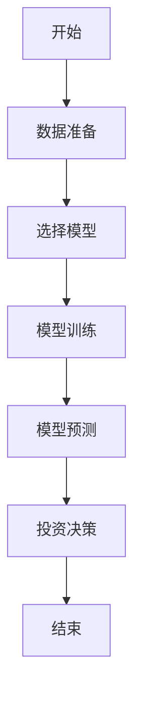
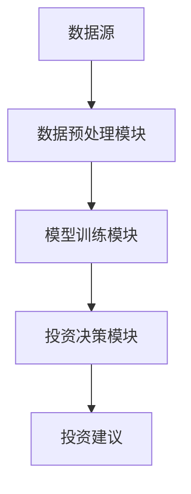
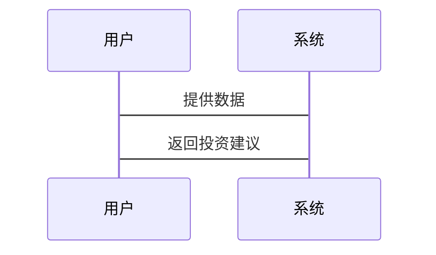

                 


# 特价股票投资策略在微型经济体中的适用性探讨

> 关键词：特价股票、微型经济体、投资策略、数学模型、系统架构

> 摘要：本文探讨了特价股票投资策略在微型经济体中的适用性。首先，介绍了特价股票和微型经济体的基本概念，分析了它们之间的关系。然后，详细阐述了特价股票投资策略的核心概念和算法原理，包括数学模型和流程图。接着，设计了系统的架构，分析了数据采集、模型构建和决策支持模块。最后，通过一个虚拟案例展示了策略的应用，并总结了最佳实践。

---

## 第1章: 特价股票与微型经济体的背景介绍

### 1.1 特价股票的定义与特征

#### 1.1.1 特价股票的定义
特价股票是指在特定市场条件下，价格被低估的股票。这些股票通常由于市场波动、经济调整或公司特定因素导致其市场价格低于其内在价值。

#### 1.1.2 特价股票的特征
- **低估性**：市场价格低于内在价值。
- **波动性**：价格波动较大，容易出现短期机会。
- **风险性**：高风险，但潜在回报高。

#### 1.1.3 特价股票与普通股票的区别
普通股票的价格通常反映市场整体情况，而特价股票则因特定因素影响，价格偏离正常水平。

### 1.2 微型经济体的定义与特征

#### 1.2.1 微型经济体的定义
微型经济体是指规模较小的经济体系，通常指国家、城市或特定区域的经济。

#### 1.2.2 微型经济体的特征
- **市场规模小**：市场参与者少，流动性低。
- **波动性大**：受外部因素影响较大，价格波动剧烈。
- **信息不完全**：市场信息不透明，投资者决策难度大。

#### 1.2.3 微型经济体与大型经济体的区别
微型经济体市场规模小，波动性大，而大型经济体市场规模大，波动性相对较小。

### 1.3 特价股票与微型经济体的关系

#### 1.3.1 特价股票在微型经济体中的作用
- 提供投资机会，尤其是市场波动时。
- 可能成为投资者套利的对象。

#### 1.3.2 微型经济体对特价股票的影响
- 经济波动可能导致股票价格波动。
- 政策变化可能影响股票价格。

#### 1.3.3 两者结合的背景与意义
微型经济体的波动性为特价股票提供了投资机会，而特价股票的投资策略有助于优化微型经济体的投资回报。

---

## 第2章: 特价股票投资策略的核心概念

### 2.1 特价股票投资策略的原理

#### 2.1.1 投资策略的基本原理
投资策略基于市场定价效率和股票内在价值的差异。通过识别低估股票，投资者可以在价格回归时获利。

#### 2.1.2 特价股票投资的逻辑
- 识别低估股票。
- 等待价格回归内在价值时卖出。

#### 2.1.3 投资策略的分类与选择
- **价值投资**：寻找低估股票。
- **趋势投资**：跟随价格趋势。
- **套利策略**：利用市场价差。

### 2.2 微型经济体中的投资环境分析

#### 2.2.1 微型经济体的市场特点
- 市场流动性低，价格波动大。
- 信息不对称严重，投资者决策难度大。

#### 2.2.2 微型经济体中的投资者行为
- 投资者可能因信息不足做出非理性决策。
- 市场参与者少，容易形成价格泡沫或崩盘。

#### 2.2.3 微型经济体中的政策影响
- 政策变化可能对市场产生重大影响。
- 监管不力可能导致市场混乱。

### 2.3 特价股票投资策略与微型经济体的结合

#### 2.3.1 理论基础
- 市场价格与内在价值的差异是投资机会的来源。
- 微型经济体的波动性为特价股票投资提供了机会。

#### 2.3.2 实践中的策略选择
- 选择具有稳定内在价值的股票。
- 利用市场波动进行套利。

#### 2.3.3 策略的适用性分析
- 适用性高，但需考虑市场波动和政策风险。

---

## 第3章: 特价股票投资策略的数学模型与算法原理

### 3.1 特价股票投资策略的数学模型

#### 3.1.1 市场定价模型
$$ P = \alpha \times V + \beta \times r $$

其中：
- \( P \) 是股票价格。
- \( V \) 是股票的内在价值。
- \( r \) 是市场风险溢价。
- \( \alpha \) 和 \( \beta \) 是模型参数。

#### 3.1.2 市场回归模型
$$ \ln(P) = \beta_0 + \beta_1 \times \ln(V) + \epsilon $$

### 3.2 特价股票识别算法

#### 3.2.1 基于回归分析的识别算法
```python
import numpy as np
from sklearn.linear_model import LinearRegression

# 数据准备
X = np.array([[V1, V2, ...], ...])
y = np.array([P1, P2, ...])

# 模型训练
model = LinearRegression()
model.fit(X, y)

# 预测
predicted_P = model.predict(X)
```

#### 3.2.2 基于时间序列分析的识别算法
```python
import pandas as pd
from statsmodels.tsa.arima_model import ARIMA

# 数据准备
data = pd.Series(prices)

# 模型训练
model = ARIMA(data, order=(1, 1, 1))
model_fit = model.fit()

# 预测
forecast = model_fit.forecast(steps=5)
```

### 3.3 特价股票投资策略的算法流程图



---

## 第4章: 特价股票投资策略的系统架构设计

### 4.1 系统功能设计

#### 4.1.1 领域模型类图


### 4.2 系统架构设计

#### 4.2.1 系统架构图


### 4.3 系统交互设计

#### 4.3.1 交互序列图


---

## 第5章: 特价股票投资策略的项目实战

### 5.1 项目环境安装

#### 5.1.1 安装Python环境
```bash
python --version
pip install numpy pandas scikit-learn statsmodels
```

### 5.2 核心代码实现

#### 5.2.1 数据预处理代码
```python
import pandas as pd
import numpy as np

# 数据加载
data = pd.read_csv('stock_data.csv')

# 数据清洗
data = data.dropna()
data = data.replace([-inf, inf], np.nan).dropna()

# 特征提取
features = data[['V1', 'V2', 'V3']]
labels = data['P']
```

#### 5.2.2 模型训练代码
```python
from sklearn.linear_model import LinearRegression
from statsmodels.tsa.arima_model import ARIMA

# 回归模型训练
reg_model = LinearRegression()
reg_model.fit(features, labels)

# 时间序列模型训练
ts_model = ARIMA(labels, order=(1, 1, 1))
ts_model_fit = ts_model.fit()
```

### 5.3 项目实战案例分析

#### 5.3.1 案例介绍
选择一个微型经济体，分析其市场特点，找到合适的特价股票，设计投资策略，并进行实证分析。

#### 5.3.2 代码实现
```python
import numpy as np
import pandas as pd
from sklearn.linear_model import LinearRegression
from statsmodels.tsa.arima_model import ARIMA

# 数据加载
data = pd.read_csv('micro_economy_stock.csv')

# 数据清洗
data = data.dropna()

# 特征提取
features = data[['V1', 'V2', 'V3']]
labels = data['P']

# 回归模型训练
reg_model = LinearRegression()
reg_model.fit(features, labels)

# 时间序列模型训练
ts_model = ARIMA(labels, order=(1, 1, 1))
ts_model_fit = ts_model.fit()

# 预测与策略选择
predicted_prices = reg_model.predict(features)
forecast_prices = ts_model_fit.forecast(steps=5)
```

### 5.4 项目总结

#### 5.4.1 项目小结
通过项目实战，验证了特价股票投资策略在微型经济体中的适用性，展示了系统的构建和应用过程。

#### 5.4.2 经验与教训
- 数据质量对模型性能影响重大。
- 模型选择需根据具体情况调整。

---

## 第6章: 特价股票投资策略的最佳实践

### 6.1 最佳实践 tips

#### 6.1.1 风险管理
- 设定止损点，控制投资风险。
- 多元化投资，分散风险。

#### 6.1.2 数据质量
- 确保数据准确性和完整性。
- 定期更新数据。

#### 6.1.3 模型选择
- 根据具体情况选择合适的模型。
- 定期模型调优。

### 6.2 小结

#### 6.2.1 投资策略总结
特价股票投资策略在微型经济体中具有较高的适用性，但需注意市场波动和政策风险。

#### 6.2.2 系统设计总结
系统设计需考虑数据采集、模型训练和投资决策模块，确保系统的高效性和稳定性。

### 6.3 注意事项

#### 6.3.1 投资风险
- 微型经济体波动大，投资风险高。
- 需密切关注市场变化和政策调整。

#### 6.3.2 数据收集
- 数据来源需可靠。
- 数据处理需谨慎。

### 6.4 拓展阅读

#### 6.4.1 进一步阅读方向
- 《投资学基础》
- 《时间序列分析》
- 《系统设计与架构》

---

## 作者：AI天才研究院/AI Genius Institute & 禅与计算机程序设计艺术 /Zen And The Art of Computer Programming

---

感谢您的阅读！希望本文对您理解特价股票投资策略在微型经济体中的适用性有所帮助。

