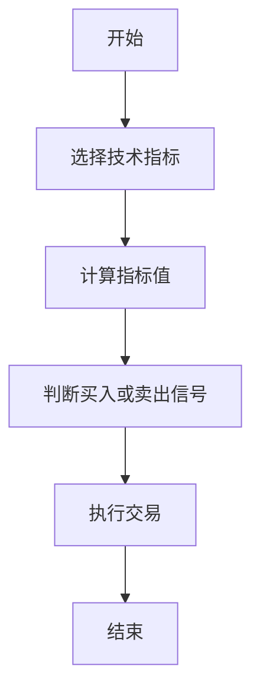
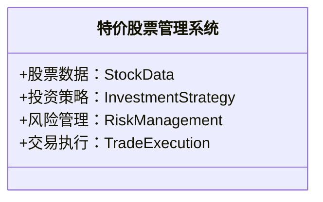

                 


# 特价股票投资策略在数字新兴经济体中的适用性探讨

> 关键词：特价股票投资策略，数字新兴经济体，股票投资，技术分析，数学模型，风险管理

> 摘要：本文探讨了特价股票投资策略在数字新兴经济体中的适用性。通过分析特价股票投资策略的核心概念、技术分析方法、数学模型构建，以及在数字新兴经济体中的实际应用，本文旨在为投资者提供科学的投资决策支持。同时，本文还探讨了风险管理策略和系统架构设计，为投资者提供了完整的投资解决方案。

---

## 第一部分：背景介绍

### 第1章：特价股票投资策略概述

#### 1.1 特价股票投资的基本概念

##### 1.1.1 特价股票的定义
特价股票是指市场估值低于其内在价值的股票，通常被认为具有被低估的投资机会。投资者通过分析公司基本面和市场趋势，寻找这些被低估的股票进行投资。

##### 1.1.2 特价股票投资的特点
- **低估性**：股票价格低于其真实价值。
- **风险性**：市场波动可能导致短期亏损。
- **长期性**：投资目标是长期增值。

##### 1.1.3 特价股票与其他投资策略的对比
| 投资策略 | 定义 | 适用场景 | 优缺点 |
|----------|------|----------|--------|
| 价值投资 | 寻找被低估的股票 | 市场低迷期 | 风险较低，回报稳定 | 
| 股票投机 | 短期价格波动交易 | 市场波动剧烈 | 风险高，回报快 |

#### 1.2 数字新兴经济体的定义与特点

##### 1.2.1 数字新兴经济体的定义
数字新兴经济体是指那些在数字化转型中快速发展的国家，如中国、印度、东南亚国家等。这些国家经济增长快，数字化程度高，股市具有较大的增长潜力。

##### 1.2.2 数字新兴经济体的市场特点
- **高增长性**：GDP增长快，企业盈利能力强。
- **波动性**：市场受政策和外部因素影响较大。
- **多样性**：行业分布广，新兴行业多。

---

## 第二部分：特价股票投资策略的核心概念

### 第2章：特价股票投资策略的原理与应用

#### 2.1 特价股票投资策略的原理

##### 2.1.1 市场周期理论
股票市场存在周期性波动，投资者应根据市场周期选择买入或卖出时机。

##### 2.1.2 价值发现与低估理论
通过基本面分析，寻找被市场低估的股票，等待其价值回归。

##### 2.1.3 风险控制策略
通过分散投资、设定止损点等方式，降低投资风险。

#### 2.2 数字新兴经济体中的应用

##### 2.2.1 市场波动性分析
使用技术分析工具，如移动平均线和RSI指标，分析市场波动性，寻找买入机会。

##### 2.2.2 企业基本面分析
分析企业的财务报表，评估其盈利能力、成长性和抗风险能力。

##### 2.2.3 投资组合优化
根据市场情况调整投资组合，平衡风险和收益。

---

## 第三部分：算法与数学模型

### 第3章：技术分析与算法策略

#### 3.1 技术分析方法

##### 3.1.1 移动平均线（MA）模型
移动平均线用于识别股票价格趋势，常用于判断买入和卖出时机。

##### 3.1.2 相对强弱指数（RSI）模型
RSI用于衡量股票超买或超卖状态，帮助投资者判断短期价格波动。

##### 3.1.3 布林带（Bollinger Bands）模型
布林带用于衡量价格波动范围，判断价格是否偏离正常范围。

#### 3.2 算法流程图

##### 3.2.1 技术分析算法流程图


#### 3.3 数学模型与公式

##### 3.3.1 移动平均线计算公式
$$
MA_n = \frac{1}{n}\sum_{i=1}^{n}P_i
$$
其中，\( P_i \) 表示第 \( i \) 天的价格，\( n \) 表示计算天数。

##### 3.3.2 RSI计算公式
$$
RSI = \frac{100 - \frac{S}{K}}{1 + \frac{S}{K}} \times 100
$$
其中，\( S \) 表示上涨幅度，\( K \) 表示计算天数。

---

## 第四部分：系统分析与架构设计

### 第4章：投资管理系统设计

#### 4.1 系统功能设计

##### 4.1.1 领域模型


#### 4.2 系统架构设计

##### 4.2.1 系统架构图


#### 4.3 系统接口设计

##### 4.3.1 数据接口
- 股票数据接口：从数据库获取实时股票数据。
- 交易接口：执行买入或卖出指令。

#### 4.4 系统交互流程

##### 4.4.1 交易执行流程图
```mermaid
sequenceDiagram
    participant 用户
    participant 系统
    用户->系统：提交买入订单
    系统->用户：确认订单
    用户->系统：完成交易
```

---

## 第五部分：项目实战

### 第5章：投资管理系统实现

#### 5.1 环境安装

##### 5.1.1 安装Python和相关库
```bash
pip install numpy pandas matplotlib
```

#### 5.2 核心代码实现

##### 5.2.1 股票数据分析代码
```python
import pandas as pd
import numpy as np

# 读取股票数据
data = pd.read_csv('stock_data.csv')

# 计算移动平均线
data['MA5'] = data['收盘价'].rolling(5).mean()

# 绘制图表
import matplotlib.pyplot as plt
data[['收盘价', 'MA5']].plot()
plt.show()
```

#### 5.3 案例分析

##### 5.3.1 实际案例分析
以某数字新兴经济体的股票为例，分析其股价走势，判断是否符合特价股票投资策略。

#### 5.4 项目小结

##### 5.4.1 项目总结
通过项目实战，验证了特价股票投资策略在数字新兴经济体中的可行性，并展示了如何利用技术分析和数学模型优化投资决策。

---

## 第六部分：风险管理与应对策略

### 第6章：风险管理策略

#### 6.1 风险来源分析

##### 6.1.1 市场风险
市场波动可能导致投资损失。

##### 6.1.2 企业风险
公司基本面变化影响股价。

##### 6.1.3 操作风险
交易错误或系统故障导致损失。

#### 6.2 风险应对策略

##### 6.2.1 设定止损点
在投资前设定止损点，避免重大损失。

##### 6.2.2 分散投资
通过投资不同行业和地区的股票，降低风险。

##### 6.2.3 定期评估
定期评估投资组合，调整策略以应对市场变化。

---

## 第七部分：最佳实践与未来展望

### 第7章：最佳投资策略

#### 7.1 最佳实践

##### 7.1.1 长期投资
坚持长期投资，避免频繁交易。

##### 7.1.2 持续学习
关注市场动态，学习新的投资策略。

##### 7.1.3 严格风控
严格执行风险管理策略，保护投资本金。

#### 7.2 未来展望

##### 7.2.1 数字化投资
随着技术进步，数字化投资工具将更加智能化。

##### 7.2.2 人工智能应用
人工智能将被更多用于股票数据分析和投资决策。

---

## 结语

特价股票投资策略在数字新兴经济体中具有广阔的适用性，但需要结合技术分析、数学模型和风险管理策略，才能实现稳健的投资回报。投资者应不断学习和适应市场变化，制定科学的投资策略。

---

## 作者

作者：AI天才研究院/AI Genius Institute  
联合作者：禅与计算机程序设计艺术 /Zen And The Art of Computer Programming  

---

**注**：以上内容为示例性目录和部分章节内容，实际撰写时需要根据具体情况进行补充和调整。

