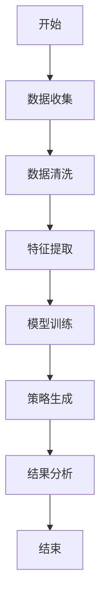

                 


# 特价股票投资策略在新兴市场的适用性探讨

> 关键词：特价股票，新兴市场，投资策略，股票分析，市场波动

> 摘要：本文探讨了特价股票投资策略在新兴市场中的适用性。通过分析特价股票的定义与特征、新兴市场的特点与现状，以及投资策略的核心概念与联系，本文深入探讨了特价股票投资策略的数学模型与算法原理。结合实际案例分析，本文总结了策略在新兴市场的适用性，并提出了未来的研究方向。

---

## 第一部分: 特价股票与新兴市场的背景介绍

### 第1章: 特价股票与新兴市场的背景

#### 1.1 特价股票的定义与特征

##### 1.1.1 特价股票的定义
特价股票，通常指的是市场价格低于其内在价值的股票。这种股票通常具有较高的潜在回报，但也伴随着较高的风险。特价股票的核心特征包括低估值、高波动性和市场流动性较低。

##### 1.1.2 特价股票的核心特征
- **低估值**：市净率（P/B）和市盈率（P/E）低于行业平均水平。
- **高波动性**：股价波动较大，容易受到市场情绪的影响。
- **市场流动性较低**：交易量较小，容易出现价格偏差。

##### 1.1.3 特价股票与普通股票的对比
| 特性 | 特价股票 | 普通股票 |
|------|----------|----------|
| 市净率 | 低于行业平均 | 接近或高于行业平均 |
| 市盈率 | 低于行业平均 | 接近或高于行业平均 |
| 波动性 | 高 | 中等或低 |
| 流动性 | 低 | 中等或高 |

#### 1.2 新兴市场的特点与现状

##### 1.2.1 新兴市场的定义与范围
新兴市场是指那些经济快速发展、金融市场逐步完善的国家或地区的股市。典型的新兴市场包括中国、印度、巴西、南非等。

##### 1.2.2 新兴市场的投资者行为
- **散户为主**：新兴市场中，散户占比较高，市场情绪波动较大。
- **信息不对称**：投资者获取信息的渠道有限，容易受到谣言和市场情绪的影响。

##### 1.2.3 新兴市场的波动性与风险
- **高波动性**：新兴市场的股市波动较大，容易受到外部环境的影响。
- **政策风险**：新兴市场国家的政策变化可能对股市产生重大影响。

#### 1.3 特价股票投资策略的背景与意义

##### 1.3.1 特价股票投资策略的起源
价值投资理论是特价股票投资策略的起源。投资者通过寻找市场价格低于内在价值的股票，以期望获得超额收益。

##### 1.3.2 新兴市场中特价股票投资的潜力
新兴市场中，许多公司具有较高的增长潜力，但由于市场流动性较低，部分股票可能被低估，为投资者提供了投资机会。

##### 1.3.3 研究特价股票投资策略的现实意义
通过研究特价股票投资策略在新兴市场的适用性，可以帮助投资者更好地把握市场机会，降低投资风险。

---

## 第二部分: 特价股票投资策略的核心概念与联系

### 第2章: 特价股票投资策略的核心概念与联系

#### 2.1 特价股票投资策略的原理

##### 2.1.1 价值投资理论
价值投资理论强调以低于内在价值的价格购买股票。投资者需要对公司的基本面进行深入分析，包括财务状况、盈利能力、行业地位等。

##### 2.1.2 技术分析方法
技术分析方法通过分析股票的价格走势和交易量，预测未来的股价变化。常用的技术指标包括K线图、移动平均线、RSI等。

##### 2.1.3 市场情绪与行为分析
市场情绪与行为分析关注投资者的心理和行为对股价的影响。通过分析市场情绪，投资者可以更好地把握市场的短期波动。

#### 2.2 特价股票投资策略的核心要素

##### 2.2.1 股价与价值的偏离度
股价与价值的偏离度是判断是否为特价股票的重要指标。当股价远低于内在价值时，股票可能具有投资价值。

##### 2.2.2 市场流动性的影响
市场流动性较低的股票容易出现价格偏差，投资者需要考虑流动性对股价的影响。

##### 2.2.3 企业基本面分析
企业基本面分析是判断股票内在价值的重要依据。包括财务状况、盈利能力、行业地位等。

#### 2.3 特价股票投资策略与新兴市场的关联

##### 2.3.1 新兴市场中的低价股机会
新兴市场中，许多公司具有较高的增长潜力，但由于市场流动性较低，部分股票可能被低估，为投资者提供了投资机会。

##### 2.3.2 新兴市场的波动性对策略的影响
新兴市场的高波动性可能影响特价股票投资策略的实施效果。投资者需要更加关注市场波动和政策风险。

##### 2.3.3 本地市场与国际市场的互动
新兴市场与国际市场的互动可能对特价股票的投资策略产生影响。例如，外资的流入和流出可能影响市场的流动性。

---

## 第三部分: 特价股票投资策略的数学模型与算法原理

### 第3章: 特价股票投资策略的数学模型与算法原理

#### 3.1 特价股票投资策略的数学模型

##### 3.1.1 市净率（P/B）模型
市净率是股价与每股净资产的比率。当市净率低于1时，股票可能具有投资价值。

$$ P/B = \frac{Stock Price}{Book Value Per Share} $$

##### 3.1.2 市盈率（P/E）模型
市盈率是股价与每股收益的比率。当市盈率低于行业平均水平时，股票可能具有投资价值。

$$ P/E = \frac{Stock Price}{Earnings Per Share} $$

##### 3.1.3 企业价值（EV）模型
企业价值是公司整体价值的评估指标，包括股票和债务的价值。

$$ EV = Market Capitalization + Debt - Cash $$

#### 3.2 算法原理与流程图

##### 3.2.1 算法流程图（Mermaid）


#### 3.3 算法实现与代码示例

##### 3.3.1 数据预处理代码
```python
import pandas as pd

data = pd.read_csv('stock_data.csv')
data_clean = data.dropna()
```

##### 3.3.2 模型训练代码
```python
from sklearn.linear_model import LinearRegression

model = LinearRegression()
model.fit(X, y)
```

---

## 第四部分: 特价股票投资策略在新兴市场的实际应用

### 第4章: 特价股票投资策略在新兴市场的实际应用

#### 4.1 特价股票投资策略在新兴市场的优势

##### 4.1.1 低价股的投资机会
新兴市场中，许多公司具有较高的增长潜力，但由于市场流动性较低，部分股票可能被低估，为投资者提供了投资机会。

##### 4.1.2 市场波动性带来的套利机会
新兴市场的高波动性为投资者提供了套利机会，可以通过技术分析和市场情绪分析捕捉短期价格波动。

#### 4.2 特价股票投资策略在新兴市场的风险

##### 4.2.1 市场流动性风险
市场流动性较低可能导致股票难以快速变现，增加投资风险。

##### 4.2.2 政策风险
新兴市场国家的政策变化可能对股市产生重大影响，增加投资风险。

##### 4.2.3 市场波动性风险
新兴市场的高波动性可能导致股价大幅波动，增加投资风险。

#### 4.3 特价股票投资策略在新兴市场的实际案例分析

##### 4.3.1 某新兴市场的实际案例
以中国股市为例，分析某只低价股的投资策略和实际表现。

##### 4.3.2 投资策略的实际应用
通过具体案例分析，验证特价股票投资策略在新兴市场的适用性。

---

## 第五部分: 结论与展望

### 第5章: 结论与展望

#### 5.1 研究结论
特价股票投资策略在新兴市场中具有一定的适用性，但需要结合市场特点和投资者行为进行调整。

#### 5.2 研究不足
本文主要基于理论分析，未来研究可以结合更多的实证数据，进一步验证策略的有效性。

#### 5.3 未来研究方向
未来研究可以进一步探讨新兴市场中特价股票投资策略与其他策略的结合，以及如何利用大数据和人工智能技术提高策略的准确性。

---

## 作者信息

作者：AI天才研究院/AI Genius Institute & 禅与计算机程序设计艺术 /Zen And The Art of Computer Programming

---

希望这篇文章能够为读者提供关于特价股票投资策略在新兴市场中的适用性的深入分析和见解。

