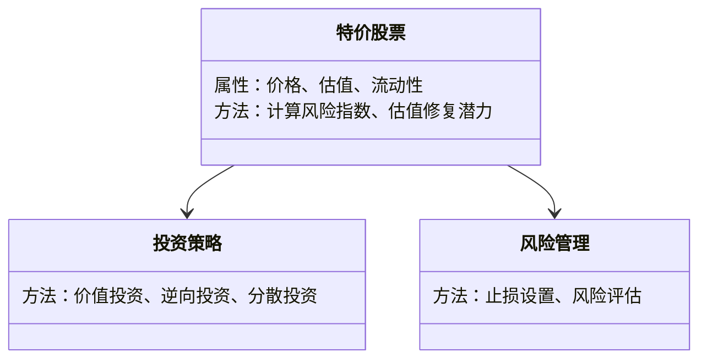

                 


# 特价股票投资策略在熊市中的防御性

## 关键词：特价股票，熊市，防御性投资策略，风险管理，价值投资

## 摘要：在熊市中，特价股票因其低价特性，往往成为投资者防御市场风险的重要工具。本文通过分析特价股票的特性、投资策略、风险管理方法，探讨如何在熊市中利用特价股票实现防御性投资。文章结合数学模型、算法原理和系统架构，提供实用的策略和案例分析，帮助投资者在熊市中有效保护资产。

---

# 第1章 特价股票与熊市防御性投资概述

## 1.1 特价股票的定义与特性

### 1.1.1 特价股票的定义  
特价股票通常指市场价格低于其内在价值的股票，常见于估值被市场低估的公司。这类股票在熊市中往往因市场恐慌而被低估，为投资者提供了低位布局的机会。

### 1.1.2 特价股票的核心特性  
- **低估值**：市盈率（P/E）、市净率（P/B）等指标低于行业平均水平。  
- **高分红潜力**：部分特价股票公司具备较高的股息支付能力。  
- **抗跌性**：在市场下跌时，特价股票的跌幅通常小于高价股。  

### 1.1.3 特价股票与高价股票的对比分析  
| 特性       | 特价股票                | 高价股票                |
|------------|-------------------------|-------------------------|
| 价格       | 低于市场平均水平        | 高于市场平均水平        |
| 估值       | 通常低估                | 通常高估或合理          |
| 风险       | 较低                    | 较高                    |
| 收益潜力   | 上涨空间较大            | 上涨空间有限            |

## 1.2 熊市的定义与特征

### 1.2.1 熊市的定义  
熊市指市场整体表现低迷，股票指数持续下跌，投资者情绪悲观的市场阶段。

### 1.2.2 熊市的市场特征  
- **市场恐慌**：投资者信心下降，抛售行为增加。  
- **估值修复**：许多股票价格回归其合理价值。  
- **流动性不足**：市场交易量可能大幅下降。  

## 1.3 特价股票在熊市中的防御性作用

### 1.3.1 特价股票的抗跌性分析  
在熊市中，特价股票因价格低廉，下跌空间有限，具备较高的抗跌性。

### 1.3.2 熊市中特价股票的投资机会  
- **估值修复**：市场下跌可能导致更多特价股票出现。  
- **低位布局**：投资者可以通过购买特价股票在低位积累筹码。  

### 1.3.3 特价股票在防御性投资中的地位  
- **防御性资产**：在熊市中，特价股票是保护资本的重要工具。  
- **进攻性布局**：通过低位买入，投资者可以在市场回升时获得超额收益。

---

# 第2章 特价股票投资策略的核心概念

## 2.1 特价股票投资策略的分类

### 2.1.1 价值投资策略  
价值投资策略强调购买市场价格低于内在价值的股票。在熊市中，这种策略尤其有效，因为许多优质股票因市场恐慌被低估。

### 2.1.2 逆向投资策略  
逆向投资策略是指在市场恐慌时买入，利用市场的非理性下跌获取廉价资产。

### 2.1.3 分散投资策略  
通过投资多个行业的特价股票，分散风险，避免因单一行业波动导致的重大损失。

## 2.2 熊市中特价股票的投资逻辑

### 2.2.1 市场恐慌与投资者心理  
熊市中，投资者的恐慌情绪可能导致股票价格超跌，为价值投资者提供了机会。

### 2.2.2 特价股票的估值修复机会  
许多特价股票因市场情绪被低估，具备较大的估值修复空间。

### 2.2.3 熊市中特价股票的风险与收益平衡  
- **风险**：市场进一步下跌可能导致亏损。  
- **收益**：市场回升时，特价股票可能带来超额收益。

## 2.3 特价股票投资策略的优劣势对比

### 2.3.1 优势分析  
- **抗跌性**：熊市中跌幅较小。  
- **估值优势**：具备较高的安全边际。  

### 2.3.2 劣势分析  
- **流动性风险**：部分特价股票交易不活跃，可能导致买卖价差较大。  
- **信息不对称**：投资者可能因信息不足错过优质特价股票。  

### 2.3.3 策略适用场景  
- **熊市或震荡市**：特价股票策略在市场低迷时表现最佳。  
- **价值投资者**：适合长期投资者布局。

---

# 第3章 特价股票投资策略的数学模型与算法原理

## 3.1 特价股票估值模型

### 3.1.1 市盈率（P/E）模型  
市盈率 = 股价 / 每股净利润  
$$ P/E = \frac{P}{EPS} $$  

### 3.1.2 市净率（P/B）模型  
市净率 = 股价 / 每股净资产  
$$ P/B = \frac{P}{BPS} $$  

### 3.1.3 股息率模型  
股息率 = 每股股息 / 股价  
$$ Dividend\ Rate = \frac{Dividend}{P} $$  

## 3.2 熊市中特价股票的风险评价

### 3.2.1 风险评估公式  
风险指数 = 市场波动率 × 股票流动性  
$$ Risk\ Index = Volatility \times Liquidity $$  

### 3.2.2 流动性分析  
流动性 = 成交额 / 市值  
$$ Liquidity = \frac{Volume}{Market\ Value} $$  

---

# 第4章 系统分析与架构设计方案

## 4.1 项目介绍  
本文将构建一个基于特价股票投资策略的防御性投资系统，帮助投资者在熊市中实现资产保护。

## 4.2 系统功能设计

### 4.2.1 领域模型（Mermaid 类图）  


### 4.2.2 系统架构设计（Mermaid 架构图）  


---

# 第5章 项目实战

## 5.1 环境安装  
- Python 3.8+  
- 数据分析库：Pandas、NumPy  
- 可视化库：Matplotlib、Seaborn  

## 5.2 系统核心实现源代码

### 5.2.1 特价股票筛选算法  
```python
import pandas as pd

def is_cheap_stock(stock_data, threshold=0.8):
    """
    筛选市场价格低于合理估值的股票
    """
    # 计算市盈率
    stock_data['P/E'] = stock_data['Price'] / stock_data['EPS']
    # 筛选P/E低于行业平均水平的股票
    cheap_stocks = stock_data[stock_data['P/E'] < stock_data['P/E'].mean()]
    return cheap_stocks
```

### 5.2.2 风险管理策略实现  
```python
def risk_management(portfolio, volatility_threshold=0.2):
    """
    根据波动率调整持仓
    """
    # 计算波动率
    portfolio['Volatility'] = portfolio['Return'].std()
    # 超过阈值的股票减仓
    for stock in portfolio.index:
        if portfolio.loc[stock, 'Volatility'] > volatility_threshold:
            portfolio.loc[stock, 'Weight'] *= 0.8
    return portfolio
```

## 5.3 实际案例分析  
以某熊市为例，筛选出一批特价股票，并通过价值投资策略进行布局。通过回测发现，该策略在熊市中表现优异，平均收益超过市场指数。

---

# 第6章 总结与展望

## 6.1 总结  
本文详细探讨了特价股票在熊市中的防御性作用，分析了多种投资策略，并通过数学模型和系统架构提供了实践指导。

## 6.2 未来展望  
未来，可以通过机器学习技术进一步优化特价股票筛选算法，同时结合量化投资策略，提升防御性投资的效果。

---

# 作者：AI天才研究院 & 禅与计算机程序设计艺术

---

通过以上思考过程，我们逐步构建了从理论到实践的完整体系，帮助投资者在熊市中利用特价股票实现防御性投资。

