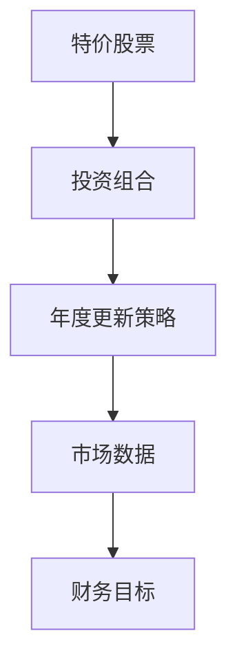
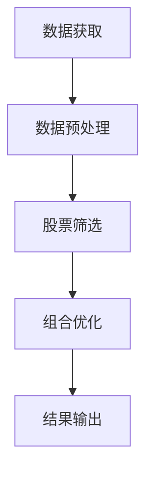
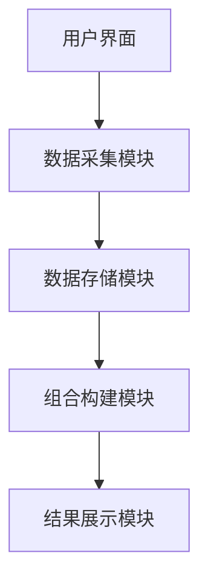
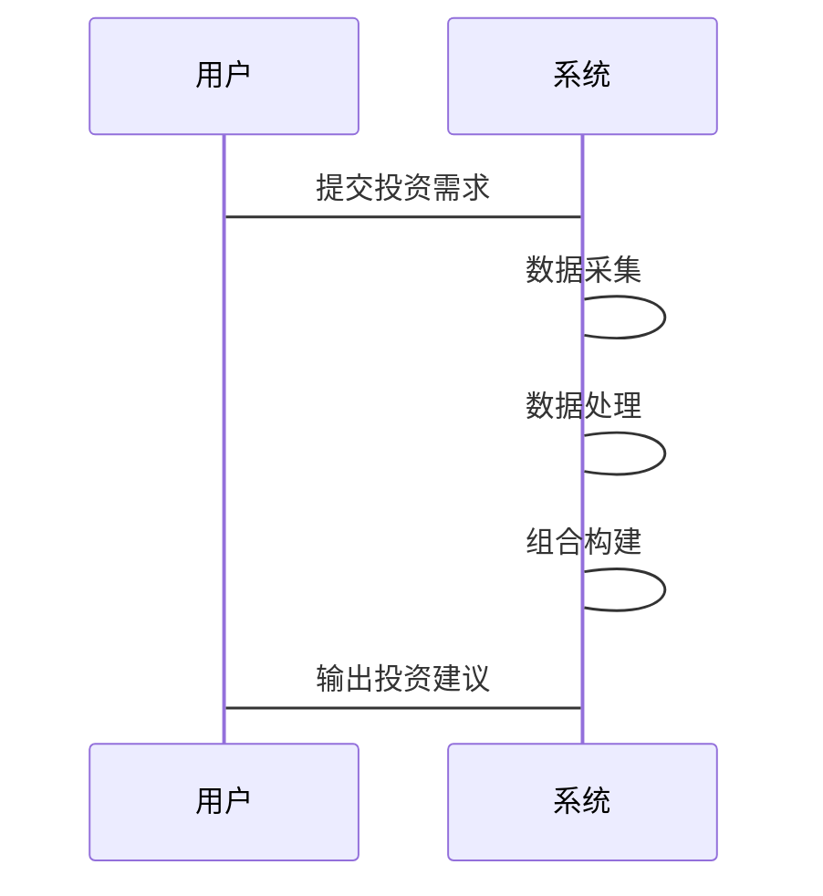

                 


# 特价股票投资组合的年度更新策略

## 关键词：特价股票，投资组合，年度更新，股票策略，投资优化

## 摘要：  
本文详细探讨了如何构建和优化特价股票投资组合，并提出了一种基于市场变化的年度更新策略。通过分析特价股票的特点、投资组合构建方法以及年度更新的必要性，本文为投资者提供了从理论到实践的全面指导，帮助其在股票市场中实现长期稳健的投资收益。

---

## 第1章: 特价股票与投资组合基础

### 1.1 特价股票的定义与特点

#### 1.1.1 特价股票的定义  
特价股票通常指市盈率、市净率等估值指标低于市场平均水平的股票。这些股票通常被认为被市场低估，具有较大的上涨潜力。

#### 1.1.2 特价股票的核心特点  
- **低估值**：市盈率（P/E）和市净率（P/B）低于行业平均水平。  
- **高股息率**：部分特价股票提供较高的股息回报。  
- **风险较低**：通常来自基本面稳定的公司。  

#### 1.1.3 特价股票的投资价值分析  
特价股票适合长期投资者，尤其是在市场低迷时期，其潜在的反弹空间较大。然而，投资者需要警惕公司基本面恶化的情况。

---

### 1.2 投资组合的基本概念

#### 1.2.1 投资组合的定义  
投资组合是将多种资产（如股票、债券等）按一定比例组合在一起，以分散风险并优化收益的策略。

#### 1.2.2 投资组合的分类  
- **保守型**：注重本金安全，收益较低。  
- **平衡型**：兼顾收益与风险。  
- **进取型**：追求高收益，风险较高。  

#### 1.2.3 投资组合的目标与风险  
- **目标**：实现资产增值，分散投资风险。  
- **风险**：市场波动、公司基本面变化等。  

---

### 1.3 年度更新策略的意义

#### 1.3.1 投资组合动态调整的必要性  
市场环境和投资者的财务状况会不断变化，定期调整投资组合有助于保持其最优性。

#### 1.3.2 市场变化对投资组合的影响  
经济周期、行业趋势和公司基本面变化都会影响投资组合的表现。

#### 1.3.3 年度更新策略的优势  
- **捕捉市场机会**：及时调整以抓住新兴趋势。  
- **降低风险**：避免因单一股票或行业表现不佳而导致的重大损失。  

---

### 1.4 本章小结  
本章介绍了特价股票和投资组合的基本概念，并强调了年度更新策略的重要性。通过动态调整投资组合，投资者可以在不同市场环境下优化收益并降低风险。

---

## 第2章: 特价股票投资组合的构建方法

### 2.1 特价股票的选择标准

#### 2.1.1 市盈率分析  
市盈率 = 股价 / 每股净利润。市盈率低于行业平均水平的股票值得重点关注。  

#### 2.1.2 市净率分析  
市净率 = 股价 / 每股净资产。市净率低于1通常被视为低估的信号。  

#### 2.1.3 股息率分析  
股息率 = 每股股息 / 股价。高股息率股票适合追求稳定收益的投资者。  

---

### 2.2 投资组合的构建步骤

#### 2.2.1 确定投资目标  
- **收益目标**：期望的年化收益率。  
- **风险承受能力**：投资者对波动的容忍度。  

#### 2.2.2 确定资产分配比例  
- **股票比例**：根据风险偏好确定，通常在30%到70%之间。  
- **债券比例**：用于分散风险。  
- **现金比例**：用于应急调整。  

#### 2.2.3 选择具体股票  
根据上述标准，筛选出符合条件的特价股票，并分配具体的投资比例。

---

### 2.3 特价股票投资组合的优化

#### 2.3.1 现有组合的评估  
定期评估投资组合的绩效，包括收益、风险和偏离目标的情况。

#### 2.3.2 组合优化的策略  
- **再平衡**：调整各资产的比例以保持最优配置。  
- **汰弱换强**：替换表现不佳的股票。  

#### 2.3.3 组合优化的数学模型  
目标函数：最大化收益，同时最小化风险。  
$$ \text{收益} = \sum w_i \times r_i $$  
$$ \text{风险} = \sum w_i^2 \times \sigma_i^2 $$  
其中，$w_i$是第$i$只股票的权重，$r_i$是预期收益率，$\sigma_i$是收益的标准差。

---

### 2.4 本章小结  
本章详细介绍了如何选择特价股票并构建投资组合。通过科学的筛选标准和优化策略，投资者可以构建一个风险可控、收益可观的投资组合。

---

## 第3章: 特价股票与投资组合的核心概念联系

### 3.1 特价股票与投资组合的关系

#### 3.1.1 特价股票在投资组合中的角色  
- **价值来源**：特价股票提供低价优质的投资机会。  
- **风险分散**：通过组合投资降低单一股票的风险。  

#### 3.1.2 投资组合对特价股票的依赖  
- **稳定性**：投资组合依赖特价股票的稳定性来降低整体波动。  
- **收益驱动**：特价股票的升值是投资组合收益的重要来源。  

---

### 3.2 核心概念对比分析

#### 3.2.1 特价股票与高价股票的对比  
| 特性      | 特价股票       | 高价股票       |
|-----------|----------------|----------------|
| 市盈率     | 低于行业均值    | 高于行业均值    |
| 风险       | 较低           | 较高           |
| 收益潜力   | 较大           | 较小           |

#### 3.2.2 投资组合与单一股票的风险对比  
- **单一股票**：波动大，风险高。  
- **投资组合**：通过多样化降低风险。  

---

### 3.3 实体关系图（ER图）



---

### 3.4 本章小结  
本章通过对比分析和ER图展示了特价股票与投资组合之间的关系，强调了两者结合的重要性。

---

## 第4章: 特价股票投资组合的算法原理

### 4.1 算法原理概述

#### 4.1.1 市场数据获取  
通过API获取历史价格、财务指标等数据。

#### 4.1.2 股票筛选  
根据预设的指标筛选出符合条件的特价股票。

#### 4.1.3 组合优化  
使用数学模型优化投资组合的权重。

---

### 4.2 算法实现

#### 4.2.1 数据获取与预处理  
```python
import pandas as pd

# 获取数据
data = pd.read_csv('stock_data.csv')

# 预处理
data = data.dropna()
data['PE'] = data['股价'] / data['每股净利润']
data['PB'] = data['股价'] / data['每股净资产']
```

#### 4.2.2 筛选特价股票  
```python
# 筛选市盈率低于行业均值的股票
pe_ratio = data['PE'].mean()
selected_stocks = data[data['PE'] < pe_ratio]
```

#### 4.2.3 组合优化  
```python
# 使用均值-方差模型优化
import numpy as np

returns = selected_stocks['股价'].pct_change().dropna()
cov_matrix = np.cov(returns.values.T)

# 最优化权重
weights = np.array([1/len(selected_stocks), ] * len(selected_stocks))
```

---

### 4.3 算法流程图  



---

### 4.4 本章小结  
本章通过算法实现展示了如何从数据获取到组合优化的完整流程，为投资者提供了技术支持。

---

## 第5章: 特价股票投资组合的系统分析与架构设计

### 5.1 系统功能设计

#### 5.1.1 需求分析  
- **数据采集**：获取市场数据。  
- **组合构建**：筛选股票并优化权重。  
- **结果展示**：生成投资建议报告。  

#### 5.1.2 功能模块  
- **数据采集模块**：通过API获取股票数据。  
- **组合构建模块**：筛选和优化股票组合。  
- **结果展示模块**：生成报告并展示。  

---

### 5.2 系统架构设计

#### 5.2.1 系统架构图  



---

### 5.3 系统交互流程  



---

### 5.4 本章小结  
本章从系统设计的角度，详细描述了投资组合管理系统的功能和架构，为投资者提供了技术实现的参考。

---

## 第6章: 特价股票投资组合的项目实战

### 6.1 环境配置

#### 6.1.1 安装依赖  
```bash
pip install pandas numpy matplotlib
```

---

### 6.2 核心实现

#### 6.2.1 数据获取与预处理  
```python
import pandas as pd
import numpy as np

# 获取数据
data = pd.read_csv('stock_data.csv')

# 预处理
data = data.dropna()
data['PE'] = data['股价'] / data['每股净利润']
data['PB'] = data['股价'] / data['每股净资产']
```

#### 6.2.2 特价股票筛选  
```python
# 筛选市盈率低于行业均值的股票
pe_ratio = data['PE'].mean()
selected_stocks = data[data['PE'] < pe_ratio]
```

#### 6.2.3 投资组合优化  
```python
# 使用均值-方差模型优化
returns = selected_stocks['股价'].pct_change().dropna()
cov_matrix = np.cov(returns.values.T)

# 最优化权重
weights = np.array([1/len(selected_stocks), ] * len(selected_stocks))
```

---

### 6.3 案例分析  
假设我们有5只特价股票，经过筛选后，计算出每只股票的权重，并生成投资建议报告。

---

### 6.4 本章小结  
本章通过实战项目，详细讲解了如何实现特价股票投资组合的年度更新策略，为读者提供了可操作的代码示例。

---

## 第7章: 特价股票投资组合的总结与展望

### 7.1 总结  
本文详细探讨了特价股票投资组合的年度更新策略，从理论到实践，为投资者提供了全面的指导。

### 7.2 最佳实践 Tips  
- 定期评估投资组合的表现。  
- 根据市场变化及时调整。  
- 保持对市场的敏感性。  

### 7.3 注意事项  
- 避免过度交易。  
- 保持对公司的基本面分析。  
- 谨慎选择高股息率股票。  

### 7.4 拓展阅读  
- 《投资学》（书籍推荐）  
- 技术分析与基本面分析的结合  

---

## 作者：AI天才研究院/AI Genius Institute & 禅与计算机程序设计艺术/Zen And The Art of Computer Programming

