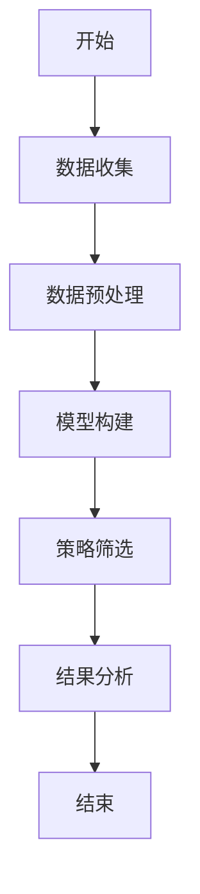

                 


# 特价股票策略在当前市场环境下的适用性

> 关键词：股票投资、特价股票、市场策略、交易算法、系统设计

> 摘要：本文深入分析了特价股票策略在当前市场环境下的适用性，从背景介绍、核心概念、算法原理、系统架构到项目实战，全面探讨了特价股票策略的优劣势、数学模型、实现方法及实际应用。通过详细的分析和案例，本文为投资者提供了科学的策略选择和系统设计思路。

---

## 引言

在现代股票市场中，投资者面临日益复杂的市场环境和多样化的需求。特价股票策略作为一种经典的股票交易策略，其在当前市场环境下的适用性备受关注。本文将从背景、概念、算法、系统设计、实战案例等多方面展开分析，帮助投资者更好地理解和应用特价股票策略。

---

## 第一部分: 特价股票策略的背景与基础

### 第1章: 特价股票策略的背景介绍

#### 1.1 特价股票策略的核心概念

- **1.1.1 什么是特价股票**  
  特价股票是指在特定时间点，价格低于市场价或具有较大折扣的股票。这类股票通常具有较高的投资价值，但可能存在较高的风险。

- **1.1.2 特价股票的定义与分类**  
  - **定义**：特价股票通常是指价格被低估的股票，可能因市场波动或公司短期问题导致价格下降。
  - **分类**：根据折扣幅度，特价股票可以分为小幅折扣、中度折扣和大幅折扣三类。

- **1.1.3 特价股票的市场背景**  
  当前市场环境下，全球经济波动、地缘政治风险等因素导致股票价格波动加剧，特价股票的出现频率增加，为投资者提供了更多的机会。

#### 1.2 当前市场环境下的股票交易特点

- **1.2.1 现代股票市场的基本特征**  
  现代股票市场具有高流动性和高波动性的特点，投资者需要快速反应和精准决策。

- **1.2.2 特价股票策略的适用场景**  
  - 特价股票策略适用于市场波动较大、价格被低估的情况。
  - 适合中长期投资者，尤其是价值投资者。

- **1.2.3 市场波动对策略的影响**  
  市场波动可能导致特价股票的价格波动加剧，投资者需要具备快速决策的能力。

#### 1.3 特价股票策略的演变与现状

- **1.3.1 特价股票策略的历史发展**  
  特价股票策略起源于20世纪初，随着市场环境的变化不断完善。

- **1.3.2 当前市场环境下策略的变化**  
  当前市场环境下，特价股票策略更加注重数据驱动和技术分析，结合量化模型进行优化。

- **1.3.3 现阶段策略的优劣势分析**  
  - 优势：价格低估，投资回报潜力大。
  - 劣势：波动风险高，需要较高的市场敏感性。

---

## 第二部分: 特价股票策略的核心概念与联系

### 第2章: 特价股票策略的核心概念

#### 2.1 特价股票策略的定义与特点

- **2.1.1 特价股票策略的定义**  
  特价股票策略是指在特定条件下，以低于市场价购买股票并等待价格上涨的策略。

- **2.1.2 特价股票策略的核心特点**  
  - 价格低估：股票价格低于其内在价值。
  - 短期波动：价格波动较大，存在快速反弹的可能性。
  - 风险较高：市场波动可能导致价格进一步下跌。

#### 2.2 特价股票策略的关键要素

- **2.2.1 特价股票的筛选标准**  
  - 市盈率（P/E）低于行业平均水平。
  - 市净率（P/B）低于行业平均水平。
  - 股息率较高。

- **2.2.2 市场环境对策略的影响**  
  - 市场波动：高波动市场中，特价股票策略的风险和收益均增加。
  - 宏观经济：经济下行周期中，特价股票策略的适用性增强。

- **2.2.3 策略执行中的关键点**  
  - 时机选择：选择市场低点买入。
  - 风险控制：设置止损点，避免过大损失。

#### 2.3 特价股票策略的数学模型

- **2.3.1 策略的数学表达式**  
  设股票价格为 \( P \)，内在价值为 \( V \)，则特价股票的条件为 \( P < V \)。

- **2.3.2 策略的优化与调整**  
  通过优化模型，确定最佳的买入和卖出时机。

- **2.3.3 策略的适用性分析**  
  使用数据可视化工具展示不同市场环境下策略的适用性。

---

## 第三部分: 特价股票策略的算法原理

### 第3章: 特价股票策略的算法原理

#### 3.1 策略的计算与实现

- **3.1.1 策略的计算步骤**  
  - 数据收集：获取股票的历史价格、财务数据等。
  - 数据分析：计算市盈率、市净率等指标。
  - 模型构建：建立数学模型，确定特价股票的筛选条件。

- **3.1.2 策略的实现方法**  
  使用Python编写脚本，自动化筛选和分析股票。

- **3.1.3 策略的优化算法**  
  使用遗传算法或机器学习算法优化策略。

#### 3.2 策略的数学模型与公式

- **3.2.1 策略的数学模型**  
  \( P_{\text{target}} = k \times P_{\text{current}} \)，其中 \( k \) 为折扣系数。

- **3.2.2 策略的优化公式**  
  使用回归分析优化模型参数。

#### 3.3 策略的算法流程图



---

## 第四部分: 特价股票策略的系统分析与架构设计

### 第4章: 特价股票策略的系统分析

#### 4.1 系统功能设计

- **4.1.1 系统的功能模块**  
  - 数据采集模块：获取股票数据。
  - 数据处理模块：计算指标。
  - 策略筛选模块：筛选特价股票。

- **4.1.2 系统的功能流程**  
  数据采集 → 数据处理 → 策略筛选 → 结果输出。

- **4.1.3 系统的功能实现**  
  使用Python编写模块，实现数据采集和处理功能。

#### 4.2 系统架构设计

- **4.2.1 系统的架构图**  
  ```mermaid
  classDiagram
    class 数据采集模块 {
      void getData()
    }
    class 数据处理模块 {
      void processData()
    }
    class 策略筛选模块 {
      void selectStocks()
    }
    数据采集模块 --> 数据处理模块
    数据处理模块 --> 策略筛选模块
  ```

- **4.2.2 系统的模块划分**  
  - 数据采集模块。
  - 数据处理模块。
  - 策略筛选模块。

- **4.2.3 系统的交互设计**  
  ```mermaid
  sequenceDiagram
    participant 用户
    participant 数据采集模块
    participant 数据处理模块
    participant 策略筛选模块
    用户 -> 数据采集模块: 请求数据
    数据采集模块 -> 数据处理模块: 提供数据
    数据处理模块 -> 策略筛选模块: 提供处理后的数据
    策略筛选模块 -> 用户: 返回结果
  ```

---

## 第五部分: 特价股票策略的项目实战

### 第5章: 特价股票策略的项目实战

#### 5.1 项目环境安装

- **Python安装**：安装Python 3.x。
- **库安装**：使用pip安装pandas、numpy、scikit-learn等库。

#### 5.2 核心代码实现

- **数据采集模块**：使用API获取股票数据。
- **数据处理模块**：计算市盈率、市净率等指标。
- **策略筛选模块**：筛选出符合条件的特价股票。

#### 5.3 案例分析

- **案例背景**：选择某行业中的股票进行分析。
- **数据分析**：计算指标，筛选出特价股票。
- **结果分析**：评估策略的有效性。

---

## 第六部分: 特价股票策略的最佳实践与总结

### 第6章: 特价股票策略的最佳实践

#### 6.1 本章小结

- 本文详细分析了特价股票策略的背景、核心概念、算法原理、系统架构和项目实战。
- 提供了科学的策略选择和系统设计思路。

#### 6.2 注意事项

- 风险控制：设置止损点，避免过大损失。
- 数据质量：确保数据来源可靠，处理准确。

#### 6.3 拓展阅读

- 推荐阅读相关书籍和论文，深入了解股票策略的优化方法。

---

## 作者信息

作者：AI天才研究院/AI Genius Institute & 禅与计算机程序设计艺术 /Zen And The Art of Computer Programming

---

通过本文的分析和实践，读者可以更好地理解和应用特价股票策略，为股票投资提供科学的指导。

