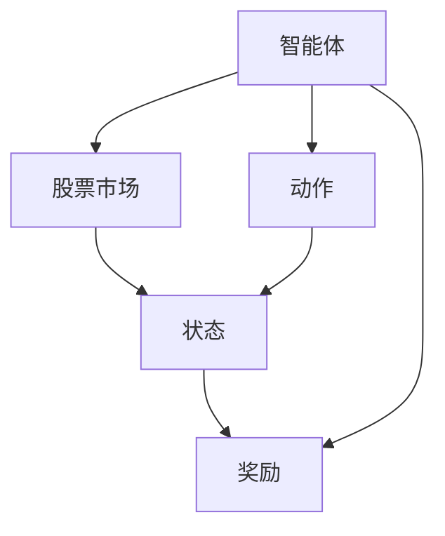
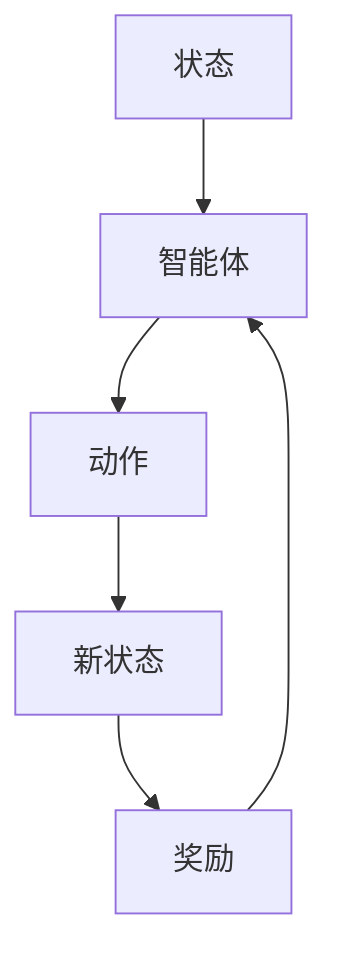

                 


# 第一部分: 特价股票筛选中的强化学习模型应用

## 第1章: 特价股票筛选概述

### 1.1 特价股票的概念与特点
#### 1.1.1 特价股票的定义
特价股票是指在特定时间或特定市场条件下，价格低于其内在价值的股票。这类股票通常被认为具有投资潜力，因为它们可能被市场低估或暂时面临困境，但具有恢复或增长的潜力。

#### 1.1.2 特价股票的特点
- **低估值**：市盈率、市净率等估值指标低于行业平均水平。
- **高波动性**：价格波动较大，容易受到市场情绪和外部因素的影响。
- **周期性**：通常在市场低迷或经济衰退时出现较多。

#### 1.1.3 特价股票的市场价值
- **投资机会**：低价买入，高价卖出，获取超额收益。
- **风险与收益并存**：高波动性意味着高风险，但同时也意味着高回报的可能性。

### 1.2 强化学习的基本原理
#### 1.2.1 强化学习的定义
强化学习是一种机器学习范式，通过智能体与环境的交互，学习如何通过决策和行为来最大化累积奖励。智能体会根据环境的反馈（奖励或惩罚）调整自己的策略。

#### 1.2.2 强化学习的核心要素
- **状态（State）**：智能体所处的环境情况，如当前股票价格、市场趋势等。
- **动作（Action）**：智能体在给定状态下采取的行动，如买入、卖出或持有股票。
- **奖励（Reward）**：智能体采取行动后获得的反馈，反映了该行动的优劣。

#### 1.2.3 强化学习与传统机器学习的区别
| 方面 | 强化学习 | 传统机器学习 |
|------|----------|---------------|
| 数据来源 | 与环境交互 | 离线数据集 |
| 目标 | 最大化累积奖励 | 最小化预测误差或分类错误 |
| 决策方式 | 基于策略 | 基于规则或模型 |

### 1.3 特价股票筛选中的强化学习应用背景
#### 1.3.1 股票交易中的不确定性
股票市场受多种因素影响，如宏观经济指标、公司财报、市场情绪等，具有高度的不确定性。

#### 1.3.2 强化学习在股票交易中的优势
- **适应性**：能够根据市场变化动态调整交易策略。
- **自我学习**：通过与市场的交互不断优化决策策略。

#### 1.3.3 特价股票筛选的挑战与机遇
- **挑战**：股票市场的不可预测性、数据的稀疏性和噪声。
- **机遇**：通过强化学习模型发现被低估的股票，获取超额收益。

---

## 第2章: 强化学习模型的核心概念与联系

### 2.1 强化学习模型的原理
#### 2.1.1 状态空间
状态空间是智能体所处的所有可能状态的集合。在特价股票筛选中，状态可能包括股票价格、市场指数、成交量等。

#### 2.1.2 动作空间
动作空间是智能体在每个状态下可以采取的所有可能动作的集合。在股票交易中，动作可能包括买入、卖出或持有。

#### 2.1.3 奖励机制
奖励机制定义了智能体在采取某个动作后获得的奖励或惩罚。在股票交易中，奖励通常与收益相关，如收益率超过某个阈值时给予正奖励。

### 2.2 强化学习模型的核心要素对比
#### 2.2.1 Q-learning与Deep Q-Network对比
| 方面 | Q-learning | Deep Q-Network |
|------|------------|----------------|
| 处理能力 | 适合小规模问题 | 适合大规模复杂问题 |
| 模型复杂度 | 线性 | 深度神经网络 |
| 适用场景 | 离散动作空间 | 离散或连续动作空间 |

#### 2.2.2 策略梯度方法与值函数方法对比
| 方面 | 策略梯度方法 | 值函数方法 |
|------|-------------|--------------|
| 优化目标 | 直接优化策略 | 通过值函数优化策略 |
| 稳定性 | 较低 | 较高 |
| 适用场景 | 高维或连续动作空间 | 离散动作空间 |

#### 2.2.3 On-policy与Off-policy方法对比
| 方面 | On-policy | Off-policy |
|------|----------|------------|
| 策略更新 | 立即更新策略 | 延后更新策略 |
| 采样方式 | 使用当前策略采样动作 | 使用历史数据采样动作 |
| 适用场景 | 稳定性要求高 | 多样性要求高 |

### 2.3 实体关系图与流程图
#### 2.3.1 实体关系图（ER图）


#### 2.3.2 强化学习模型流程图（Mermaid）


---

## 第3章: 强化学习算法原理与数学模型

### 3.1 Q-learning算法原理
#### 3.1.1 Q-learning的基本原理
Q-learning是一种基于值函数的强化学习算法，通过更新Q表（Q-value table）来学习最优策略。Q表记录了每个状态下每个动作的期望奖励。

#### 3.1.2 Q-learning的更新公式
$$ Q(s, a) = Q(s, a) + \alpha (r + \gamma \max Q(s', a') - Q(s, a)) $$

其中：
- $\alpha$ 是学习率，控制更新步长。
- $\gamma$ 是折扣因子，平衡当前奖励和未来奖励的重要性。

### 3.2 Deep Q-Network算法
#### 3.2.1 DQN的基本结构
DQN由两个深度神经网络组成：主网络和目标网络。主网络负责选择动作，目标网络负责评估动作的价值。

#### 3.2.2 DQN的数学模型
$$ \text{损失函数} = \mathbb{E}[(r + \gamma Q_{\text{target}}(s', a') - Q_{\text{main}}(s, a))^2] $$

其中：
- $Q_{\text{main}}$ 是主网络的输出。
- $Q_{\text{target}}$ 是目标网络的输出。

### 3.3 策略梯度方法
#### 3.3.1 策略梯度的基本原理
策略梯度方法直接优化策略，通过梯度上升或下降来调整策略参数，以最大化累积奖励。

#### 3.3.2 策略梯度的数学模型
$$ \nabla \theta \leftarrow \nabla \mathbb{E}[R] = \mathbb{E}[\nabla R] $$

其中：
- $\theta$ 是策略参数。
- $R$ 是累积奖励。

---

## 第4章: 强化学习模型的数学公式与代码实现

### 4.1 Q-learning算法的数学公式
$$ Q(s, a) = Q(s, a) + \alpha (r + \gamma \max Q(s', a') - Q(s, a)) $$

### 4.2 Deep Q-Network的代码实现
```python
import tensorflow as tf
from tensorflow.keras import layers

# 定义主网络和目标网络
class DQN:
    def __init__(self, state_space, action_space):
        self.state_space = state_space
        self.action_space = action_space
        self.main_network = self.build_network()
        self.target_network = self.build_network()
    
    def build_network(self):
        model = tf.keras.Sequential()
        model.add(layers.Dense(64, input_dim=self.state_space, activation='relu'))
        model.add(layers.Dense(64, activation='relu'))
        model.add(layers.Dense(self.action_space, activation='linear'))
        return model

    # 其他方法如update_target_network和get_action等略...
```

---

## 第5章: 强化学习在股票筛选中的应用

### 5.1 系统分析与架构设计
#### 5.1.1 问题场景介绍
智能体在股票市场中，通过观察股票价格、市场指数等信息，决策买入、卖出或持有股票，以最大化累积收益。

#### 5.1.2 系统功能设计
- 数据采集：从市场获取实时或历史股票数据。
- 特征提取：从股票数据中提取有用的特征，如技术指标、市场情绪等。
- 模型训练：使用强化学习算法训练模型。
- 策略执行：根据模型的决策执行交易。

### 5.2 项目实战
#### 5.2.1 环境安装
安装必要的库：
```bash
pip install tensorflow keras numpy pandas matplotlib
```

#### 5.2.2 核心代码实现
```python
import numpy as np
import pandas as pd
import tensorflow as tf
from tensorflow.keras import layers

# 定义强化学习环境
class StockEnvironment:
    def __init__(self, data):
        self.data = data
        self.current_step = 0
        self.state_size = len(data.columns)
    
    def reset(self):
        self.current_step = 0
        return self.data.iloc[self.current_step].values
    
    def step(self, action):
        # 执行交易操作，更新当前步，返回新状态、奖励、是否终止
        # 具体实现略...
        pass

# 定义强化学习智能体
class Agent:
    def __init__(self, state_size, action_size):
        self.state_size = state_size
        self.action_size = action_size
        self.model = self.build_model()
    
    def build_model(self):
        model = tf.keras.Sequential()
        model.add(layers.Dense(64, input_dim=self.state_size, activation='relu'))
        model.add(layers.Dense(64, activation='relu'))
        model.add(layers.Dense(self.action_size, activation='linear'))
        return model

    # 其他方法如act和train略...
```

#### 5.2.3 案例分析
通过实际数据训练模型，并在测试数据上验证模型的交易策略和收益情况。

---

## 第6章: 最佳实践与小结

### 6.1 最佳实践
- **数据预处理**：确保数据的完整性和准确性。
- **模型调参**：根据实际效果调整学习率、折扣因子等参数。
- **风险管理**：设置止损和止盈机制，控制交易风险。

### 6.2 小结
本文详细介绍了强化学习在特价股票筛选中的应用，从理论到实践，逐步深入地探讨了强化学习模型的构建与优化方法。通过实际案例分析，展示了如何利用强化学习模型在股票交易中获取超额收益。

---

## 作者
作者：AI天才研究院/AI Genius Institute  
联系邮箱：contact@aiguru.org  
版权所有：禅与计算机程序设计艺术 / Zen And The Art of Computer Programming

