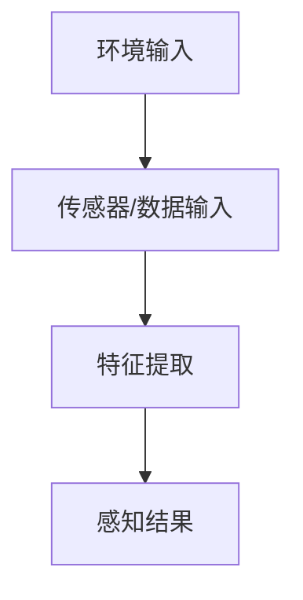
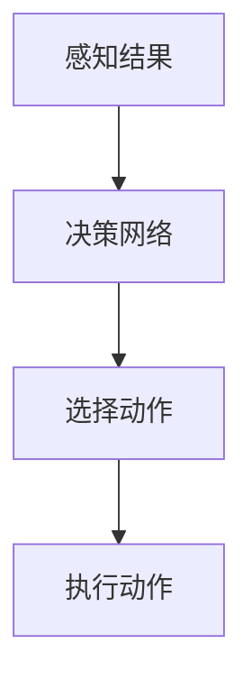
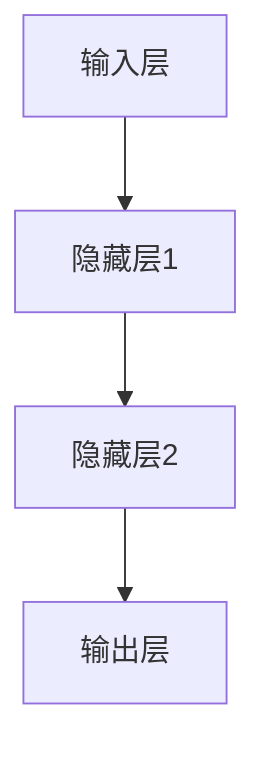
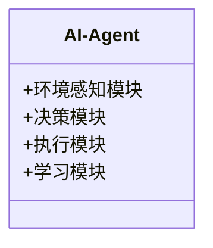
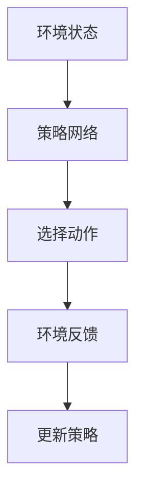
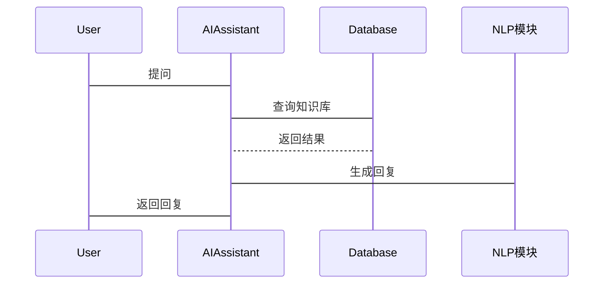

                 


# 理解AI Agent：定义、特征与基本原理

**关键词**：AI Agent，人工智能，机器学习，强化学习，系统架构

**摘要**：本文详细介绍了AI Agent的定义、特征和基本原理，涵盖了AI Agent的核心概念、算法原理、系统架构设计以及实际应用场景。通过丰富的案例分析和系统设计，帮助读者全面理解AI Agent的技术本质和应用价值。

---

## 第1章 AI Agent 的基本概念

### 1.1 AI Agent 的定义与特征

AI Agent（人工智能代理）是指能够感知环境、做出决策并执行任务的智能实体。AI Agent的核心特征包括自主性、反应性、目标导向和学习能力。

| 特征 | 描述 |
|------|------|
| 自主性 | 能够独立执行任务，无需外部干预 |
| 反应性 | 根据环境反馈调整行为 |
| 目标导向 | 以目标为导向，优化决策和行动 |
| 学习能力 | 通过经验改进性能 |

### 1.2 AI Agent 的分类与应用场景

AI Agent可以根据功能、智能水平和环境类型进行分类。常见的应用场景包括智能助手、自动驾驶和游戏AI。

**Mermaid图：AI Agent的分类**


---

## 第2章 AI Agent 的感知与决策机制

### 2.1 感知机制

AI Agent通过传感器或数据输入感知环境。常见的感知方法包括基于规则、基于模型和基于数据驱动的方法。

**Mermaid图：感知流程**



### 2.2 决策机制

AI Agent基于感知结果做出决策。常见的决策方法包括基于规则、基于模型和基于强化学习。

**Mermaid图：决策流程**



---

## 第3章 AI Agent 的学习与进化

### 3.1 机器学习在 AI Agent 中的应用

AI Agent广泛使用机器学习技术，包括监督学习、无监督学习和强化学习。

**监督学习**：通过标记数据训练模型，例如分类任务。

$$ y = \theta x + b $$

**强化学习**：通过试错机制优化策略，例如Q-learning的更新公式：

$$ Q(s, a) = r + \gamma \max Q(s', a') $$

### 3.2 深度学习与神经网络在 AI Agent 中的应用

深度学习模型如CNN、RNN和Transformer在AI Agent中发挥重要作用。

**Mermaid图：神经网络结构**



---

## 第4章 AI Agent 的系统架构与设计

### 4.1 系统架构的定义与作用

AI Agent的系统架构设计包括环境建模、策略网络设计和生成式模型设计。

**Mermaid图：系统架构**



### 4.2 基于强化学习的系统架构设计

强化学习的环境建模和策略网络设计是关键。

**Mermaid图：强化学习流程**



---

## 第5章 项目实战：AI Agent 实现

### 5.1 智能客服系统设计

**需求分析**：实现自动响应和问题解决。

**系统设计**：包括感知模块、决策模块和执行模块。

**代码实现**：使用Python和深度学习模型实现。

```python
class AIAssistant:
    def __init__(self):
        self.model = load_model('chat_model.h5')
    
    def perceive(self, input_text):
        # 数据预处理
        pass
    
    def decide(self, input_text):
        # 模型推理
        return self.model.predict(input_text)
    
    def execute(self, response):
        # 输出响应
        print(response)
```

### 5.2 系统实现与测试

通过测试用例验证系统的正确性和性能。

**Mermaid图：系统交互**



---

## 第6章 实际应用中的挑战与未来展望

### 6.1 挑战

AI Agent面临技术局限性、伦理问题和安全风险。

### 6.2 未来展望

AI Agent将更加智能化、个性化和协作化。

---

## 作者

作者：AI天才研究院 & 禅与计算机程序设计艺术

---

这篇文章系统地介绍了AI Agent的定义、特征和基本原理，并通过实际案例和系统设计展示了其应用和挑战。通过详细的分析和丰富的图表，帮助读者全面理解AI Agent的技术本质和未来发展。

