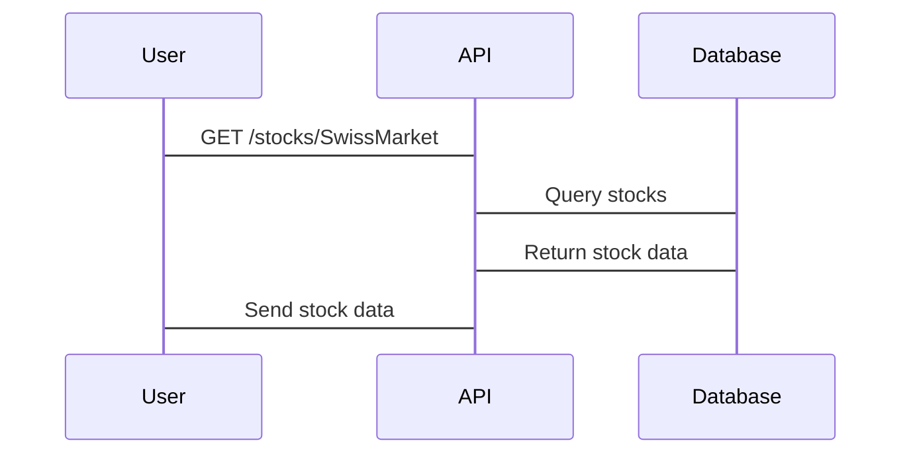

                 


# 瑞士股市估值:避险天堂的市场特点

## 关键词：瑞士股市、股市估值、避险天堂、股票分析、金融投资

## 摘要：瑞士股市以其稳定性和避险功能著称，本文将深入探讨其估值方法、市场特点及避险机制，为投资者提供全面的分析和实战指导。

---

## 第一部分：瑞士股市估值的背景与概述

### 第1章：瑞士股市的概述与特点

#### 1.1 瑞士股市的概述

- **1.1.1 瑞士股市的定义与历史发展**
  瑞士股市是全球最重要的金融市场之一，起源于19世纪，经历了多次改革和整合，现由瑞士证券交易所集团运营。

- **1.1.2 瑞士股市在全球市场中的地位**
  瑞士股市以其稳定性和避险功能，成为全球投资者的避风港，尤其在政治和经济不确定时期。

- **1.1.3 瑞士股市的独特性与稳定性**
  瑞士股市的稳定性得益于其严格的监管和保守的投资者文化。

#### 1.2 瑞士股市的避险天堂特点

- **1.2.1 瑞士股市的避险功能**
  瑞士法郎的强势和瑞士严格的金融监管，使瑞士股市成为避险资产。

- **1.2.2 瑞士金融体系的稳定性**
  瑞士政府的财政健康和低债务水平，增强了金融体系的稳定性。

- **1.2.3 瑞士股市的低波动性**
  瑞士股市波动性较低，适合长期投资者。

#### 1.3 瑞士股市的主要参与者

- **1.3.1 政府与监管机构**
  瑞士金融市场监管局（FINMA）负责监管，确保市场透明和公正。

- **1.3.2 投资者与机构**
  包括国内个人投资者、机构投资者和全球投资者。

- **1.3.3 主流上市公司**
  如瑞银、瑞信、雀巢等，覆盖多个行业。

---

## 第二部分：瑞士股市估值的核心概念与方法

### 第2章：瑞士股市估值的核心概念

#### 2.1 股票估值的基本原理

- **2.1.1 股票估值的定义与目标**
  股票估值是通过分析公司财务数据和市场因素，确定其合理价格。

- **2.1.2 股票估值的主要方法**
  包括基本面分析、技术分析和市场比较法。

- **2.1.3 瑞士股市估值的独特性**
  稳定性和低波动性使估值更为可靠。

#### 2.2 瑞士股市估值的关键指标

- **2.2.1 市盈率（P/E Ratio）**
  $$ P/E = \frac{Price}{Earnings} $$
  用于评估股票的相对价值。

- **2.2.2 市净率（P/B Ratio）**
  $$ P/B = \frac{Price}{Book\ Value} $$
  适用于评估资产密集型公司。

- **2.2.3 股息率（Dividend Yield）**
  $$ Dividend\ Yield = \frac{Dividend}{Price} $$
  反映投资回报。

#### 2.3 瑞士股市估值的模型

- **2.3.1 市场价值模型**
  通过市场指数和行业平均市盈率评估。

- **2.3.2 股利折现模型**
  将未来股息现值化，评估股票价值。

- **2.3.3 市场比较法**
  将目标公司与可比公司进行比较。

### 第3章：瑞士股市估值的数学模型与公式

#### 3.1 常用估值公式

- **3.1.1 市盈率公式**
  $$ P/E = \frac{Price}{Earnings} $$
  示例：公司A的股价为100，利润为20，P/E=5。

- **3.1.2 市净率公式**
  $$ P/B = \frac{Price}{Book\ Value} $$
  示例：公司B的股价为50，每股净值为25，P/B=2。

- **3.1.3 股息率公式**
  $$ Dividend\ Yield = \frac{Dividend}{Price} $$
  示例：公司C股息为5，股价100，股息率5%。

#### 3.2 估值模型的实现步骤

1. 收集目标公司的财务数据。
2. 计算市盈率、市净率和股息率。
3. 对比行业平均值，评估股票价值。

---

## 第三部分：瑞士股市系统的分析与架构设计

### 第4章：瑞士股市系统的分析与架构设计

#### 4.1 系统功能设计

- **领域模型（mermaid类图）**
  ```mermaid
  classDiagram
      class Company {
          string Name
          float Price
          float Earnings
          float Dividends
      }
      class Market {
          float IndexValue
          list Companies
      }
      class Investor {
          float PortfolioValue
          list Holdings
      }
      Company --> Market
      Market --> Investor
  ```

- **系统架构设计（mermaid架构图）**
  ```mermaid
  context Diagram
      participant User
      participant MarketDataAPI
      participant Database
      participant InvestorDashboard
      User -> MarketDataAPI: Request data
      MarketDataAPI -> Database: Retrieve data
      MarketDataAPI -> InvestorDashboard: Update dashboard
  ```

#### 4.2 系统接口设计

- **接口描述**
  RESTful API，提供市场数据和公司信息查询。

#### 4.3 系统交互设计（mermaid序列图）



---

## 第四部分：项目实战

### 第5章：项目实战

#### 5.1 环境安装

- Python 3.8+
- 安装必要的库：
  ```bash
  pip install pandas numpy matplotlib
  ```

#### 5.2 系统核心实现源代码

```python
import pandas as pd
import numpy as np

# 示例数据
data = {'Company': ['CompanyA', 'CompanyB', 'CompanyC'],
        'Price': [100, 50, 75],
        'Earnings': [20, 10, 15],
        'Dividends': [5, 3, 6]}
df = pd.DataFrame(data)

# 计算估值指标
df['P/E'] = df['Price'] / df['Earnings']
df['P/B'] = df['Price'] / df['Book Value']
df['Dividend Yield'] = df['Dividends'] / df['Price']

print(df)
```

#### 5.3 代码应用解读与分析

- 使用pandas库处理数据。
- 计算市盈率、市净率和股息率，对比行业平均值，得出估值结果。

#### 5.4 实际案例分析和详细讲解剖析

- 以瑞银为例，分析其市盈率、市净率和股息率，评估其在瑞士股市中的估值。

#### 5.5 项目小结

- 通过代码实现瑞士股市的估值分析，帮助投资者做出明智决策。

---

## 第五部分：总结与展望

### 第6章：总结与展望

#### 6.1 核心观点总结

- 瑞士股市以其稳定性和避险功能，成为投资者的首选。
- 通过合理的估值方法，投资者可以在瑞士股市中找到优质投资机会。

#### 6.2 小结

- 本文详细介绍了瑞士股市的估值方法和市场特点，为投资者提供了实用的指导。

#### 6.3 注意事项

- 投资者需关注市场动态和公司基本面，谨慎投资。

#### 6.4 拓展阅读

- 建议进一步学习金融市场的其他估值方法和风险管理策略。

---

## 作者：AI天才研究院/AI Genius Institute & 禅与计算机程序设计艺术 /Zen And The Art of Computer Programming

---

### END

