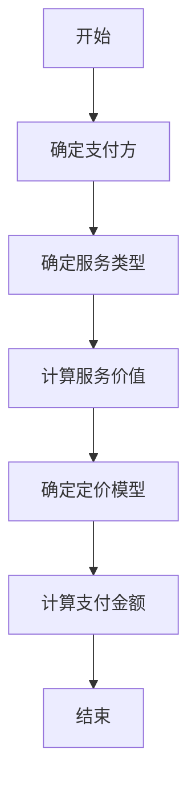
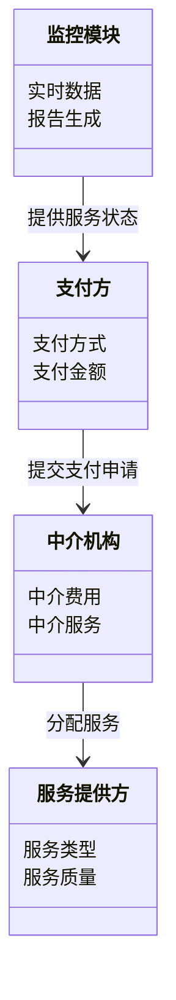
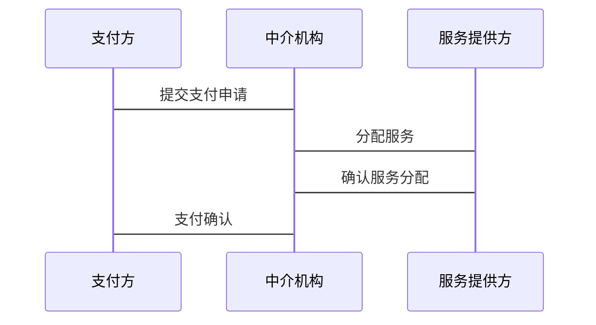

                 


# 生态系统服务付费机制的投资模式探讨

## 关键词：生态系统服务、付费机制、投资模式、环境经济学、系统架构

## 摘要：  
生态系统服务付费机制是一种将自然环境提供的服务（如清洁空气、水源调节）转化为可量化的经济价值的机制。本文探讨了该机制的投资模式，分析其算法原理、系统架构，并通过实际案例展示其应用，最后总结最佳实践。

---

# 第1章: 生态系统服务付费机制的背景介绍

## 1.1 生态系统服务的定义与内涵

### 1.1.1 生态系统服务的定义  
生态系统服务是指自然生态系统提供的所有直接或间接的效益，包括 provisioning（提供资源）、regulating（调节功能）、supporting（支持功能）和 cultural（文化价值）四个类别。

### 1.1.2 生态系统服务的核心要素  
- ** provisioning services**：如食物、水资源的提供。  
- ** regulating services**：如气候调节、洪水控制。  
- ** supporting services**：如土壤形成、养分循环。  
- ** cultural services**：如旅游、教育价值。  

### 1.1.3 生态系统服务的分类与特征  
表格：生态系统服务分类与特征对比  

| 类型                | 特征描述                           |
|---------------------|------------------------------------|
| 提供资源服务         | 直接提供可利用资源                 |
| 调节功能服务         | 维持生态系统的平衡                 |
| 支持功能服务         | 支持其他生态服务的产生             |
| 文化价值服务         | 提供精神和文化层面的价值           |

---

## 1.2 生态系统服务付费机制的背景

### 1.2.1 环境资源的价值化趋势  
随着环境问题的加剧，环境资源的价值逐渐被重视，付费机制成为实现环境资源价值化的关键工具。

### 1.2.2 环境治理的市场化需求  
传统的政府主导模式效率低下，引入市场机制可以提高资源配置效率。

### 1.2.3 全球可持续发展目标与付费机制的关联  
联合国可持续发展目标（SDGs）强调环境保护，付费机制是实现这些目标的重要手段。

---

## 1.3 本章小结

### 1.3.1 生态系统服务的核心概念  
生态系统服务是自然系统提供的多种效益，分为四类： provisioning、regulating、supporting 和 cultural services。

### 1.3.2 生态系统服务付费机制的必要性  
付费机制通过市场手段实现环境资源的价值化，是环境治理的重要工具。

---

# 第2章: 生态系统服务付费机制的核心概念与联系

## 2.1 生态系统服务的价值评估

### 2.1.1 生态系统服务的非市场价值  
非市场价值难以直接用货币衡量，但可通过替代成本法或意愿支付法估算。

### 2.1.2 生态系统服务的市场价值  
市场价值是指通过市场交易实现的经济价值，如水权交易、碳交易等。

### 2.1.3 价值评估的方法与模型  
- **替代成本法**：计算恢复生态系统的成本。  
- **意愿支付法**：通过调查估算人们对生态服务的支付意愿。  
- **市场价值法**：基于市场价格直接评估。  

---

## 2.2 生态系统服务付费机制的模式

### 2.2.1 支付方的分类  
- **政府**：通过财政转移支付或补贴。  
- **企业**：通过环境税或排污权交易。  
- **个人**：通过自愿支付或参与环保项目。  

### 2.2.2 付费机制的类型  
- **基于供给的机制**：根据生态服务的供给量定价。  
- **基于需求的机制**：根据生态服务的需求量定价。  
- **综合机制**：结合供给和需求因素。  

### 2.2.3 机制的优缺点对比  
表格：付费机制优缺点对比  

| 类型         | 优点                           | 缺点                             |
|--------------|--------------------------------|----------------------------------|
| 基于供给     | 确保供给稳定                   | 需求弹性不足                     |
| 基于需求     | 价格反映市场需求               | 供给不稳定                       |

---

## 2.3 核心概念的ER实体关系图

```mermaid
erDiagram
    actor 支付方 {
        +string 支付方类型
        +string 支付金额
        +string 支付方式
    }
    actor 服务提供方 {
        +string 服务类型
        +string 服务质量
        +string 提供方式
    }
    actor 中介机构 {
        +string 中介类型
        +string 中介服务
        +string 中介费用
    }
    payment PAYMENT
    payment <<-- 支付方: 提供支付
    payment --> 服务提供方: 提供服务
    payment --> 中介机构: 提供中介服务
```

---

## 2.4 本章小结

### 2.4.1 核心概念的总结  
生态系统服务付费机制涉及价值评估和多种支付模式，需综合考虑供给和需求。

### 2.4.2 模式与机制的关联性  
不同模式适用于不同场景，需根据具体需求选择合适机制。

---

# 第3章: 生态系统服务付费机制的算法原理

## 3.1 定价模型的数学公式

### 3.1.1 基于供给的定价模型  
供给定价模型基于生态服务的供给量，公式为：  
$$P = aQ + b$$  
其中，$P$ 为价格，$Q$ 为服务量，$a$ 为边际成本，$b$ 为固定成本。

### 3.1.2 基于需求的定价模型  
需求定价模型基于生态服务的需求量，公式为：  
$$P = cQ + d$$  
其中，$P$ 为价格，$Q$ 为需求量，$c$ 为边际收益，$d$ 为固定成本。

### 3.1.3 综合定价模型  
综合模型结合供给和需求，公式为：  
$$P = eQ + f$$  
其中，$e$ 为综合系数，$f$ 为调整项。

---

## 3.2 算法流程图



---

## 3.3 算法实现代码

```python
# 生态系统服务付费机制算法实现

def calculate_payment(service_type, service_quantity):
    # 参数：service_type（服务类型），service_quantity（服务量）
    if service_type == 'water':
        a = 0.5  # 边际成本
        b = 10   # 固定成本
    elif service_type == 'carbon':
        a = 0.3
        b = 5
    else:
        a = 0.4
        b = 8
    payment = a * service_quantity + b
    return payment

# 示例
payment = calculate_payment('water', 100)
print(f"支付金额为：{payment}")
```

---

## 3.4 本章小结

### 3.4.1 定价模型的数学公式  
基于供给、需求和综合的定价模型为生态服务付费提供了理论基础。

### 3.4.2 算法流程与代码实现  
通过算法流程图和Python代码，展示了生态服务付费机制的实现过程。

---

# 第4章: 生态系统服务付费机制的系统分析

## 4.1 系统功能设计

### 4.1.1 功能模块  
- **支付方模块**：处理支付请求。  
- **服务提供方模块**：提供生态服务。  
- **中介机构模块**：协调支付与服务提供。  
- **监控模块**：实时监控服务质量和支付情况。  

### 4.1.2 领域模型  


---

## 4.2 系统架构设计

### 4.2.1 分层架构  
- **用户层**：支付方和中介机构。  
- **业务逻辑层**：处理支付请求和分配服务。  
- **数据访问层**：访问数据库，记录交易数据。  

### 4.2.2 架构图  
```mermaid
container 支付方系统 {
    component 支付请求处理
    component 支付状态查询
}
container 服务提供方系统 {
    component 服务分配
    component 服务质量监控
}
container 中介机构系统 {
    component 中介服务协调
    component 中介费用计算
}
```

---

## 4.3 系统接口设计

### 4.3.1 API 接口  
- `/submit_payment`：提交支付请求。  
- `/allocate_service`：分配生态服务。  
- `/monitor_status`：监控服务状态。  

---

## 4.4 系统交互序列图



---

## 4.5 本章小结

### 4.5.1 系统功能设计  
生态服务付费机制系统包含支付方、服务提供方、中介机构和监控模块四个功能模块。

### 4.5.2 系统架构设计  
分层架构设计确保了系统的可扩展性和可维护性。

---

# 第5章: 生态系统服务付费机制的项目实战

## 5.1 项目背景与目标

### 5.1.1 项目背景  
某地区水资源短缺，希望通过付费机制实现水资源的合理分配。

### 5.1.2 项目目标  
建立水资源付费机制，确保水资源的可持续利用。

---

## 5.2 项目实施步骤

### 5.2.1 确定支付方  
政府、企业和个人均可成为支付方。

### 5.2.2 确定服务类型  
水资源调节服务。

### 5.2.3 设计定价模型  
使用综合定价模型，公式为：  
$$P = 0.5Q + 10$$

### 5.2.4 实施与监控  
通过系统平台实现支付与服务分配，并实时监控服务状态。

---

## 5.3 环境影响评估

### 5.3.1 水资源分配效果  
实施前：水资源分配不均；实施后：水资源分配合理，供需平衡。

### 5.3.2 经济效益分析  
支付方的经济负担减轻，服务提供方的收益增加。

---

## 5.4 本章小结

### 5.4.1 项目背景与目标  
通过项目实战，验证生态服务付费机制的有效性。

### 5.4.2 实施步骤与结果  
详细描述了项目实施的步骤，并展示了环境与经济效益。

---

# 第6章: 生态系统服务付费机制的最佳实践

## 6.1 小结

### 6.1.1 核心概念总结  
生态系统服务付费机制是实现环境资源价值化的关键工具。

### 6.1.2 算法与系统总结  
定价模型和系统架构的设计确保了机制的科学性和可操作性。

---

## 6.2 注意事项

### 6.2.1 支付方的选择  
需综合考虑支付方的经济能力和支付意愿。

### 6.2.2 服务价值的评估  
需确保评估的准确性和客观性。

### 6.2.3 系统的安全性  
确保系统数据的安全性和交易的透明性。

---

## 6.3 未来趋势

### 6.3.1 技术创新  
人工智能和大数据技术的应用将提升付费机制的效率。

### 6.3.2 全球化发展  
付费机制将在全球范围内得到更广泛的应用。

---

# 作者：AI天才研究院/AI Genius Institute & 禅与计算机程序设计艺术 /Zen And The Art of Computer Programming

