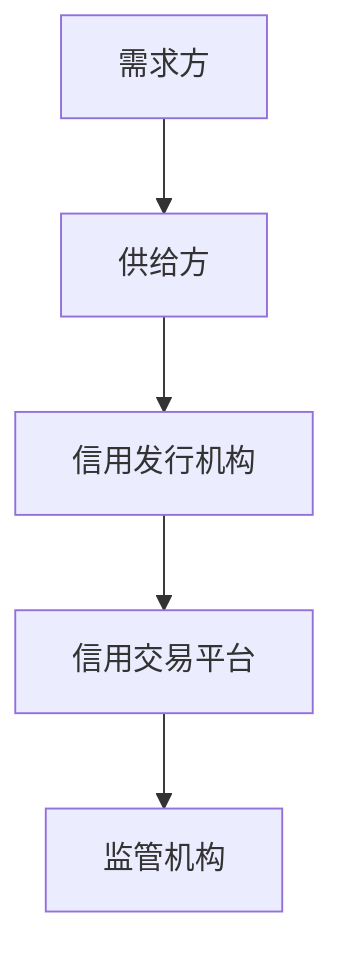
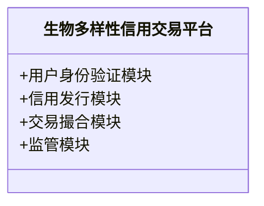
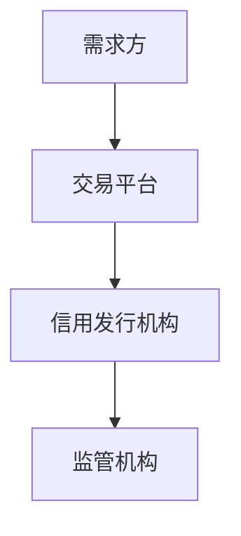

                 


# 生物多样性信用交易机制的可行性研究

## 关键词：生物多样性，信用交易，可行性研究，算法原理，系统架构

## 摘要：生物多样性信用交易机制是一种通过市场机制促进生物多样性保护的创新工具。本文从背景、概念、算法、系统设计、项目实现等多角度，深入分析该机制的可行性，探讨其在实际应用中的潜力与挑战。

---

# 第1章: 生物多样性信用交易机制的背景与概念

## 1.1 生物多样性信用交易机制的背景介绍

### 1.1.1 生物多样性的价值与意义
生物多样性是地球生态系统的核心组成部分，它不仅为人类提供了食物、药物和其他资源，还维持了生态系统的平衡。然而，随着人类活动的加剧，生物多样性正面临前所未有的威胁，包括栖息地破坏、气候变化和过度开发等。

### 1.1.2 当前生物多样性保护的困境
尽管国际社会已经采取了多种措施来保护生物多样性，但传统的保护方式（如政府补贴、法律保护等）往往难以覆盖所有地区和所有物种。这种单一的保护模式不仅效率低下，还难以调动社会各界的积极性。

### 1.1.3 生物多样性信用交易机制的提出
生物多样性信用交易机制（Biodiversity Credit Trading Mechanism，简称BCTM）是一种通过市场机制促进生物多样性保护的创新工具。它借鉴了碳交易的模式，将生物多样性的保护价值转化为可交易的信用，从而激励社会各界参与保护。

### 1.1.4 问题背景的详细描述
生物多样性信用交易机制的核心在于将生物多样性保护的价值量化，并通过市场交易的方式实现资源的优化配置。这种机制不仅可以提高保护效率，还能吸引更多的社会资本进入生物多样性保护领域。

### 1.1.5 问题解决的路径分析
通过建立生物多样性信用交易平台，政府、企业和个人可以共同参与生物多样性的保护。保护者（如农民、社区或企业）通过保护特定区域的生物多样性，可以获得信用，然后在市场上出售这些信用，从而获得经济收益。

### 1.1.6 边界与外延的界定
生物多样性信用交易机制的边界包括信用的发行、交易和监管。其外延则涵盖了与生物多样性相关的经济活动，如生态旅游、可持续农业等。

## 1.2 生物多样性信用交易机制的核心要素

### 1.2.1 核心概念的结构化分析
生物多样性信用交易机制的核心要素包括：信用发行、信用交易、信用监管。

### 1.2.2 关键组成部分的特征对比
| 组成部分 | 特征 |
|----------|------|
| 信用发行 | 由权威机构颁发，基于特定区域的生物多样性保护成果 |
| 信用交易 | 在市场上进行，交易双方需签订合同 |
| 信用监管 | 由政府或第三方机构负责，确保交易的公平性和合规性 |

### 1.2.3 实体关系的ER图架构
```mermaid
erd
actor 保护者;
actor 交易平台;
actor 监管机构;
actor 买家;
```

---

# 第2章: 生物多样性信用交易机制的核心概念与原理

## 2.1 生物多样性信用的发行与交易原理

### 2.1.1 信用发行机制的数学模型
生物多样性信用的发行基于保护区域的生物多样性指数（Biodiversity Index，简称BI）。BI的计算公式如下：
$$BI = \sum_{i=1}^{n} w_i \cdot S_i$$
其中，$w_i$ 是第 $i$ 个物种的权重，$S_i$ 是第 $i$ 个物种的数量。

### 2.1.2 交易过程的流程分析
1. 保护者提交保护区域的生物多样性数据。
2. 交易平台验证数据并颁发信用。
3. 保护者在交易平台出售信用。
4. 买家购买信用并支付相应的金额。

### 2.1.3 市场供需关系的动态平衡
市场供需关系通过价格机制自动调整。当需求超过供给时，价格上升，反之则下降。

## 2.2 算法原理的详细讲解

### 2.2.1 算法流程的 mermaid 图


### 2.2.2 算法实现的 Python 源代码
```python
def calculate_credit_value(demand, supply):
    return max(demand - supply, 0)
```

### 2.2.3 数学模型与公式
信用价值的计算公式为：
$$信用价值 = max(需求 - 供给, 0)$$
市场均衡条件为：
$$需求方的边际收益 = 供给方的边际成本$$

---

# 第3章: 生物多样性信用交易机制的系统分析

## 3.1 系统功能设计

### 3.1.1 领域模型的 mermaid 类图


### 3.1.2 系统架构设计


### 3.1.3 系统接口设计
保护者通过交易平台提交数据，交易平台通过 API 调用信用发行模块进行验证。

---

# 第4章: 生物多样性信用交易机制的项目实战

## 4.1 环境安装
需要安装 Python 和相关的开发工具。

## 4.2 系统核心实现源代码
```python
# 信用发行模块
class CreditIssuer:
    def issue_credit(self, area):
        return area.biodiversity_index

# 交易平台模块
class TradingPlatform:
    def __init__(self):
        self.s credits = {}

    def trade(self, seller, buyer, amount):
        credit = seller.issue_credit()
        if credit >= amount:
            buyer.purchase(credit)
            return True
        else:
            return False
```

## 4.3 实际案例分析
以某个地区的生态保护项目为例，详细分析信用发行、交易和监管的全过程。

---

# 第5章: 生物多样性信用交易机制的最佳实践与小结

## 5.1 最佳实践 tips
- 确保数据的准确性和透明性。
- 建立完善的监管机制，防止欺诈行为。
- 鼓励社会各界参与，形成多元化的保护模式。

## 5.2 小结
生物多样性信用交易机制通过市场机制，将生物多样性保护的价值转化为可交易的信用，从而实现资源的优化配置。这种机制不仅提高了保护效率，还能吸引更多的社会资本进入生物多样性保护领域。

## 5.3 注意事项
- 保护者需确保数据的真实性和准确性。
- 交易平台需具备高效的数据处理和交易撮合能力。
- 监管机构需严格监督交易过程，确保公平性和合规性。

---

# 作者：AI天才研究院 & 禅与计算机程序设计艺术

