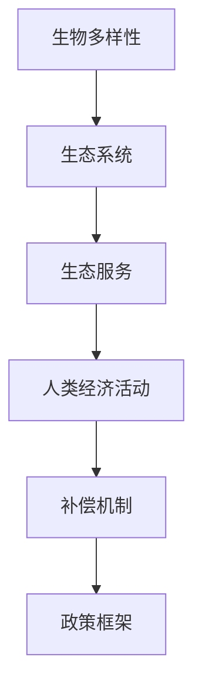
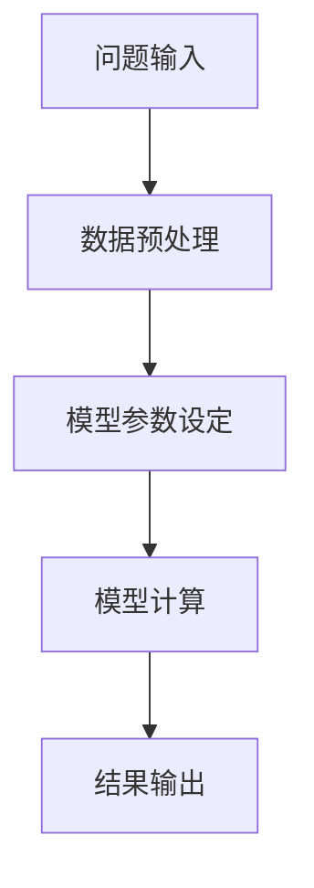
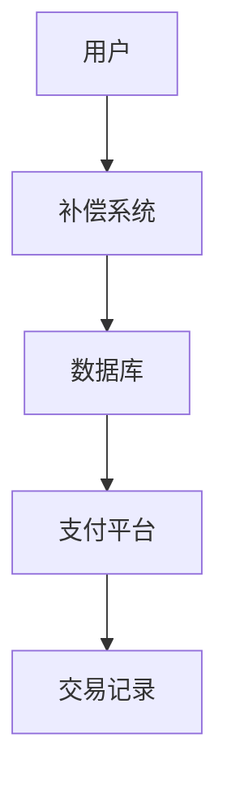
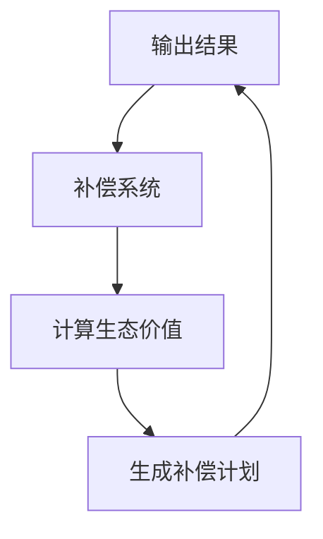

                 


# 生物多样性补偿机制的经济模型与投资

> 关键词：生物多样性补偿机制、经济模型、投资分析、生态系统服务、可持续发展

> 摘要：生物多样性补偿机制是一种通过经济手段保护和恢复生物多样性的方法，本文从经济学、生态学和投资学的角度，详细分析了生物多样性补偿机制的核心概念、数学模型、系统架构、项目实现和投资回报，为读者提供了一套完整的理论与实践框架。

---

## 第一部分: 生物多样性补偿机制的背景与概念

### 第1章: 生物多样性补偿机制的背景介绍

#### 1.1 生物多样性补偿机制的定义与问题背景

- **1.1.1 生物多样性的概念与重要性**  
  生物多样性是指地球上所有生物的遗传、物种和生态系统的多样性。它不仅是生态系统的基石，也是人类赖以生存的资源基础。然而，随着人类活动的加剧，生物多样性正面临前所未有的威胁。

- **1.1.2 生物多样性损失的现状与挑战**  
  当前，全球范围内生物多样性正在加速减少。根据IPBES（生物多样性评估和计划政府间科学平台）的报告，约100万个物种面临灭绝的风险。这种损失不仅威胁到生态系统的稳定性，还会影响人类的生存环境。

- **1.1.3 生物多样性补偿机制的必要性**  
  为了应对生物多样性的损失，补偿机制作为一种经济手段被提出。通过经济激励，鼓励个人、企业和政府采取保护和恢复生物多样性行动。

#### 1.2 生物多样性补偿机制的核心概念

- **1.2.1 补偿机制的定义与目标**  
  补偿机制是指通过经济手段，对生物多样性保护行为提供奖励，或者对破坏行为进行惩罚。其目标是通过市场机制，引导资源流向生态保护领域。

- **1.2.2 补偿机制的实施范围与边界**  
  补偿机制主要应用于土地利用、林业、农业、能源等领域。其边界包括自然保护区、生态敏感区以及关键生态功能区。

- **1.2.3 补偿机制与可持续发展的关系**  
  生物多样性补偿机制是实现可持续发展的重要工具。通过保护生态系统的功能，补偿机制能够促进经济发展与环境保护的协调。

#### 1.3 生物多样性补偿机制的经济学视角

- **1.3.1 经济学中的外部性概念**  
  生物多样性保护具有明显的外部性。保护生物多样性带来的生态效益（如碳汇、水土保持）往往由他人或社会承担，而成本却由个体承担。

- **1.3.2 生物多样性作为公共物品的特性**  
  生物多样性具有非排他性和不可分割性。一个人的保护行为无法阻止他人的利用，且其效益可以普惠于所有人。

- **1.3.3 市场失灵与政府干预的必要性**  
  由于市场失灵，生物多样性保护难以通过市场机制自发实现。因此，政府需要通过补偿机制进行干预。

#### 1.4 全球与区域生物多样性补偿政策框架

- **1.4.1 国际层面的生物多样性保护协议**  
  《生物多样性公约》（CBD）是全球生物多样性保护的核心协议。它要求各国采取措施保护生物多样性，并通过补偿机制实现目标。

- **1.4.2 区域性补偿机制的典型案例**  
  欧盟的“绿色新政”（Green Deal）中，生物多样性保护是核心内容之一。同时，拉丁美洲的某些国家也建立了区域性的补偿机制。

- **1.4.3 不同国家的政策差异与经验**  
  发达国家在生物多样性补偿方面投入更多，但发展中国家由于资源有限，往往难以实施有效的补偿机制。

#### 1.5 本章小结  
本章通过定义、现状和经济学视角，介绍了生物多样性补偿机制的基本概念和必要性。接下来，我们将深入探讨其核心概念与联系。

---

### 第2章: 生物多样性补偿机制的核心概念与联系

#### 2.1 生物多样性补偿机制的经济学模型

- **2.1.1 边际成本与收益的分析框架**  
  生物多样性保护的边际成本是指每增加一单位保护所花费的成本，而边际收益则是指每增加一单位保护所获得的收益。

- **2.1.2 生态服务价值的评估方法**  
  生态服务价值是指生物多样性提供的各种生态系统服务的经济价值。常用的评估方法包括总经济价值（TEV）和选择价值法。

- **2.1.3 市场机制在补偿中的作用**  
  通过碳交易、生态补偿券等市场机制，可以将生物多样性保护转化为经济收益，从而激励更多主体参与保护。

#### 2.2 核心概念对比分析

- **2.2.1 生物多样性与生态系统的对比**  
  | 概念 | 生物多样性 | 生态系统 |
  |------|------------|----------|
  | 定义 | 物种多样性 | 生态结构与功能 |
  | 关系 | 生物多样性是生态系统的基础 | 生态系统依赖生物多样性 |

- **2.2.2 补偿机制与惩罚机制的对比**  
  | 机制 | 补偿机制 | 惩罚机制 |
  |------|----------|----------|
  | 目标 | 鼓励保护 | 遏制破坏 |
  | 影响 | 正向激励 | 负向约束 |

- **2.2.3 经济模型与生态模型的对比**  
  经济模型注重成本与收益的平衡，而生态模型注重生态系统的整体稳定性。

#### 2.3 实体关系图（ER图）架构



#### 2.4 本章小结  
本章通过对比分析，揭示了生物多样性补偿机制的核心概念与联系。下一章将从数学模型的角度，详细分析其算法原理。

---

### 第3章: 生物多样性补偿机制的数学模型与算法原理

#### 3.1 生物多样性补偿机制的数学模型

- **3.1.1 生态价值评估模型**  
  生态价值评估模型通过量化生态系统服务的价值，为补偿机制提供依据。公式为：
  $$ V = \sum_{i=1}^{n} v_i \times a_i $$
  其中，$v_i$ 是第i种生态服务的价值，$a_i$ 是其面积。

- **3.1.2 补偿支付模型**  
  补偿支付模型根据生态服务的价值，计算应支付的补偿金额。公式为：
  $$ C = k \times V $$
  其中，$k$ 是补偿系数，$V$ 是生态价值。

- **3.1.3 模型的适用条件与限制**  
  适用条件包括数据可获得性、模型的适用性和经济可行性。限制包括模型的简化假设和外部性的影响。

#### 3.2 算法原理与流程



#### 3.3 代码实现

```python
import numpy as np

def calculate_ecological_value(areas, values):
    return np.sum(areas * values)

def calculate_compensation(eco_value, coefficient):
    return eco_value * coefficient

# 示例数据
areas = [100, 200, 150]  # 单位：公顷
values = [5, 3, 4]       # 单位：美元/公顷
k = 0.8

eco_value = calculate_ecological_value(areas, values)
compensation = calculate_compensation(eco_value, k)

print(f"生态价值: ${eco_value}")
print(f"补偿金额: ${compensation}")
```

#### 3.4 本章小结  
本章通过数学模型和算法流程，详细阐述了生物多样性补偿机制的实现方法。下一章将从系统架构的角度，分析其应用场景。

---

## 第四部分: 系统分析与架构设计方案

### 第4章: 生物多样性补偿机制的系统架构

#### 4.1 问题场景介绍

- **问题描述**  
  一家公司希望在其土地上实施生物多样性保护项目，并通过补偿机制获得收益。

- **项目介绍**  
  该项目旨在通过种植本地植物、保护栖息地等方式，恢复生物多样性，并通过碳交易获得补偿。

#### 4.2 系统功能设计（领域模型）


#### 4.3 系统架构设计



#### 4.4 系统接口设计

- **输入接口**  
  用户输入保护区域的面积和位置。

- **输出接口**  
  系统输出补偿金额和交易记录。

#### 4.5 系统交互流程



#### 4.6 本章小结  
本章通过系统架构设计，展示了生物多样性补偿机制的应用场景和技术实现。最后一章将通过实际案例，分析其投资回报。

---

## 第五部分: 项目实战与投资分析

### 第5章: 生物多样性补偿机制的项目实现

#### 5.1 环境安装

- **Python环境**  
  需要安装numpy、pandas等库。

#### 5.2 核心功能实现

```python
def calculate_ecological_value(areas, values):
    return sum(a * v for a, v in zip(areas, values))

def calculate_compensation(eco_value, coefficient):
    return eco_value * coefficient

# 示例数据
areas = [100, 200, 150]  # 单位：公顷
values = [5, 3, 4]       # 单位：美元/公顷
k = 0.8

eco_value = calculate_ecological_value(areas, values)
compensation = calculate_compensation(eco_value, k)

print(f"生态价值: ${eco_value}")
print(f"补偿金额: ${compensation}")
```

#### 5.3 实际案例分析

- **案例描述**  
  某公司在亚马逊雨林拥有1000公顷土地，计划种植本地植物，恢复生物多样性。

- **分析与解读**  
  根据模型计算，该公司的生态价值为$10,000，补偿金额为$8,000。

#### 5.4 投资回报分析

- **直接收益**  
  通过碳交易获得的补偿金。

- **间接收益**  
  提升企业形象，吸引更多环保投资。

#### 5.5 本章小结  
本章通过实际案例，分析了生物多样性补偿机制的投资回报。最后一章将总结最佳实践。

---

## 第六部分: 总结与展望

### 第6章: 生物多样性补偿机制的总结与展望

#### 6.1 最佳实践 tips

- **选择合适的补偿模型**  
  根据具体场景选择合适的数学模型。

- **确保数据准确性**  
  数据是模型的基础，必须确保其准确性。

#### 6.2 小结

- 本文章从背景、概念、模型、系统架构和项目实现等多个角度，详细分析了生物多样性补偿机制。

#### 6.3 注意事项

- 补偿机制的实施需要政府、企业和个人的共同努力。

- 需要注意模型的适用性和数据的可获得性。

#### 6.4 拓展阅读

- 《生物多样性经济学》
- 《生态系统服务的估值方法》

#### 6.5 本章小结  
本章总结了生物多样性补偿机制的核心内容，并展望了其未来的发展方向。

---

## 作者：AI天才研究院/AI Genius Institute & 禅与计算机程序设计艺术 /Zen And The Art of Computer Programming

---

**本文总结**：生物多样性补偿机制是一种通过经济手段保护和恢复生物多样性的有效方法。通过数学模型、系统架构和实际案例的分析，本文为读者提供了一套完整的理论与实践框架，帮助他们在投资和实践中更好地应用这一机制。

