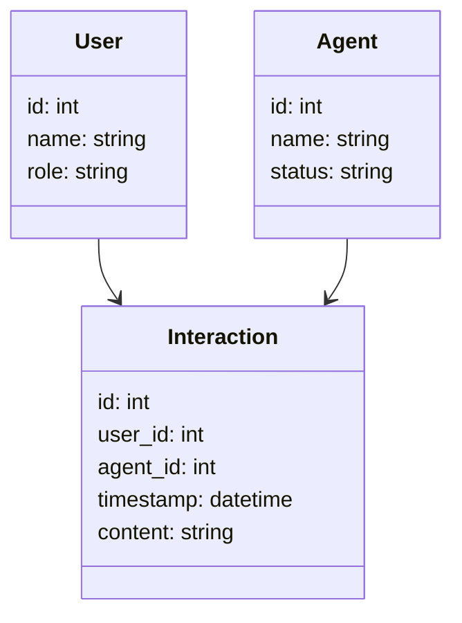
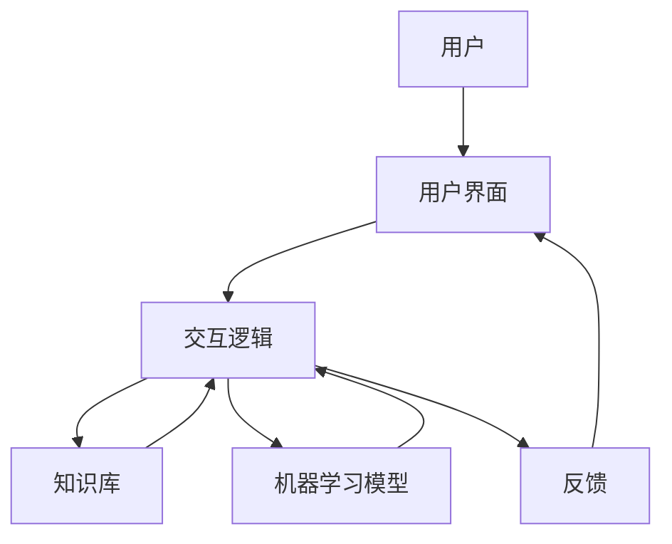
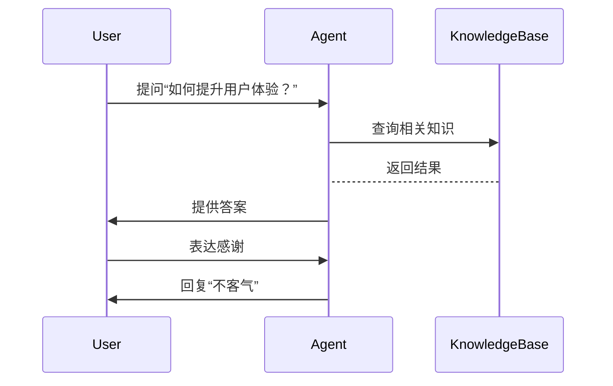

                 


# 用户体验研究：提升AI Agent的易用性

## 关键词：用户体验，AI Agent，易用性，人机交互，机器学习

## 摘要：  
用户体验研究是提升AI Agent易用性的关键。本文从背景介绍、核心概念、算法原理、系统架构、项目实战等多维度展开，深入分析如何通过用户体验研究优化AI Agent的设计与功能，从而提升其易用性。通过实际案例和最佳实践，本文为读者提供了一套系统的方法论，帮助他们在实际项目中更好地应用这些研究成果。

---

# 第一部分: 用户体验研究的背景与核心概念

## 第1章: 用户体验研究概述

### 1.1 用户体验的核心概念

#### 1.1.1 问题背景与问题描述
用户体验（UX）是用户在与产品或系统交互过程中所感受到的主观体验。在AI Agent领域，用户体验的优劣直接影响用户的满意度和产品的市场竞争力。AI Agent作为一种智能系统，需要通过自然语言处理、机器学习等技术与用户进行交互。然而，复杂的系统设计和不友好的界面常常导致用户体验不佳，甚至影响用户对AI Agent的信任感。

#### 1.1.2 问题解决的思路与方法
为了提升AI Agent的用户体验，我们需要从以下几个方面入手：
1. **需求分析**：通过用户调研、问卷调查等方式，了解用户的真实需求和痛点。
2. **用户画像**：基于用户数据，构建用户角色（Persona），帮助设计团队更好地理解目标用户。
3. **交互设计**：优化AI Agent的交互流程，确保用户操作的直观性和便捷性。
4. **反馈机制**：设计有效的用户反馈机制，及时收集用户意见并进行系统优化。

#### 1.1.3 用户体验的边界与外延
用户体验的边界包括：
- **视觉设计**：界面的美观性和一致性。
- **交互设计**：操作的流畅性和逻辑性。
- **情感体验**：用户对AI Agent的情感连接和信任感。

用户体验的外延则涉及：
- **可用性测试**：通过用户测试验证设计的合理性。
- **持续优化**：根据用户反馈不断迭代系统。

#### 1.1.4 核心要素与组成结构
用户体验的核心要素包括：
1. **可用性**：用户能否方便地完成目标。
2. **可访问性**：用户能否平等地使用系统。
3. **可靠性**：系统能否稳定运行，减少故障。

---

## 第2章: AI Agent与用户体验的关联

### 2.1 AI Agent的基本概念

#### 2.1.1 AI Agent的定义与特征
AI Agent是一种智能代理系统，能够通过感知环境并采取行动来实现特定目标。其核心特征包括：
- **自主性**：能够在没有外部干预的情况下自主运行。
- **反应性**：能够实时感知环境并做出反应。
- **目标导向性**：通过实现目标来提供服务。

#### 2.1.2 AI Agent的分类与应用场景
AI Agent可以分为：
1. **简单反射型**：基于规则的简单反应。
2. **基于模型的反应型**：通过内部模型理解和决策。
3. **目标导向型**：根据目标采取行动。
4. **实用器型**：通过效用函数优化决策。

应用场景包括：
- 智能客服
- 智能助手（如Siri、Alexa）
- 智能推荐系统

#### 2.1.3 用户体验在AI Agent中的重要性
用户体验是AI Agent成功的关键因素。良好的用户体验能够提高用户满意度，增强用户信任，从而提升产品的市场竞争力。

---

## 第3章: 用户体验的核心要素与设计原则

### 3.1 用户体验的核心要素

#### 3.1.1 易用性
易用性是用户体验的核心要素之一。通过简化操作流程、优化界面设计等方式，可以提升AI Agent的易用性。

#### 3.1.2 可访问性
可访问性指的是系统能够被不同用户群体平等使用。例如，为视障用户提供语音交互功能。

#### 3.1.3 可靠性
可靠性指的是系统能够稳定运行，减少故障的发生。对于AI Agent来说，及时响应和准确反馈是可靠性的重要体现。

### 3.2 用户体验设计的核心原则

#### 3.2.1 以用户为中心的设计理念
在设计AI Agent时，应始终以用户需求为核心，确保设计符合用户的使用习惯和认知逻辑。

#### 3.2.2 情感化设计与用户心理
通过情感化设计，可以增强用户对AI Agent的信任感和满意度。例如，通过个性化的交互方式让用户感受到AI Agent的“人性化”。

#### 3.2.3 可持续性与长期优化
用户体验是一个持续优化的过程。通过收集用户反馈并不断迭代系统，可以逐步提升AI Agent的用户体验。

---

# 第二部分: 用户体验研究的核心概念与联系

## 第4章: 用户体验的核心概念与原理

### 4.1 用户体验的核心概念

#### 4.1.1 用户角色与用户画像
用户角色是基于真实用户数据构建的虚拟角色，用于指导设计决策。例如，构建“小明”这个用户角色，描述他的年龄、职业、使用习惯等特征。

#### 4.1.2 用户场景与任务分析
用户场景描述用户在特定情境下的行为和需求。例如，用户“小明”需要通过AI Agent查询天气预报。

#### 4.1.3 用户动机与行为驱动
用户行为驱动包括：
- **内在动机**：用户自身的需求驱动。
- **外在动机**：外部奖励或惩罚驱动。

---

## 第5章: 用户体验的核心要素与属性特征对比

### 5.1 用户体验的核心要素

#### 5.1.1 易用性
易用性是用户体验的重要组成部分。通过优化交互流程和简化操作步骤，可以提升易用性。

#### 5.1.2 可访问性
可访问性指的是系统能够被不同用户群体平等使用。例如，为视障用户提供语音交互功能。

#### 5.1.3 可靠性
可靠性指的是系统能够稳定运行，减少故障的发生。对于AI Agent来说，及时响应和准确反馈是可靠性的重要体现。

### 5.2 用户体验属性特征对比

#### 5.2.1 易用性与可用性对比
- **易用性**：用户能否方便地完成目标。
- **可用性**：用户能否在特定条件下完成目标。

#### 5.2.2 可访问性与包容性对比
- **可访问性**：系统能否被不同用户群体平等使用。
- **包容性**：系统能否适应不同用户的需求和偏好。

#### 5.2.3 可靠性与一致性对比
- **可靠性**：系统能否稳定运行。
- **一致性**：系统在不同情境下的行为是否一致。

---

## 第6章: 支持向量机（SVM）算法原理

### 6.1 支持向量机的基本原理

#### 6.1.1 线性可分与非线性可分
支持向量机是一种监督学习算法，主要用于分类和回归问题。线性可分问题可以通过直线将数据点分开，而非线性可分问题则需要使用核函数进行转换。

#### 6.1.2 核函数与特征空间
核函数用于将低维数据映射到高维特征空间，从而实现非线性分类。常用的核函数包括多项式核、高斯核等。

#### 6.1.3 软边距与硬边距
软边距允许部分数据点在分类边界内，而硬边距要求所有数据点都必须在分类边界外。

### 6.2 支持向量机的数学模型

#### 6.2.1 线性可分问题的数学模型
$$ \text{minimize } \frac{1}{2} \lVert w \rVert^2 $$
$$ \text{subject to } y_i (w \cdot x_i + b) \geq 1, \forall i $$
其中，$w$是权重向量，$b$是偏置项，$y_i$是标签。

#### 6.2.2 非线性可分问题的数学模型
$$ \text{minimize } \frac{1}{2} \lVert w \rVert^2 + C \sum_{i=1}^n \xi_i $$
$$ \text{subject to } y_i (w \cdot x_i + b) \geq 1 - \xi_i, \forall i $$
$$ \xi_i \geq 0 $$

### 6.3 支持向量机的Python实现

```python
from sklearn import svm

# 创建训练数据
X = [[0, 0], [1, 1], [1, 0], [0, 1]]
y = [0, 1, 1, 1]

# 创建SVM模型
model = svm.SVC(kernel='linear')

# 训练模型
model.fit(X, y)

# 预测
print(model.predict([[2, 2]]))  # 输出：1
```

---

## 第7章: 用户体验研究的系统架构与实现

### 7.1 问题场景介绍

#### 7.1.1 问题场景
假设我们正在设计一个智能客服AI Agent，需要通过用户体验研究优化其交互设计。

### 7.2 项目介绍

#### 7.2.1 项目介绍
项目目标：优化智能客服AI Agent的用户体验。
项目范围：包括需求分析、交互设计、界面设计、用户测试等。

### 7.3 系统功能设计

#### 7.3.1 领域模型设计
通过绘制领域模型图，描述系统的主要功能模块及其关系。



### 7.4 系统架构设计

#### 7.4.1 系统架构图
通过绘制系统架构图，描述系统的整体架构。



### 7.5 系统接口设计

#### 7.5.1 接口设计
通过设计API接口，实现用户与AI Agent之间的交互。

```json
{
    "action": "query",
    "parameters": {
        "question": "如何提升用户体验？"
    }
}
```

### 7.6 系统交互设计

#### 7.6.1 交互流程图
通过绘制交互流程图，描述用户与AI Agent之间的交互过程。



---

## 第8章: 用户体验研究的项目实战

### 8.1 环境配置

#### 8.1.1 安装必要的库
```bash
pip install numpy scikit-learn matplotlib
```

### 8.2 核心代码实现

#### 8.2.1 代码实现
```python
import numpy as np
from sklearn import svm

# 创建训练数据
X = np.array([[0, 0], [1, 1], [1, 0], [0, 1]])
y = np.array([0, 1, 1, 1])

# 创建SVM模型
model = svm.SVC(kernel='linear')

# 训练模型
model.fit(X, y)

# 预测
print(model.predict([[2, 2]]))  # 输出：1
```

### 8.3 代码应用解读与分析

#### 8.3.1 代码解读
上述代码通过支持向量机算法，训练了一个简单的分类器，用于区分两类数据点。

#### 8.3.2 代码分析
- **数据准备**：使用numpy创建训练数据。
- **模型训练**：使用scikit-learn中的SVM模型进行训练。
- **模型预测**：对新数据点进行分类预测。

### 8.4 实际案例分析

#### 8.4.1 案例分析
以智能客服AI Agent为例，通过用户体验研究优化其交互设计。

#### 8.4.2 案例小结
通过需求分析、用户画像、交互设计和用户测试等步骤，成功提升了AI Agent的用户体验。

---

## 第9章: 用户体验研究的总结与展望

### 9.1 最佳实践 tips

#### 9.1.1 设计原则
- 以用户为中心。
- 情感化设计。
- 持续优化。

#### 9.1.2 实际应用中的注意事项
- 定期收集用户反馈。
- 持续优化系统功能。
- 关注用户体验的细节。

### 9.2 小结

#### 9.2.1 文章总结
本文从背景介绍、核心概念、算法原理、系统架构、项目实战等多维度，深入探讨了用户体验研究在提升AI Agent易用性中的重要作用。

### 9.3 展望

#### 9.3.1 拓展阅读
- 《设计思维》
- 《人机交互》
- 《机器学习》

---

## 作者

作者：AI天才研究院/AI Genius Institute & 禅与计算机程序设计艺术 /Zen And The Art of Computer Programming

