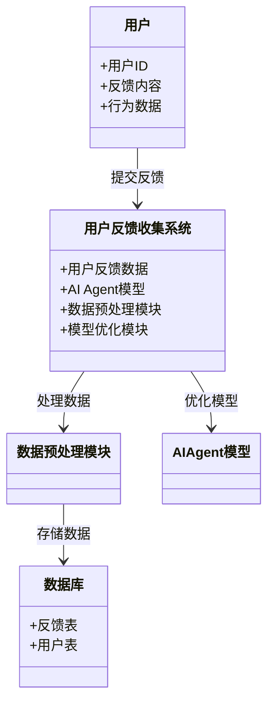

                 


# 用户反馈收集：迭代改进AI Agent

---

## 关键词

- 用户反馈
- AI Agent
- 迭代改进
- 机器学习
- 算法优化

---

## 摘要

本文将详细探讨如何通过用户反馈来迭代改进AI Agent。用户反馈是AI Agent优化的核心驱动力，通过分析用户行为、偏好和反馈数据，AI Agent能够不断优化自身的决策能力和用户体验。文章将从背景介绍、核心概念、算法原理、系统架构设计、项目实战以及最佳实践等多维度展开，深入分析用户反馈在AI Agent迭代改进中的关键作用，并提供具体的实现方案和代码示例。

---

## 第一部分：用户反馈收集与AI Agent的背景介绍

### 第1章：用户反馈的核心概念

#### 1.1 用户反馈的定义与分类

用户反馈是指用户在与AI Agent交互过程中提供的各种形式的意见、建议、评分或行为数据。用户反馈可以是显式的（例如直接给出评分、评价或建议）或隐式的（例如通过行为数据，如点击、停留时间等间接反映用户的偏好）。

| **反馈类型** | **描述** |
|---------------|-----------|
| 显式反馈     | 用户主动提供的意见、评分或建议 |
| 隐式反馈     | 通过用户行为间接反映的偏好 |

#### 1.2 用户反馈的重要性

用户反馈是AI Agent优化的重要数据来源，能够帮助开发者理解用户需求、改进算法性能、提升用户体验。

---

### 第2章：AI Agent的基本概念

#### 2.1 AI Agent的定义与特点

AI Agent是一种能够感知环境、执行任务并做出决策的智能实体。AI Agent的核心特点包括：

1. **自主性**：能够在没有外部干预的情况下运行。
2. **反应性**：能够根据环境变化做出实时响应。
3. **学习能力**：能够通过数据和反馈不断优化自身行为。

#### 2.2 AI Agent的核心功能

AI Agent的功能模块通常包括：

1. **感知模块**：收集环境数据（如用户输入、行为数据）。
2. **决策模块**：基于感知数据做出决策。
3. **执行模块**：执行决策并输出结果。

---

## 第二部分：用户反馈与AI Agent的核心原理

### 第3章：用户反馈与AI Agent的核心原理

#### 3.1 用户反馈在AI Agent中的作用

用户反馈是AI Agent优化的关键输入。通过分析用户反馈，AI Agent可以：

1. **改进决策模型**：优化算法参数，提升决策准确度。
2. **增强用户体验**：根据用户偏好调整交互方式。
3. **预测用户行为**：通过反馈数据预测用户需求。

#### 3.2 用户反馈的收集与处理流程

用户反馈的处理流程包括以下几个步骤：

1. **数据采集**：通过用户输入或行为数据收集反馈。
2. **数据预处理**：清洗数据，提取有用信息。
3. **数据分析**：通过机器学习算法分析反馈数据。
4. **模型优化**：根据反馈结果优化AI Agent的算法参数。

---

## 第三部分：基于用户反馈的AI Agent改进算法

### 第4章：基于反馈的机器学习算法

#### 4.1 监督学习

在监督学习中，用户反馈可以作为标签数据，用于训练分类模型。例如，可以通过用户反馈对AI Agent的输出进行分类，提升分类准确度。

#### 4.2 强化学习

强化学习是一种通过奖励机制优化决策模型的算法。用户反馈可以作为奖励信号，帮助AI Agent学习最优策略。

#### 4.3 半监督学习

在半监督学习中，部分用户反馈数据可以用于标注未标记数据，从而提高模型的泛化能力。

---

### 第5章：基于反馈的数学模型与公式

#### 5.1 损失函数

在监督学习中，损失函数用于衡量模型预测值与真实值的差距。常见的损失函数包括均方误差（MSE）和交叉熵损失。

$$ \text{MSE} = \frac{1}{n}\sum_{i=1}^{n}(y_i - \hat{y_i})^2 $$

$$ \text{交叉熵损失} = -\frac{1}{n}\sum_{i=1}^{n} y_i \log(\hat{y_i}) + (1 - y_i) \log(1 - \hat{y_i}) $$

#### 5.2 优化器

优化器用于调整模型参数以最小化损失函数。常见的优化器包括随机梯度下降（SGD）和Adam优化器。

$$ \text{Adam优化器} = \beta_1 \text{梯度} + \beta_2 \text{动量} $$

---

## 第四部分：系统分析与架构设计

### 第6章：系统功能设计

#### 6.1 领域模型类图

以下是用户反馈处理系统的领域模型类图：



---

### 第7章：系统架构设计

#### 7.1 系统架构图

以下是用户反馈处理系统的架构图：


---

## 第五部分：项目实战

### 第8章：用户反馈收集系统实战

#### 8.1 环境安装

安装必要的Python库：

```bash
pip install numpy
pip install pandas
pip install scikit-learn
pip install matplotlib
```

#### 8.2 核心代码实现

以下是用户反馈收集与处理的核心代码：

```python
import numpy as np
from sklearn.model_selection import train_test_split
from sklearn.linear_model import LinearRegression

# 数据预处理
def preprocess_feedback(feedback_data):
    # 数据清洗
    feedback_data = feedback_data.dropna()
    # 特征提取
    X = feedback_data[['user_id', 'feedback_score']]
    y = feedback_data['target']
    return X, y

# 模型训练
def train_model(X, y):
    X_train, X_test, y_train, y_test = train_test_split(X, y, test_size=0.2)
    model = LinearRegression()
    model.fit(X_train, y_train)
    return model

# 模型优化
def optimize_model(model, X_test, y_test):
    score = model.score(X_test, y_test)
    print(f"模型得分：{score}")
    return model

# 主函数
def main():
    feedback_data = pd.read_csv('feedback.csv')
    X, y = preprocess_feedback(feedback_data)
    model = train_model(X, y)
    optimized_model = optimize_model(model, X_test, y_test)

if __name__ == "__main__":
    main()
```

---

### 第9章：实际案例分析与解读

#### 9.1 案例分析

假设我们有一个在线客服AI Agent，用户可以通过评分和评论对客服的响应速度和准确性进行反馈。通过收集这些反馈数据，我们可以使用机器学习算法优化客服的响应策略。

#### 9.2 案例解读

通过分析用户反馈数据，我们可以发现某些用户对AI Agent的响应时间敏感，而另一些用户则更关注回答的准确性。根据这些反馈，我们可以调整AI Agent的决策策略，优先满足用户的个性化需求。

---

## 第六部分：最佳实践与总结

### 第10章：最佳实践

#### 10.1 实践建议

1. **实时反馈处理**：尽量实时处理用户反馈，减少延迟。
2. **多模态反馈分析**：结合文本、语音、行为等多种反馈形式。
3. **用户隐私保护**：确保用户反馈数据的隐私安全。

---

### 第11章：总结与展望

用户反馈是AI Agent优化的核心驱动力。通过分析用户反馈数据，AI Agent可以不断改进自身算法，提升用户体验。未来，随着机器学习算法的不断进步，用户反馈在AI Agent优化中的作用将更加重要。

---

## 作者

作者：AI天才研究院（AI Genius Institute） & 禅与计算机程序设计艺术（Zen And The Art of Computer Programming）

---

以上是《用户反馈收集：迭代改进AI Agent》的技术博客文章的完整内容，涵盖了从背景介绍到项目实战的各个层面，适合技术人员和AI领域的从业者阅读。

