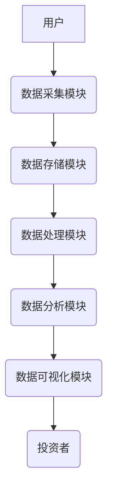

                 


# 电动汽车产业链的ESG投资机会分析

## 关键词：电动汽车产业链，ESG投资，环境因素，社会责任，公司治理，绿色能源，可持续发展

## 摘要：  
本文系统分析了电动汽车产业链中的ESG投资机会，从环境、社会和治理三个维度探讨了电动汽车产业链的关键影响因素。通过构建数学模型和算法，分析了如何通过ESG评分和投资组合优化来评估和选择投资标的。同时，本文还结合实际案例，提供了系统的数据支持和项目实战分析，为投资者提供了清晰的ESG投资策略和风险管理方法。

---

## 第1章：ESG投资的定义与重要性

### 1.1 ESG投资的定义

#### 1.1.1 环境（Environmental）的定义与内涵  
环境因素关注企业在生产过程中对自然资源的消耗、碳排放、污染治理等方面的表现。在电动汽车产业链中，环境因素主要体现在电池生产过程中的碳排放、废旧电池回收处理的环保要求以及充电过程中能源的绿色化应用。

#### 1.1.2 社会责任（Social）的定义与内涵  
社会责任强调企业在经营过程中对员工、消费者和社会的贡献，包括劳工权益、社会公平、社区支持等方面。在电动汽车产业链中，社会责任体现在企业对员工的福利保障、对供应商的公平对待以及对社会就业的促进。

#### 1.1.3 公司治理（Governance）的定义与内涵  
公司治理关注企业的组织架构、董事会结构、高管薪酬、股东权益保护等内部管理机制。在电动汽车产业链中，公司治理因素主要体现在企业的透明度、管理层的决策能力和合规性。

### 1.2 ESG投资的重要性

#### 1.2.1 ESG投资对可持续发展的意义  
ESG投资不仅关注企业的财务表现，更关注其对环境、社会和治理的贡献。在电动汽车产业链中，ESG投资有助于推动行业向更可持续的方向发展，减少资源浪费和环境污染，促进社会公平与和谐。

#### 1.2.2 ESG投资对投资者的价值  
通过关注ESG因素，投资者可以识别和规避潜在的风险，如环境政策变化、社会责任缺失导致的声誉损失以及公司治理不善引发的财务风险。同时，ESG表现优异的企业往往具有更强的长期盈利能力。

#### 1.2.3 ESG投资与全球气候变化的目标  
全球气候变化是当前最重要的环境挑战之一。电动汽车产业链作为减少碳排放的重要组成部分，其ESG表现直接关系到全球气候变化目标的实现。通过投资ESG表现优异的电动汽车企业，投资者可以为全球气候治理贡献力量。

---

## 第2章：电动汽车产业链的结构与特点

### 2.1 电动汽车产业链的构成

#### 2.1.1 上游：原材料与零部件供应商  
上游主要包括锂、镍、钴等电池原材料供应商，以及电机、电控系统等零部件制造商。这些供应商的生产过程中的环境和社会责任表现直接影响整个产业链的ESG评分。

#### 2.1.2 中游：电池、电机、电控系统制造商  
中游是电动汽车产业链的核心部分，主要包括电池制造商（如宁德时代、比亚迪）、电机制造商（如卧龙电气）和电控系统制造商（如德尔福）。这些企业在生产过程中需要关注碳排放、员工福利和公司治理透明度。

#### 2.1.3 下游：整车制造商与充电设施运营商  
下游包括整车制造商（如特斯拉、大众、丰田）和充电设施运营商（如国家电网、星星充电）。整车制造商的生产过程和供应链管理是ESG评估的重要部分，而充电设施运营商的环境表现则体现在充电能源的绿色化和充电站的建设是否符合社会需求。

### 2.2 电动汽车产业链的关键技术与发展趋势

#### 2.2.1 电池技术的突破与挑战  
电池技术是电动汽车的核心，直接影响续航里程和安全性。当前，锂离子电池技术不断进步，但电池回收和二次利用仍面临技术瓶颈。环境因素要求电池企业必须在生产过程中减少碳排放，同时建立完善的废旧电池回收体系。

#### 2.2.2 智能化与网联化的发展趋势  
随着人工智能和物联网技术的发展，电动汽车正在向智能化和网联化方向转型。这不仅提升了用户体验，也对企业的社会责任和公司治理提出了更高要求，例如数据隐私保护和网络安全。

#### 2.2.3 充电基础设施的建设与优化  
充电基础设施是电动汽车产业链的重要组成部分。环境因素要求充电设施必须使用绿色能源，而社会责任则要求充电站的布局必须满足社会需求，尤其是在偏远地区提供充电服务。

---

## 第3章：ESG与电动汽车产业链的结合

### 3.1 环境因素在电动汽车产业链中的体现

#### 3.1.1 电池生产过程中的碳排放问题  
电池生产是电动汽车产业链中碳排放的主要来源之一。企业需要通过技术创新和管理优化，减少生产过程中的碳排放。例如，采用清洁能源发电、提高生产效率和回收余热。

#### 3.1.2 废旧电池回收与处理的环保要求  
废旧电池的处理是环境治理的重要环节。企业需要建立完善的回收体系，确保废旧电池不会对环境造成二次污染。同时，电池材料的循环利用也是降低环境影响的重要途径。

#### 3.1.3 充电过程中的能源消耗与绿色能源的应用  
充电过程中的能源消耗直接影响环境表现。企业需要推广绿色能源的使用，例如太阳能和风能发电，并通过智能充电技术优化能源使用效率。

### 3.2 社会因素在电动汽车产业链中的体现

#### 3.2.1 劳工权益与企业社会责任  
企业在生产过程中需要保障员工的合法权益，包括公平的薪酬、安全的工作环境和良好的劳动关系。同时，企业还需要关注员工的职业发展和培训机会。

#### 3.2.2 产业链上下游企业的社会影响  
电动汽车产业链的上下游企业需要关注社会公平和包容性发展。例如，电池供应商需要确保原材料的采购符合伦理标准，整车制造商需要关注产品的可及性和 affordability。

#### 3.2.3 电动汽车普及对社会就业与经济结构的影响  
电动汽车的普及将改变传统的汽车产业链结构，催生新的就业机会，例如充电站运维人员、电池回收工程师等。同时，电动汽车产业的发展也对地方政府的经济政策和社会治理能力提出了新的要求。

### 3.3 公司治理因素在电动汽车产业链中的体现

#### 3.3.1 企业的透明度与信息披露  
公司治理要求企业必须保持透明度，定期披露环境、社会和治理方面的信息。例如，企业需要公开碳排放数据、社会责任实践和公司治理结构。

#### 3.3.2 高管薪酬与激励机制  
高管的薪酬结构和激励机制是公司治理的重要组成部分。合理的激励机制可以确保高管的行为与企业长期发展目标一致，同时也能有效避免短期行为。

#### 3.3.3 企业合规性与风险管理  
公司治理要求企业必须遵守相关法律法规，并建立有效的风险管理机制。例如，企业需要应对环境政策变化带来的风险，确保合规性。

---

## 第4章：ESG投资机会的数学模型与算法分析

### 4.1 ESG评分模型的构建

#### 4.1.1 数据采集与处理  
ESG评分模型需要收集企业的环境、社会和治理方面的数据。数据来源包括企业年报、社会责任报告、第三方评级机构的数据以及新闻媒体的相关报道。

#### 4.1.2 数据清洗与特征提取  
为了提高模型的准确性，需要对数据进行清洗，去除重复和异常值。同时，需要提取关键特征，例如碳排放强度、员工满意度、董事会结构等。

#### 4.1.3 指标权重的确定  
不同维度的指标对ESG评分的影响程度不同。可以通过因子分析法确定各指标的权重。例如，环境指标的权重为0.4，社会指标为0.3，治理指标为0.3。

#### 4.1.4 ESG评分计算公式  
$$ ESG\_score = \sum_{i=1}^{n} w_i \times score_i $$  
其中，$w_i$ 是第i个指标的权重，$score_i$ 是第i个指标的评分。

### 4.2 投资组合优化的算法分析

#### 4.2.1 确定投资目标与约束条件  
投资目标包括最大化投资回报率和最小化投资风险。约束条件包括投资组合的ESG评分必须达到一定标准，以及投资组合的波动率必须在合理范围内。

#### 4.2.2 构建优化模型  
$$ \text{最大化 } R = \sum_{i=1}^{n} w_i \times r_i $$  
$$ \text{约束 } ESG\_score \geq T $$  
$$ \text{且 } \sum_{i=1}^{n} w_i = 1 $$  

其中，$R$ 是投资回报率，$r_i$ 是第i个资产的预期回报率，$ESG\_score$ 是投资组合的ESG评分，$T$ 是目标评分。

#### 4.2.3 使用Python实现投资组合优化  
以下是使用Python和优化库（如scipy.optimize）实现投资组合优化的代码示例：

```python
import numpy as np
from scipy.optimize import minimize

# 示例数据
n = 5
weights = np.array([0.2, 0.2, 0.2, 0.2, 0.2])
returns = np.array([0.1, 0.15, 0.12, 0.18, 0.08])
esg_scores = np.array([0.7, 0.8, 0.6, 0.9, 0.5])

# 定义目标函数
def objective(weights, returns):
    return -np.dot(weights, returns)

# 定义约束条件
def constraint(weights, esg_scores, target=0.7):
    return np.dot(weights, esg_scores) - target

# 求解优化问题
cons = ({'type': 'ineq', 'fun': lambda w: np.sum(w) - 1},
        {'type': 'ineq', 'fun': lambda w: constraint(w, esg_scores)})
bounds = [(0, 1)] * n

result = minimize(objective, weights, bounds=bounds, constraints=cons)

print("最优权重：", result.x)
print("最优回报率：", -result.fun)
```

---

## 第5章：系统架构与数据支持

### 5.1 系统功能设计

#### 5.1.1 数据采集模块  
数据采集模块负责收集电动汽车产业链中各企业的环境、社会和治理数据，包括碳排放数据、社会责任报告和社会舆论数据。

#### 5.1.2 数据处理模块  
数据处理模块对收集到的数据进行清洗、转换和特征提取，确保数据的准确性和一致性。

#### 5.1.3 数据分析模块  
数据分析模块使用机器学习算法对数据进行建模和预测，生成企业的ESG评分和投资组合优化建议。

#### 5.1.4 数据可视化模块  
数据可视化模块将分析结果以图表形式展示，方便投资者理解和决策。

### 5.2 系统架构设计



---

## 第6章：项目实战与案例分析

### 6.1 项目实战

#### 6.1.1 环境安装与数据准备  
安装必要的Python库，如pandas、numpy、scipy.optimize等。准备电动汽车产业链中各企业的环境、社会和治理数据。

#### 6.1.2 核心实现  
根据前面的算法，实现ESG评分模型和投资组合优化模型，并对具体企业进行评分和投资建议。

#### 6.1.3 案例分析  
以特斯拉为例，分析其ESG表现，包括碳排放、社会责任和公司治理等方面。

### 6.2 投资建议

#### 6.2.1 短期投资建议  
短期内，建议投资者关注环境表现优异的企业，如电池制造商和绿色能源供应商。

#### 6.2.2 长期投资建议  
长期来看，建议投资者关注社会责任和公司治理表现优异的企业，如整车制造商和充电设施运营商。

#### 6.2.3 风险管理  
投资者需要关注政策风险、技术风险和市场风险，并建立有效的风险对冲机制。

---

## 第7章：总结与展望

### 7.1 总结

本文系统分析了电动汽车产业链中的ESG投资机会，从环境、社会和治理三个维度探讨了电动汽车产业链的关键影响因素。通过构建数学模型和算法，分析了如何通过ESG评分和投资组合优化来评估和选择投资标的。同时，本文还结合实际案例，提供了系统的数据支持和项目实战分析，为投资者提供了清晰的ESG投资策略和风险管理方法。

### 7.2 展望

未来，随着电动汽车技术的不断进步和全球气候变化目标的推动，电动汽车产业链的ESG投资机会将更加广泛。投资者需要进一步关注技术创新、政策变化和社会发展趋势，以捕捉更多的投资机会。

---

## 作者：AI天才研究院/AI Genius Institute & 禅与计算机程序设计艺术 /Zen And The Art of Computer Programming

---

希望这篇文章能够为投资者提供有价值的ESG投资分析和建议！

