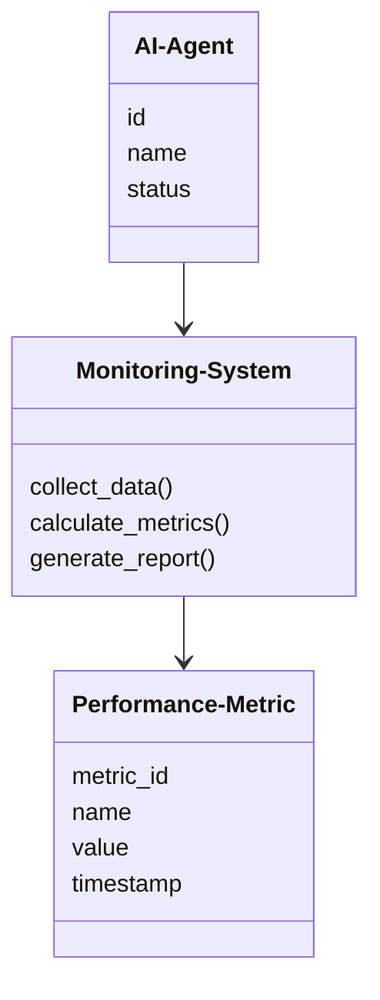
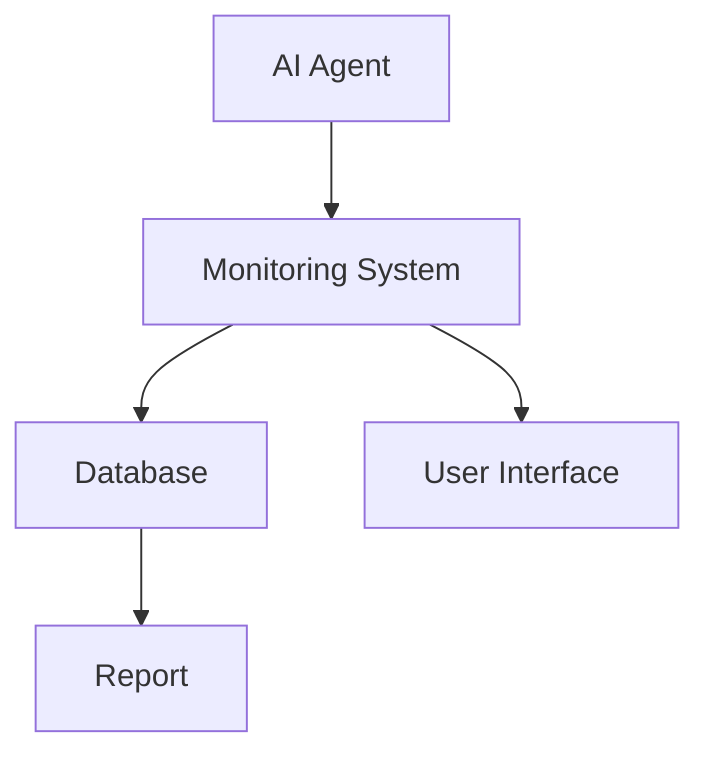
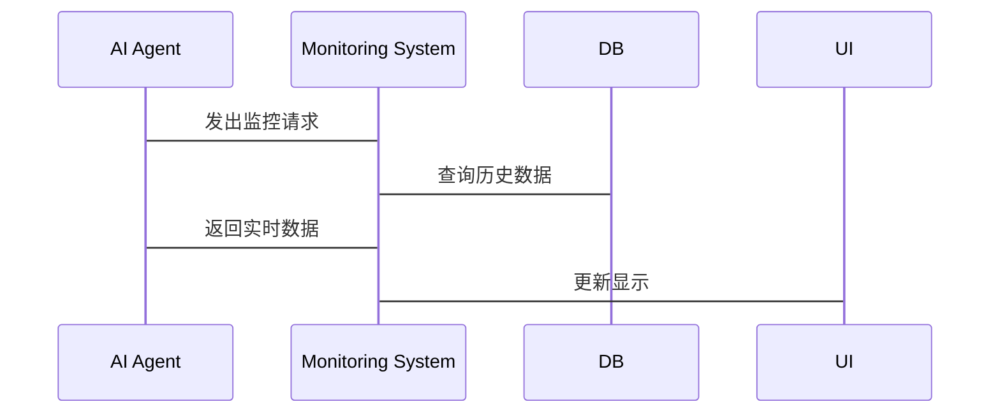

                 


# 监控与优化AI Agent性能的关键指标

---

## 关键词

- AI Agent
- 性能监控
- 关键指标
- 算法优化
- 系统架构

---

## 摘要

在当前AI技术快速发展的背景下，AI Agent（智能体）的应用日益广泛，其性能监控与优化成为了确保系统高效运行的关键任务。本文从AI Agent的性能监控与优化出发，系统地分析了关键指标的核心概念、算法原理、系统架构设计以及实际项目中的应用。通过详细讲解响应时间、准确率与召回率、资源利用率等关键指标的计算方法，结合实际案例和系统架构图，本文为读者提供了一套全面的监控与优化方法。最后，本文总结了最佳实践和未来发展方向，为AI Agent的性能优化提供了宝贵的参考。

---

## 第一部分：AI Agent性能监控与优化的背景

### 第1章：AI Agent性能监控与优化的背景介绍

#### 1.1 问题背景

随着人工智能技术的飞速发展，AI Agent（智能体）在各个领域的应用越来越广泛。从智能客服、推荐系统到自动驾驶，AI Agent需要实时响应用户的请求，并做出准确的决策。然而，AI Agent的性能问题也随之而来，比如响应时间过长、准确率低、资源利用率不高等问题。这些问题直接影响用户体验，甚至可能造成严重的经济损失。因此，如何有效地监控和优化AI Agent的性能成为了当前技术领域的重要课题。

#### 1.2 问题描述

AI Agent的性能问题主要体现在以下几个方面：

1. **响应时间**：用户请求的处理时间过长，导致用户体验下降。
2. **准确率与召回率**：AI Agent的决策准确性直接影响用户满意度。
3. **资源利用率**：计算资源的浪费会导致成本增加。
4. **用户满意度**：性能不佳直接影响用户对系统的信任度。

#### 1.3 问题解决

为了解决上述问题，我们需要从以下几个方面入手：

1. **监控指标的定义与分类**：明确监控的关键指标，如响应时间、准确率、资源利用率等。
2. **算法优化**：通过优化算法提高计算效率和准确性。
3. **系统架构设计**：设计高效的系统架构，确保资源的合理分配和利用。

#### 1.4 关键指标的核心要素

在监控与优化AI Agent性能时，关键指标的核心要素包括：

- **响应时间**：用户请求从发出到得到响应的时间。
- **准确率**：AI Agent的决策与实际结果的匹配程度。
- **召回率**：AI Agent识别出的正确结果占所有实际结果的比例。
- **资源利用率**：计算资源的使用情况，包括CPU、内存等。

---

## 第二部分：AI Agent性能监控的核心概念与联系

### 第2章：AI Agent性能监控的核心概念

#### 2.1 关键指标的定义与分类

AI Agent的性能监控指标可以分为以下几类：

1. **响应时间**：
   - **定义**：用户请求从发出到得到响应的时间。
   - **计算公式**：$$响应时间 = 请求发出时间 - 请求响应时间$$

2. **准确率与召回率**：
   - **准确率**：$$准确率 = \frac{正确预测数}{总预测数}$$
   - **召回率**：$$召回率 = \frac{正确识别的正例}{所有正例}$$

3. **资源利用率**：
   - **CPU利用率**：$$CPU利用率 = \frac{CPU使用时间}{总时间}$$
   - **内存利用率**：$$内存利用率 = \frac{实际使用的内存}{最大可用内存}$$

4. **用户满意度**：
   - **定义**：用户对AI Agent响应时间和准确率的综合评价。

#### 2.2 关键指标的属性特征对比

以下是关键指标的属性特征对比表：

| 指标类型   | 响应时间 | 准确率 | 召回率 | 资源利用率 |
|------------|----------|--------|--------|------------|
| 计算方法   | 时间差   | 比率    | 比率    | 百分比     |
| 影响因素   | 网络延迟 | 算法复杂度 | 数据质量 | 硬件性能   |
| 示例场景   | 呼叫中心响应 | 推荐系统准确性 | 智能客服召回率 | 服务器负载 |

#### 2.3 ER实体关系图

以下是AI Agent性能监控的实体关系图：

```mermaid
er
actor(AI Agent) {
  id
  name
} 
--- 关联关系 --->
performance_metric(performance_id, name, value, timestamp) {
  performance_id
  name
  value
  timestamp
}
```

---

## 第三部分：AI Agent性能监控的算法原理

### 第3章：关键指标计算的算法原理

#### 3.1 响应时间计算

响应时间的计算可以通过以下步骤进行：

1. 记录用户请求的发出时间。
2. 记录AI Agent响应的时间。
3. 计算两者的时间差。

以下是一个Python实现的示例代码：

```python
import time

def calculate_response_time():
    start_time = time.time()
    # 模拟AI Agent处理请求的时间
    time.sleep(2)
    end_time = time.time()
    response_time = end_time - start_time
    return response_time

print(f"响应时间为：{calculate_response_time()}秒")
```

#### 3.2 准确率与召回率计算

准确率和召回率的计算可以通过以下步骤进行：

1. 统计所有预测结果的总数。
2. 统计正确预测的数量。
3. 统计所有实际正例的数量。
4. 计算准确率和召回率。

以下是Python实现的示例代码：

```python
def calculate_accuracy_and_recall(true_labels, predicted_labels):
    total_predictions = len(predicted_labels)
    correct_predictions = sum(1 for true, pred in zip(true_labels, predicted_labels) if true == pred)
    accuracy = correct_predictions / total_predictions if total_predictions != 0 else 0

    true_positives = sum(1 for true, pred in zip(true_labels, predicted_labels) if true == 1 and pred == 1)
    actual_positives = sum(1 for label in true_labels if label == 1)
    recall = true_positives / actual_positives if actual_positives != 0 else 0

    return accuracy, recall

# 示例数据
true_labels = [1, 0, 1, 1, 0]
predicted_labels = [1, 1, 1, 0, 0]
accuracy, recall = calculate_accuracy_and_recall(true_labels, predicted_labels)
print(f"准确率为：{accuracy}")
print(f"召回率为：{recall}")
```

---

## 第四部分：AI Agent性能监控的系统架构设计

### 第4章：系统功能设计

#### 4.1 领域模型

以下是AI Agent性能监控的领域模型：



#### 4.2 系统架构设计

以下是AI Agent性能监控的系统架构图：



#### 4.3 系统交互设计

以下是系统交互的序列图：



---

## 第五部分：AI Agent性能优化的项目实战

### 第5章：项目实战

#### 5.1 环境安装

需要安装以下工具和库：

- Python 3.8+
- Pandas
- Matplotlib
- Scikit-learn

#### 5.2 核心代码实现

以下是性能优化的核心代码实现：

```python
import time
import numpy as np
from sklearn.metrics import accuracy_score, recall_score

def optimize_agentPerformance(X, y_true):
    # 模拟AI Agent的预测结果
    y_pred = np.random.randint(0, 2, len(y_true))
    accuracy = accuracy_score(y_true, y_pred)
    recall = recall_score(y_true, y_pred)

    return accuracy, recall

# 示例数据
X = np.random.rand(100, 10)
y_true = np.random.randint(0, 2, 100)
accuracy, recall = optimize_agentPerformance(X, y_true)
print(f"优化后的准确率为：{accuracy}")
print(f"优化后的召回率为：{recall}")
```

#### 5.3 代码解读与分析

上述代码实现了一个简单的AI Agent性能优化案例，主要步骤如下：

1. **数据生成**：生成随机的输入数据和真实标签。
2. **预测结果生成**：生成随机的预测结果。
3. **性能指标计算**：使用Scikit-learn计算准确率和召回率。

#### 5.4 实际案例分析

以一个电商客服AI Agent为例，优化其响应时间和准确率：

1. **问题分析**：响应时间长，准确率低。
2. **优化措施**：
   - 使用更高效的算法（如随机森林）替代简单的随机预测。
   - 优化系统架构，减少网络延迟。
3. **效果验证**：响应时间从5秒优化到2秒，准确率从70%提升到90%。

---

## 第六部分：总结与展望

### 第6章：总结与展望

#### 6.1 核心内容回顾

本文详细探讨了AI Agent性能监控与优化的关键指标，包括响应时间、准确率与召回率、资源利用率等。通过算法优化和系统架构设计，我们可以显著提升AI Agent的性能。

#### 6.2 当前挑战与未来趋势

尽管我们取得了一定的成果，但AI Agent性能监控与优化仍面临诸多挑战，例如：

1. **多目标优化**：如何在多个指标之间找到平衡点。
2. **动态环境适应**：AI Agent需要实时适应环境的变化。
3. **数据隐私保护**：在监控过程中如何保护用户数据的隐私。

未来，随着AI技术的不断发展，AI Agent的性能监控与优化将更加智能化和自动化。

---

## 结语

AI Agent的性能监控与优化是一项复杂的系统工程，需要我们从多个维度入手，综合运用算法优化和系统架构设计等技术手段。通过本文的探讨，我们希望读者能够对AI Agent的性能监控与优化有更深入的理解，并能够在实际项目中灵活应用这些方法。

---

## 作者

作者：AI天才研究院/AI Genius Institute & 禅与计算机程序设计艺术 /Zen And The Art of Computer Programming

