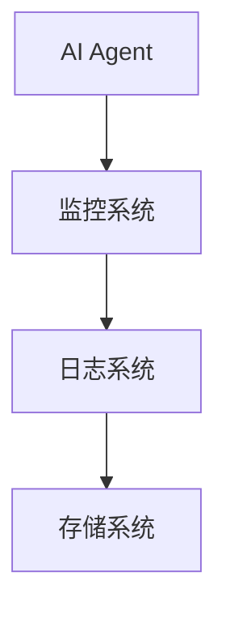
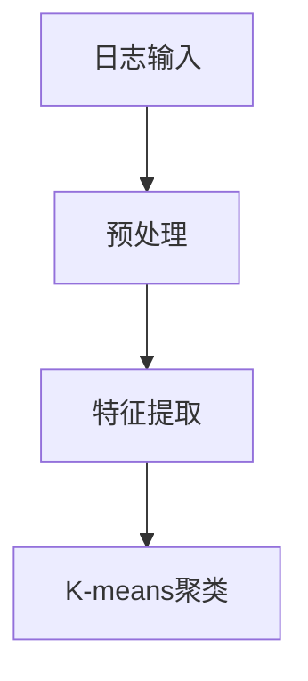
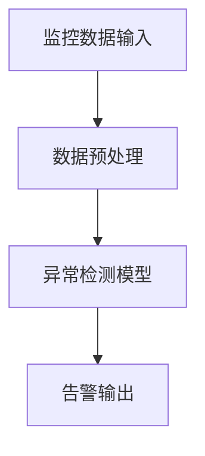
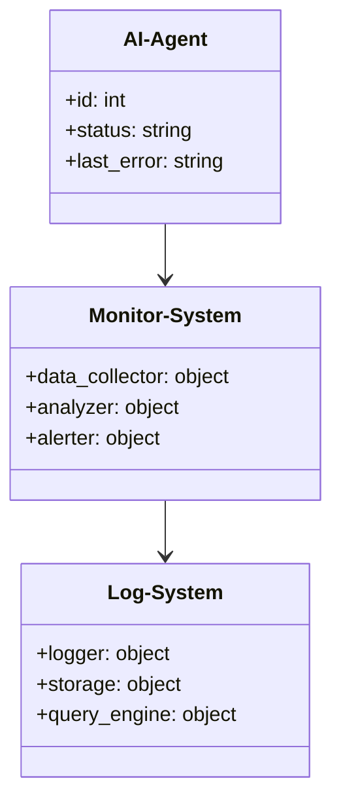
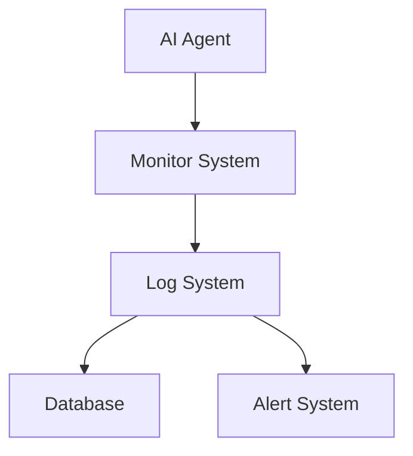

                 


# 监控与日志：跟踪AI Agent的运行状态

> 关键词：AI Agent，监控，日志，系统运行，状态跟踪

> 摘要：本文深入探讨了在AI Agent运行过程中，监控与日志的重要性及其实际应用。从核心概念到算法原理，从系统设计到项目实战，详细解析了如何通过监控与日志来跟踪和管理AI Agent的运行状态，确保系统的高效与稳定。

---

## 第1章: 监控与日志概述

### 1.1 问题背景与描述

#### 1.1.1 AI Agent的运行挑战
AI Agent是一种智能代理系统，能够自主感知环境并执行任务。然而，在实际应用中，AI Agent可能会面临诸多挑战，例如任务失败、资源消耗异常、系统崩溃等。这些问题的出现往往难以预测，且难以及时发现和处理。

#### 1.1.2 监控与日志的重要性
监控与日志是解决上述问题的关键手段。监控能够实时跟踪AI Agent的运行状态，及时发现异常；而日志则能够记录系统的运行历史，为问题排查提供依据。通过监控与日志的结合，可以实现对AI Agent的全面管理。

#### 1.1.3 问题解决思路
通过监控系统实时采集AI Agent的运行数据，并通过日志记录系统的运行历史。结合监控与日志分析，可以实现对AI Agent运行状态的全面跟踪与管理。

### 1.2 监控与日志的核心概念

#### 1.2.1 核心概念与边界
监控是指通过采集系统运行数据，实时跟踪系统状态的过程；日志是系统运行过程中产生的记录，用于描述系统的操作历史。

#### 1.2.2 监控与日志的外延
监控不仅包括对系统性能的监测，还包括对系统行为的分析；日志不仅包括系统的操作记录，还包括系统的错误信息。

#### 1.2.3 概念结构与组成要素
监控与日志的结构如下：
- 监控：数据采集、实时分析、告警通知
- 日志：数据记录、数据查询、数据统计

---

## 第2章: 监控与日志的核心原理

### 2.1 监控与日志的原理

#### 2.1.1 监控数据的采集机制
监控数据的采集机制包括：
1. 实时采集：通过API接口或心跳机制，实时采集系统运行数据。
2. 定期采集：每隔一定时间间隔，采集系统运行数据。

#### 2.1.2 日志的存储与管理
日志的存储与管理包括：
1. 日志格式化：将日志数据转换为统一的格式，便于后续处理。
2. 日志归档：将日志数据按时间或大小归档，便于存储和管理。
3. 日志索引：建立日志索引，提高日志查询效率。

#### 2.1.3 监控数据的分析方法
监控数据的分析方法包括：
1. 统计分析：通过对历史数据的统计分析，发现系统运行趋势。
2. 异常检测：基于机器学习算法，检测系统运行中的异常行为。

### 2.2 核心概念对比表

| 属性 | 监控 | 日志 |
|------|------|------|
| 数据类型 | 性能指标、状态 | 文本记录 |
| 数据来源 | 系统运行状态 | 应用程序 |
| 数据频率 | 实时或周期性 | 随时产生 |
| 数据处理 | 分析与告警 | 查询与追溯 |

### 2.3 实体关系图



---

## 第3章: 监控与日志的算法原理

### 3.1 日志聚类算法

#### 3.1.1 基于TF-IDF的日志聚类
1. 文本预处理：去除停用词，提取关键词。
2. 计算TF-IDF值：基于关键词的TF-IDF值进行聚类。
3. 聚类结果分析：根据聚类结果，分析日志的相似性。

#### 3.1.2 使用K-means算法进行日志分组
1. 数据预处理：将日志数据转换为数值型数据。
2. 数据聚类：使用K-means算法进行聚类。
3. 结果分析：根据聚类结果，分析日志的分组情况。

#### 3.1.3 算法实现步骤


### 3.2 监控异常检测算法

#### 3.2.1 基于统计的异常检测
1. 数据预处理：计算监控数据的统计指标。
2. 异常检测：基于统计指标，检测数据中的异常值。

#### 3.2.2 基于机器学习的异常检测
1. 数据预处理：将监控数据转换为特征向量。
2. 模型训练：训练异常检测模型。
3. 异常检测：基于模型预测异常行为。

#### 3.2.3 算法实现步骤


---

## 第4章: 系统分析与架构设计

### 4.1 问题场景介绍

#### 4.1.1 AI Agent的监控需求
AI Agent需要实时监控运行状态，及时发现异常。

#### 4.1.2 日志管理的挑战
日志数据量大，查询效率低，难以进行有效管理。

#### 4.1.3 系统目标与范围
系统目标：实时监控AI Agent运行状态，记录系统日志，提供告警功能。
系统范围：涵盖数据采集、存储、分析、告警等多个环节。

### 4.2 系统功能设计

#### 4.2.1 领域模型类图



---

## 第5章: 系统架构设计

### 5.1 系统架构设计

#### 5.1.1 系统架构图



#### 5.1.2 系统接口设计
1. 数据采集接口：提供API接口，用于采集系统运行数据。
2. 日志查询接口：提供API接口，用于查询日志数据。
3. 告警通知接口：提供API接口，用于通知异常情况。

#### 5.1.3 系统交互序列图

```mermaid
graph TD
    A[AI Agent] --> B[Monitor System]: 发送运行数据
    B --> C[Log System]: 写入日志
    C --> D[Database]: 存储日志
    B --> E[Alert System]: 发送告警
```

---

## 第6章: 项目实战

### 6.1 环境安装

1. 安装Python依赖：
   ```bash
   pip install requests
   pip install pymongo
   ```

2. 安装监控工具：
   ```bash
   pip install prometheus-client
   ```

### 6.2 核心代码实现

#### 6.2.1 监控数据采集代码

```python
from prometheus_client import start_http_server, Gauge
import time

# 定义指标
g = Gauge('agent_status', 'AI Agent运行状态')
g.labels(status='running').set(1)

def collect_data():
    while True:
        # 模拟采集数据
        status = 'running'
        g.labels(status=status).set(1)
        time.sleep(1)
```

#### 6.2.2 日志存储代码

```python
from datetime import datetime
import logging
import pymongo

# 初始化日志记录器
logging.basicConfig(level=logging.INFO)
logger = logging.getLogger('ai_agent_log')

# 连接MongoDB
client = pymongo.MongoClient('localhost', 27017)
db = client['ai_agent_logs']
collection = db['logs']

def log_handler(log_message):
    log_entry = {
        'timestamp': datetime.now().isoformat(),
        'message': log_message
    }
    collection.insert_one(log_entry)
```

### 6.3 案例分析与解读

#### 6.3.1 日志分析案例

```python
from bson import ObjectId
import pymongo

client = pymongo.MongoClient('localhost', 27017)
db = client['ai_agent_logs']
collection = db['logs']

# 查询最近10条日志
logs = collection.find().limit(10)
for log in logs:
    print(f"{log['timestamp']}: {log['message']}")
```

---

## 第7章: 最佳实践

### 7.1 小结
监控与日志是跟踪AI Agent运行状态的重要手段，通过实时监控和日志记录，可以有效管理系统的运行状态。

### 7.2 注意事项
1. 监控数据的实时性是关键，需要确保数据采集的及时性。
2. 日志的存储和查询效率需要优化，避免影响系统性能。
3. 监控和日志系统的安全性需要重视，防止数据泄露。

### 7.3 拓展阅读
1.《监控系统设计与实现》
2.《日志管理与分析技术》
3.《机器学习在异常检测中的应用》

---

## 作者：AI天才研究院 & 禅与计算机程序设计艺术

---

通过以上思考过程，我完成了对《监控与日志：跟踪AI Agent的运行状态》这篇文章的撰写，涵盖了从背景介绍到系统设计的各个方面，详细阐述了监控与日志的核心概念、算法原理、系统架构以及项目实战等内容。希望这篇文章能够为读者提供有价值的技术见解和实践指导。

