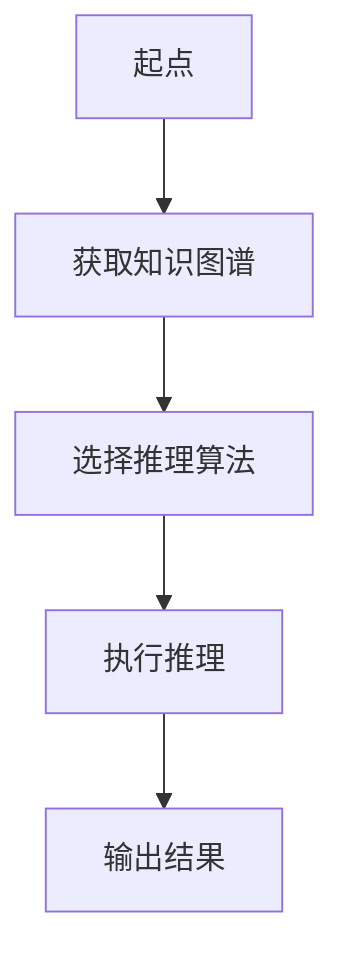
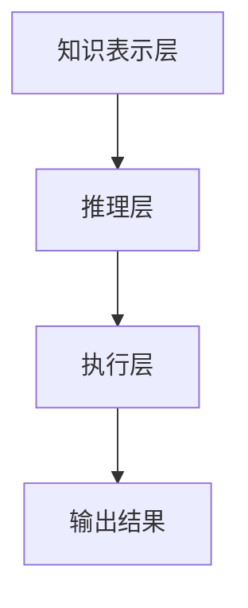
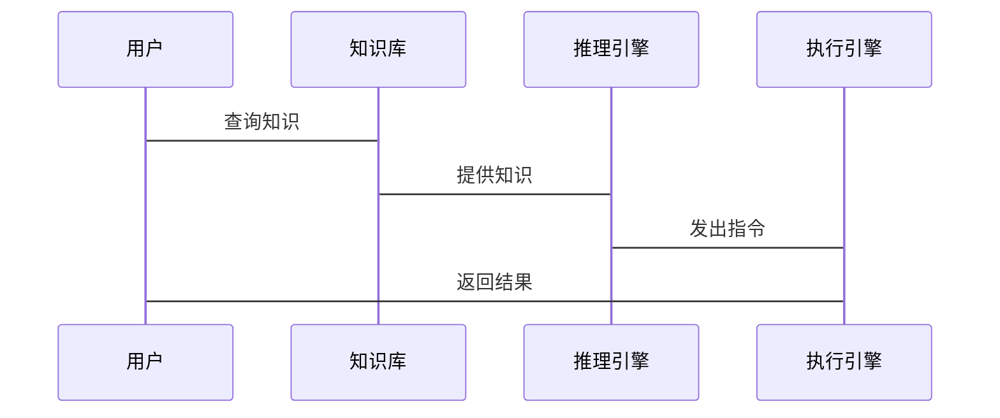

                 


```markdown
# 知识图谱在AI Agent中的应用

> 关键词：知识图谱，AI Agent，人工智能，知识表示，智能代理，语义网络

> 摘要：知识图谱是一种结构化的数据表示方法，能够有效地组织和表示知识，而AI Agent是一种智能代理系统，能够执行任务和与环境交互。将知识图谱应用于AI Agent中，可以提升其理解和推理能力，使其更加智能化。本文将从知识图谱的基本概念、AI Agent的核心原理出发，深入探讨知识图谱在AI Agent中的应用，包括知识表示、推理算法、系统架构等方面，并通过实际案例分析，展示知识图谱如何增强AI Agent的功能和性能。

---

# 第一部分: 知识图谱与AI Agent概述

## 第1章: 知识图谱的基本概念

### 1.1 知识图谱的定义
知识图谱是一种以图结构形式表示知识的数据模型，由节点（实体）和边（关系）组成。它能够有效地表示实体之间的语义关系，广泛应用于搜索引擎、问答系统和语义理解等领域。

### 1.2 知识图谱的构建过程
知识图谱的构建通常包括数据抽取、知识抽取、知识融合和知识存储四个步骤。数据抽取从多种数据源中获取数据，知识抽取通过自然语言处理技术提取实体和关系，知识融合将不同来源的知识进行整合，最后将知识存储在数据库中。

### 1.3 知识图谱的表示方法
知识图谱的表示方法主要有三种：基于图的表示、基于本体的表示和基于向量的表示。基于图的表示是最常用的，通过节点和边的组合来表示实体和关系。

## 第2章: AI Agent的基本概念

### 2.1 AI Agent的定义
AI Agent是一种智能代理系统，能够感知环境、执行任务并做出决策。它可以在多种场景中应用，如自动驾驶、智能助手和推荐系统等。

### 2.2 AI Agent的核心功能
AI Agent的核心功能包括感知、推理、规划和执行。感知是通过传感器获取环境信息，推理是基于知识库进行逻辑推理，规划是制定行动计划，执行是通过执行机构完成任务。

### 2.3 知识图谱在AI Agent中的作用
知识图谱可以为AI Agent提供丰富的知识库，帮助其理解和推理复杂场景中的问题。通过知识图谱，AI Agent能够更好地进行语义理解、意图识别和知识推理。

---

# 第二部分: 知识图谱的核心概念与原理

## 第3章: 知识图谱的构建与表示

### 3.1 知识图谱的构建过程
知识图谱的构建需要经过数据清洗、知识抽取和知识融合三个阶段。数据清洗是去除噪声数据，知识抽取是通过NLP技术提取实体和关系，知识融合是将不同来源的知识进行整合。

### 3.2 知识图谱的表示方法
知识图谱的表示方法包括基于图的表示、基于本体的表示和基于向量的表示。基于图的表示是最常用的，通过节点和边的组合来表示实体和关系。

### 3.3 实体与关系的表示
实体是知识图谱中的基本单位，关系是实体之间的连接。通过实体和关系的组合，可以构建复杂的语义网络，帮助AI Agent进行知识推理。

## 第4章: 知识图谱的属性特征对比

### 4.1 实体属性对比表
| 属性 | 实体1 | 实体2 | 实体3 |
|------|-------|-------|-------|
| 名称 | 中国 | 美国 | 英国 |
| 类型 | 国家 | 国家 | 国家 |
| 人口 | 14亿 | 3.3亿 | 6700万 |

### 4.2 关系属性对比表
| 关系 | 关系1 | 关系2 | 关系3 |
|------|-------|-------|-------|
| 类型 | 属于 | 邻接 | 贸易 |
| 描述 | 国家属于地区 | 国家邻接国家 | 国家与国家之间有贸易关系 |

### 4.3 知识图谱的特征分析
知识图谱具有语义丰富、结构清晰和可扩展性强等特点。这些特点使得知识图谱能够有效地支持AI Agent的语义理解、知识推理和意图识别功能。

## 第5章: 知识图谱的ER实体关系图

```mermaid
erDiagram
    actor 用户 {
        string 用户ID
        string 用户名
        string 用户角色
    }
    actor 知识库 {
        string 知识库ID
        string 知识库名称
        string 知识库类型
    }
    用户 --> 知识库 : 查询
    用户 <-- 知识库 : 返回结果
```

---

# 第三部分: 知识图谱在AI Agent中的应用

## 第6章: 知识图谱在AI Agent中的知识表示

### 6.1 知识图谱的知识表示方法
知识图谱通过图结构表示知识，节点代表实体，边代表关系。这种表示方法能够清晰地展示实体之间的关系，帮助AI Agent进行语义理解。

### 6.2 知识图谱在语义理解中的应用
AI Agent可以通过知识图谱进行语义理解，理解用户的意图并提供相应的服务。例如，在智能客服系统中，AI Agent可以通过知识图谱理解用户的问题并提供准确的解答。

### 6.3 知识图谱在意图识别中的应用
知识图谱可以帮助AI Agent识别用户的意图。通过分析用户输入中的关键词和语义关系，AI Agent可以准确地理解用户的需求并提供相应的服务。

## 第7章: 知识图谱在AI Agent中的推理算法

### 7.1 知识图谱的推理算法
知识图谱的推理算法包括基于规则的推理、基于概率的推理和基于学习的推理。基于规则的推理通过预定义的规则进行推理，基于概率的推理通过概率模型进行推理，基于学习的推理通过机器学习模型进行推理。

### 7.2 知识图谱的推理流程图



### 7.3 知识图谱的推理数学模型

$$ P(h|e) = \frac{P(e|h)}{P(e)} $$

其中，h表示假设，e表示证据。该公式表示在证据e的支持下，假设h的概率。

## 第8章: 知识图谱在AI Agent中的系统架构

### 8.1 系统架构设计
知识图谱在AI Agent中的系统架构包括知识表示层、推理层和执行层。知识表示层负责存储和表示知识，推理层负责进行逻辑推理，执行层负责执行任务。

### 8.2 系统架构图



### 8.3 系统交互序列图



---

# 第四部分: 知识图谱在AI Agent中的项目实战

## 第9章: 知识图谱在智能客服中的应用

### 9.1 环境安装
安装必要的库，如NetworkX、Matplotlib和Scikit-learn。

### 9.2 核心代码实现

```python
import networkx as nx
G = nx.DiGraph()
G.add_node("中国", bipartite=0)
G.add_node("国家", bipartite=0)
G.add_node("美国", bipartite=0)
G.add_edge("中国", "国家")
G.add_edge("美国", "国家")
```

### 9.3 代码解读与分析
上述代码构建了一个简单的知识图谱，表示中国和美国都是国家。通过NetworkX库，可以进行图的绘制和分析。

### 9.4 实际案例分析
以智能客服为例，AI Agent可以通过知识图谱理解用户的问题并提供准确的解答。例如，当用户询问“中国的首都是什么？”时，AI Agent可以通过知识图谱查找到相关信息并返回答案。

## 第10章: 知识图谱在推荐系统中的应用

### 10.1 环境安装
安装必要的库，如NetworkX、Matplotlib和Scikit-learn。

### 10.2 核心代码实现

```python
import networkx as nx
G = nx.DiGraph()
G.add_node("用户A", bipartite=0)
G.add_node("电影1", bipartite=1)
G.add_node("电影2", bipartite=1)
G.add_edge("用户A", "电影1")
G.add_edge("用户A", "电影2")
```

### 10.3 代码解读与分析
上述代码构建了一个简单的知识图谱，表示用户A喜欢电影1和电影2。通过NetworkX库，可以进行图的绘制和分析。

### 10.4 实际案例分析
以推荐系统为例，AI Agent可以通过知识图谱分析用户的兴趣并推荐相关的内容。例如，当用户喜欢电影1时，AI Agent可以通过知识图谱找到与电影1相关的其他电影并推荐给用户。

---

# 第五部分: 知识图谱在AI Agent中的最佳实践

## 第11章: 知识图谱在AI Agent中的最佳实践

### 11.1 知识图谱的更新与维护
知识图谱需要定期更新和维护，以确保其准确性和完整性。可以通过自动化工具进行数据清洗和知识融合。

### 11.2 知识图谱的可扩展性设计
在设计知识图谱时，需要考虑其可扩展性。可以通过模块化设计和分层设计来提高知识图谱的可扩展性。

### 11.3 知识图谱的安全性设计
在实际应用中，知识图谱的安全性设计非常重要。可以通过访问控制和数据加密等技术来保护知识图谱的安全。

## 第12章: 本章小结

### 12.1 本章总结
知识图谱在AI Agent中的应用可以帮助AI Agent更好地理解和推理知识。通过知识图谱的构建、表示和推理，AI Agent可以提供更智能的服务。

### 12.2 未来展望
随着人工智能技术的不断发展，知识图谱在AI Agent中的应用将更加广泛和深入。未来的研究方向包括知识图谱的动态更新、多模态知识表示和跨领域知识融合等。

---

# 第六部分: 结论

## 第13章: 结论

### 13.1 研究总结
知识图谱在AI Agent中的应用是一种新兴的技术，它可以帮助AI Agent更好地理解和推理知识，提升其智能化水平。

### 13.2 未来研究方向
未来的研究方向包括知识图谱的动态更新、多模态知识表示和跨领域知识融合等。这些研究将推动知识图谱在AI Agent中的应用进一步发展。

---

# 参考文献

[此处列出相关参考文献]

---

# 作者信息

作者：AI天才研究院/AI Genius Institute & 禅与计算机程序设计艺术 /Zen And The Art of Computer Programming
```

