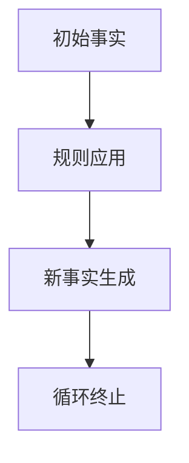
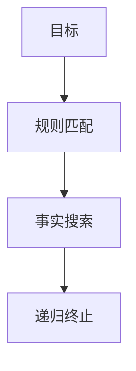

                 


# 知识图谱推理：提升AI Agent的逻辑分析

> 关键词：知识图谱，AI Agent，逻辑推理，符号逻辑，描述逻辑，知识表示，智能问答系统

> 摘要：本文深入探讨知识图谱推理在AI Agent中的应用，分析其核心概念、算法原理、系统架构，并通过项目实战和最佳实践，帮助读者掌握提升AI Agent逻辑分析能力的关键技术。

---

## 第一部分: 知识图谱推理概述

### 第1章: 知识图谱的基本概念与背景

#### 1.1 知识图谱的定义与特点

**知识图谱的定义**：知识图谱是一种以图结构形式表示知识的语义网络，由实体（节点）和关系（边）组成。节点代表具体的概念或实例，边表示实体之间的关系。

**知识图谱的核心特点**：
1. **语义性**：通过属性和关系描述实体间的语义联系。
2. **结构化**：采用图结构组织知识，便于计算机理解和推理。
3. **可扩展性**：支持大规模数据的存储和处理。

**知识图谱与传统数据库的区别**：
| 特性 | 数据库 | 知识图谱 |
|------|--------|----------|
| 数据结构 | 行数据，无关联 | 图结构，关联性强 |
| 查询方式 | 基于字段查询 | 基于关系和语义查询 |
| 应用场景 | 结构化数据分析 | 智能问答、推荐系统 |

#### 1.2 知识图谱推理的背景与意义

**背景**：随着AI技术的发展，AI Agent需要处理复杂语义信息，知识图谱成为构建语义网络的关键技术。

**意义**：知识图谱推理使AI Agent能够理解上下文，进行逻辑推理，提升问题解决能力。

**应用场景**：
1. **智能问答系统**：通过知识图谱推理回答复杂问题。
2. **推荐系统**：基于用户属性和物品关系进行推荐。

### 第2章: 知识图谱推理的核心概念

#### 2.1 知识图谱推理的基本原理

**符号逻辑与推理**：使用符号逻辑表示知识，如命题逻辑和谓词逻辑。

**描述逻辑与推理**：描述逻辑用于构建本体论，支持复杂属性和限制的推理。

**逻辑推理的数学模型**：
- 命题逻辑：$P \land Q$ 表示同时满足P和Q。
- 谓词逻辑：$\forall x (P(x) \rightarrow Q(x))$ 表示所有x满足P则满足Q。

#### 2.2 知识图谱推理的关键技术

**基于规则的推理**：使用逻辑规则进行推理，如IF-THEN规则。

**基于概率的推理**：考虑不确定性，使用概率方法进行推理。

**基于深度学习的推理**：利用神经网络学习推理模式。

#### 2.3 知识图谱推理的实现步骤

1. **知识抽取与构建**：从文本中抽取实体和关系，构建知识图谱。
2. **知识表示与存储**：使用图结构表示知识，并存储在数据库中。
3. **知识推理与应用**：根据推理算法进行推理，应用到实际场景中。

### 第3章: 知识图谱推理的算法原理

#### 3.1 前向 chaining 推理算法

**算法步骤**：
1. 初始化事实。
2. 根据规则库推导新事实。
3. 重复直到没有新事实生成。

**算法实现**：
```python
def forward_chaining(rules, facts):
    new_facts = set(facts)
    while True:
        old_length = len(new_facts)
        for rule in rules:
            antecedent, consequent = rule
            if all(fact in new_facts for fact in antecedent):
                consequent not in new_facts and new_facts.add(consequent)
        if len(new_facts) == old_length:
            break
    return new_facts
```

**流程图**：


#### 3.2 反向 chaining 推理算法

**算法步骤**：
1. 从目标出发，寻找支持目标的事实或规则。
2. 递归搜索，直到找到支持目标的事实。

**流程图**：


## 第二部分: 系统分析与架构设计

### 第4章: 系统功能设计

#### 4.1 系统功能模块

**知识图谱构建模块**：负责抽取和构建知识图谱。
**推理引擎模块**：执行推理算法，生成推理结果。
**结果解释模块**：将推理结果转化为人类可理解的形式。

#### 4.2 系统架构设计

**系统架构图**：


**接口设计**：
1. **知识图谱存储接口**：提供存储和查询功能。
2. **推理引擎接口**：接收查询请求，返回推理结果。
3. **结果解释接口**：将推理结果转化为可读形式。

### 第5章: 项目实战

#### 5.1 环境安装

**安装Python和相关库**：
```bash
pip install python-dot
pip install networkx
pip install py2neo
```

#### 5.2 核心代码实现

**知识图谱构建代码**：
```python
from py2neo import Graph, Node, Relationship

graph = Graph("http://localhost:7474", auth=("neo4j", "password"))
node1 = Node("Person", name="Alice")
node2 = Node("Person", name="Bob")
relation = Relationship(node1, "KNOWS", node2)
graph.create(node1)
graph.create(node2)
graph.create(relation)
```

**推理引擎代码**：
```python
def infer_facts(graph, target):
    # 实现推理逻辑
    pass
```

#### 5.3 实际案例分析

**案例：智能问答系统**：
1. **用户查询**：谁是Alice的朋友？
2. **推理过程**：查询知识图谱，找到与Alice相关联的朋友。
3. **结果输出**：Bob是Alice的朋友。

## 第三部分: 最佳实践

### 第6章: 小结与注意事项

**小结**：知识图谱推理使AI Agent具备逻辑分析能力，提升问题解决能力。

**注意事项**：
1. 确保知识图谱数据质量。
2. 选择合适的推理算法。
3. 处理推理中的不确定性。

### 第7章: 未来展望与拓展阅读

**未来展望**：
- 知识图谱与大语言模型的结合。
- 跨模态知识图谱推理。

**拓展阅读**：
- 知识图谱构建技术。
- 图神经网络在推理中的应用。

---

## 作者：AI天才研究院 & 禅与计算机程序设计艺术

这篇文章详细探讨了知识图谱推理在AI Agent中的应用，从基础概念到算法实现，再到系统设计和项目实战，帮助读者全面理解相关技术。通过本文的学习，读者可以掌握提升AI Agent逻辑分析能力的关键方法，为实际应用提供有力支持。

