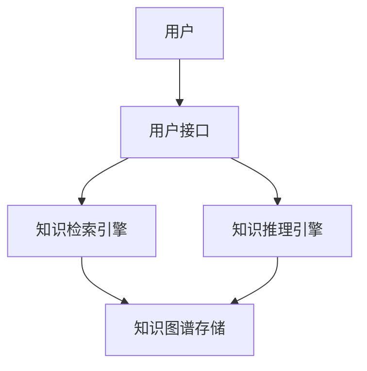

                 


# 知识图谱集成：增强AI Agent的背景知识

**关键词**：知识图谱、AI Agent、背景知识、语义表示、系统架构、智能问答

**摘要**：本文详细探讨了知识图谱在增强AI Agent背景知识中的应用。通过介绍知识图谱的核心概念、构建方法以及与AI Agent的结合，展示了如何通过知识图谱提升AI Agent的理解和推理能力。文章结合理论与实践，提供了丰富的代码示例和系统设计，帮助读者全面掌握知识图谱集成的技术细节。

---

## 第一部分: 知识图谱集成与AI Agent背景知识概述

### 第1章: 知识图谱集成的背景与意义

#### 1.1 知识图谱的基本概念

**1.1.1 知识图谱的定义**

知识图谱是一种以结构化方式表示知识的图数据，由实体（概念、事物）和关系（属性、联系）组成，用于描述现实世界中的各种实体及其之间的关系。例如，知识图谱可以表示“人”与“职位”的关系，如“张三担任CEO”。

**1.1.2 知识图谱的核心特点**

- **结构化**：知识以三元组（头实体、关系、尾实体）形式表示，便于计算机处理。
- **可扩展性**：支持不断增加新的实体和关系，适应不同领域的需求。
- **语义丰富性**：通过层次化和网络化的结构，能够表达复杂的语义关系。

**1.1.3 知识图谱与传统数据库的区别**

传统数据库主要存储结构化数据，关注事务处理和查询优化，而知识图谱更注重语义理解和关联推理，适用于复杂的关联数据建模。

#### 1.2 AI Agent的背景与需求

**1.2.1 AI Agent的定义与功能**

AI Agent是具备感知和行动能力的智能实体，能够通过传感器获取信息，理解环境并做出决策。例如，智能助手（如Siri）就是一个典型的AI Agent，能够理解用户的指令并执行操作。

**1.2.2 AI Agent在实际场景中的应用**

- 智能客服：通过自然语言处理理解和解决用户问题。
- 智能推荐系统：根据用户行为推荐相关内容。
- 自动驾驶：通过实时数据分析做出驾驶决策。

**1.2.3 知识图谱对AI Agent的重要性**

知识图谱为AI Agent提供了丰富的背景知识，使其能够理解上下文、推理关联信息，从而做出更智能的决策。

#### 1.3 知识图谱集成的目标与价值

**1.3.1 知识图谱集成的目标**

- 提供语义丰富的背景知识，增强AI Agent的理解能力。
- 支持关联推理，提升决策的准确性和智能化。
- 实现跨领域知识的共享与复用。

**1.3.2 知识图谱对AI Agent的增强作用**

- 通过知识图谱，AI Agent能够理解用户的深层需求，提供更精准的服务。
- 知识图谱支持动态更新，使AI Agent能够适应环境的变化。
- 知识图谱的结构化特性有助于提高信息检索的效率。

**1.3.3 知识图谱集成的实际应用场景**

- 智能问答系统：通过知识图谱提供准确的知识回答。
- 智慧医疗：整合医疗知识库，辅助医生进行诊断决策。
- 智能教育：根据学生的学习情况推荐个性化学习资源。

---

### 第2章: 知识图谱的核心概念与体系结构

#### 2.1 知识图谱的三元组模型

**2.1.1 实体与概念**

- **实体**：现实世界中的具体事物，如“张三”、“苹果公司”。
- **概念**：抽象的概念，如“公司”、“人”。

**2.1.2 关系与属性**

- **关系**：描述实体之间的关联，如“是”、“属于”、“担任”。
- **属性**：描述实体的特征，如“职位”、“年龄”。

**2.1.3 知识图谱的构建过程**

1. 数据抽取：从文本、数据库等来源中提取实体和关系。
2. 数据清洗：去除噪声数据，确保数据质量。
3. 数据融合：将多源数据整合到统一的知识图谱中。
4. 数据建模：使用本体论（如RDF、RDFS、OWL）构建知识模型。

#### 2.2 知识图谱的层次结构

**2.2.1 基本层次模型**

- **基本层**：定义基本的实体和关系，如“人”、“职位”、“担任”。
- **概念层**：定义更高层次的概念，如“员工”、“管理层”。

**2.2.2 高阶层次模型**

- **层次化**：通过层次结构描述概念的层次关系，如“管理层”是“员工”的上位概念。
- **网络化**：通过网络结构描述概念之间的多种关系，如“CEO”与“CTO”之间的并列关系。

**2.2.3 知识图谱的扩展性**

- **可扩展性**：知识图谱可以通过增加新的实体和关系进行扩展，适应不同的应用场景。

#### 2.3 知识图谱的语义表示

**2.3.1 RDF与RDFS**

- **RDF（资源描述框架）**：用于描述资源及其属性和关系，例如，`<http://example.org/CEO>`是一个资源。
- **RDFS（RDF Schema）**：在RDF的基础上，定义了类和属性的层次结构，例如，定义“CEO”是一个类，属于“职位”类。

**2.3.2 OWL本体构建**

- **OWL（Web本体语言）**：用于构建形式化的知识表示，支持更复杂的语义推理，例如，定义“CEO”是“高管”的一种。

**2.3.3 知识图谱的语义网络**

- **语义网络**：通过语义关系将实体连接起来，形成一个复杂的网络结构，例如，“CEO”与“公司”之间有“管理”关系。

---

### 第3章: 知识图谱的构建与管理

#### 3.1 知识抽取与实体识别

**3.1.1 文本挖掘与信息抽取**

- **文本挖掘**：从非结构化文本中提取有用信息，例如，从新闻文章中提取人名、公司名。
- **信息抽取**：使用自然语言处理技术，识别文本中的实体和关系。

**3.1.2 实体识别技术**

- **NER（Named Entity Recognition）**：识别文本中的命名实体，如人名、地名、组织名。
- **实体链接**：将识别出的实体链接到知识图谱中的具体节点，例如，将“张三”链接到知识图谱中的“张三”节点。

**3.1.3 实体消歧**

- **消歧**：解决同一实体在不同上下文中的不同含义，例如，区分“苹果公司”和“苹果手机”。

#### 3.2 知识融合与关联建立

**3.2.1 多源数据融合**

- **数据清洗**：去除重复数据和噪声数据。
- **数据整合**：将来自不同来源的数据整合到统一的知识图谱中。

**3.2.2 关系抽取与推理**

- **关系抽取**：从文本中识别出实体之间的关系，例如，“张三担任CEO”。
- **关系推理**：基于已有的关系进行推理，例如，从“张三是CEO”和“CEO属于高管”可以推理出“张三是高管”。

**3.2.3 知识图谱的动态更新**

- **动态更新**：根据新的数据不断更新知识图谱，例如，当张三不再担任CEO时，更新知识图谱。

#### 3.3 知识图谱的质量评估

**3.3.1 知识完整性评估**

- **完整性**：知识图谱中是否涵盖了所有相关实体和关系。
- **覆盖率**：知识图谱能够覆盖多少应用场景的需求。

**3.3.2 知识准确性评估**

- **准确性**：知识图谱中的信息是否准确无误。
- **一致性**：知识图谱中的信息是否自洽，例如，避免出现“张三是CEO”和“张三是实习生”同时存在的情况。

---

## 第四部分: 知识图谱与AI Agent的结合

### 第4章: 知识图谱与AI Agent的结合

#### 4.1 知识图谱在AI Agent中的应用

**4.1.1 知识检索与问答**

- **知识检索**：基于知识图谱进行快速查询，例如，回答“谁是苹果公司的CEO？”。
- **智能问答**：通过知识图谱提供准确的知识回答，例如，解释“什么是人工智能？”。

**4.1.2 知识推理与决策支持**

- **知识推理**：基于知识图谱进行推理，例如，从“张三是CEO”和“CEO属于高管”可以推理出“张三是高管”。
- **决策支持**：利用知识图谱中的关联信息辅助决策，例如，在招聘高管时，参考候选人的职位历史和业绩。

**4.1.3 知识图谱的动态更新**

- **实时更新**：根据最新的数据实时更新知识图谱，确保AI Agent的知识是最新的。
- **自适应学习**：通过知识图谱的动态更新，使AI Agent能够不断学习新的知识。

---

## 第五部分: 系统分析与架构设计

### 第5章: 系统分析与架构设计

#### 5.1 项目介绍与系统功能设计

**5.1.1 项目介绍**

- **项目名称**：知识图谱集成的AI Agent系统。
- **项目目标**：构建一个基于知识图谱的AI Agent系统，提供智能问答、知识检索等服务。

**5.1.2 系统功能设计**

- **知识图谱管理**：包括知识图谱的构建、存储和查询。
- **智能问答**：基于知识图谱提供智能问答服务。
- **知识推理**：支持基于知识图谱的推理功能。

**5.1.3 系统架构设计**

1. **知识图谱存储**：使用图数据库（如Neo4j）存储知识图谱。
2. **知识检索引擎**：实现高效的图查询功能。
3. **知识推理引擎**：支持基于规则的推理和基于逻辑的推理。
4. **用户接口**：提供友好的用户界面，方便用户与AI Agent交互。

#### 5.2 系统架构设计

**5.2.1 系统架构图**



**5.2.2 核心组件**

- **用户接口**：接收用户的输入，并将请求传递给知识检索引擎或知识推理引擎。
- **知识检索引擎**：基于知识图谱进行快速查询，返回结果。
- **知识推理引擎**：基于知识图谱进行推理，返回推理结果。
- **知识图谱存储**：存储知识图谱数据，支持高效的图查询。

---

## 第六部分: 项目实战

### 第6章: 项目实战

#### 6.1 环境安装与配置

**6.1.1 安装Python**

- 使用Anaconda安装Python 3.8及以上版本。

**6.1.2 安装依赖库**

```bash
pip install neo4j python-dotenv
```

#### 6.2 系统核心实现

**6.2.1 知识图谱构建**

```python
from neo4j import GraphDatabase

def create_graph_driver():
    return GraphDatabase.driver("bolt://localhost:7687", auth=("neo4j", "password"))

def create_knowledge_graph(driver):
    with driver.session() as session:
        session.run("CREATE (a:Person {name: '张三'})")
        session.run("CREATE (b:Company {name: '苹果公司'})")
        session.run("MATCH (a:Person {name: '张三'}), (b:Company {name: '苹果公司'}) CREATE (a)-[r:WORKS_AT]->(b)")
```

**6.2.2 智能问答系统**

```python
from neo4j.exceptions import ServiceUnavailable

def ask_question(question):
    driver = create_graph_driver()
    with driver.session() as session:
        try:
            result = session.run(
                "CALL gds.questionGraph($question, {}) YIELD nodes, relationships",
                question
            )
            return result.single()["nodes"]
        except ServiceUnavailable:
            return None
    return None
```

#### 6.3 项目小结

**6.3.1 项目总结**

- 通过本项目，我们实现了基于知识图谱的AI Agent系统，能够进行智能问答和知识推理。
- 系统的核心是知识图谱的构建和管理，以及基于知识图谱的推理引擎。

**6.3.2 项目优势**

- 知识图谱提供了丰富的背景知识，使AI Agent能够理解上下文和关联信息。
- 系统架构灵活，支持扩展和动态更新。

---

## 第七部分: 最佳实践与拓展

### 第7章: 最佳实践

#### 7.1 小结

- 知识图谱是一种强大的工具，能够为AI Agent提供丰富的背景知识。
- 通过知识图谱的构建和管理，可以显著提升AI Agent的理解和推理能力。

#### 7.2 注意事项

- 知识图谱的构建需要大量的人力和时间，需要仔细规划和管理。
- 知识图谱的质量直接影响AI Agent的性能，需要进行严格的测试和评估。

#### 7.3 拓展阅读

- **知识图谱的标准与规范**：了解RDF、RDFS、OWL等知识表示标准。
- **图数据库**：深入学习Neo4j等图数据库的使用和优化。
- **知识图谱的应用案例**：研究知识图谱在智能问答、推荐系统等领域的实际应用。

---

**作者：AI天才研究院/AI Genius Institute & 禅与计算机程序设计艺术 /Zen And The Art of Computer Programming**

---

以上是完整的文章内容，涵盖了从知识图谱的基本概念到实际应用的各个方面，结合理论与实践，提供了丰富的代码示例和系统设计，帮助读者全面掌握知识图谱集成的技术细节。

