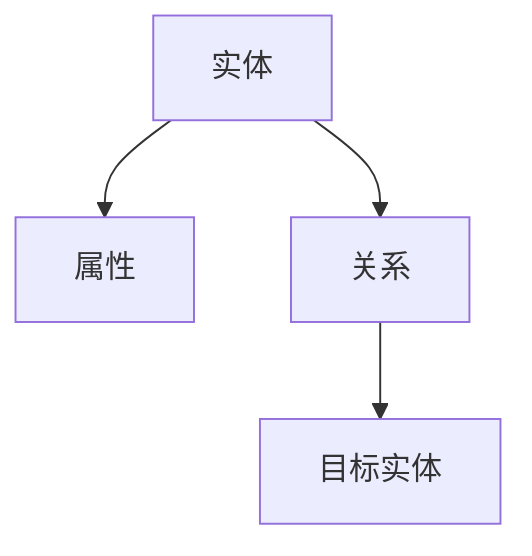
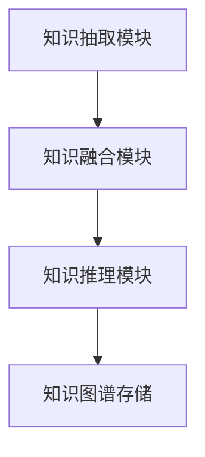

                 


# 知识图谱集成：扩展AI Agent的知识储备

> **关键词**：知识图谱，AI Agent，知识集成，算法原理，系统架构，项目实战

> **摘要**：知识图谱集成是扩展AI Agent知识储备的重要手段。本文详细探讨了知识图谱的基本概念、AI Agent的知识需求，以及如何通过算法和系统架构设计实现知识图谱的集成。文章还通过项目实战展示了知识图谱集成的具体应用，并总结了相关经验和未来发展方向。

---

## 第一部分: 知识图谱集成的背景与核心概念

### 第1章: 知识图谱集成的背景与问题背景

#### 1.1 知识图谱的基本概念
- **1.1.1 知识图谱的定义**  
  知识图谱是一种以结构化形式表示知识的图数据库，由实体（概念或对象）及其关系组成。  
  $$实体：表示现实世界中的具体或抽象事物，如“人”、“书”等。$$  
  $$关系：表示实体之间的关联，如“作者”、“属于”等。$$  

- **1.1.2 知识图谱的核心特征**  
  知识图谱具有可扩展性、语义丰富性和结构化的特性，能够有效地表示复杂的关系网络。  

- **1.1.3 知识图谱与传统数据库的区别**  
  | 特性         | 知识图谱                     | 传统数据库             |  
  |--------------|------------------------------|-----------------------|  
  | 数据结构     | 图结构，支持复杂关系         | 行结构，支持简单查询   |  
  | 查询能力     | 支持语义查询和复杂关联查询   | 支持简单的条件查询     |  
  | 知识表示     | 语义丰富，支持知识推理       | 数据存储，不支持推理   |  

#### 1.2 AI Agent的发展趋势
- **1.2.1 AI Agent的基本概念**  
  AI Agent是一种能够感知环境、自主决策并执行任务的智能实体，广泛应用于推荐系统、智能助手等领域。  

- **1.2.2 知识图谱在AI Agent中的作用**  
  知识图谱为AI Agent提供了丰富的背景知识，帮助其理解上下文并做出更智能的决策。  

- **1.2.3 知识图谱集成的必要性**  
  AI Agent需要依赖外部知识库来扩展其知识储备，而知识图谱因其结构化和语义化的特性，成为理想的选择。  

#### 1.3 知识图谱集成的目标与意义
- **1.3.1 知识图谱集成的目标**  
  通过将知识图谱与AI Agent结合，提升其知识理解和推理能力。  

- **1.3.2 知识图谱集成的意义**  
  知识图谱的语义信息能够增强AI Agent的上下文理解和问题解决能力，使其更加智能化。  

- **1.3.3 知识图谱集成的边界与外延**  
  知识图谱的边界在于其覆盖的知识领域和深度，而外延则体现在与其他知识源的整合上。  

#### 1.4 本章小结
本章介绍了知识图谱的基本概念和AI Agent的发展趋势，重点阐述了知识图谱在AI Agent中的作用和集成的必要性。

---

### 第2章: 知识图谱与AI Agent的核心概念与联系

#### 2.1 知识图谱的核心要素
- **2.1.1 实体与属性**  
  实体是知识图谱的基本单元，属性用于描述实体的特征。例如，实体“书籍”可以有属性“作者”、“出版日期”等。  

- **2.1.2 关系与事实**  
  关系描述了实体之间的关联，如“书籍属于类别”。  

- **2.1.3 知识图谱的结构化表示**  
  知识图谱通常采用RDF（资源描述框架）或类似的形式进行结构化表示。  

#### 2.2 AI Agent的知识需求
- **2.2.1 AI Agent的知识类型**  
  AI Agent需要多种类型的知识，包括事实知识、规则知识、语义知识等。  

- **2.2.2 知识图谱与AI Agent知识需求的匹配**  
  知识图谱的结构化特性使其能够很好地满足AI Agent对语义知识的需求。  

- **2.2.3 知识图谱在AI Agent中的应用场景**  
  - 语义理解：通过知识图谱帮助AI Agent理解用户查询的上下文。  
  - 知识推理：基于知识图谱进行关联推理，提供更准确的答案。  

#### 2.3 知识图谱与AI Agent的实体关系图


#### 2.4 本章小结
本章深入探讨了知识图谱的核心要素及其与AI Agent知识需求的匹配关系，并通过实体关系图展示了两者的联系。

---

### 第3章: 知识图谱集成的算法原理与数学模型

#### 3.1 知识图谱构建算法
- **3.1.1 知识抽取算法**  
  从文本中提取实体、关系和属性的算法，如基于规则的抽取和深度学习模型（如LSTM）。  

- **3.1.2 实体识别与链接算法**  
  使用实体识别技术（如NER）和实体链接技术（如Wikidata链接）将实体映射到知识库。  

- **3.1.3 关系抽取算法**  
  通过模式匹配或深度学习模型（如BERT）提取实体之间的关系。  

#### 3.2 AI Agent的知识集成算法
- **3.2.1 知识融合算法**  
  将多个来源的知识进行整合，消除冲突，确保一致性。  

- **3.2.2 知识推理算法**  
  基于知识图谱进行推理，如基于规则的推理和基于图的推理。  

- **3.2.3 知识表示学习算法**  
  使用深度学习模型（如TransE、DistillBERT）将知识图谱中的实体和关系表示为低维向量。  

#### 3.3 知识图谱的数学模型与公式
- **3.3.1 知识表示的向量空间模型**  
  $$v_i = \sum_{j=1}^{n} w_{ij} \cdot v_j$$  
  其中，$v_i$是实体i的向量表示，$w_{ij}$是权重，$v_j$是相关实体的向量。  

- **3.3.2 知识图谱的图嵌入模型**  
  $$X = \{x_1, x_2, ..., x_n\}$$  
  其中，$x_i$是实体i的图嵌入向量。  

#### 3.4 本章小结
本章详细介绍了知识图谱构建和AI Agent知识集成的算法原理，并通过数学公式展示了知识表示的学习过程。

---

### 第4章: 知识图谱集成的系统架构设计

#### 4.1 系统功能设计
- **4.1.1 知识抽取模块**  
  负责从文本中提取实体、关系和属性。  

- **4.1.2 知识融合模块**  
  将多个来源的知识进行整合和冲突消解。  

- **4.1.3 知识推理模块**  
  基于知识图谱进行推理，生成新的知识。  

#### 4.2 系统架构图


#### 4.3 接口设计与交互流程
- **接口设计**  
  提供RESTful API接口，供AI Agent调用知识图谱服务。  

- **交互流程**  
  ```mermaid
  sequenceDiagram
      participant AI Agent
      participant 知识图谱服务
      AI Agent->>知识图谱服务: 请求知识查询
      知识图谱服务->>知识图谱服务: 执行知识推理
      知识图谱服务->>AI Agent: 返回结果
  ```

#### 4.4 本章小结
本章设计了一个支持知识图谱集成的系统架构，并详细描述了各模块的功能和交互流程。

---

### 第5章: 项目实战——知识图谱集成的实现

#### 5.1 环境安装与配置
- 安装Python环境和相关库（如networkx、py2neo）。  

#### 5.2 核心代码实现
- **知识抽取模块**  
  ```python
  import networkx as nx

  def extract_entities(text):
      # 假设text是待处理的文本
      entities = []
      # 示例：提取实体（实际需要具体实现）
      return entities
  ```

- **知识图谱构建模块**  
  ```python
  from py2neo import Graph

  def construct_kg(entities, relations):
      graph = Graph("http://localhost:7474", auth=("neo4j", "password"))
      # 创建实体节点和关系边
      return graph
  ```

#### 5.3 案例分析与结果展示
- **案例分析**  
  以书籍推荐系统为例，展示知识图谱在AI Agent中的应用。  

- **结果展示**  
  通过图谱可视化工具（如Gephi）展示构建的知识图谱。  

#### 5.4 本章小结
本章通过项目实战展示了知识图谱集成的具体实现过程，并通过案例分析验证了其有效性。

---

## 第六部分: 总结与展望

### 6.1 本章总结
本文详细探讨了知识图谱集成在扩展AI Agent知识储备中的应用，从背景、核心概念、算法原理到系统架构和项目实战，全面阐述了相关技术和方法。

### 6.2 最佳实践Tips
- 知识图谱的构建需要结合具体场景和需求。  
- 在AI Agent中使用知识图谱时，需注意知识的准确性和实时性。  

### 6.3 未来研究方向
- 知识图谱的动态更新与维护技术。  
- 增强AI Agent的知识推理能力，支持更复杂的语义理解。  

### 6.4 作者简介
作者：AI天才研究院/AI Genius Institute & 禅与计算机程序设计艺术 /Zen And The Art of Computer Programming

---

**文章总结**  
知识图谱集成是扩展AI Agent知识储备的重要手段，本文通过理论与实践相结合的方式，详细探讨了其核心概念、算法原理和系统架构，为相关研究和应用提供了参考。

